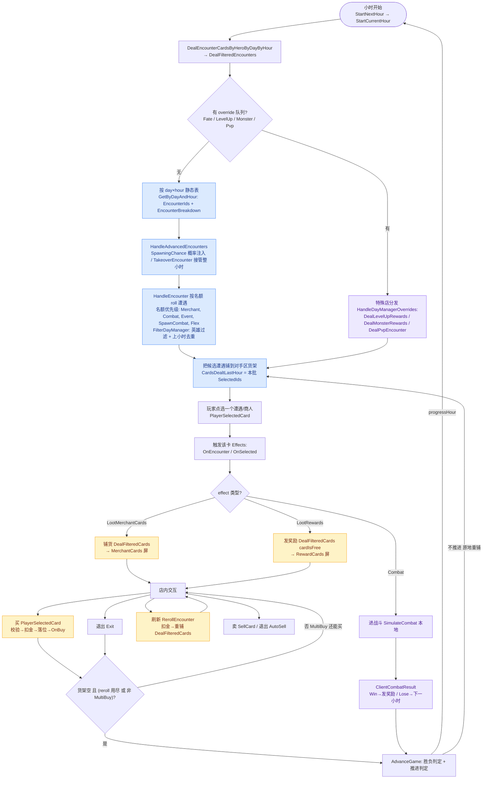

> Status: REFERENCE-ONLY: doc #1 of the 5-part shop-entry reverse-engineering series analyzing the OLD client-side BazaarCardDealer (decompiled). Committed as pure research docs at 475c0b0d; the Collection shop-probability feature it fed (design/plan doc #6) was removed unshipped at a8fee8b9, whose message says "keep the shop-entry mechanics analysis." Self-flags (line 84) it is the legacy client dealer, not the current server-GameSim online path.

# 进商店完整逻辑总览（从小时开始到离店）

状态：draft（总览/串联版）
最后核对：2026-06-15（7-agent workflow 映射 + 完整性审查，独立重扫无与已记录结论的实质矛盾）
> **📚「进商店逻辑」文档系列 · 建议阅读顺序**（你在读 **#1 总览**）
> 1. [总览 · 从进店到离店的完整流程](2026-06-15-shop-entry-1-lifecycle.md) ← 本文
> 2. [讲解 · 铺货 / 单卡概率怎么算（TL;DR + 流程图 + 名词词典）](2026-06-15-shop-entry-2-stocking-explainer.md)
> 3. [深入 · native/loose + 英雄 + RNG 顺序 + 手牌 + 数据缺口](2026-06-15-shop-entry-3-native-loose-deep-dive.md)
> 4. [参考 · 单卡概率逐行推导 + Collection Panel 接入](2026-06-15-shop-entry-4-single-card-reference.md)
> 5. [背景 · 旧 dealer 是什么 / 为何在客户端 / 是否线上权威](2026-06-15-shop-entry-5-client-server-boundary.md)
> 6. [落地设计 · Collection Panel 商店概率浮层](2026-06-15-collection-panel-shop-probability-design.md)

> 前三份文档讲的是「`DealFilteredCards` 内部怎么把一货架卡抽出来」。
> **本文是上一层的总览**：一小时怎么开始、决定你遇到谁、你点中商人后**靠什么机制**真正铺货、店内能做什么、怎么离店、战斗/升级/PvP 这些「特殊店」如何并入同一条流水线。
> 所有 `file:line` 指 `decompiled/BazaarBattleService/BazaarBattleService/BazaarCardDealer.cs`（除非另注）。

---

## TL;DR

- **一小时分两段**：先「**摆出谁**」（这一小时棋盘上出现哪些商人/遭遇候选），再「**铺什么货**」（你点中某个商人后，它货架上卖什么）。两段是**两套独立机制**，都查同一张 `day×hour` 静态表但用途不同。
- **「摆出谁」**由 `DealFilteredEncounters` 按 `day×hour` 表的 `EncounterBreakdown` 名额（商人/战斗/事件/SpawnCombat/Flex）逐个 roll 决定，并按英雄、上一小时已发去重。
- **「铺什么货」的真正入口是效果系统，不是直接调用**：你点中商人 → 触发它的 `OnEncounter/OnSelected` 效果 → 其中的 `LootMerchantCards` 效果 → 才调 `DealFilteredCards`。**「这个商人卖什么」由商人卡 `Effects` 上挂的 `LootMerchantCards` 决定。**
- **店内能做 4 件事**：买（`PlayerSelectedCard`）、刷新（`RerollEncounter`）、卖（`SellCard` / 退出时 `AutoSell`）、退出（`Exit`）。`MultiBuy` 商店买一张不清空货架、可连买。
- **离店/买空 → `AdvanceGame`**：决定推进小时（重新摆遭遇）还是原地重铺当前小时。
- **特殊店并入同一条流水线**：升级奖励、怪物战斗奖励、PvP 走 `DayManagerOverrideQueue` 三态分发，顶替这一小时的普通遭遇。
- **全程本地**：铺货、抽卡、概率、战斗 sim 全在客户端 `seedManager` 上跑；服务器只做 **PvP 撮合**和 **run 完成上报**，**不存在服务端权威商店 sim**。

---

## 1. 全景图



---

## 2. 范围与边界

### 2.1 本地 dealer vs 在线 server（题目点名）

**铺货、抽卡、概率、战斗 sim 全部在客户端本地**（`DealFilteredCards`、`SimulateCombat`（`:3998`）、全程 `seedManager`）。服务器（`BazaarRequestManager`）只做两件事：

- **PvP 撮合**：`DealPvpEncounter`（`:5587-5659`）拉对手/ghost，`SanityCheckAndFixBattlePlayerDataFromServer`（`:5472-`）。
- **run 完成上报领宝箱**：`EndCurrentRun → SendRunCompleted`（`:1950`）。

**不存在服务端权威商店 sim**——「online server sim 影响进店概率吗」这个疑问的答案是：不影响铺货/抽卡。（注意：这是**旧 dealer 代码**的结论；当前线上发牌仍由服务器 `GameSim` 驱动，权威权重数值见 deep-dive §6/§7 的数据缺口盘点。）

### 2.2 贯穿全程的状态机：`EOpponentBoardStatus`

「你现在在店里的哪个屏」由 `SwitchBoardStatus`（`:2542`）维护，取值 `NewHour / Encounters / MerchantCards / RewardCards / CombatCards / PVPSelectCards / PVPCombatCards`。它是 UI 与逻辑共用的真相源，决定 `StartNextHour` 走 `Encounters` 还是 `NewHour`（`:2500`）等分支。读代码时认准这个枚举就不会迷路。

---

## 3. 第一段：一小时开始——「摆出谁」

入口链：`StartNextHour`（`:2494`）→ `StartCurrentHour`（`:2525`）→ `DealEncounterCardsByHeroByDayByHour`（`:2323`）→ `DealFilteredEncounters`（`:4700`）。

### 3.1 day×hour 静态表

`GetByDayAndHour(day, hour)`（`StaticDataDayRepository.cs:51-62`，数据来自 `EncountersByHeroByHourByDay.Json`）返回 `BazaarDayByHourManager`（`BazaarDayByHourManager.cs:6-56`）：

| 字段 | 含义 |
| --- | --- |
| `EncounterIds` | 本小时候选遭遇 id 全集 |
| `NumberEncountersToSpawn`（默认 3）| 这一小时摆几个候选供你挑 |
| `EncounterBreakdown` | 各类名额：`MerchantCount / CombatCount / FlexCount / EventCount / SpawnCombatCount` |
| `NativeItemTierProbability` | 给**第二段铺货**用的 native 闸门概率（见 deep-dive） |

> `day > gameConfig.NumDays` 时被钳到 `NumDays`（`:2325-2327` 与 `:3522-3524`）——超出天数上限后**复用最后一天的表**，避免越界。`hour` 是 1-based。

### 3.2 选遭遇：名额优先级 + 过滤 + roll

`DealFilteredEncounters` 先处理 override（见 §7），正常路径循环调 `HandleEncounter`（`:4889-4943`）填 `SelectedIds`：

1. **名额优先级**（`:4893-4922`）：`Merchant → Combat → Event → SpawnCombat → Flex`。`Flex` 是**跨 CardType 的兜底**类别（`FilterDayManager :4535-4550` 不校验 CardType）。
2. **`FilterDayManager`**（`:4491-4606`）对该类别过滤：
   - **英雄**：`Heroes.Contains(Common) || Heroes.Contains(玩家英雄)`（`:4494`）——非本英雄专属的遭遇被静默过滤。
   - **去重**：排除 `SelectedIds`（本轮已选）、`VisitedAdvancedEncounters`（已访问高级遭遇）、以及默认排除 `CardsDealtLastHour`（**上一小时已发**，`:4605`）。
3. `FilterByRemainingBoardSize`（按对手区空位）→ `RollEncounterTierAndFilter`（按稀有度 roll，`:4967` 消耗一个 `GetDouble`）→ `seedManager.GetNumber() % count` 抽一张（`:4938`）。

最终 `HandleEncounterDealing` 把选中的遭遇 `DealCard` 到对手区货架（`:4954/4959`），并 `CardsDealtLastHour = SelectedIds`（`:4782`，整体替换、跨小时去重、随存档持久化）。

### 3.3 高级遭遇上游注入

铺常规遭遇前先 `HandleAdvancedEncounters`（`:4849-4887`）：对 `IsAdvancedEncounter && OverrideDayManager` 的候选，`SpawningChance += SpawningChanceIncrement`（`:4864`，**就地累加并持久化**，越往后越容易触发），`seedManager.GetDouble() < SpawningChance` 命中即注入。命中后：

- `TakeoverEncounter=true` → **接管整小时**，跳过所有常规遭遇（`:4768-4771`，`HandleEncounterDealing` 只发那一张 `:4954`）。
- 否则常规遭遇名额减 1（`:4772`）。

详见 deep-dive 的「打破 3 张卡模型」清单。

---

## 4. 第二段：玩家选中商人——「铺什么货」的真正入口

⭐ **这是整条流程最核心、也最容易讲错的连接**（6 个映射 agent 初版都把它当成「选中即直接发牌」，完整性审查纠正了它）。

`PlayerSelectedCard`（`:1582`）的 Merchant/Encounter 分支**本身不铺货**——它只设 `CurrentSelectEncounter`、`Board.Opponent`、`RefreshRerolls`（`:1830-1835`）。

真正铺货走**效果系统**：

```text
选中商人 → UpdateEffectsByTriggerType(OnEncounter/OnSelected)  (:1775-1776)
        → TriggerEffectToTargets (BazaarDeckTools.cs:1344-1350)
        → dealer.TriggerEffect (:2852)
        → case LootMerchantCards (:2926-2928)  → SwitchBoardStatus(MerchantCards) + DealFilteredCards(player, card)
        → case LootRewards     (:2922-2924)  → SwitchBoardStatus(RewardCards) + DealFilteredCards(player, card, cardIsFree:true)
```

**所以「这个商人卖什么」是由商人卡 `Effects` 上挂的 `LootMerchantCards` 效果驱动的**，`DealFilteredCards` 只是被这个效果调用。`DealFilteredCards` 的三个调用点也印证：
- `:2928` `LootMerchantCards`（普通进店铺货——**主入口**）
- `:2924` `LootRewards`（奖励货架，免费）
- `:5921` `RerollEncounter`（刷新重铺）
- `:2392` `DealRewardCards`（PvE 胜利发战利品，**不是进店主路径**）

> 易错点：`DealRewardCards`（`:2382`）的 `seed` 形参其实没用，`:2392` 调 `DealFilteredCards(player, CurrentSelectEncounter)` 不传 seed——别以为 reward 铺货有独立 seed。

`AutoSelect` 旁路（`AdvancedEncounters.AutoSelect`）会让 `DealFilteredCards` 不展示选择直接替玩家选一张并 return（`:3607-3625`，详见 deep-dive）。

---

## 5. 货架铺货算法（`DealFilteredCards` 内部）

这部分**已被前三份文档充分覆盖**，这里只放索引：

- 清货架、`ExperiencePointsId` 预发占格、hero filter、`FilterCards` 候选池构造、`PlayerSkillCard` 排除、`CardIdFilters` 固定直发 → explainer §1/§3、single-card §2-4。
- reroll exclusion（`RerollRepeats` / `DealtCardForReRollExclusion`）→ deep-dive §6、single-card §3.5。
- **纯技能分支**（`RollSkillTierAndFilter`，`:5114-5172`，return）vs **物品 native/loose 主循环** → deep-dive §2；技能分支用未钳制的 `Day`、不传品级（技能不升级）、`return` 物理上绕开 `NativeItemTierProbability`。
- `SelectRandomTier` / `TierDuplicateCardHandling`（手牌覆盖展示品级）/ `FilterByRemainingBoardSize`（格子非绑定）/ 每槽 RNG 顺序 → deep-dive §2.4/§2.5/§3.5/§3.6。

补一个本文层面的边界（兄弟方法）：`GetFilteredCards`（`:3634`）**不是 tooltip 预览，也不铺货架**——它被卡牌效果 `CardSpawner`（`BazaarCardSpawn.cs`）独占调用，把卡直接 spawn 到**玩家手板**。它对 `MerchantHeroFilters` 的处理和 `DealFilteredCards` **不对称**：`GetFilteredCards` 总是追加 `player.Hero`（`:3638`），`DealFilteredCards` 只在没有 `MerchantHeroFilters` 时才回退到 `player.Hero`（`:3443-3449`）。

---

## 6. 店内交互：买 / 刷新 / 卖 / 退出

### 6.1 买（`PlayerSelectedCard` 购买状态机，`:1582-1862`）

校验链（任一失败 `OnPlayerSelectedCardError` 返回，**多数失败在扣金之前**）：

1. 货架定位：卡必须在对手区货架上（`:1582-1590`）。
2. Skill 空槽检查（`No_Skill_Socket_Room`，`:1606-1610`）。
3. `CanAffordCard`：金币 `>=` `BuyPrice`（`:1611-1616`，免费卡 `BuyPrice==0` 恒过）。
4. Item 空间：先试**融合 Fuse**（`UpgradeCard` + `OnUpgrade`）；否则查玩家区/仓库，放不下 → **`No_Space`**（`:1699-1704`，题目点名）；`Unstashable` Tag 的卡只能进玩家区。
5. **扣金** `SubtractGold`（`:1712-1716`）→ 从货架移除 → 按类型落位 → **`OnBuy`** 事件（`:1828`）。

`MultiBuy`（`CurrentSelectEncounter.SpawningFilters.MultiBuy`，`:1617-1631`）：`flag = MultiBuy && 买的不是退出键`。`flag=true` 时**只移除买走那一张，货架其余留着可连买**（`:1745-1748`）；`flag=false`（非 MultiBuy 或点退出）则买一张就清空整个货架。

> 失败时序坑：`No_Space` 在扣金（`:1712`）之前，不会误扣；但 `PutCardOnSocket` 失败（`:1814`）在扣金之后，那种极端失败会出现「已扣金」状态（`:1654-1706` 空间检查 → `:1712` 扣金 → `:1787` 落位）。

### 6.2 刷新（`RerollEncounter`，`:5885-5932`）

进店时 `RefreshRerolls`（`:1834` → `BazaarBattlePlayer.cs:108-126`）按 `NumberOfRerolls` 三态初始化：`==0`→**无限刷**（`InfiniteReroll=true`）、`>0`→有限次、`<0`→禁止刷；并把 `RerollCount=0`。

`RerollEncounter` 流程：门槛（`!InfiniteReroll` 时 `NumberOfRerolls<0` 或 `RerollsRemaining<=0` 拒绝）→ 金币不足 `OnCannotAfford` → `SubtractGold` → `RerollsRemaining--`（非无限）→ **`RerollCount++`（含无限）** → 清货架 → 按是否含 `LootRewards` 设 `cardIsFree` → `DealFilteredCards` 重铺（`:5921`）。

成本 `GetRerollCost`（`:5927-5931`）：
```text
max(0,  (RerollCost - RerollBaseModifier) + (RerollScalar + RerollScaleModifier) * RerollCount )
```
- `RerollBaseModifier` / `RerollScaleModifier` 各是「`Value`（临时）+ `ValuePerm`（永久）」之和；后者可为负（玩家可减缓涨价）。
- **关键反直觉**：`InfiniteReroll` 只是不扣次数，**`RerollCount` 照涨，所以无限刷仍会越刷越贵**（`RerollScalar>0` 时）。

reroll **自己不清** `DealtCardForReRollExclusion`——同一商人内连续刷会累积排除集、尽量不重样；离开该遭遇才清（见 §8）。

### 6.3 卖（`SellCard` + 退出 `AutoSell`）

- **主动卖**：`SellCard`（`:2112-2186`）——玩家在自己区卖卡，`SellPrice` 加金 + `OnBeforeSell/OnSell` 触发 + `UpdateCardEffects` 撤 `OnPlaced`；`Unsellable` 拦截。
- **退出自动卖**：`AutoSell`（`CurrentSelectEncounter.SpawningFilters.AutoSell`）——`Exit` 时把货架剩余 Item/Skill/Reward 用 `HandleAutoSell`（`:1893`）收进玩家，按金价补偿（`AddGold`，`:2433`；MultiBuy 且非退出 id 时跳过加金，`:2428`）。

### 6.4 退出（`Exit`，`:2396-2446`）

清货架 → 对 `ExitButton` 触发 `OnSelected` → `AdvanceGame(progressHour:true)` → `CurrentSelectEncounter` 重置为 `Create()` 并清排除集。`ExitId`/`ExitButton` 标识「这个店的退出按钮卡」（`:1591-1601`）。

---

## 7. 离店与推进 + 特殊店（并行分支）

### 7.1 `AdvanceGame`（`:1955-2011`）

先判负（Prestige 触底 → spawn Fates → `EndCurrentRun/OnRunDefeated`）、判胜（`Victories >= VictoriesToWin → OnRunVictory`）。然后货架空时两条路：

- `progressHour=true` → `StartNextHour` **推进小时**、重新摆遭遇（回到 §3）。
- `progressHour=false` 且（reroll 用尽 或 非 MultiBuy）→ **原地** `StartCurrentHour` 重铺当前小时（不进时、不发 XP），`CurrentSelectEncounter` 置空、清排除集（`:1992`）。

`progressHour` 默认 true，被 `AdvancedEncounters.ProgressHour`（默认也是 **true**，`BazaarCard.cs:92`）覆盖。`TimeIncrement`（`:2468-2492`）推进 Hour/Day，跨天 `GainIncome`（经济，`:5382-5387`）。

### 7.2 `DayManagerOverrideQueue` 三态分发——「这一小时进的不是普通商店」

`DealFilteredEncounters` 顶部先排空 override 队列（`:4708-4744`），`HandleDayManagerOverrides`（`:5861-5883`）三分支：

| override | 铺货来源 | 入口 |
| --- | --- | --- |
| `LevelUpReward` | `LevelUpData.Rewards`（升级奖励卡） | `DealLevelUpRewards`（`:5661-5754`） |
| `MonsterReward` | 怪物模板的手牌/技能 | `DealMonsterRewards`（`:5432-5469`，5457 循环） |
| `Pvp` | server 撮合的对手 | `DealPvpEncounter`（`:5587-5659`） |

**升级链**：经验跨级（`HandleOnGainExperienceEvent`/`HandleOnLevelUpEvent`，`:5266-5330`）→ `Enqueue(LevelUpReward)`（`:5278/5327`）→ 下一小时进的是升级奖励店而非普通店。

### 7.3 战斗闭环 `ClientCombatResult`（`:2338-2380`）

战斗结束入口：`Win` 非 PVP → `DealRewardCards` + 切 `RewardCards`（`:2358-2359`）；`Win` PVP → `AddVictory`；`Lose` → `StartNextHour`。它把「离店→战斗→回店」接成闭环。`GoldRewardAmount`（`:40`）/`MonsterBattlePlayerId`（`:46`）都是**战斗侧**字段（怪物战金币分档 / 怪物对手模板），**不在购买里用**。

---

## 8. 状态与持久化

### 8.1 `DealtCardForReRollExclusion`（reroll 去重集，全局）

每次 `DealFilteredCards` 发一张就 `Add`（`:3517` 技能 / `:3629` 物品）。**清空点共 12 处**（遭遇切换/小时推进/退出/override）：`:1710, 1754, 1764, 1995, 2333, 2444, 3494, 4781, 5207, 5231, 5867, 5877`。随存档读写（`:6031`）。

> reroll 本身不清它；只有「买遭遇/进战斗/推进小时/换遭遇」和「池子不足时降级」（`:3494`）才清。

### 8.2 `CardsDealtLastHour`（跨小时遭遇去重）

`DealFilteredEncounters` 末尾整体替换为本小时 `SelectedIds`（`:4782`，不是追加），无显式 Clear；存档读写 `:5974/6030`。

### 8.3 进店状态的存档

`SaveCurrentGame/LoadGame`（`:5934-`, `:6019-6031`）读写：`CurrentSelectEncounter`（`gameStateMetadata.CurrentEncounter`）、`EncounterRerolls`/`EncounterRerollsRemaining`、`DealtCardForReRollExclusion`、`CardsDealtLastHour`、`DayManagerOverrideQueue`。

> 坑：`LoadGame` **不重新调用** `RefreshRerolls`，`InfiniteReroll` 依赖反序列化值。读档进店入口 `ContinueGame`（`:617-658`）/`UpdateBoard`（`:660-`）会校验货架/玩家区排布合法性。

---

## 9. RNG / 确定性附录

所有随机来自同一个 `seedManager`，**顺序消耗**——任一路径改变都会让后续整条牌局漂移。关键消耗点：

| 阶段 | 调用 | 位置 |
| --- | --- | --- |
| 高级遭遇注入 | `GetDouble()` | `:4859` |
| 选遭遇 | `GetNumber() % count` | `:4938` |
| 遭遇稀有度 | `GetDouble()` | `:4967` |
| 铺货 native 闸门 | `GetDouble()`（短路） | `:3548` |
| 铺货掷品级 | `GetDouble()` | `:3558→4453` |
| 铺货抽卡 | `GetNumber(count)` | `:3574/3585/3596` |
| 技能铺货 | `GetDouble()`+`GetNumber()%count` | `:5124 / :3510` |
| CardSpawner 效果 | `GetNumber()` | `:3673` |
| 怪物奖励 | `GetNumber(count)` | `:5459` |

每槽 RNG 顺序的细节见 deep-dive §3.5。

---

## 10. 本文相对前三份文档「新增」了什么

前三份只覆盖到 `DealFilteredCards` 内部（铺货/概率）。本文新增的「进店完整逻辑」部分：

1. **两段式**（摆出谁 vs 铺什么货）+ `day×hour` 表 + `EncounterBreakdown` 名额优先级 + `CardsDealtLastHour` 跨小时去重（§3）。
2. **⭐ 铺货真正入口是 `LootMerchantCards` 效果**，不是直接调用（§4）。
3. 店内交互全套：购买状态机、`MultiBuy`、刷新成本公式、`SellCard`/`AutoSell`、`Exit`（§6）。
4. `AdvanceGame` 推进/原地重铺、`DayManagerOverrideQueue` 三态特殊店、升级链、`ClientCombatResult` 闭环（§7）。
5. 状态清空点汇总、存档读写、本地 vs server 边界、RNG 消耗全表（§2/§8/§9）。

> 完整性审查独立重扫后**未发现与前三份文档的实质矛盾**；仅纠正了「选中即直接发牌」的连接误解、`DealRewardCards` 无独立 seed、`AdvancedEncounter.ProgressHour` 默认 true 三处表述。
