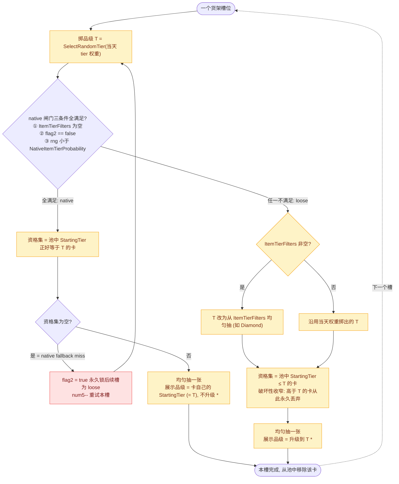

> Status: REFERENCE-ONLY: doc #3 of the shop-entry series (native/loose gate, hero limits, RNG order, data gaps; 475c0b0d 2026-06-18). Same disposition as siblings #1/#2/#4/#5: pure decompiled-source analysis kept per a8fee8b9's explicit intent; the downstream #6 shop-probability overlay was removed unshipped. Cross-link to doc #6 now points into docs/archive/.

# native 与 loose 深入 + 英雄限制 + 数据缺口（卖卡商店）

状态：draft（深入讲解版）
最后核对：2026-06-15（已用对抗式 workflow 复核核心论断，全部带 file:line 证据；后续补入 RNG 顺序、3 张卡品级与当天权重关系、手牌关联、`NativeItemTierProbability` 运行时不可得）
> **📚「进商店逻辑」文档系列 · 建议阅读顺序**（你在读 **#3 深入**）
> 1. [总览 · 从进店到离店的完整流程](2026-06-15-shop-entry-1-lifecycle.md)
> 2. [讲解 · 铺货 / 单卡概率怎么算（TL;DR + 流程图 + 名词词典）](2026-06-15-shop-entry-2-stocking-explainer.md)
> 3. [深入 · native/loose + 英雄 + RNG 顺序 + 手牌 + 数据缺口](2026-06-15-shop-entry-3-native-loose-deep-dive.md) ← 本文
> 4. [参考 · 单卡概率逐行推导 + Collection Panel 接入](2026-06-15-shop-entry-4-single-card-reference.md)
> 5. [背景 · 旧 dealer 是什么 / 为何在客户端 / 是否线上权威](2026-06-15-shop-entry-5-client-server-boundary.md)
> 6. [落地设计 · Collection Panel 商店概率浮层](2026-06-15-collection-panel-shop-probability-design.md)

> 本文专门把几件之前讲得不够清楚的事讲透：
> 1. **native 和 loose 到底是什么、什么时候走哪条**（含「展示品级」的精确语义，§2）。
> 2. **商店发卡和你手中的牌有没有关系**（§2.5）。
> 3. **在「一个商人进店发 3 张、棋盘不会被格子限制」的真实约束下，怎么基于 native/loose 分析单卡概率**（§3），含**一个槽位的随机数（RNG）顺序**（§3.5）和**3 张卡的品级与当天 tier 权重的关系**（§3.6）。
> 4. **每个 dealer 输入到底缺什么数据**——逐项给状态（§6），含 **`NativeItemTierProbability` 为什么客户端运行时也拿不到**（§6.1）。
> 顺带把**英雄限制**和 Collection Panel 现有的英雄逻辑一并写清（§4）。

---

## TL;DR

- **native = 卡以自己的起始品级「原样」出现（不升级）**；只有 `StartingTier` **正好等于**本槽掷出品级 `T` 的卡才有资格。
- **loose = 卡被「升级」到本槽掷出的品级 `T`**；`StartingTier <= T` 的卡都有资格，被选中后升到 `T`。
- **什么时候走 native**：一个槽位要三条件**同时**满足才走 native —— ① 商人没有 `ItemTierFilters`，② 之前没发生过 native fallback miss（`flag2==false`），③ `rng < NativeItemTierProbability`。**任一不满足就走 loose。**
- **现实约束让模型大大简化**：一个标准卖卡商人 `NumberCardsToSpawn = 3`，最大卡 3 格，货架 10 格，进店先清空 → **格子限制永远不触发**，可以从模型里直接删掉。
- **tier 专卖商人就是 `ItemTierFilters` 商人**：catalog 里已经有 Curio(铜/中立)、Silvia(银)、Goldie(金)、Luxe(钻) 四个卖物商人 + 四个对应技能训练师。它们**永远走 loose**，把卡升级到锁定品级。你说的 Sylvia/Luxury 就是这一类（实际名字是 Silvia=银、Luxe=钻）。
- **英雄限制只决定「哪些卡进候选池」，和 native/loose 正交**。Collection Panel 已经用 4 个 `HeroMode` 建模了它。
- **你附的那张 wiki 图，正好能填「每天 tier 权重」这个占位符**（来源网络、版本 0.1.9，仅供参考）。**但它给不出 `NativeItemTierProbability`**——因为 native 和 loose 用的是同一个 tier 抽样，native 闸门概率对「出货品级分布」是隐形的。所以 **`NativeItemTierProbability` 是唯一真正卡住的未知数**。

**一句话**：流程和判定已经能讲得很清楚；唯一还差一个权威数字（native 闸门概率），它恰恰是 wiki 图也测不出来的那个。

---

## 1. 先把范围钉死：一个「标准卖卡商人」长什么样

本文聚焦最常见的情形，先用代码确认它的边界条件：

| 约束 | 值 | 代码证据 |
| --- | --- | --- |
| 进店发几张 | `NumberCardsToSpawn` 默认 **3** | `BazaarCard.cs:38`（`= 3`）|
| 最大卡尺寸 | Large = **3 格**（Small=1/Medium=2/Large=3）| `BazaarCard.cs:128-135`（枚举）+ `BazaarCardDealer.cs:4624`（`(int)CardSize` 当格数用）|
| 货架（对手区）格数 | **10** | `BazaarBoard.cs:100`（`new BazaarCard[10]`）+ `BazaarDeckTools.cs:220-232`（`for i<10`）|
| 进店是否先清空货架 | 是 | `BazaarCardDealer.cs:3437-3439` |

**推论：格子限制对标准卖卡商人永远不触发。** 3 张卡、每张最多 3 格 = 最多 9 格 ≤ 10 格；而且每发一张前是按**当前空位**实时过滤的，最坏情况是已经摆了 2 张 Large（占 6 格）还剩 4 格，第三张 Large（3 格）依然放得下（`FilterByRemainingBoardSize`，`BazaarCardDealer.cs:3559,4608-4625`）。

> 还有一点加固结论：货架是**对手区** `OpponentCardHand`，它的 `CountEmptySocketsOnCarpet` 只数「id 为空」的位置，**不受玩家自己棋盘的 CarpetUnlocks 锁格影响**——对手区 10 格全部可用（workflow 复核，`BazaarDeckTools.cs:220-232`）。

**所以本文的概率模型可以直接删掉「格子过滤」这一步**，只剩：3 个槽，每槽走一次 native/loose。

**两个需要诚实标注的边界（不是反例，是适用范围）：**

1. **经验卡例外**：若商人配了 `AdvancedEncounters.ExperiencePointsId`，会在主循环前先发一张经验卡占用对手区格子（`BazaarCardDealer.cs:3463-3465`）。经验卡通常是 1 格，发完还剩 9 格，对 3 张卡仍不绑定；只有更大的经验卡或更高的 `NumberCardsToSpawn` 才可能让格子过滤生效。
2. **`NumberCardsToSpawn` 是 data-driven，不是写死的 3**：3 只是 C# 默认值。dealer 读的是每张商人卡数据里的实际值（`BazaarCardDealer.cs:3532`），代码显式处理了非 3 的情况（为 0 直接 return、池子不够时钳到 `list4.Count`、tooltip 还把它显示成 `MonsterItemRewardCount`）。权威 per-merchant 值在 `GameData.db`，不在本仓库。**本文按「常见情况 = 3」分析，但记住这是一个数据字段。**

---

## 2. native 和 loose 到底是什么（本文核心）

### 2.1 一句话定义（先记住这个）

| | 资格条件 | 被选中后的「展示品级」 | 直觉 |
| --- | --- | --- | --- |
| **native（原生）** | `StartingTier == T`（起始品级**正好等于**掷出品级）| **=卡自己的起始品级，不升级**\* | 「让卡以它的天然品级原样出现」 |
| **loose（宽松）** | `StartingTier <= T`（起始品级**小于等于**掷出品级）| **=升级到 `T`**\* | 「随便挑张够低的卡，升级到掷出的品级」 |

\* 这一列有一个 `TierDuplicateCardHandling` 的修正，见 2.4，但**它只影响展示品级，不影响这张卡是否出现**。

`T` 是这个槽位用当天 tier 权重表掷出来的一个品级（`SelectRandomTier`，`BazaarCardDealer.cs:3552-3558`）。

**为什么游戏需要 native 这条路？** 如果只有 loose，每张被选中的卡都会被升级到 `T`，玩家永远买不到「青铜价的青铜卡」。native 分支的意义就是：有一定概率，让一张卡**以它本来的低品级**出现在货架上。这就是 native 和 loose 最本质的区别——**不是「资格宽严」，而是「出现时升不升级」**。

### 2.2 什么时候走 native，什么时候走 loose（判定，已复核）

每个槽位先算一个布尔 `flag3`（本槽是否走 native）：

```text
flag3 = (ItemTierFilters.Count == 0)  AND  (flag2 == false)  AND  (rng < NativeItemTierProbability)
```

代码：`BazaarCardDealer.cs:3547-3551`。三者是短路 `&&`。**`flag3` 为 true 才走 native，否则走 loose。**

所以 **你会走 loose，当且仅当下面任一成立**：

| 触发 loose 的原因 | 含义 | 关键点 |
| --- | --- | --- |
| `ItemTierFilters` 非空 | 商人是 tier 专卖（Silvia/Goldie/Luxe…）| **整店所有槽永久走 loose**，native 闸门被这条直接关死 |
| `flag2 == true` | 之前某槽发生了 **native fallback miss** | **从那一槽起，后面所有槽都被锁成 loose** |
| `rng >= NativeItemTierProbability` | 这一槽的随机闸门没开 | **只影响当前槽**；下一槽重新掷闸门 |

**`flag2`（sticky lock）的精确语义**（workflow 纠正了一个常见误解）：`flag2` 被置 true **只有一种情况**——某个槽位**已经走了 native**（`flag3==true`、闸门开了），却发现池里**没有任何** `StartingTier == T` 的卡（`list9` 为空）。这时代码 `num5--`（重试本槽）、`flag2 = true`、`continue`（`BazaarCardDealer.cs:3567-3573`）。

- `flag2` 声明在 for 循环**外面**（`BazaarCardDealer.cs:3544`），所以一旦置 true 就**永久**锁住后续所有槽位。
- **注意区分**：一个槽位「闸门随机没开」**不会**设 `flag2`；只有「闸门开了但同品级没货」才会。换句话说，native miss ≠ 闸门没开。

### 2.3 一张图：单个槽位的 native/loose 决策



`*` 展示品级的精确语义见下一节（`TierDuplicateCardHandling` 修正）。

### 2.4 展示品级的精确语义（`TierDuplicateCardHandling` 修正）

2.1 的「展示品级」列在**最常见情况下**成立，但有一个修正项，是 workflow 对抗复核挖出来的，必须讲清楚：

**机制链：** 新建卡实例时，Item 的 `Tier = StartingTier`（`StaticDataCardRepository.cs:207-210`）；最终 `DealCard` **只在 `传入tier > 实例当前tier` 且是 Item 时才升级**（`BazaarDeckTools.cs:94-96`）。而「传入 tier」是 `list3` 记录的品级 = `TierDuplicateCardHandling(T, 卡id)` 的返回值。

`TierDuplicateCardHandling`（`BazaarCardDealer.cs:4467-4489`）：扫玩家**棋盘**里同 id、且 `Tier < Diamond` 的卡；**有就返回这些卡的最大 tier（直接覆盖掷出的 `T`），没有才返回原本的 `T`**。注意它是**覆盖**，不是「取较大值」——所以覆盖后的展示品级**可能比 `T` 高，也可能比 `T` 低**（`BazaarCardDealer.cs:4482-4484`：`return list.Max();`，没有和 `T` 比大小）。

把各情况摊开：

| 情况 | 资格 | 展示品级 | 结论 |
| --- | --- | --- | --- |
| **不持有该卡**（最常见）| native `== T` / loose `<= T` | native = 卡的起始品级（= `T`）；loose = 升到 `T` | 跟手牌无关 ✅ |
| **持有该卡的副本（Tier < Diamond）** | 同上 | **覆盖为你持有副本的最高 tier，无视掷出的 `T`** | loose 时可能比 `T` **低**（你那张铜卡的例子）；native/loose 也可能比 `T` **高** ⚠️ |
| **loose 资格集为空（fallback，罕见）** | 可能 `StartingTier > T` | 不升级、保留更高的起始品级（除非被上面的「持有副本」规则覆盖）| 边界 |

要点：

- **`TierDuplicateCardHandling` 只改「这张卡出现时摆出来是几级」，不改「它出不出现」。** 算「出现概率」时可以完全忽略它；只有当你要算「出现且为某品级」时才接上。
- 它在 native 分支**无条件**调用（`BazaarCardDealer.cs:3577`），在 loose 分支**仅当 `ItemTierFilters` 为空**时调用（`BazaarCardDealer.cs:3599-3601`）。
- 对 **tier 专卖商人（`ItemTierFilters` 非空）跳过**它——所以它们的展示品级就是干净的「锁定品级」（见第 5 节）。
- 这一步的产品意义是**合成**：商店发到你已有的同名卡时，把它摆成你已有副本的 tier，方便合并升级。所以「掷出金、但你手里是铜」时，发出来的会被覆盖回**铜**，能合成——而不是摆成不能合成的金。**但 tier 专卖商人跳过这步**，那儿发到你已有的低品级卡会被锁成商人的高品级，无法与你手上的合成。

### 2.5 商店发卡和你手中的牌有关系吗：基本无关

结论先行：**商店刷哪些卡、以多大概率刷，跟你手里的牌无关。** 只有两个例外，且都不改变「这张卡会不会出现」。我把 `DealFilteredCards` 整条路径里所有读取你棋盘/手牌/仓库的地方都查过，下面是全部。

**✅ 例外 1：棋盘上的物品 → 只改「展示品级」，不改「是否出现」。**
`TierDuplicateCardHandling`（`BazaarCardDealer.cs:4467-4489`）在商店**选中一张卡之后**，扫你**棋盘**（`PlayerCardHand`）有没有同 id、且 `Tier < Diamond` 的副本；有就把这张发出来的卡**覆盖**成「你已有副本的最高品级」（无视掷出的 `T`，可能高也可能低），方便和你手上的同级卡合成。限制：

- **只看棋盘，不看仓库**（`PlayerStorageHand` 在整条发牌路径里一次都不读）。
- 只有已有副本是 Bronze/Silver/Gold 才计入（`< Diamond`）。
- native 无条件调用（`:3577`），loose 仅当无 `ItemTierFilters` 时调用（`:3599-3601`），tier 专卖商人跳过。
- **覆盖**为你已有副本的最高 tier（无视掷出的 `T`，**可能比 `T` 高、也可能低**，例如持铜卡时把掷出的金覆盖回铜以便合成）；但**不进候选池、不改抽样权重**——手里有 X 不会让 X 更容易刷出来。

**✅ 例外 2：已装备的技能 → 排除出候选池。**
建池时把你 4 个技能槽（`PlayerSkillCard`）里的同 id 卡剔除（`BazaarCardDealer.cs:3456-3459`）。它**会**影响「是否出现」，但只对技能/训练师商店有意义（物品商店池里没技能卡）。注意是「技能槽」，不是手牌。

**❌ 常见误解：**

- 棋盘空位**不**决定商店刷什么——那次空间过滤看的是**对手区货架** `OpponentCardHand`（`:3559`、`:4608-4625`），不是你的手牌；你棋盘满不满只在你**购买**时（`No_Space`）才有约束。
- 仓库（storage）在发牌逻辑里完全不参与。

| 你持有的 | 影响是否出现? | 影响展示品级? | 代码 |
| --- | --- | --- | --- |
| 棋盘物品（`PlayerCardHand`，< Diamond）| ❌ | ✅ 覆盖为你已有最高品级（可高可低，便于合成）| 4467-4489 / 3577 / 3601 |
| 仓库物品（`PlayerStorageHand`）| ❌ | ❌（不被读取）| —（全路径无引用）|
| 已装备技能（`PlayerSkillCard`）| ✅ 同 id 排除出池 | — | 3456-3459 |
| 棋盘空位 | ❌（看的是对手区货架）| — | 3559 / 4608-4625 |

---

## 3. 基于「3 槽 native/loose」分析单卡概率

现在把现实约束代入，给一个能照着算的框架。

### 3.1 简化后的单槽模型

格子过滤删掉后，每个槽位就是：

```text
1. 掷 T ~ 当天 tier 权重表 w_day(·)
2. 若 native 闸门开 (概率 p, 需 ItemTierFilters 空 且 flag2==false):
       资格集 S_native = { 池中卡 : StartingTier == T }
       若 S_native 空 → flag2=true, 重试本槽(强制 loose)
       否则 → 在 S_native 内均匀抽 1 张, 从池移除
   否则 (loose):
       若 ItemTierFilters 非空 → T = 从 ItemTierFilters 均匀抽
       资格集 S_loose = { 池中卡 : StartingTier <= T }
       池 ← S_loose (非空时, 破坏性收窄), 然后均匀抽 1 张, 从池移除
```

其中 `p = NativeItemTierProbability`（按 day/hour 取，**未知，占位**）。

### 3.2 目标卡 `X` 在「一个槽位」被选中的条件概率

设进入本槽前存活池为 `L`，`X ∈ L`，`X.StartingTier = s`。

**native 路径**（仅当闸门开，概率 `p`）：

```text
P(选中 X | native) = Σ_T  w_day(T) · [s == T] · ( 1 / |{y∈L : y.StartingTier == T}| )
```

只有掷到 `T == s` 才给 `X` 资格；分母是池里和 `X` 同起始品级的卡数。

**loose 路径**（闸门没开 / 被锁 / tier 专卖，概率 `1-p` 或 1）：

```text
P(选中 X | loose) = Σ_T  P(T) · [s <= T] · ( 1 / |{y∈L : y.StartingTier <= T}| )
```

`P(T)` 是 `w_day(T)`（普通商人）或 `ItemTierFilters` 上的均匀分布（tier 专卖）。`X` 只要 `s <= T` 就有资格，但分母是**所有** `StartingTier <= T` 的卡——掷得越高，分母越大，`X` 反而被稀释。

**本槽合计**（普通商人）：`P = p · P(·|native) + (1-p) · P(·|loose)`。

### 3.3 三个槽位不是独立的（必须串起来）

loose 抽卡会执行 `池 ← S_loose(T)`（`BazaarCardDealer.cs:3587-3590`），**永久丢弃所有 `StartingTier > T` 的卡**。所以前一个 loose 槽掷到低品级，会把后面槽里高起始品级的目标卡概率打到 0。正确做法是用状态机把 3 个槽串起来枚举（或蒙特卡洛），状态至少是 `(已发槽数, 当前池, flag2)`。详见配套技术文档第 8.2 节的伪代码（删掉其中的 size filter 即可）。

### 3.4 一个具体算例（符号化，因为 `p` 未知）

**问题**：第 8 天，某英雄进一个普通卖卡商人，一张起始品级 = **Gold** 的目标卡 `X`，出现概率？

用 wiki 第 8 天权重（见第 7 节）：`Silver 0.60, Gold 0.32, Diamond 0.08`。对单个槽位、`X.StartingTier = Gold`：

- **native 贡献**：需要掷到 `T == Gold`（0.32），再在「同为 Gold 起始」的卡里抽中 `X`。
  `≈ p · 0.32 · (1 / N_gold)`，`N_gold` = 池中 Gold 起始卡数。
- **loose 贡献**：需要掷到 `T >= Gold`（Gold 0.32 + Diamond 0.08 = 0.40），再在「`StartingTier <= T`」的卡里抽中 `X`。
  `≈ (1-p) · [ 0.32 · (1/N_{≤Gold}) + 0.08 · (1/N_{≤Diamond}) ]`。

可以直接读出几个定性结论，不需要知道 `p`：

- **掷到 Silver（0.60）对这张 Gold 卡几乎是浪费**：native 要求相等（Silver≠Gold 不给资格）；loose 要求 `Gold <= Silver` 也不成立。所以**第 8 天有 60% 的 tier roll 对 Gold 起始卡是「死票」**。
- **越高起始品级的卡，越依赖高 tier roll**，而高 tier roll 在前几天权重极低（见第 7 节，Gold 要到第 5 天才出现、Diamond 第 8 天才出现）。
- **`p` 只在 native 和 loose 之间分配权重**：`p` 越大，越偏向「同品级精确抽中」（分母 `N_gold` 小，可能更有利）；`p` 越小，越偏向「`<=T` 的大池稀释」。**正因为 `p` 未知，我们能讲清结构，但报不出精确百分比。**

> 这正是为什么第 6 节把 `NativeItemTierProbability` 列为唯一的红色未知项。

### 3.5 一个槽位的随机数顺序（RNG 顺序）

发牌前先取两类参数，**注意取的频率/键不同**：

- `NativeItemTierProbability`（即上面的 `p`）：循环**前取一次**，按 **day+hour**（`GetByDayAndHour`，`BazaarCardDealer.cs:3526-3531`）→ 3 个槽**共用同一个 `p`**。
- 当天 tier 权重表：每槽**各取一次**，但只按 **day**（`GetProbabilitiesByDay(day)`，`:3552`）→ 取的是同一张表，3 个槽的权重**完全相同**。

然后每个槽位按**固定顺序**消耗随机数：

| 顺序 | 调用 | 作用 | 是否每槽都消耗 | 代码 |
| --- | --- | --- | --- | --- |
| ① | `seedManager.GetDouble()` | native 闸门 | **否**——短路 `&&`，仅当 `ItemTierFilters` 空且 `flag2==false` 才消耗 | `:3548` |
| ② | `SelectRandomTier()` 内的 `GetDouble()` | 掷品级 T | **是**——即便 tier 专卖会立刻覆盖 T，这次抽样也照常消耗 | `:3558 → :4453` |
| ③a | `GetNumber(S_native 张数)` | native 均匀抽卡 | native 分支 | `:3574` |
| ③b | `GetNumber(ItemTierFilters 个数)` | 从过滤器选 tier | 仅 tier 专卖 | `:3585` |
| ③c | `GetNumber(当前池张数)` | loose 均匀抽卡 | loose 分支 | `:3596` |

按情形展开四种典型序列：

```text
普通商人, 闸门可用:          GetDouble(闸门) → GetDouble(掷T) → GetNumber(抽卡)
普通商人, flag2 已锁:        [跳过闸门]      → GetDouble(掷T) → GetNumber(loose抽卡)
tier 专卖商人:              [跳过闸门]      → GetDouble(掷T，丢弃) → GetNumber(选tier) → GetNumber(loose抽卡)
native fallback miss(本槽):  GetDouble(闸门开) → GetDouble(掷T) → [同品级没货 → num5--, flag2=true, 重试本槽, 不抽卡]
```

**为什么这个顺序重要**：要用同一随机种子精确复刻商店内容，就必须严格按此序消耗随机流。两个最易踩的坑——① 闸门的 `GetDouble` 是短路的，一旦 `flag2` 被锁或商人有 `ItemTierFilters`，后续槽位**不再消耗**这次 `GetDouble`，随机流会整体错位；② tier 专卖商人虽不用当天权重，`SelectRandomTier` 仍会**白消耗一次** `GetDouble`。

### 3.6 出 3 张卡时，每张卡的品级和「当天 tier 权重」的关系

把上面的取值频率 + RNG 顺序合起来，就能直接回答这个问题：

1. **3 张卡共用同一张权重表、同一个 native 概率。** 同一次进店里 day 不变 → 当天权重 `w_day` 对 3 个槽完全相同；day+hour 不变 → `p` 也相同。**槽位之间唯一不同的是各自独立的随机抽样，不是分布。**
2. **每个槽独立掷自己的品级 `T_i`。** 每槽各做一次 `SelectRandomTier`（独立 `GetDouble`），所以掷出的三个品级 `(T₁, T₂, T₃)` 近似 **i.i.d. ~ w_day**（独立同分布）。
3. **每张卡的「展示品级」≈ 它那一槽掷出的 `T_i`。** 因为 loose 把卡升级到 `T_i`、native 要求卡起始品级正好 `== T_i`——两条路最终摆出来的品级都 ≈ `T_i`。所以**一阶近似下，3 张卡的品级各自独立地服从当天权重表 `w_day`**。

> 例（第 8 天，普通商人，权重 Silver 0.60 / Gold 0.32 / Diamond 0.08）：3 张卡里**每一张**都独立地约 60% 银、32% 金、8% 钻。期望大致是「2 张银 + 1 张金」，但完全可能 3 张全银，或刷出 2 张金。

**偏离「干净 i.i.d.」的几个因素**（要诚实标注）：

- **native 精确匹配 + fallback**：native 槽只有当池里存在 `StartingTier == T_i` 的卡才成立；没有就丢弃重掷（`num5--`、`flag2=true`），让最终品级分布**偏离那些「没有对应起始品级卡」的 tier**。
- **手牌重复（合成）覆盖**：若你已持有该卡的 `< Diamond` 副本，`TierDuplicateCardHandling` 把展示品级**覆盖为你副本的最高 tier**——可能高于、也可能**低于** `T_i`（持铜卡时金会被覆盖回铜，见 §2.4 / §2.5）。
- **loose 空集 fallback**：极少数情况展示品级会**低于** `T_i`（卡停在更高的起始品级，见 §2.4）。
- **tier 专卖商人**：完全不看 `w_day`——3 张卡被锁成同一个过滤品级（如 Luxe 全 Diamond）。

**品级近似独立，但「具体是哪几张卡」不独立。** 三个 `T_i` 的抽样相互独立，但**卡的身份**被池子串联：每抽一张就从池移除（不会重复同一 id），loose 还会破坏性收窄起始品级上限（§3.3）。所以你可能拿到 3 张「金品级」的卡，但它们一定是 3 张不同的卡，且后面槽位能选的卡，其**起始品级**被前面的低 tier roll 压制。

---

## 4. 英雄限制：决定「哪些卡可用」，与 native/loose 正交

你的判断是对的——**英雄限制只决定候选池里有哪些卡，不参与每槽的 tier 机制**（workflow 复核确认，claim A）。下面把 dealer 和 Collection Panel 两层都写清。

### 4.1 dealer 这一层（游戏真实逻辑）

```text
heroFilters = MerchantHeroFilters（商人卡上非空时）
            = [玩家当前英雄]（否则）
候选：heroFilters.Intersect(card.Heroes).Any()   （heroFilters 为空则不过滤）
```

代码：`BazaarCardDealer.cs:3442-3449` + `StaticDataCardRepository.cs:164-166`。

**关键结论：中立卡和英雄卡是两个分开的池。** 一个普通英雄商人 `heroFilters = [玩家英雄]`，而一张纯中立卡 `Heroes = [Common]`，`Intersect([英雄],[Common]) = 空` → **不会被英雄商人选中**（workflow 复核，claim B）。中立卡只有当商人的 `MerchantHeroFilters` **显式包含 Common** 时才进池。所以游戏里有专门的「中立商人」。

> 一个 drift 警告：dealer 用的英雄枚举是 `BazaarTypes.EBazaarHero`（含 `Invalid, Common, …, Hero7, Neutral, Count`——**Common 和 Neutral 是两个值**），而 Collection Panel 用 `BazaarGameShared.EHero`（`Common, …, Karnok, Hero8`——**没有独立 Neutral，mod 把中立并到 Common**）。绝大多数情况无影响，但若某卡用的是 dealer 的独立 `Neutral` 值，mod 的 Common-keyed 逻辑不会等价复刻。

### 4.2 Collection Panel 这一层（mod 已有的产品逻辑）

Collection Panel 的 `CollectionSourceOfferPoolResolver.MatchesHero` 用 4 个 `HeroMode` 建模英雄归属（`CollectionSourceOfferPoolResolver.cs:156-201`）：

| HeroMode | Collection Panel 行为 | 对应 dealer 含义 |
| --- | --- | --- |
| `AllHeroes` | 永远 true | `heroFilters` 为空（不设英雄门）跨英雄商人 |
| `SelectedHero` | `Contains(card.Heroes, 当前英雄)`；没选英雄则 true | 普通英雄商人，`heroFilters=[玩家英雄]`（动态跟随当前 run）|
| `FixedHero`（merchant） | `Contains(card.Heroes, rule.Hero)` | `MerchantHeroFilters` 硬锁某个英雄 |
| `FixedHero`（trainer） | **`MatchesExclusiveHero`：`card.Heroes.Count == 1 且含该英雄`** | 训练师教「该英雄独有」技能——**比 dealer 的 Intersect 更严**，是 mod 的产品近似，不是 dealer 字面规则 |
| `NeutralOnly` | `Contains(card.Heroes, Common)` | 专门的中立池（`heroFilters` 含 Common）|

实测分布（catalog 全量扫描）：`SelectedHero` 47 项、`FixedHero` 14 项（7 个英雄卖物商人 + 7 个英雄独有训练师）、`AllHeroes` 7 项、`NeutralOnly` 仅 1 项（Curio）。

**两个容易混淆的点：**

1. **mod 里有两层英雄过滤，别混为一谈**：(a) source offer pool 解析（`MatchesHero`，决定「这个商人卖哪些卡」，对应 dealer 的 `FilterCards` 成员资格）；(b) 用户手动点的英雄筛选行（`CollectionFilterEngine.cs` → `CollectionHeroScope.MatchesFilter`，决定「用户想看哪些」）。两者都比对 `card.Heroes`，但回答不同问题。
2. **trainer 的 `Count==1` 排他规则是 mod 自己的细化**，dealer 对技能用的还是普通 `Intersect`。若有人把 mod 的训练师池当成 byte-exact 复刻 dealer，会偏。

### 4.3 缺什么英雄数据

dealer 的权威英雄门是**每个商人卡上的 `MerchantHeroFilters`**（`BazaarCard.cs:50`，dealer 在 `3443-3445` 读）。**这个 per-merchant 列表 mod 里没有**。Collection Panel 用两个更粗的手填字段顶替：`availableHeroes`（这个 source 在哪些英雄下显示）+ 每个 offer segment 的 `heroMode`/`hero`。**这是「够用的近似」，不是权威复刻**——要精确复刻 dealer，需要补每个商人模板真实的 `MerchantHeroFilters`。

---

## 5. tier 专卖商人 = `ItemTierFilters` 商人（实证）

`ItemTierFilters` 是把 native 关死、强制 loose、并把卡升级到锁定品级的机制（workflow 复核，claim F）：

```text
ItemTierFilters 非空 → 每个槽都是 loose
  T = 从 ItemTierFilters 均匀抽（如只有 [Diamond] 就恒为 Diamond）
  资格集 = { StartingTier <= T }
  抽中后升级到 T；跳过 TierDuplicateCardHandling
```

catalog 里**已经有这 8 个 tier 专卖 source**（全部 `AtMost` 模式，**零 Exact**）：

| 名字 | 类型 | 卖/教 | 锁定品级 | heroMode | = dealer |
| --- | --- | --- | --- | --- | --- |
| **Curio** | 商人 | 铜级中立物品 | Bronze | NeutralOnly | `ItemTierFilters=[Bronze]` + 中立池 |
| **Silvia** | 商人 | 银级物品 | Silver | SelectedHero | `ItemTierFilters=[Silver]` |
| **Goldie** | 商人 | 金级物品 | Gold | SelectedHero | `ItemTierFilters=[Gold]` |
| **Luxe** | 商人 | 钻级物品 | Diamond | SelectedHero | `ItemTierFilters=[Diamond]` |
| **Pip** | 训练师 | 给 2 金 + 教铜级技能 | Bronze | SelectedHero | 技能版 |
| **Argenta** | 训练师 | 银级技能 | Silver | SelectedHero | 技能版 |
| **Orlin** | 训练师 | 金级技能 | Gold | SelectedHero | 技能版 |
| **Adira** | 训练师 | 钻级技能 | Diamond | SelectedHero | 技能版 |

> 你提到的 **Sylvia / Luxury 就是这一类**——对应 catalog 里的 **Silvia（银）/ Luxe（钻）**（外加 Goldie 金、Curio 铜）。

**两个要写进文档的细节：**

1. **catalog 用 `startingTier: AtMost: <tier>` 来表达**，意思是「起始品级 ≤ 该品级」——这正好等于 loose 的资格集 `StartingTier <= T`。所以 catalog 的 tier 专卖**已经在近似 `ItemTierFilters` 的候选池**了，只差「卡会被升级到锁定品级」这个展示细节。
2. **catalog 里零条 `Exact` 规则**（8 条 tier 规则全是 `AtMost`）。也就是说 **Collection Panel 目前只建模了 loose（`<=`），没有建模 native（`==`）**。这是把 native 概率接进来时要补的一块。

---

## 6. 数据缺口盘点：每个 dealer 输入到底缺什么（精确版）

把你的几条澄清直接落进表里。状态图例：✅ 已知 / 🟡 部分已知（可补，工作量小）/ 🔴 关键未知。

| dealer 输入 | 状态 | 现在有什么 | 还缺什么 / 怎么补 |
| --- | --- | --- | --- |
| `NumberCardsToSpawn` | ✅（常见=3）| 默认 3，本文按 3 分析 | 它是 data-driven 字段；权威 per-merchant 值在 `GameData.db`，少数商人可能非 3 |
| `RerollRepeats` | 🟡 | — | 你确认「会作为记录」；接入即可，工作量小 |
| `ItemTierFilters` | 🟡 | catalog 已知 8 个 tier 专卖（Curio/Silvia/Goldie/Luxe + 4 训练师）| 其余普通商人确认为空；个别特殊商人需逐个核对 |
| `CardIdFilters` | 🟡 | 现有 resolver 能产出每个 source 的 **`OfferedCardIds` 具体集合**，天然适合表达「这个店就卖这几张」 | **但 catalog 里没有任何 source 用「字面 GUID 白名单」**；dealer 的 `CardIdFilters` 是另一套机制（还会触发「数量==NumberCardsToSpawn 时固定直发」`BazaarCardDealer.cs:3477-3483`，并**短路英雄门** `StaticDataCardRepository.cs:164`）。要复刻固定直发路径需显式建模，不能只靠 offer 集合 |
| reroll 排除集 | ⬜ 暂不考虑 | 旧字段 `GameStateMetadata.DealtCardForReRollExclusion` | 你说先不接；接入也简单（线上状态另说，不能直接复用旧字段）|
| **每天 tier 权重表** | 🟡 有参考 | **你附的 wiki 图**填了占位（见第 7 节）| 标注「来源网络/版本 0.1.9/仅供参考」；线上权威表仍需服务器或抓包确认 |
| **`NativeItemTierProbability`** | 🔴 **唯一关键未知，且客户端运行时也拿不到** | 无 | 客户端不可得（未接线 + 服务器侧 + 混淆剥离，见 §6.1）；**wiki 图也给不出**（见下）。需服务器源码 / 抓包 / 经验估计 |

**为什么 wiki 图填不了 `NativeItemTierProbability`（必须讲清的点）：** native 和 loose 用的是**同一个** `SelectRandomTier(当天权重)` 抽样（`BazaarCardDealer.cs:3558`）；闸门 `flag3` 开不开**只改变挑哪张卡，不改变应用的品级 `T`**。所以「出货品级随天分布」这张图反映的是**当天权重表**，对 `NativeItemTierProbability` 完全隐形（workflow 复核，claim G 后半确认）。换句话说：**你能从出货品级反推每天权重，但永远反推不出 native 闸门概率。**

> 顺带，wiki 这张「出货品级分布」严格说是当天权重表的**一阶近似**，会被几个效应轻微偏移：native fallback 丢弃（偏离「没有同起始品级卡」的那些 tier）、`TierDuplicateCardHandling` 把展示品级抬高、loose fallback 保留更高起始品级、tier 专卖直接改写 T。当成参考权重够用，当成精确权重不行。

### 6.1 `NativeItemTierProbability` 能从客户端运行时拿到吗：不能

三条独立证据（已核对当前客户端反编译）：

1. **持有它的类型在客户端没接线。** 它挂在 `TDayHourConfig.NativeItemTierProbability`（`decompiled/BazaarGameShared/BazaarGameShared.Domain.Game/TDayHourConfig.cs:20`，默认 `0.05f`；另有一个按 tier 的字典 `NativeItemTierProbabilities` 在 `:28`）。但全树搜索**两份反编译快照**，`TDayHourConfig` 只出现在自己的定义文件里——`TheBazaarRuntime` 没有任何地方 new 它、加载它、读它，它也没注册进多态反序列化体系（无 `[BazaarJsonDerivedType]`）。运行时根本没有这个对象实例，没东西可读。
2. **当前客户端不在本地算 tier 发牌——服务器算。** 客户端会用的当天权重表 `TGameMode.ItemSkillSpawnTierPercantagesByDay` 在 `TheBazaarRuntime` 里**没有任何消费点**；发牌由服务器 `GameSim` 消息驱动，客户端只渲染。没有客户端代码路径会去用 native 闸门概率。
3. **能存在于模型里的那部分数据也被混淆剥离。** 客户端序列化器 `BazaarJsonSerializerSettingsClient` 用 **`obfuscate: true`** 构造转换器（`decompiled/BazaarGameShared/BazaarGameShared.Infra.Serialization/BazaarJsonSerializerSettingsClient.cs:11`），凡 `[BazaarObfuscate]` 属性整列排除（`BazaarJsonDerivedTypeConverter.cs:75-78`）；当天权重表正带这个标记（`TGameMode.cs:21-22`），所以根本不在客户端 `GameData.db` 里——这也解释了为什么 mod 的 `DayTierSchedule` 只能硬编码近似。

**要避开的坑**：`TDayHourConfig.NativeItemTierProbability` 的默认值 `0.05f` 是占位、不是真值；何况运行时连实例都不存在。别把 `0.05f` 当成线上数字。

**真值从哪来**：服务器配置（唯一权威）/ 抓包（但 native/loose 判定在服务器做，很可能只发结果不发概率）/ **从对局观测经验估计**——因为 native = 卡以自己起始品级原样出现、loose = 升级到掷出品级，统计「出货卡里有多大比例停在自己 `StartingTier`、没被升级」可以**经验反推** native 命中率（会被 loose 恰好掷到 `T == StartingTier`、以及手牌重复升级污染，是估计而非权威）。注意：这条「升没升级」的维度才测得出 native 率；上面 §6 说的「品级分布维度测不出」是另一回事。

---

## 7. 占位符：每天 tier 权重表（来自 wiki，仅供参考）

> **数据来源：** https://thebazaar.wiki.gg/wiki/Item_Skill_Spawn_Tier_Percentage_by_Day_0.1.9 （社区 wiki，版本 0.1.9）。
> **来源网络，仅作参考，不是线上权威，且会随 balance patch 漂移。** 对应 dealer 里的 `GetProbabilitiesByDay(day)`（或其一阶近似）。

| Day | Bronze | Silver | Gold | Diamond |
| --- | --- | --- | --- | --- |
| 1 | 1.00 | — | — | — |
| 2 | 0.91 | 0.09 | — | — |
| 3 | 0.61 | 0.39 | — | — |
| 4 | 0.36 | 0.64 | — | — |
| 5 | 0.19 | 0.70 | 0.12 | — |
| 6 | 0.09 | 0.73 | 0.18 | — |
| 7 | — | 0.81 | 0.19 | — |
| 8 | — | 0.60 | 0.32 | 0.08 |
| 9 | — | 0.46 | 0.39 | 0.15 |
| 10+ | — | 0.40 | 0.45 | 0.15 |

说明：

- 表中无 **Legendary**——这张参考表里的物品/技能出货只到 Diamond。
- 行和约为 1.00（个别行因四舍五入到 1.01）。`SelectRandomTier` 会把权重升序累加抽样，和小于 1 的部分回退 Bronze（`BazaarCardDealer.cs:4451-4464`）。
- **native 闸门概率 `NativeItemTierProbability` 仍是 `<TBD>`**，按 day/hour 取（`BazaarCardDealer.cs:3526-3531`），本表不含、wiki 也测不出、**客户端运行时也拿不到**（见 §6.1）。

占位结构（拿到权威值再替换）：

```text
TierProbabilities[day]      = 上表（reference: thebazaar.wiki.gg 0.1.9）   # 仅供参考
NativeItemTierProbability[day][hour] = <TBD float ∈ [0,1]>                 # 关键未知
```

---

## 8. 一句话收尾（讲给观众）

> **native** 就是「让卡以它本来的品级原样出现」（只有起始品级**正好等于**本回合掷出的品级才有资格）；**loose** 就是「挑一张起始品级**不超过**掷出品级的卡，再升级到那个品级」。
> 三条件全满足才走 native，否则走 loose；tier 专卖商人（Silvia/Goldie/Luxe 这些）干脆永远 loose。英雄限制只决定「哪些卡进池」，和这套 tier 机制无关。
> 把一个商人发 3 张、格子放得下的现实约束代进去，流程就只剩「3 个槽各掷一次品级、各走一次 native/loose」——**唯一还差的数字，是 native 闸门到底多大概率会开**，而这恰恰是那张 wiki 图也量不出来的。

---

## 附：本文论断的复核来源

第 1/2/4/5/6 节的核心论断均来自一次对抗式多 agent 复核（4 个 Opus agent，266k tokens），逐条带 `file:line` 证据，关键修正（`flag2` 仅由 native fallback miss 触发、`TierDuplicateCardHandling` 可把展示品级抬到 T 以上、格子非绑定的边界、catalog 零 Exact 规则、两套英雄枚举 drift）已并入正文。需要逐行证据链时见配套技术文档
[2026-06-15-shop-entry-4-single-card-reference.md](2026-06-15-shop-entry-4-single-card-reference.md)。
