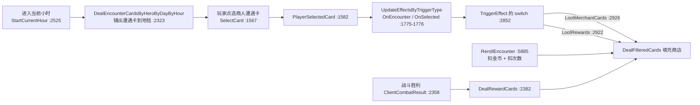
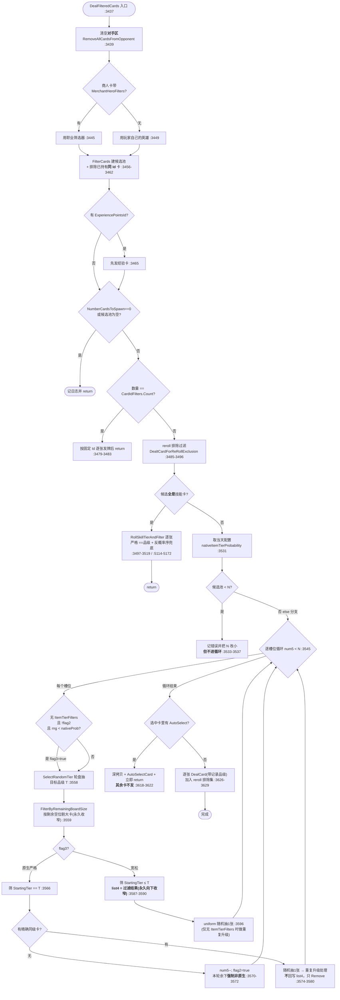
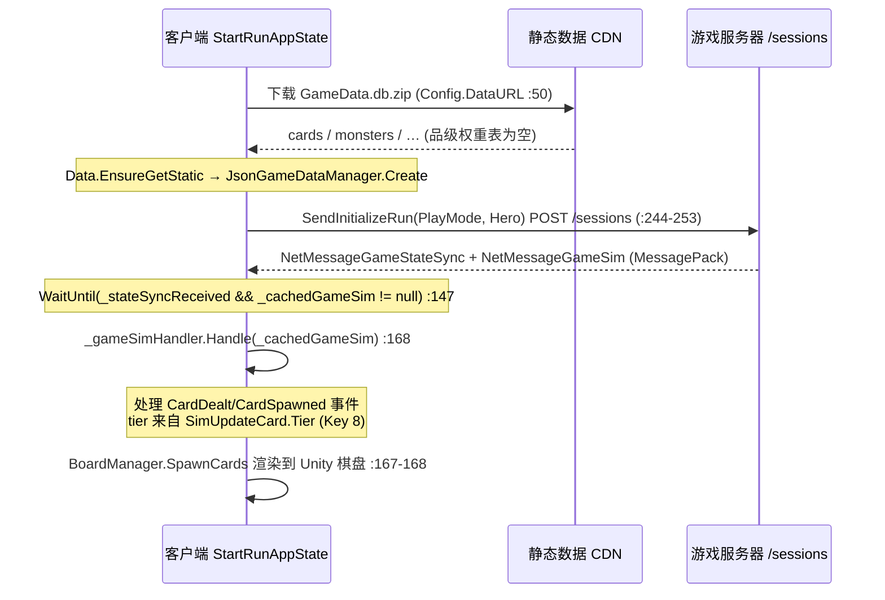

> Status: REFERENCE (reverse-engineering) — doc #5 of the shop-entry series (commit 475c0b0d, 2026-06-18); analyzes old client-side BazaarCardDealer + server-authoritative card-dealing boundary. Spot-verified still accurate vs decompiled source at HEAD 7a68e8bb. Never a plan; its downstream #6 Collection shop-probability overlay was built (965c5cc3) then removed (a8fee8b9), both docs already in docs/archive/.

# 卡牌生成与「客户端 / 服务器」边界分析

状态：draft
最后核对：2026-06-15

> **📚「进商店逻辑」文档系列 · 建议阅读顺序**（你在读 **#5 背景**）
> 1. [总览 · 从进店到离店的完整流程](2026-06-15-shop-entry-1-lifecycle.md)
> 2. [讲解 · 铺货 / 单卡概率怎么算（TL;DR + 流程图 + 名词词典）](2026-06-15-shop-entry-2-stocking-explainer.md)
> 3. [深入 · native/loose + 英雄 + RNG 顺序 + 手牌 + 数据缺口](2026-06-15-shop-entry-3-native-loose-deep-dive.md)
> 4. [参考 · 单卡概率逐行推导 + Collection Panel 接入](2026-06-15-shop-entry-4-single-card-reference.md)
> 5. [背景 · 旧 dealer 是什么 / 为何在客户端 / 是否线上权威](2026-06-15-shop-entry-5-client-server-boundary.md) ← 本文
> 6. [落地设计 · Collection Panel 商店概率浮层](2026-06-15-collection-panel-shop-probability-design.md)

本文回答两个互相独立的问题：

1. 反编译出来的 `BazaarBattleService.BazaarCardDealer.DealFilteredCards(...)` 这条路径，**是怎样生成商店 / 选牌卡牌**的。
2. 既然当前游戏已经是「客户端发起会话、等待服务器消息、按事件渲染卡牌」的在线流程，为什么客户端包里**还能看到这套看上去像后端的逻辑**。

这个区分很重要。旧的 `BazaarBattleService` dealer 逻辑**确实打包在客户端里**，而且完整到可以逐行分析；但当前运行时同时存在一条**服务器权威**路径——客户端开启会话、等服务器消息、再用 `GameSimEventCardSpawned` / `GameSimEventCardDealt` 事件渲染卡牌。因此本文把旧 dealer 算法当作「**客户端确实搭载的一份实现**」来分析，而**不**自动把它当成「当前线上后端实现」的证明。

> **引用约定**：首次给出完整路径，之后用文件名简写。例如 `BazaarCardDealer.cs:3548` 指
> `decompiled/BazaarBattleService/BazaarBattleService/BazaarCardDealer.cs:3548`。本文所有结论以 `file:line` 为准，散文描述仅作串联。

---

## 一、证据边界

被分析的旧 dealer 入口：

- `decompiled/BazaarBattleService/BazaarBattleService/BazaarCardDealer.cs:3437`
  （`DealFilteredCards(BazaarBattlePlayer bazaarPlayer, BazaarCard card, bool cardIsFree = false)`）

它依赖的辅助类型 / 数据：

- `BazaarCard.SpawningFilter`：`CardIdFilters`、`NumberCardsToSpawn`、`MerchantHeroFilters`、
  `CardTypeFilters`、`CardSizeFilters`、`ItemTierFilters`、`HiddenTagFilters`、`Rerolls`
  （`decompiled/BazaarBattleService/BazaarBattleService.Models/BazaarCard.cs:20,36,38,50,60,64`）。
- `BazaarCard.StartingTier` / `Tier`（`BazaarCard.cs:245`）。
- `BazaarCard.EItemTier` 顺序：`Bronze < Silver < Gold < Diamond < Legendary`（`BazaarCard.cs:145`）。
- `StaticDataCardRepository.FilterCards(...)`
  （`decompiled/BazaarBattleService/BazaarBattleService.Repositories.CardRepository/StaticDataCardRepository.cs:161`）。
- `StaticDataDayRepository.GetByDayAndHour(...)`（`.../DayRepositiory/StaticDataDayRepository.cs:51`）。
- `StaticDataTierRepository.GetProbabilitiesByDay(...)`（`.../TierRepository/StaticDataTierRepository.cs:47`）。

---

## 二、旧 Dealer 的发牌算法

### 2.0 是谁触发了 `DealFilteredCards`（调用链）

文档要先说清楚「谁调用它」，否则后面的逐步流程没有上下文。共有 **4 个调用点**，全部在 `BazaarCardDealer.cs` 内部，**没有任何一个来自 `TheBazaarRuntime`（见第四章）**：

| 入口 | 行号 | 触发场景 |
| --- | --- | --- |
| `TriggerEffect` → `LootMerchantCards` | `:2926` → `DealFilteredCards(player, card)` `:2928` | 进商人遭遇，铺商店货 |
| `TriggerEffect` → `LootRewards` | `:2922` → `DealFilteredCards(player, card, cardIsFree:true)` `:2924` | 奖励遭遇，免费发牌 |
| `RerollEncounter`（public） | `:5885` → `DealFilteredCards(..., CurrentSelectEncounter, cardIsFree)` `:5921` | 玩家点「重roll」 |
| `DealRewardCards` | `:2382` → `DealFilteredCards(bazaarPlayer, CurrentSelectEncounter)` `:2392` | 非 PVP 战斗胜利后发奖励 |

完整链路（商店场景）：



注意几个细节：

- `SelectCard`（public，`:1567`）只是把当前玩家取出后转交 `PlayerSelectedCard`（`:1582`）。
- 遭遇的 effect（`LootMerchantCards` 等）是在 `PlayerSelectedCard` 的 `UpdateEffectsByTriggerType(OnEncounter/OnSelected)`（`:1775-1776`）里触发的，**先于** `CurrentSelectEncounter` 在 Merchant/Encounter 分支（`:1832`）被正式赋值。
- `RerollEncounter` 的守卫顺序：`!InfiniteReroll` 时 `NumberOfRerolls < 0` 直接 false（`:5890`）→ `RerollsRemaining <= 0` 直接 false（`:5894`）→ 金币 `< GetRerollCost` 触发 `OnCannotAfford` false（`:5900`）。通过后才扣钱、扣次数、清对手区、重发（`:5905-5921`）。重roll 走的是**同一个 `DealFilteredCards`**，所以本章对「刷新」和「重roll」都适用。
- `CurrentSelectEncounter` 在 `AdvanceGame`（`:1994`）和 `Exit`（`:2443`）时被重置为 `BazaarCard.Create()`。

### 2.1 核心算法流程图



### 2.2 逐步说明（深化）

**① 清空发售区（`:3439`）**——`RemoveAllCardsFromOpponent` 只清**对手区**（`OpponentCardHand` + `OpponentSkillCard`），玩家自己的手牌 / 技能槽不动。在旧模型里，商店 / 选牌的「货架」就是发到对手侧的卡。

**② 决定英雄筛选器（`:3443-3449`）**——商人卡若带 `MerchantHeroFilters` 就用它（职业 / 专属商店），否则用玩家当前英雄。这不是「卡上有英雄类别属性」的泛规则，而是专门看 `MerchantHeroFilters`。

**③ 建初始候选池（`:3456-3462`）**——读出玩家已装备技能槽的卡 Id（`GetBazaarBattlePlayer().Board.PlayerSkillCard`），调用 `cardRepo.FilterCards(card, list)`，再 `where !playerSkillCardIds.Contains(p.Value.Id)`。两点容易看错：
- 这个排除作用于**池中所有类型的卡**，凡 Id 命中已装技能槽的都被排，**不只技能卡**；
- 读的是 `GetBazaarBattlePlayer()`（固定玩家字段）而非传入的 `bazaarPlayer` 参数。

`FilterCards` 本身是**两分支**（`StaticDataCardRepository.cs:163-171`）：
- `CardIdFilters` 非空 → 只按 Id 取，**跳过 hero / 类型 / 体积 / 标签 / 隐藏标签 / `Enabled` 全部其它过滤**（注意：被禁用的卡只要 Id 在列表里也能进店）；
- `CardIdFilters` 空 → 才 AND 上 hero、`CardTypeFilters`、`CardSizeFilters`、`CardTagFilters`、`HiddenTagFilters`、`Enabled`。
- `FilterCards` **不**处理 `ItemTierFilters`，品级过滤在后面 `DealFilteredCards` 里做。

**④ 输出容器（`:3460-3462`）**——`list2`（选中 Id）、`list3`（每张输出品级）、`list4`（**可变**候选池）。`list4` 的可变性后面很关键：某些过滤会**整段替换** `list4`，从而影响同一次填充里后续槽位的可选范围。

**⑤ 先发经验卡（`:3463-3465`）**——若触发卡 `AdvancedEncounters.ExperiencePointsId` 非空，立即把经验卡发到对手侧，**早于**主随机逻辑。
> 隐患（游戏代码自身）：条件是 `card?.AdvancedEncounters?.ExperiencePointsId != Guid.Empty`。当 `AdvancedEncounters` 为 null 时，`Guid?` 的 null `!= Guid.Empty` 会被提升为 **true**，随即在 `:3465` 无空保护地访问 `card.AdvancedEncounters.ExperiencePointsId` → NRE。实际靠 `AdvancedEncounters` 恒非 null 兜着。

**⑥ 数量 / 池子校验（`:3467-3484`）**——`NumberCardsToSpawn==0` 退出；候选池空退出；若 `NumberCardsToSpawn == CardIdFilters.Count`，**跳过所有随机逻辑**，逐张发指定 Id 后 return（这类店完全确定）。

**⑦ reroll 重复排除（`:3485-3496`）**——若 `!Rerolls.RerollRepeats`，从池中剔除 `GameStateMetadata.DealtCardForReRollExclusion` 里的卡；剔除后仍 ≥ `NumberCardsToSpawn` 就用剔除后的池，否则**清空整个排除集**再用全池。
> 注意：`DealtCardForReRollExclusion` 是**全局累积**集合，每次发牌都往里加（`:3517` / `:3629`），**不是只排「第一次进店」的卡**；只有在会饿死池子时（`:3494`）或遭遇切换等生命周期点才清空。所以你 reroll 掉的卡在重置前会更难再出。

**⑧ 全技能特殊路径（`:3497-3519`）**——若池中**全是**技能卡，走 `RollSkillTierAndFilter`（`:5114`）逐张选，**完全绕开**下面的物品 native/loose 循环。该函数先按概率抽一个 tier，严格筛 `StartingTier == tier`（`:5137`）；若该 tier 无货，则把「按概率升序排好的 tier 列表」`Reverse()` 后扫描，取**第一个有货的 tier**（`:5155-5169`）。
> 因此「降级」一词不准确：它是**按概率降序**找第一个有货 tier，不是按品级阶梯降级；只有当数据的概率序恰好与稀有度一致时，外观才像降级。

**⑨ 取当天配置（`:3521-3531`）**——`Day` 钳到 `gameConfig.NumDays`（`:3522-3524`），`dayRepo.GetByDayAndHour(day, Hour)` 取当天/当时管理器，读出
`float nativeItemTierProbability = byDayAndHour.Value.NativeItemTierProbability`（`:3531`）。旧 dealer 的这些仓库由 `dayByHourManager.json`、`tierManager.json` 等**独立静态文件**初始化（`BazaarBattleSettings.cs:17,31`；`BazaarCardDealer.InitializeAsync` `:404,:407`）。
> **代码本身无法确定 `NativeItemTierProbability` 的线上实际值**，只能证明旧 dealer 从哪读它。第三章用实测数据进一步说明：这个值（以及品级权重表）在客户端静态数据里**根本不存在**。

**⑩ 池子不足的边界（`:3533-3537`）**——`if (list4.Count < NumberCardsToSpawn)` 时记错误并 `numberCardsToSpawn = list4.Count`，但**整个随机循环在 `else` 分支（`:3538+`）**，所以这条「降数」分支**根本不进循环**——该赋值在此分支里实际是死代码。

**⑪ 逐张物品选择循环（`:3544-3606`）**——循环维护方法局部变量 `flag2`（原生失败标记，`:3544`/`:3571`）。
- **11.1 是否进原生模式（`:3548`）**：三条件同时满足才进——`ItemTierFilters.Count==0` 且 `!flag2` 且 `seedManager.GetDouble() < nativeItemTierProbability`。即带 `ItemTierFilters` 的店**永不**进原生模式。
- **11.2 轮盘抽目标品级（`:3558` → `SelectRandomTier` `:4451`）**：每槽位**重新**抽一次 `T`。`SelectRandomTier` 取随机 double，把概率**按值升序**排，累加，返回首个累积和 ≥ 随机数的 tier，兜底 `Bronze`。
- **11.3 按棋盘空间过滤（`:3559` → `FilterByRemainingBoardSize` `:4608`）**：剔除体积大于剩余空位的卡；此调用**也会回写 `list4`**（持续收窄）。无货则 break。
- **11.4 原生严格（`flag3=true`，`:3564-3581`）**：筛 `StartingTier == T`（`:3566`）。无精确同级卡 → 记日志、`num5--` 重试本槽、`flag2=true`、continue（**本次填充剩下槽位全部强制非原生**）。有 → 随机抽 1 张、过 `TierDuplicateCardHandling`、记录、`list4.Remove`。**注意此分支不回写 `list4`**（不收窄 tier 集，只移除被选项）。
- **11.5 非原生宽松（`:3583-3605`）**：若有 `ItemTierFilters` 则从中随机选目标 tier（`:3585`）；筛 `StartingTier <= T`（`:3587`）；**非空则 `list4 = list10`（破坏性永久收窄）**（`:3590`），空则记日志保留全池；从 `list4` uniform 随机抽 1 张（`:3596`）；**仅当无 `ItemTierFilters` 时**才做重复升级（`:3599`）。
- **11.6 重复升级处理（`TierDuplicateCardHandling` `:4467-4489`）**：只看玩家手牌 `PlayerCardHand`，收集同 Id 且 `Tier < Diamond` 的卡的品级，返回其 **Max**；无重复返回原 roll 品级。
  > 这不是「保证升级」：当 roll 出的品级**高于**手里所有同卡时，它其实把品级**降**到手里最高那张。最终发牌阶段只有「给定品级 > 实例当前品级」才真正升级（`BazaarDeckTools.cs:94`）。

**⑫ AutoSelect 检查（`:3607-3625`）**——发牌前扫一遍选中卡，若任一张 `AdvancedEncounters.AutoSelect` 为真：深拷贝 → `AutoSelectCard` → **立即 return，其余卡不发**。用于强制剧情 / 教学 / 特殊奖励。

**⑬ 最终发牌（`:3626-3630`）**——无 AutoSelect 时，逐张 `DealCard(..., list3[num7])`（带记录品级）发到对手侧，并把每张 Id 加入 reroll 排除集。`DealCard` 由模板建实例（`BazaarDeckTools.cs:76`）、找空位、按需升级品级（`:94`）、放置（`:110`）。

---

## 三、为什么一张卡「难找」——定量模型

社区里常说某些物品（如「暴走模块」）在商店里**很难刷到**，并把原因归到「原生等级系统」。本章用代码控制流 + 实测卡牌分布，给出一个更准确的定量解释。**结论先行**：真正主导「难找」的是**均匀稀释**和**单调品级天花板**这两条与 native 模式无关的杠杆；原生概率只决定「偏向哪个品级带」，并不能消除这两条机制。

### 3.1 单调品级天花板（最重要、社区版本普遍漏掉）

**命题**：在一次填充的若干个 loose 槽位中，可选卡的「品级天花板」单调不增，且等于到目前为止 roll 出的 **最小** `T`；因此**任意一个早期的低 roll，会永久封死后面所有槽位**。

**证明**：设第 i 个槽位前的共享候选表为 `L_i`，其最大 `StartingTier` 记为天花板 `C_i`。loose 分支（`:3587`）计算 `list10 = {p ∈ L_i : StartingTier <= T_i}`（`T_i` 为本槽独立抽的目标 tier），非空时**覆盖**共享表：`list4 = list10`（`:3590`）。因为 `EItemTier` 是全序枚举，存活元素都满足 `StartingTier <= T_i`，故 `C_{i+1} <= T_i` 且 `C_{i+1} <= C_i`（只删不增）。叠加每槽的 `list4.Remove`（`:3605`）与体积剪枝（`:3559`），`L` 单调缩小，且存活品级的上界 = 各已完成槽位 `T` 的最小值。形式化：k 个 loose 槽后天花板 `C = min(C_0, T_1, …, T_k)`——「若干个下闭集的交 = 阈值取最小的那个下闭集」。

唯一**不**收窄 tier 集的是原生严格分支（`:3566-3580`，只 `Remove`、不回写）；但**第一次原生 miss 就 latch `flag2`**（`:3571`），把本次填充剩下的槽位全部赶进 loose 这条会收窄的路。

**后果**：想在一家 N 槽商店里同时摆出 K 张高品级卡，不只需要 K 次高 roll，还需要这些高 roll **发生得早**——因为任意先于它们的低 `T_i` 会把天花板永久压到其 `StartingTier` 之下、把它们移出后续池子。在一张偏 Bronze/Silver 的当天权重表下，前一两槽就把天花板压到 Bronze/Silver 是大概率事件。**这才是「一家店很少同时出多张高品级」的结构性原因**：每槽 tier roll 虽独立，但它们对「可选性」的**效果是 running-minimum，不是逐槽独立**。

### 3.2 数值示例（均匀稀释 1/池大小）

> 下列数字均为**示意**。真实当天品级权重在服务器侧，客户端没有（见 3.4 / 第三章）。

实测物品 `StartingTier` 分布（当前 `GameData.db`，1270 张 `TCardItem`，过滤前）：
**Bronze 509 / Silver 470 / Gold 227 / Diamond 30 / Legendary 34**。

假设当天权重 `w = {B .45, S .30, G .18, D .05, L .02}`，hero 过滤后池子按真实分布缩放到 n=100：Bronze 40 / Silver 37 / Gold 18 / Diamond 2.4 / Legendary 2.7。累计「≤该 tier」张数：`A(≤B)=40, A(≤S)=77, A(≤G)=95, A(≤D)=97.4, A(≤L)=100`。设原生概率 `p_n=0.5`。计算**单个目标物品**在某一槽（首槽、无前序收窄）被选中的概率：

**(A) 原生严格**（以 `p_n` 进入）：只有 `T == 该卡 StartingTier` 且在同级集合里胜出：
- Bronze 目标：`0.5 × .45 × 1/40 ≈ 0.56%`
- Gold 目标：`0.5 × .18 × 1/18 ≈ 0.50%`
- → 原生模式下两者**几乎相等**：高品级池子薄（Gold 18 vs Bronze 40）补偿了低权重。原生模式偏爱「同级稀少」的卡。

**(B) 宽松**（以 `1-p_n` 进入，且任一原生 miss 后整轮都走这里）：`T >= 该卡 StartingTier` 时存活，再在**整个存活池** `A(≤T)` 里 uniform 胜出，对 `T` 求和：
- Bronze 目标（任何 T 都合格）：`.45/40 + .30/77 + .18/95 + .05/97.4 + .02/100 ≈ 1.78%`
- Gold 目标（仅 T∈{G,D,L} 合格）：`.18/95 + .05/97.4 + .02/100 ≈ 0.26%`

**均匀稀释 `1/池大小` 显式化**：宽松模式里胜出因子是 `1/A(≤T)`——Bronze 目标在 `T=Bronze` 只跟 40 张竞争（`1/40=2.5%`），但同一张在 `T=Legendary` 要跟全部 100 张竞争（`1/100=1.0%`）。**roll 越高、池子越大、目标越被稀释**。Gold 目标双重受罚：在最可能的低 roll 上**直接不合格**，合格时又总在 ≥95 的大池里竞争。

### 3.3 方向性结论

- **原生严格**让**低起始品级**卡更难（Bronze 目标 1.78%→0.56%，约 3.2× 更稀），让**高起始品级**卡相对没那么难（小而集中的同级池）。
- **宽松**反之：让**高起始品级**卡更难（Gold 目标 0.50%→0.26%，约 2× 更稀），低起始品级卡更容易。
- 所以「原生系统导致暴走难找」这个因果，**取决于暴走的起始品级是多少**——若暴走是高起始品级，原生模式反而让它**更容易**出，与该论点相反。社区版本既没确定暴走的 `StartingTier`，也没确定原生概率大小，因果链是悬空的。
- **两条主导杠杆与 native 无关**：(a) 两分支最后都是 uniform 抽（`1/list9.Count` `:3574`、`1/list4.Count` `:3596`），单卡概率恒为 `~1/池大小`；(b) loose 的 `list4=list10`（`:3590`）+ 体积剪枝（`:3559`）持续缩共享池，且首次原生 miss 把整轮 latch 进 loose（`:3571`）。`NativeItemTierProbability` 只改变「偏向哪个品级带」，删不掉这两条机制。

### 3.4 「Gold 必定 Gold 起步」只在少数分支成立

`StartingTier == T` 的严格筛只在原生分支（`:3566`）成立，而该分支是**低概率、miss 即自我关闭**（`:3571`）的支路；主导的宽松分支恰恰允许 `StartingTier <= T`（`:3587`），即把**低起步卡升格成高品级**摆出来卖。所以多数商店货**并不是**「起始品级纯净」的。

---

## 四、当前运行时：服务器会话 + 客户端静态数据

当前反编译运行时呈现的是另一条在线路径。下图是实际把卡牌摆上棋盘的链路：



### 4.1 客户端下载 / 读取静态数据

- 开局拉静态数据：`Task staticDataFetchTask = Data.EnsureGetStatic(...)`
  （`decompiled/TheBazaarRuntime/TheBazaar/StartRunAppState.cs:132-134`）。
- `Data.EnsureGetStatic` → `DataDownloader.DownloadAsync(...)` → `JsonGameDataManager.Create()`
  （`Data.cs:502-507`）。
- 下载 `GameData.db.zip`：`types = {"GameData"}`（`TheBazaar.DataManagement/DataDownloader.cs:65-67`），
  URL = `Config.DataURL + "/" + text + ".db.zip"`（`DataDownloader.cs:72`）。
- 默认 staging 地址：`DataURL = "https://internal.playthebazaar.com/staging/static"`（`Config.cs:50`）；
  socket 地址另设 `SocketURL`（`Config.cs:43`，由 `HttpGameClient` 使用），两者都是 staging。
- `JsonGameDataManager.Create()` 打开 `GameData` 读 `cards`、`game_modes`、`level_ups`、`monsters`、`seasons`、`tooltips` 等表（`JsonGameDataManager.cs:149-152`）；单卡读取 `SELECT Data FROM cards WHERE Id = ?`（`JsonGameDataManager.cs:80-81`，方法 `GetCardById` 体 `:73-89`）。

这证明客户端**拥有丰富的静态卡模板**（含 `StartingTier` 等字段），但静态模板 ≠ 线上权威发牌。

### 4.2 在线开局走游戏服务器

- `StartRunAppState.InitializeRun` 起网络连接：`NetworkManager.GetInstance()` →
  `InitializeServerConnectionAsync(...)`（`StartRunAppState.cs:135-137`）。
- `new HttpGameClient(Config.SocketURL)`（`Networking/NetworkManager.cs:79`）→
  `await _httpClient.SendInitializeRun(Data.SelectedPlayMode, Data.SelectedHero)`（`NetworkManager.cs:109`）。
- `SendInitializeRun` 向 `/sessions` POST 一个 `InitializeRunCommand`（`Networking/HttpGameClient.cs:244-253`），
  应答按 MessagePack 解为 `INetMessage`（`HttpGameClient.cs:168-169`，`Content-Type: application/msgpack` `:131-132`）。

### 4.3 客户端等待服务器状态 / sim 消息

- `WaitUntil(() => _stateSyncReceived && AppState._cachedGameSim != null, ...)`（`StartRunAppState.cs:146-147`）。
- 之后才 `RunManager.StartRun()`（`:164-165`）并 `AppState._gameSimHandler.Handle(AppState._cachedGameSim)`（`:167-168`）。
- `AppState.Initialize` 把网络消息接到处理器：`OnGameStateSyncMessageReceived` / `OnGameSimMessageReceived` /
  `OnRunInitializedMessageReceived`（`AppState.cs:240-243`）；`StartRunAppState` 在收到 `NetMessageGameStateSync` 时置 `_stateSyncReceived`、缓存 `NetMessageGameSim`（`:195-203`）。

### 4.4 卡牌显示由 sim 事件驱动，**品级来自服务器**

- `GameSimHandler.ProcessEvents` 处理 `GameSimEventCardDealt` / `GameSimEventCardSpawned`（`TheBazaar/GameSimHandler.cs:301-307`）。
- `ProcessCardSpawnedEvents` 用事件载荷建 / 更新实例：`Data.GetOrCreateCard(InstanceId, TemplateId, Type)`（`:60`），赋 owner/section/socket（`:65-68`）。
- `GameStateHandler.SyncItems` 调 `BoardManager.SpawnCards(...)` 把卡摆上 Unity 棋盘（`GameStateHandler.cs:167-168`）。

**深化（卡牌的品级从哪来）**：`GameSimEventCardDealt`（`:7`）只带 `(InstanceId, TemplateId, ECardType)`，`GameSimEventCardSpawned`（`:7`）只多 `(CombatantId, Section, Socket)`——**事件本身不带品级**。品级随**配对的** `SimUpdateCard.Tier`（`[Key(8)] ETier?`，`SimUpdateCard.cs:34-35`）下发，在 `Card.Update` 里写入（`DataExtensions.cs:160-163`）；全量同步则走 `CardSnapshotDTO.Tier`（`[Key(7)]`，`CardSnapshotDTO.cs:32-33`，`DataExtensions.cs:196`）；中途升级走 `GameSimEventCardUpgraded.NewTier`（`GameSimHandler.cs:90`）。`Card.Tier` 只是个普通可写属性（`Card.cs:37`），**spawn 路径上没有任何客户端 tier-roll 逻辑**。→ **品级是服务器权威输出**。

### 4.5 实测：客户端静态数据里**没有**品级权重 / 原生概率

直接探查线上客户端缓存的 `GameData.db`（`~/Library/Application Support/com.TempoStorm.TheBazaar/prod/cache/GameData.db`，v5.0.0）：

- `game_modes`（唯一一行）是 JSON `TGameMode`：`NumberOfDays=10`、`HoursInADay=6`、`VictoriesToWin=10`；其中
  `EncounterTierTable = {}`、`ItemSkillTierTablesByDay = {"1":{}, …, "20":{}}` **全为空**。
- 在全部 8 张表（cards / collectibles / challenges / game_modes / level_ups / monsters / seasons / tooltips）里 grep
  `NativeItemTierProbability` / `TierProbabilit*` / `DayByHour*`：**0 命中**。

**为什么是空的（深化）**：`TGameMode.EncounterTierTable`、`ItemSkillTierTablesByDay` 都是 `[JsonIgnore]` + `private set` 的**派生成员**，反序列化时由 `OnDeserialized → BuildTierTables`（`TGameMode.cs:62-78`）从源字段 `EncounterSpawnTierPercentages`、`ItemSkillSpawnTierPercantagesByDay`（`TGameMode.cs:18-25`）重建；而这两个源字段都标了 `[BazaarObfuscate]`，客户端导出序列化器**会剥掉 `[BazaarObfuscate]` 属性**（`BazaarJsonDerivedTypeConverter.cs:75-78`）。于是客户端 `GameData.db` 里源字典是空的，派生表也就是空 `{}`——**与实测完全吻合**。`NativeItemTierProbability` 则在 `TDayHourConfig`（`TDayHourConfig.cs:20`）上，属于逐日逐时 spawn 配置，本就不在 `game_modes` 里。

且 `TheBazaarRuntime` 里对 `ItemSkillTierTablesByDay` / `EncounterTierTable` / `TDayHourConfig` / `TierProbability` 的引用是 **0**；唯一读者是 `BazaarBattleService`（sim DLL）和 `bazaar-qinglong`（独立推荐 mod）。**结论：品级 / spawn 决策现在在服务器侧；客户端 `TGameMode` 的品级字段是残留的（vestigial）。**

---

## 五、为什么客户端里会有「后端样」的逻辑

三个互相独立的事实：

1. 客户端包**确实搭载** `BazaarBattleService.dll`。
2. 该 DLL 里有一份旧 / 本地 `BazaarCardDealer`，含发牌、过滤、战斗、存档、ghost、奖励等逻辑。
3. 当前运行时**同时**用 `/sessions` 网络路径，由服务器下发 sim / state 消息。

客户端确实搭载 `BazaarBattleService`：

- `GameServiceManager` 引用 `BazaarBattleService` / `BazaarBattleService.Models`（`decompiled/TheBazaarRuntime/GameServiceManager.cs:4-6`），
  `OnAwake` 里 `CardDealer = new BazaarCardDealer()`（`:121-125`）；`TheBazaarRuntime.csproj:33-34` 引用该 DLL。

**深化（这个 dealer 在线上其实不发牌）**：`GameServiceManager` 的 `BazaarCardDealer` 虽被构造，但 `TheBazaarRuntime` 对它的所有引用都是**非发牌**用途——VFX / 事件委托接线、暂停与时间 lerp 常量（`CardDealer.GameRules.*`，`GameServiceManager.cs:455,476-483,503,523`）、读取助手（`cardRepo.GetCardById`、`tooltipRepo`、`GetBazaarBattlePlayer/GetOpponentBattlePlayer` 等）。而真正的发牌 / 品级方法——`DealFilteredCards`（`:3437`）、`DealRewardCards`（`:2382`）、`DealEncounterCardsByHeroByDayByHour`（`:2323`）——在 `TheBazaarRuntime` 里**没有任何调用点**（只有 `BazaarBattleService` 内部互调）；它们读的是服务器侧静态文件（`GameRules` `:420`、`TierManager` `:407`、`DayByHourManager` `:404`，来自 `gameConfig.StaticFolderPath`），**不是**客户端 `GameData.db`。此外 `GetBazaarBattlePlayer()` 已标 `[Obsolete("Replaced in v2, use GetPlayer instead")]` 且返回一个**全新空** `BazaarBattlePlayer`（`GameServiceManager.cs:243-247`）；线上 v2 路径是 `GetPlayer() => Data.Run.Player`（服务器数据）。线上棋盘由 `AppState._gameSimHandler.Handle(_cachedGameSim)`（`StartRunAppState.cs:168`）从服务器 `NetMessageGameSim` 填充。

所以更保守也更准确的解读：

- `BazaarBattleService` 是一份**共享 / 遗留 sim 程序集**，被打进客户端用于本地校验、表现、存读档、测试或旧玩法路径；它在线上是**残留 / 本地 sim 组件，不是在线发牌源**。
- 线上后端**可能**用同一程序集、更早或更晚的版本、或服务器专用分支——代码无法证明三者等同。
- 名字里有「BattleService」不等于「远端执行」，那只是客户端构建里可见的程序集名。

---

## 六、能下 / 不能下的结论

**能从代码下结论**：

- 旧 dealer 有原生品级分支，进入条件 = `ItemTierFilters.Count==0` + 本轮未原生失败 + `rng < NativeItemTierProbability`（`BazaarCardDealer.cs:3548`）。
- 原生模式按 `StartingTier == ItemTier` 筛（`:3566`）；非原生按 `StartingTier <= ItemTier` 筛（`:3587`，且**永久收窄** `list4` `:3590`）。
- `ItemTierFilters` 同时关掉原生模式并跳过重复升级（`:3548` / `:3583-3585` / `:3599`）。
- 旧 dealer 的发牌由 `TriggerEffect`（`LootMerchantCards`/`LootRewards`）、`RerollEncounter`、`DealRewardCards` 触发（`:2922-2928` / `:5885-5921` / `:2382-2392`）。
- 当前运行时从网络会话收 `CardDealt` / `CardSpawned` sim 事件渲染卡牌，**品级由服务器在 `SimUpdateCard.Tier` 下发**（`StartRunAppState.cs:127-168`、`GameSimHandler.cs:51-90`、`DataExtensions.cs:160-163`）。
- 客户端线上静态数据**不含**品级权重表与 `NativeItemTierProbability`（实测 8 表 0 命中；`TGameMode` 品级表为 `[BazaarObfuscate]` 剥离后的空派生字段）。

**仅凭此代码不能下的结论**：

- 当前线上后端就是 `BazaarCardDealer.DealFilteredCards`。
- `NativeItemTierProbability` 的当前线上值（客户端拿不到）。
- 某张具体线上卡的当前 `StartingTier`（需另查当前 `GameData.db` 的该模板）。
- 客户端那份名为 `BazaarBattleService` 的 DLL 就是线上权威服务器二进制。

---

## 七、实测数据附录（可复现）

来源：`~/Library/Application Support/com.TempoStorm.TheBazaar/prod/cache/GameData.db`（也有 `staging/cache/GameData.db`）。

- 表与行数：`cards 2889`、`monsters 166`、`challenges 80`、`level_ups 30`、`seasons 16`、`collectibles 8`、`tooltips 1`、`game_modes 1`。
- `game_modes`（v5.0.0）：`NumberOfDays=10`、`HoursInADay=6`、`VictoriesToWin=10`、`EncounterTierTable={}`、`ItemSkillTierTablesByDay` 全空。
- 全卡 `StartingTier` 分布：Bronze 1202 / Silver 850 / Gold 505 / Diamond 271 / Legendary 61。
- 物品（`TCardItem`，1270 张）`StartingTier`：**Bronze 509 / Silver 470 / Gold 227 / Diamond 30 / Legendary 34**。
- 技能（`TCardSkill`，514 张）`StartingTier`：Bronze 91 / Silver 180 / Gold 149 / Diamond 89 / Legendary 5。
- `game_modes` 还含 `StandardPrices`（按尺寸 × 品级的买卖价），与本文无关，附记。

复现命令示意：

```bash
DB=~/Library/Application\ Support/com.TempoStorm.TheBazaar/prod/cache/GameData.db
sqlite3 "$DB" ".tables"
sqlite3 "$DB" "SELECT Data FROM game_modes;" | python3 -c "import sys,json;d=json.load(sys.stdin);print(d['Version'],d['ItemSkillTierTablesByDay'])"
sqlite3 "$DB" "SELECT Data FROM cards;" | python3 -c "import sys,json,collections;c=collections.Counter();[c.update([json.loads(l).get('StartingTier')]) for l in sys.stdin if l.strip() and json.loads(l).get('\$type')=='TCardItem'];print(dict(c))"
```

---

## 八、分析方法

1. 用 `NativeItemTierProbability`、`ItemTierFilters`、`StartingTier`、`AutoSelect` 在反编译码里定位品级 / 原生逻辑。
2. 通读 `DealFilteredCards`（`BazaarCardDealer.cs:3437-3632`）及辅助：`SelectRandomTier`（`:4451`）、`TierDuplicateCardHandling`（`:4467`）、`FilterByRemainingBoardSize`（`:4608`）、`RollSkillTierAndFilter`（`:5114`）。
3. 读仓库 / 数据输入：`StaticDataCardRepository.FilterCards`、`StaticDataDayRepository.GetByDayAndHour`、`StaticDataTierRepository.GetProbabilitiesByDay`、`BazaarBattleSettings`。
4. 追触发链：`SelectCard`→`PlayerSelectedCard`→`UpdateEffectsByTriggerType`→`TriggerEffect`→`DealFilteredCards`，以及 `RerollEncounter` / `DealRewardCards` 两个旁路。
5. 核实当前运行时是否还纯本地——否：`StartRunAppState` / `NetworkManager` / `HttpGameClient` 显示 `/sessions` 网络初始化与服务器消息处理；`GameSimHandler` 显示品级随 `SimUpdateCard` 下发。
6. 探查客户端静态数据：`DataDownloader` / `JsonGameDataManager` 下载 `GameData.db.zip` 并读本地 SQLite；实测品级权重表为空，并定位到 `[BazaarObfuscate]` 剥离机制。
7. 区分「代码已证事实」与「推断」：旧 dealer 算法是客户端搭载、可分析的；它与当前后端行为等同，是需要服务器消息抓包 / 当前静态数据 / 后端源码才能验证的**假设**。
```
