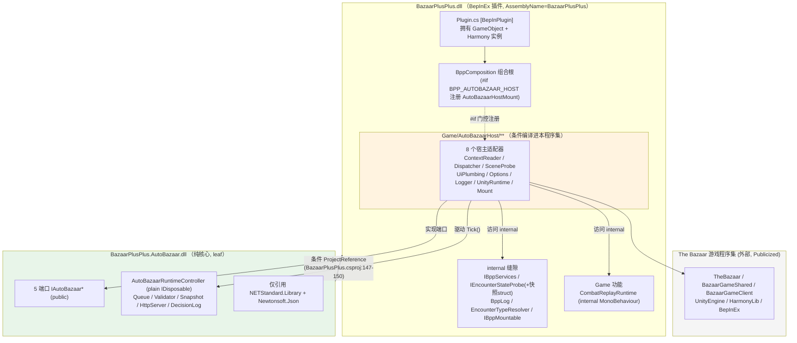
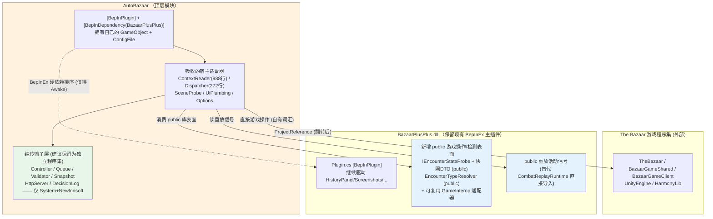

<!-- Agent-authored feasibility audit. Generated 2026-06-05 via a multi-agent workflow (5 dimension analyses + independent red-team + synthesis), then spot-verified against code by the orchestrator. Read-only audit — no source was changed. UPDATE 2026-06-05: the §八 decision gate is now RESOLVED — the user approved full inversion (two-plugin model, dedicated public facade, config migrated to own cfg, pure core preserved) AND a repo-wide rename AutoBazaar→BazaarAgent. The work packages (incl. the rename) are compiled in docs/superpowers/plans/2026-06-05-autobazaar-dependency-inversion-refactor-prompt.md. This audit's body keeps the current code's AutoBazaar names since it analyzes the as-built state.
UPDATE 2026-06-05 (plan red-team pass): two refinements were folded into the plan after re-verifying against live code. (1) The rename is split: WP-R is CODE-ONLY/behavior-neutral; the user-visible cfg-section rename + on-disk path move are a SEPARATE behavior-affecting package (WP-M) that ships with the inversion + release notes + in-game validation (the [AutoBazaar]→[BazaarAgent] bind-section rename silently resets a user's Enabled/HttpListenerPort — AutoBazaarBepInExOptions.cs:20-31 + AutoBazaarRuntimeController.cs:87-100). (2) endpoint.json is to be REMOVED entirely: it is written/deleted only by AutoBazaarHttpServer.cs:65-74,288-319 with NO active code consumer anywhere in the bpp/ workspace (the external bazaarplusplus-agent is stdio JSONL, not an HTTP-discovery client), and the port is config-driven (default 47900) so there is nothing to discover; this also shrinks IAutoBazaarOptions (drops EndpointFilePath). Removing it deletes the "path move breaks external consumers" risk class from §六. Also: the §六 build-optionality invariant relies on BazaarPlusPlus.csproj actively DELETING the optional dll (Debug :230/:251, Release :330-337) before conditionally copying it (:246-249/:324-327); after inversion the main project must keep scrubbing BOTH new dlls or a default build can ship a stale host — and no existing arch test guards the delete (CoreLayeringTests.cs:315-387 checks only the copy gating), so the plan adds one.
UPDATE 2026-06-05 (live-code review): this document was re-reviewed against current code and reconciled with the companion execution prompt. The feasible end state is now described as a TWO-PLUGIN model: BazaarPlusPlus.dll keeps its existing Plugin.cs entry and exposes a narrow public facade; the agent host becomes a second BepInEx plugin with BepInDependency on BazaarPlusPlus. The audit's "not recommended" conclusion means "not worth doing merely for ownership narration"; it does not override the now-confirmed independent-plugin/package direction. -->

# AutoBazaar 与 BazaarPlusPlus 依赖反转可行性分析报告

> 审计范围：`/Users/yxinyu/codes/bpp/bazaarplusplus-mod`（BepInEx 5 插件，netstandard2.1）
> 目标方案：**反转程序集依赖方向** —— 让 `AutoBazaar` 引用 `BazaarPlusPlus`，使 AutoBazaar 成为承载全部自动化业务逻辑的顶层模块，把 BazaarPlusPlus 当作"游戏检测 + 游戏操作库"消费（类比今天 BazaarPlusPlus 消费 The Bazaar 游戏程序集）。
> 性质：**只读审计**，未修改任何源码。所有结论均以 `file:line` 证据为准；文档仅作参考，凡与代码冲突均以代码为准并标注漂移。
> 证据等级标注：**[已验证]** = 本次审计直接读码确认；**[高置信推断]** = 由已验证事实强逻辑推出；**[待编译验证]** = 需实际编译才能定论。

---

## 一、执行摘要与可行性结论

**结论：有条件可行，但只应为"独立 BepInEx 插件 / 独立交付物"这一明确目标实施（high-risk / justified-only-by-independent-packaging）。**

依赖反转在"程序集引用方向"这一层面是技术可行的：今天 `BazaarPlusPlus` → `AutoBazaar` 是唯一一条编译边（`BazaarPlusPlus.csproj:147-150`，受 `EnableAutoBazaarHost` 条件门控），且**反向没有任何编译边**——除两处 `#if BPP_AUTOBAZAAR_HOST` 门控的注册代码外，主插件代码完全不知道 AutoBazaar 存在 **[已验证]**（`BppComposition.cs:31-32, 127-128` 是唯一引用点）。因此单看引用翻转，不会立即产生循环。

但方案"如其所述"无法直接成立，三个事实是决定性的：

1. **支撑该方案的类比是错的。** 方案把"AutoBazaar 消费 BazaarPlusPlus"类比为"BazaarPlusPlus 消费游戏程序集"。但游戏程序集是**被动库**（从不回调 mod），而今天 **BazaarPlusPlus 主动驱动 AutoBazaar**：`AutoBazaarUnityRuntime.Update()` 每帧拉动 `_controller.Tick()`（`AutoBazaarUnityRuntime.cs:34-37`），`AutoBazaarRuntimeController` 只是一个被驱动的 `IDisposable`。**[已验证]** 反转引用不会让 AutoBazaar 像 mod 消费游戏那样"调用"BazaarPlusPlus，而是迫使 AutoBazaar **接管整个 Unity 生命周期所有权**（GameObject、`[BepInPlugin]` 入口、`Awake/Update/OnDestroy`）。"调用一个库"和"宿主一个运行时"是两回事。

2. **头号目标"BazaarPlusPlus 必须不知道 AutoBazaar 存在"要求改变宿主模型，而不是只翻引用。** BepInEx 入口 `[BepInPlugin]` 与组合根都在 BazaarPlusPlus 内（`Plugin.cs:26-27`、`BppComposition.cs:127-128`），AutoBazaar 当前必须由 `BppComposition` 挂载。若挂载逻辑留在 BazaarPlusPlus，则 BazaarPlusPlus 需引用 AutoBazaar 去挂载它，**同时** AutoBazaar 引用 BazaarPlusPlus 做游戏操作——形成**硬性 MSBuild ProjectReference 循环**。可行出路是：新增 AutoBazaar/BazaarAgent 自有 BepInEx 插件（已作为执行计划的确认方向，BazaarPlusPlus.dll 保留现有入口）、或引入第三个入口程序集；单纯翻转 `ProjectReference` 不可行。

3. **用户真正的"封装/无策略"目标其实已经达成。** 用户的诉求是"自动化业务逻辑全部封装、mod 不含对局策略"。**这一点今天通过 ADR-0005 的端口设计已经满足**：依赖倒置（5 个端口 `AutoBazaarPorts.cs:6-47`）已就位，决策策略在独立的 `bazaarplusplus-agent` 进程，mod 只做传输+校验（`AutoBazaarActionValidator.cs:25-42,125-132` 把 hero/playMode 硬编码为字符串，刻意不依赖游戏枚举）**[已验证]**。因此反转不应被描述为"建立封装"，而是购买"独立插件/独立交付"能力；若不保留纯核心，会牺牲当前由 `CoreLayeringTests.cs:249-293` 强制的隔离。companion plan 已选择保留纯 core。

### 关于"本次重构反转 ADR-0005"

**这是事实，且必须正视。** ADR-0005 的核心约束（"core 程序集不得引用 UnityEngine/BepInEx/HarmonyLib/游戏 DLL/Game/GameInterop"，`docs/adr/0005-...:13`）正是反转后 AutoBazaar 必然要持有的引用集。但 ADR-0005 **自己在 line 18 写明了"重开条件"："Reopen if AutoBazaar ever needs to become its own BepInEx plugin"**。所以此次反转恰是该 ADR 预留的、明确命名但尚未触发的那一步——它是"重开一个已知决策"，而非"违规推翻"。**[已验证]** 因此可接受性取决于：团队是否确实需要"AutoBazaar 拥有独立打包/独立 BepInEx 插件"的能力。若仅为"更干净的所有权叙事"，则代价（superseding ADR + 重写/新增架构守卫 + 跨插件 facade/handshake + 主版本号 bump）不成比例。

**红队推荐的更便宜替代**（详见第七节）：保持当前方向不变，仅就地清理宿主层的两处异味（把日志改走已有的 `IAutoBazaarLogger` 端口；把 CombatReplay 触点改为事件总线/`Func` 探针）。这能消除最尖锐的耦合，且无论是否反转都值得做。

---

## 二、当前架构与依赖现状

**今天的真实编译方向是单向的：主插件 → AutoBazaar 纯核心。** 宿主适配器（`Game/AutoBazaarHost/**`）编译进主插件程序集内部，因而能访问主插件的 `internal` 缝隙；它们实现 AutoBazaar 核心定义的 5 个端口并在组合时注入。

**关键现状事实（全部已验证）：**

| 事实 | 证据 |
|---|---|
| 唯一编译边：主插件条件引用核心 | `BazaarPlusPlus.csproj:147-150`（`Condition="'$(EnableAutoBazaarHost)' == 'true'"`） |
| 核心是纯 leaf | `BazaarPlusPlus.AutoBazaar.csproj:11-14`（仅 NETStandard.Library 2.0.3 + Newtonsoft.Json 13.0.3） |
| 宿主适配器条件编译进主插件 | `BazaarPlusPlus.csproj:61-63`（默认 Remove）+ `:70-72`（`EnableAutoBazaarHost==true` 时 Include） |
| 门控机制 | `BazaarPlusPlus.csproj:20-25`（`EnableAutoBazaarHost` 默认 false → `;BPP_AUTOBAZAAR_HOST`） |
| 反向边仅 2 处且全部门控 | `BppComposition.cs:31-32`（using）+ `:127-128`（Register），均在 `#if BPP_AUTOBAZAAR_HOST` 内 |
| 控制流方向：主插件驱动核心 | `AutoBazaarUnityRuntime.cs:34-37`（`Update()` → `_controller.Tick()`）；核心是 `IDisposable` 被拉动 |
| 主插件唯一 `[BepInPlugin]` | `Plugin.cs:26-27`（全仓无第二个 `BaseUnityPlugin`，`BepInDependency` 全仓为 0）**[已验证]** |
| 反向无编译边 | grep（排除 AutoBazaar/、Game/AutoBazaarHost/、tests/、decompiled/）：仅 `BppComposition.cs` 命中，且在门控内 |

---

## 三、耦合点全清单

下表汇总宿主适配器（及组合根）对 BazaarPlusPlus 的全部耦合点，按"反转后处理"分类。**所有被消费的 BazaarPlusPlus 类型今天全部是 `internal`** —— 这是反转的支配性成本。

| 耦合点 | 类型 | 证据 file:line | 反转后处理 |
|---|---|---|---|
| 主插件 → 核心 ProjectReference | 编译引用边 | `BazaarPlusPlus.csproj:147-150` | **翻转**：删除此引用，在 `BazaarPlusPlus.AutoBazaar.csproj` 加反向引用 |
| 8 个宿主文件编译进主插件 | 源码 Compile-Include | `BazaarPlusPlus.csproj:70-72` | **迁移**：移入 AutoBazaar（或新宿主程序集） |
| `BppComposition` 注册 `AutoBazaarHostMount` | 组合/运行时 | `BppComposition.cs:127-128` | **删除**：主插件不得知 AutoBazaar；挂载移到 AutoBazaar/BazaarAgent host 插件侧 |
| `IBppServices`（聚合，仅用其 `EncounterState`） | internal 接口 | `Core/Runtime/IBppServices.cs:11`；消费见 `AutoBazaarGameContextReader.cs:25,131-132` | **public 或 IVT**；建议收窄为专用探针 |
| `IBppMountable` | internal 接口 | `Core/Runtime/IBppMountable.cs:8`；实现见 `AutoBazaarHostMount.cs:9` | **不再使用**（挂载模型重设计） |
| `BppMountableRegistry` / `BppRuntimeServices` | internal 类 | `Core/Runtime/BppMountableRegistry.cs:7`、`BppRuntimeServices.cs:12` | 注册模型重设计 |
| `IEncounterStateProbe`（仅用 2/3 方法） | internal 接口 | `Core/GameState/IEncounterStateProbe.cs:5`；调用见 reader:131-132 | **public**（核心检测缝隙） |
| `EncounterIdsSnapshot` / `EncounterTargetingSnapshot` | internal struct | `Core/GameState/EncounterIdsSnapshot.cs:8`、`EncounterTargetingSnapshot.cs:7` | **public**（探针返回类型；纯 id/flag 包，无游戏类型，安全） |
| `EncounterTypeResolver.Resolve` | internal 静态类 | `GameInterop/Encounter/EncounterTypeResolver.cs:11`；调用见 reader:135 | **public** 或折入探针 |
| `BppLog` | internal 静态类 | `Infrastructure/BppLog.cs:9`；`AutoBazaarBppLogger.cs:10-19` 是端口适配器，另有 7 个绕过端口的直调（Dispatcher:31；SceneProbe:40-43,50,63；UiPlumbing:76,118,155） | **不需暴露**（见下方"红队修正"） |
| **`CombatReplayRuntime`（Game 功能 MonoBehaviour）** | **跨功能泄漏** | `Game/CombatReplay/CombatReplayRuntime.cs:18`；消费见 `AutoBazaarUiPlumbing.cs:4,47` | **重设计**（最尖锐项，见第五/六节） |
| 游戏 DLL / Unity / Harmony / BepInEx.Configuration | 外部引用 | reader:5-15、dispatcher:5-12、SceneProbe:5-7、Options:5-6 | **保持外部**，但反转后由 AutoBazaar 持有 |

### 三处需要修正各维度分析的结论

1. **`BppLog` 不是硬耦合，可就地消除（修正 D1 的"次于 IBppServices 的最常用缝隙"定性）。** `IBppServices` 已直接暴露 `ManualLogSource Logger`（`Core/Runtime/IBppServices.cs:19` **[已验证]**），且核心已有 `IAutoBazaarLogger` 端口 + `AutoBazaarBppLogger` 适配器。`AutoBazaarBppLogger` 是合法的日志端口适配器；真正的问题是 Dispatcher/SceneProbe/UiPlumbing 三个适配器里 7 个绕过端口的 `BppLog` 直调（`AutoBazaarGameActionDispatcher.cs:31`；`AutoBazaarSceneProbe.cs:40-43,50,63`；`AutoBazaarUiPlumbing.cs:76,118,155`）。这些可改走 `IAutoBazaarLogger` 或绑定 BepInEx logger 删除。`BppLog` **无需** public/IVT。红队此项修正成立。

2. **宿主适配器对游戏私有成员的访问主要靠反射，而非 Publicizer（修正红队"missed risk"中对 Publicizer 传播的力度）。** 实测：reader/dispatcher 中对 `._iteractionFilter`、`._validCards` 的引用**全部在注释里**（`AutoBazaarGameContextReader.cs:156, 728`），非可执行代码 **[已验证]**。真正的私有成员访问通过反射完成（`AccessTools.TypeByName` + `GetField`/`GetMethod`，宿主层共 18 处调用点，如 `AutoBazaarSceneProbe.cs:60-66`、`AutoBazaarGameActionDispatcher.cs:141-153`）。直接读取 `AppState.CurrentState`/`Data.Run`/`Data.Entities`（reader:74-76, 405）是游戏 public API。因此"反转需把 `PublicizeAll=true` 搬进 AutoBazaar.csproj"这一论断应降级为 **[待编译验证]**——主流机制是反射（不需 Publicizer）；是否有少数直接字段访问真正依赖 Publicizer，需编译方能定论。

3. **CombatReplay 的耦合极浅，且仓库既有跨功能模式是"访问器/事件"而非"暴露 public 类型"（强化 D2/D4 的修正，反对"提升 CombatReplayRuntime 为 public"）。** `AutoBazaarUiPlumbing.cs:47` 仅需一个瞬态 bool（`IsReplayStartInProgress`）。同文件已直接读底层游戏信号 `replay.IsReplaying`（:53）并反射 `ReplayState._exitRequested`（:167），证明所需游戏状态已可直达。而仓库其余消费者**从不直接导入** `CombatReplayRuntime` 这个 internal 类型——`Game/HistoryPanel/` 一律用 `Func<CombatReplayRuntime?>` 访问器注入（`IHistoryPanelRuntime.cs:19`、`HistoryPanelMount.cs:14`、`HistoryPanelReplayService.cs:18`），`RunLoggingController.cs:61` 用 lambda 探针，Patches 用 `CombatReplayRuntime.Instance` 静态 **[已验证]**。把整个功能 MonoBehaviour 提升为 public 去暴露一个 bool 是不成比例的；应改用事件总线/`Func` 探针。

---

## 四、目标架构设计

反转后，AutoBazaar/BazaarAgent 成为独立顶层交付物，但 **BazaarPlusPlus.dll 仍保留现有 BepInEx 主插件入口**（`Plugin.cs:26-27`）。由于第二节已证"主插件当前驱动核心"+"AutoBazaar 当前挂载在组合根内"，最干净且已确认的形态是：新增 AutoBazaar/BazaarAgent host BepInEx 插件（`[BepInPlugin]` + `[BepInDependency("BazaarPlusPlus")]`），由它拥有自己的 GameObject/MonoBehaviour 与自己的 `ConfigFile`，并删除 `BppComposition` 中的 host 注册。红队的"missed risk"指出：**`AutoBazaarGameContextReader`(988 行)与 `AutoBazaarGameActionDispatcher`(272 行)是"自动化形状"的代码**（讲 `AutoBazaarContext`/`ActionKind`/`AutoBazaarDecisionOption` 这套 AutoBazaar 自有词汇），它们应落在 AutoBazaar——这意味着 **AutoBazaar 自己持有游戏 DLL 耦合，BazaarPlusPlus 实际只贡献一个很小的"探针+解析器"表面**。这与方案"BazaarPlusPlus 是富游戏操作库"的心智模型**正好相反** **[高置信推断，基于已验证的 reader/dispatcher 词汇与行数]**。

### BazaarPlusPlus 拟暴露的 public 游戏互操作 API 表面（最小集）

实测 reader 对 `IBppServices` 的使用**只触及 `EncounterState` 一个成员**（`AutoBazaarGameContextReader.cs:131-132`，其余 6 个成员 EventBus/Config/Paths/RunContext/GameStateProbe/Logger 全未用）**[已验证]**。故应**收窄而非整体暴露 `IBppServices`**：

1. `public IEncounterStateProbe`（仅 2/3 方法被用）+ `EncounterIdsSnapshot`/`EncounterTargetingSnapshot` 转 public（纯 id/flag 包，无游戏类型，安全）；
2. `public EncounterTypeResolver.Resolve(string?)`；
3. `public` 重放活动信号（替代 `CombatReplayRuntime.Instance.IsReplayStartInProgress` 的直接导入）；
4. **不暴露** `BppLog`（改走 `IAutoBazaarLogger` 端口或 BepInEx logger）。

### 插件/生命周期模型抉择

| 方案 | 描述 | 评价 |
|---|---|---|
| **(a) AutoBazaar/BazaarAgent 自有插件，BazaarPlusPlus 保持主插件** | AutoBazaar 持 `[BepInPlugin]`+`[BepInDependency]`，自有 GameObject；BazaarPlusPlus 继续用 `Plugin.cs` 驱动原有功能 | **确认方向**（ADR-0005:18 命名的重开条件）。BepInEx 的 `BaseUnityPlugin` 本身即 MonoBehaviour，由 chainloader 在自己的 GameObject 上实例化，可直接承载 `Update()`/`OnDestroy()` |
| (b) 把入口/组合根整体搬进 AutoBazaar | BazaarPlusPlus 退化为无入口库，其全部功能(HistoryPanel/CombatReplay 等)由 AutoBazaar 生命周期驱动 | 巨型重构，且语义荒谬（一个"自动化"模块去驱动整个 mod） |
| (c) 第三个入口程序集 | 新建瘦入口，引用 BazaarPlusPlus + AutoBazaar | 打破循环，但增加程序集数，且不提供 BazaarAgent 自己作为插件的产品身份 |
| 复用 `IBppMountable` 挂载路径 | —— | **不可行**：该路径由构造决定是"主插件驱动"（`BppMountableRegistry.MountAll` 由组合根填充），反转后组合根不得知 AutoBazaar |

---

## 五、技术可行性分析

### 5.1 依赖倒置 / 接口抽象——已经做对了

依赖倒置**今天已应用**：5 个端口（`AutoBazaarPorts.cs:6-47`，`IAutoBazaarOptions`/`ContextReader`/`ActionDispatcher`/`Logger`/`Clock`）干净地把"纯自动化"与"游戏耦合"分离，宿主适配器实现它们，核心在 `AutoBazaarRuntimeController` 构造时按接口注入 **[已验证]**。这正是反转想要的"封装"——**它已经存在**。反转不是"建立 DIP"，而是"把已有 DIP 缝隙的所有权挪边"。

### 5.2 游戏 API 可雕刻性——这是中心张力

方案设想"BazaarPlusPlus 是富游戏操作库"。但实测：

- BazaarPlusPlus **当前并不存在**这样的库表面——快照构建（reader 988 行）、命令分发（dispatcher 272 行）、场景/Profile 探测都在宿主层、直接对游戏 DLL 说话，**不**通过任何 BazaarPlusPlus 缝隙暴露 **[已验证：reader:74-76,405; dispatcher:141-183]**。
- 这些代码是"自动化形状"的（讲 AutoBazaar 自有 DTO/枚举），**不该**下沉进游戏无关的 BazaarPlusPlus 库，否则污染它。它们应留在 AutoBazaar。
- 结论：反转后 **AutoBazaar 自己持有 TheBazaar/BazaarGameShared/BazaarGameClient/Unity/Harmony 引用**，BazaarPlusPlus 的可复用贡献缩小为"探针+解析器+少量 GameInterop 助手"的小表面。方案的心智模型与代码实际所在**相反**。

### 5.3 CombatReplay 泄漏与 internal→public 可见性

- **可见性是支配成本**：13 个被消费的 BazaarPlusPlus 类型**全部 `internal`**，今天可达**仅因**宿主编译进同一程序集 **[已验证]**。主程序集唯一的 `InternalsVisibleTo` 只授予 `SettingsDockRegistry.Tests`（`Properties/AssemblyAttributes.cs:3`），**未授予 AutoBazaar** **[已验证]**。反转必须二选一：(1) 把约 10 个 internal 类型提升 public（永久扩大 BazaarPlusPlus API 表面，与"封装"目标相悖）；(2) 加 `InternalsVisibleTo("BazaarPlusPlus.AutoBazaar")`（但这要求主程序集**显式命名 AutoBazaar**，直接违反"BazaarPlusPlus 不知道 AutoBazaar 存在"）。**这是一个方案未做的硬抉择。**
- **CombatReplay 泄漏**（`AutoBazaarUiPlumbing.cs:4,47`）是唯一伸进 Game **功能** MonoBehaviour 的边。反转会使其从"同程序集内部访问"恶化为"顶层模块 → 功能"依赖——正是 `CoreLayeringTests.cs:204-240` 一类边界测试要防止的方向。但如 5.3/三节所证，该耦合极浅，应在任何反转前用事件总线/`Func` 探针就地切断（与 HistoryPanel 既有模式一致）。

### 5.4 ADR-0005 纯核心决策：消解 vs 保留两程序集——推荐保留

| 选项 | 内容 | 评估 |
|---|---|---|
| **(a) 消解** | 单一 AutoBazaar 程序集同时含传输 + 宿主适配器 | `CoreLayeringTests.cs:249-293` 一旦 AutoBazaar/ 下出现那些 using 即按构造失败；且 10 个仅引用纯核心的 `AutoBazaar.Tests`（net10.0，无游戏 DLL）会被拖入游戏程序集，破坏快速隔离测试环。需删测试 + 退役纯核心原则 |
| **(b) 保留两程序集（推荐）** | AutoBazaar 拥有①纯核心（不变，仅 System+Newtonsoft）+②新游戏耦合宿主程序集（引用 BazaarPlusPlus-as-library + 游戏 DLL） | 满足"自动化逻辑归 AutoBazaar 所有"意图，保住可独立测试的纯核心与 10 个快测试，保住 ADR-0005 的"可物理省略纯核心"不变量。代价：多一个程序集 + 略复杂的打包/拷贝流 |

**推荐 (b)**：D4 与 D5 一致，红队亦认可。理由：纯核心是"被测试强制的资产"，消解它换来的仅是程序集数减一，不值。

---

## 六、风险评估

| 风险 | 等级 | 触发条件 | 缓解 |
|---|---|---|---|
| **类比破裂：被动库 vs 主动宿主** | 高 | 反转引用后期望 AutoBazaar"像 mod 调游戏"那样调 BazaarPlusPlus | 强制方案先回答"反转后谁拥有每帧 Update() 泵与 GameObject"。诚实答案=AutoBazaar 成为自有 BepInEx 插件（ADR-0005:18），按此成本计 **[已验证控制流方向]** |
| **ProjectReference 硬循环** | 高 | 组合根/入口留在 BazaarPlusPlus 且仍需挂载 AutoBazaar，同时 AutoBazaar 引用 BazaarPlusPlus | 已确认采用第二插件模型：BazaarPlusPlus 保留 `Plugin.cs:26-27` 主入口，删除 `BppComposition.cs:127-128` 的 host 注册，由新的 agent host 插件自挂载并依赖 BazaarPlusPlus。若只翻 `ProjectReference` 而不改宿主模型，**编译不通过** **[高置信推断]** |
| **可见性：13 个 internal 缝隙** | 高（支配成本） | AutoBazaar 成独立下游程序集后看不见任何 internal | public 化(扩 API 表面，违封装) 或 IVT(主程序集命名 AutoBazaar，违"不知存在")——二者均部分违背目标，须明确取舍 **[已验证全 internal + 无 IVT 授权]** |
| **CombatReplay 跨功能泄漏** | 高（可先消除） | 宿主迁出后 `AutoBazaarUiPlumbing` 直接导入 Game 功能 | 反转前就用事件总线/`Func` 探针切断（红队修正：耦合仅一个瞬态 bool，底层游戏信号已可直达，无需暴露整个功能类型）**[已验证消费模式]** |
| **跨插件 Update() 帧内竞态** | 中-高（新增，未缓解） | AutoBazaar 成独立插件后，每帧读主插件可变静态单例 `CombatReplayRuntime.Instance` | `[BepInDependency]` 仅排序 Awake，**不**排序两 GameObject 的 Update()。全仓今无任何 `BepInDependency`（净新增且强制）。切断 CombatReplay 触点可同时消除此竞态 **[已验证 BepInDependency=0]** |
| **生命周期/加载顺序** | 中-高 | AutoBazaar Awake 可能先于主插件静态初始化(`BppLog.Install`/`BppPatchHost.Install`，`Plugin.cs:46-47`) | `[BepInDependency("BazaarPlusPlus")]` 为**必需非可选**(保证主插件 Awake 先完成)；若 AutoBazaar 改用自己的 BepInEx logger 可消除对 `BppLog` 的早期依赖 |
| **配置切分(用户可见)** | 中 | `[AutoBazaar]` 段今在 `BazaarPlusPlus.cfg`(`Plugin.cs:97-100`→`AutoBazaarBepInExOptions.cs:20-31`) | 干净端态=迁入 agent host 自有 `<GUID>.cfg` 并把 section 改为 `[BazaarAgent]`。文件迁移和 section rename 都会导致用户设置静默回到默认值，必须作为 WP-M 发版说明+游戏内验证的一部分；若坚持同文件则两插件绑同一物理 cfg(存档竞态) |
| **架构测试需协同重写(非"翻一个")** | 中 | 静默反转使现有测试"说谎" | `CoreLayeringTests.cs:249-293`(纯核心) 须改指向新内层子层；`:315-387`(主 csproj 形状) 须删/重写；`:204-240` 的 AutoBazaar 禁令只扫 `GameInterop/`，须升级为全 BazaarPlusPlus 程序集守卫(含 Core，今未受护)；另新增默认构建 artifact scrub 守卫。无部分落地路径(迁移中编译不过) **[已验证现有测试存在与内容]** |
| **失去"默认可物理省略"** | 中 | 反转后 AutoBazaar 成顶层 | 下游引用程序集**无法令自身从上游构建中缺席**——`run.sh --with-autobazaar-host`/`EnableAutoBazaarHost` 失去 ProjectReference 可表达的反义。须把省略性重设计为"两个独立顶层交付物" **[已验证当前门控形状]** |
| **投入产出比** | 高（决策性） | —— | 用户目标(逻辑封装+无策略)已由端口达成；反转换不到端口未给的东西，却需要 superseding ADR、public facade、跨插件生命周期、测试重写和主版本 bump。**若仅为所有权叙事，不值；若独立插件/独立交付是真需求，则可按 companion plan 执行** **[已验证端口已就位]** |
| **Publicizer/ManagedPath 传播** | 低-中 **[待编译验证]** | 若直接字段访问真依赖 Publicizer，AutoBazaar.csproj 需 `PublicizeAll`+游戏 DLL HintPath | 实测私有访问主流是反射(18 处，不需 Publicizer)，`._iteractionFilter`/`._validCards` 仅在注释。需编译确认是否有少量直接字段访问触发此需求(本审计修正了红队对此风险力度的高估) **[已验证注释性质]** |
| **主版本 bump / repo docs 更新** | 低 | superseding ADR + 翻转构建图 + 用户可见 cfg/path 迁移 | 按仓库规则"取破坏性变更并 bump 主版本"，需预算版本号(今 `Version 5.0.0`)、新 superseding ADR、CLAUDE.md 重写(其"四+一程序集"叙述将失真) |

---

## 七、建议实施路径

> 总原则：**先做无悔的就地清理（WP-0），再按已确认的两插件方向执行 rename + inversion。** WP-0 无论是否反转都值得做，且能独立发布。WP-2~WP-5+WP-M 是一次协同构建图翻转，**无部分落地路径**（迁移中间态可能编译不过）。

### 更便宜的替代方案（红队发现，推荐优先采纳）

**不反转。** 用户目标已由端口达成。若宿主适配器"感觉放错位置"，最便宜的正确动作是保持方向不变、仅清理宿主异味。这避免 superseding ADR、跨插件 handshake、构建图翻转和测试重写。该替代方案现在作为风险边界保留；companion plan 已记录确认方向为完整两插件反转。

| # | 目标 | 涉及文件 | 风险 | 完成判据 |
|---|---|---|---|---|
| **WP-0** | **无悔清理（替代方案本体；反转的前置）** | `AutoBazaarUiPlumbing.cs:4,47,76,118,155`、`AutoBazaarGameActionDispatcher.cs:31`、`AutoBazaarSceneProbe.cs:40-43,50,63`；新增事件总线/`Func` 重放探针(参 `Game/HistoryPanel/` 模式) | 低 | ① 7 个绕过端口的 `BppLog` 直调改走 `IAutoBazaarLogger`；② 删除 `using BazaarPlusPlus.Game.CombatReplay`，重放进行中标志改经事件总线/`Func` 探针读取；③ `./run.sh build --with-autobazaar-host` 通过 + `dotnet test tests/AutoBazaar.Tests/AutoBazaar.Tests.csproj` 绿；④ 架构测试不变仍绿 |
| WP-1 | 新 superseding ADR | `docs/adr/` 新增；标记 ADR-0005 superseded | 低 | 记录两插件目标、public facade、省略性策略、WP-M 配置/路径/endpoint 迁移和版本 bump |
| WP-2 | 抽出 public 游戏互操作表面 | `Core/GameState/IEncounterStateProbe.cs`、`EncounterIdsSnapshot.cs`、`EncounterTargetingSnapshot.cs`、`GameInterop/Encounter/EncounterTypeResolver.cs` | 中 | 探针+2 DTO+Resolver 转 public(或建专用 `public IAutoBazaarGameProbe`)；主程序集编译绿；既有功能不回归 |
| WP-3 | 建立 AutoBazaar 宿主程序集 + 迁移 8 适配器 | 新 `BazaarPlusPlus.AutoBazaarHost.csproj`；移动 `Game/AutoBazaarHost/**`；纯核心 `AutoBazaar/**` 保持不动(选项 b) | 高 | 宿主程序集引用 BazaarPlusPlus(库)+纯核心+游戏 DLL；`[待编译验证]` 确认是否需 `PublicizeAll`+ManagedPath |
| WP-4 | AutoBazaar 自有 BepInEx 插件 + 翻转构建图 | 新 `[BepInPlugin]`+`[BepInDependency("BazaarPlusPlus")]`；删除 `BazaarPlusPlus.csproj:147-150` 引用；删 `BppComposition.cs:127-128` 注册；重设 `BuildAll`/`CopyToBepInExPlugins`/`CopyToInstallerSource` 的 host 构建/拷贝/默认 scrub；cfg 文件迁移与 section/path rename 作为 WP-M 同批处理 | 高 | 双插件正确加载排序；默认构建能 scrub 两个新 dll；游戏内验证 AutoBazaar/BazaarAgent 端到端工作(经 Steam 启动 App 1617400)；配置迁移注记入发版 |
| WP-5 | 架构测试协同重写 | `CoreLayeringTests.cs:204-240, 249-293, 295-312, 315-387` | 中 | 纯核心守卫指向新内层子层；全 BazaarPlusPlus 程序集禁 `using BazaarPlusPlus.AutoBazaar`(含 Core)；主 csproj 形状守卫删/改；新增默认构建 scrub 守卫；新省略性叙述("两独立交付物")成立 |

---

## 八、已确认的决策点（由 companion plan 承接）

以下问题原本是实施前阻塞项；截至本次 live-code review，companion plan 已按下列答案承接。若实现时发现代码事实漂移，仍以代码为准重新上报。

1. **是否真要反转？** 已确认完整反转 + repo-wide rename。审计仍保留结论：端口已经满足"封装/无策略"目标，反转真正买到的是独立 BepInEx 插件 / 独立交付物。

2. **BepInEx 入口落在哪？** 采用两插件模型：BazaarPlusPlus 保留现有 `Plugin.cs:26-27` 主入口；AutoBazaar/BazaarAgent host 新增自己的 `[BepInPlugin]` + 必需 `[BepInDependency]`，自有 GameObject/Update/OnDestroy。

3. **可见性机制：public 还是 IVT？** 采用 dedicated public facade，不用 blanket-public，也不用 `InternalsVisibleTo("BazaarPlusPlus.AutoBazaar")`。

4. **CombatReplay 触点如何重做？** 采用事件总线发布瞬态标志 / GameInterop 重放活动探针 / `Func` 探针（与 HistoryPanel 一致），而非把 `CombatReplayRuntime` 提升为 public。（本审计证实耦合仅一个 bool，底层信号已可直达，强烈不建议暴露整个功能类型。）

5. **`AutoBazaar` 程序集形态：保留纯核心子层吗？** 保留。纯传输 core 继续只引用 System + Newtonsoft，游戏/Unity/BepInEx/Harmony 耦合移入新的 host 程序集。

6. **`[AutoBazaar]` 配置段是否允许迁出 `BazaarPlusPlus.cfg`？** 允许，但作为 WP-M 行为变更处理：迁入 host 自有 cfg，并把 section/path 改为 BazaarAgent；发版说明要写明用户设置会静默回到默认值。

7. **省略性策略如何重设计？** 接受"AutoBazaar/BazaarAgent host 是按需产出的独立顶层交付物、默认 mod 构建仍只含 BazaarPlusPlus"这一替代不变量；默认构建还必须主动 scrub 两个新 dll，防止 prior host build 留下 stale artifact。

8. **架构测试重写范围确认。** 升级现有 `CoreLayeringTests.cs:204-240` 的 `GameInterop/` 局部禁令为**全 BazaarPlusPlus 程序集**（含今未受护的 Core），并将纯核心守卫(249-293)重指向新内层子层、删/改主 csproj 形状守卫(315-387)、新增默认构建 scrub 守卫。这些与构建翻转**同批落地**（无中间可编译状态）。

---

### 附：本审计独立核实并据以修正各维度/红队结论的要点

- **[确认]** 唯一编译边 + 反向无边 + 全 internal + 无 IVT 授权 + 无 BepInDependency + 控制流方向（主插件驱动核心）+ 现有架构测试内容 —— 五维度与红队事实层面准确。
- **[修正 D1]** `BppLog` 非硬耦合，可就地经 `IAutoBazaarLogger`/`ManualLogSource`(`IBppServices.cs:19`) 消除，无需 public/IVT。
- **[修正红队 missed-risk]** Publicizer 传播风险被高估：宿主私有访问主流是反射（18 处），`._iteractionFilter`/`._validCards` 仅存在于注释；是否真需 `PublicizeAll` 须 `[待编译验证]`。
- **[强化 D2/D4，反对过度暴露]** 仓库既有跨功能模式是 `Func<>` 访问器（HistoryPanel）与静态 `Instance`（Patches），从不直接导入 `CombatReplayRuntime` internal 类型；`AutoBazaarUiPlumbing.cs:4` 是唯一异常，应回归既有模式而非提升类型为 public。
- **[确认红队核心立场]** reader(988 行)/dispatcher(272 行)是"自动化形状"，反转后 AutoBazaar 自持游戏耦合，BazaarPlusPlus 贡献缩为小探针表面 —— 方案"富游戏库"心智模型与代码实际相反。
