# 售卖卡牌商店：一张卡的出现概率是怎么算出来的

状态：draft（讲解 / explainer 版）
最后核对：2026-06-15
> **📚「进商店逻辑」文档系列 · 建议阅读顺序**（你在读 **#2 讲解**）
> 1. [总览 · 从进店到离店的完整流程](2026-06-15-shop-entry-1-lifecycle.md)
> 2. [讲解 · 铺货 / 单卡概率怎么算（TL;DR + 流程图 + 名词词典）](2026-06-15-shop-entry-2-stocking-explainer.md) ← 本文
> 3. [深入 · native/loose + 英雄 + RNG 顺序 + 手牌 + 数据缺口](2026-06-15-shop-entry-3-native-loose-deep-dive.md)
> 4. [参考 · 单卡概率逐行推导 + Collection Panel 接入](2026-06-15-shop-entry-4-single-card-reference.md)
> 5. [背景 · 旧 dealer 是什么 / 为何在客户端 / 是否线上权威](2026-06-15-shop-entry-5-client-server-boundary.md)
> 6. [落地设计 · Collection Panel 商店概率浮层](2026-06-15-collection-panel-shop-probability-design.md)

> 本文是给观众讲清楚“某张卡在某个商店里出现的概率是怎么来的”的讲解稿。
> 所有结论都来自旧 `BazaarBattleService.BazaarCardDealer.DealFilteredCards(...)` 的逐行实现，
> 已对照 `decompiled/` 源码核对（见每节的 `file:line` 引用）。
> 全文的关键边界写在 TL;DR 第 5 条：**旧 dealer ≠ 当前线上后端**，权威权重数值需另行验证。

---

## TL;DR（先看这个）

**一句话**：一张卡出现在货架上，不是“候选池 100 张所以每张 1%”，而是要连过一串**确定性的资格关卡**，再在**每个货架槽位**上经历一次“掷品级 → 按品级筛池 → 池内均匀抽一张”的随机过程；而且每抽一张都会**永久改变后续槽位的池子**，所以槽位之间不是独立的。

**5 件你必须先知道的事：**

1. **概率分两段。** 前半段是“目标卡能不能进池”——一串 AND 过滤，结果只有“在池里 / 不在池里”；后半段才是“在每个槽位上被抽中的随机概率”。任何一段没过，概率就是 0。
2. **每个槽位有两条随机路径：native（原生）和 loose（宽松）。**
   - native：本槽掷出品级 `T`，只在 `StartingTier == T`（起始品级**正好等于** `T`）的卡里均匀抽。
   - loose：本槽掷出品级 `T`，在 `StartingTier <= T`（起始品级**小于等于** `T`）的卡里均匀抽。
3. **抽卡会“烧池子”。** loose 抽中后，池子被**永久收窄**成 `StartingTier <= T` 的子集——高于 `T` 的卡从此消失。所以前面槽位掷到低品级，会直接把后面槽位里高起始品级的卡概率打到 0。
4. **有几个商店会“跳过随机”。** 固定 `CardIdFilters` 直发的商店概率是确定的 0 或 1；纯技能商店走另一条技能路径（本文不展开）。
5. **⚠️ 最重要的边界：旧 dealer 的逻辑结构可信，但它用的权重数值不能直接当成线上事实。** 当前游戏开局由**服务器** `GameSim` 驱动发牌，客户端只负责渲染；旧 dealer 是一份“可逐行读懂的客户端内实现”，它的 `NativeItemTierProbability` 和每天的 tier 权重表需要服务器源码 / 抓包 / 现行静态数据另行确认（`decompiled/TheBazaarRuntime/TheBazaar/StartRunAppState.cs:134-168`，`decompiled/TheBazaarRuntime/TheBazaar/GameSimHandler.cs:32-48`）。

**所以，要真正算出一张卡的概率，你需要的输入分两类：**

| 类别 | 是否已确定 | 说明 |
| --- | --- | --- |
| 流程逻辑（怎么算） | ✅ 已确定 | 旧 dealer 源码逐行可读，本文第 3 节 |
| 单卡静态字段（这张卡是什么） | ✅ 已确定 | 卡模板里的 `StartingTier`/`Heroes`/`CardType` 等，客户端可查 |
| 商店 spawning filter（这个店怎么发） | 🟡 部分 | `CardIdFilters`/`NumberCardsToSpawn`/`ItemTierFilters`/`RerollRepeats` 需逐店确认 |
| **day tier 权重表**（每天每个品级的概率） | 🔴 **占位符** | 见第 7 节，当前是近似值，权威表待填 |
| **`NativeItemTierProbability`**（native 闸门的开启概率） | 🔴 **占位符** | 见第 7 节，按 day/hour 取，权威值待填 |
| 运行时状态（玩家技能槽 / 手牌 / 货架空位 / reroll 排除集） | 🟡 部分 | 客户端能读 live 状态，但需做成 dealer 同构快照 |

---

## 0. 这篇文档算什么、不算什么

**算**：玩家进入一个**售卖卡牌的商店**后，某一张目标卡（按 template id）最终被选中、并尝试发到对手区货架的概率，应该如何拆解与估算。

**不算**：

- **纯技能商店**：建池后若候选全是 `Skill`，旧 dealer 会切到 `RollSkillTierAndFilter(...)` 技能路径并直接 `return`，本文不展开（`decompiled/BazaarBattleService/BazaarBattleService/BazaarCardDealer.cs:3497-3519`）。
- **玩家能不能买得下**：本文只算“发到货架”的概率。玩家自己棋盘 / 仓库能否容纳，是购买动作里的另一个约束（`No_Space`），属于“出现之后”的事（`decompiled/BazaarBattleService/BazaarBattleService/BazaarCardDealer.cs:1698-1704`）。
- **战斗遭遇（Combat）**：旧 dealer 对 `CardType == Combat` 的卡在进入槽位循环前就 `return`，不是售卖卡牌的商店（`decompiled/BazaarBattleService/BazaarBattleService/BazaarCardDealer.cs:3540-3543`）。

整个发牌逻辑集中在一个方法里：`DealFilteredCards`，`decompiled/BazaarBattleService/BazaarBattleService/BazaarCardDealer.cs:3437-3632`。下面所有引用都围绕它展开。

---

## 1. 生成概率流程图（mermaid）

下面这张图就是 `DealFilteredCards` 的完整控制流。**蓝色=确定性关卡（决定“在不在池里”），黄色=随机抽取（决定“被不被抽中”）。**

```mermaid
flowchart TD
    Start(["进入商店<br/>DealFilteredCards"]) --> Clear["① 清空对手区货架<br/>RemoveAllCardsFromOpponent"]
    Clear --> Exp{"商店配了经验卡?<br/>ExperiencePointsId"}
    Exp -->|有| ExpDeal["先发一张经验卡到货架<br/>占用一个货架空位"]
    Exp -->|无| Hero
    ExpDeal --> Hero{"商店有<br/>MerchantHeroFilters?"}
    Hero -->|有| HeroM["heroFilters = 商店指定英雄列表"]
    Hero -->|无| HeroP["heroFilters = 玩家当前英雄"]
    HeroM --> Pool
    HeroP --> Pool["② 建初始池 L0 = FilterCards<br/>CardIdFilters 非空: 只留这些 id<br/>否则: hero/type/size/tag/hidden/enabled 逐项 AND"]
    Pool --> SkillEx["③ 排除玩家已装备技能槽里的同 id 卡"]
    SkillEx --> Z0{"NumberCardsToSpawn==0<br/>或 池为空?"}
    Z0 -->|是| RET0(["返回：什么都不发<br/>P = 0"])
    Z0 -->|否| Fixed{"NumberCardsToSpawn<br/>== CardIdFilters.Count?"}
    Fixed -->|是| FixedDeal["④ 固定直发：逐个发出 CardIdFilters 里的每个 id<br/>P = 1 (在列表里) / 0 (不在)"]
    FixedDeal --> RETF(["返回"])
    Fixed -->|否| Reroll{"RerollRepeats == false?"}
    Reroll -->|是| RerollEx["⑤ 按 reroll 排除集过滤<br/>过滤后仍 >= NumberCardsToSpawn 才采用<br/>否则清空排除集、保留原池"]
    Reroll -->|否| SkillAll
    RerollEx --> SkillAll{"⑥ 池子全是 Skill?"}
    SkillAll -->|是| SkillPath["技能路径 RollSkillTierAndFilter<br/>本文不展开"]
    SkillPath --> RETS(["返回"])
    SkillAll -->|否| ReadDay["⑦ 读 day/hour 输入<br/>NativeItemTierProbability + 当天 tier 权重表<br/>🔴 这两个是占位符，见第 7 节"]
    ReadDay --> CountChk{"池数量 >=<br/>NumberCardsToSpawn?"}
    CountChk -->|否| RETC(["记录错误，不进入槽位循环<br/>不发牌"])
    CountChk -->|是| Loop{"还有槽位要发?<br/>num5 < N"}
    Loop -->|否| Final["逐张 DealCard 到对手区货架<br/>按记录的品级升级 / 保持"]
    Final --> END(["✅ 货架生成完成"])

    Loop -->|是| RollT["⑧ 本槽掷品级 T = SelectRandomTier(当天权重)<br/>(无论 native/loose 都先掷)"]
    RollT --> Size["FilterByRemainingBoardSize<br/>按对手区货架空位过滤 (空位 ≥ 卡尺寸)"]
    Size --> SizeEmpty{"过滤后池子空?"}
    SizeEmpty -->|是| Loop
    SizeEmpty -->|否| Gate{"native 闸门:<br/>ItemTierFilters 空 且 flag2==false<br/>且 rng 小于 NativeItemTierProbability?"}

    Gate -->|"是: native 分支"| NSet{"S_native = 池中 StartingTier == T<br/>非空?"}
    NSet -->|空| NMiss["native miss：num5-- 重试本槽<br/>flag2 = true → 之后所有槽强制 loose"]
    NMiss --> Loop
    NSet -->|非空| NPick["在 S_native 内均匀抽 1 张<br/>P = 1 / S_native 的张数"]
    NPick --> NRemove["仅移除这 1 张<br/>(不收窄池子)"]
    NRemove --> Loop

    Gate -->|"否: loose 分支"| TierFilter{"ItemTierFilters 非空?"}
    TierFilter -->|是| UniT["改用 T = 从 ItemTierFilters 均匀抽一个品级"]
    TierFilter -->|否| KeepT["沿用第 ⑧ 步掷出的 T"]
    UniT --> LSet
    KeepT --> LSet{"S_loose = 池中 StartingTier ≤ T<br/>非空?"}
    LSet -->|非空| Narrow["💥 list4 = S_loose 破坏性收窄<br/>永久丢弃所有 StartingTier 大于 T 的卡"]
    LSet -->|空| NoNarrow["保留当前池 (仅记日志)"]
    Narrow --> LPick["在当前池内均匀抽 1 张<br/>P = 1 / 当前池张数"]
    NoNarrow --> LPick
    LPick --> LRemove["移除这 1 张"]
    LRemove --> Loop

    classDef det fill:#dbeafe,stroke:#3b82f6,color:#1e3a8a;
    classDef rng fill:#fef3c7,stroke:#f59e0b,color:#7c2d12;
    classDef stop fill:#fee2e2,stroke:#ef4444,color:#7f1d1d;
    class Clear,ExpDeal,HeroM,HeroP,Pool,SkillEx,RerollEx,ReadDay det;
    class RollT,Size,NSet,NPick,NRemove,TierFilter,UniT,KeepT,LSet,Narrow,NoNarrow,LPick,LRemove,Gate rng;
    class RET0,RETF,RETS,RETC,FixedDeal,SkillPath stop;
```



**怎么读这张图：**

- ①–⑦ 是**确定性前半段**：每一步要么把目标卡留在池里，要么淘汰它，要么直接 return。目标卡只要在 ②③⑤ 任一步被淘汰，整店概率就是 0。
- ④ 固定直发 和 ⑥ 纯技能 是两个“跳过随机”的出口。
- ⑧ 开始是**随机后半段**：图里 `Loop` 是逐槽位循环。每个槽位都走一遍 `掷品级 → 空位过滤 → native 或 loose → 抽一张`。
- 注意两条红色细节：`flag2`（native miss 之后把所有后续槽位锁成 loose）和 `💥 破坏性收窄`（loose 抽卡会烧掉池子里的高品级卡）。这两点是“槽位之间不独立”的根源，第 3.11 节展开。

---

## 2. 名词与字段词典（每个名词都解释“它是怎么搞的”）

讲解时最容易卡壳的就是这些名词。下面按“对象 / 商店字段 / 目标卡字段 / 概率参数 / 运行时状态 / 内部变量”分类，每条都说清**它是什么、在流程里怎么被用、对概率有什么影响**。

### 2.1 核心对象与方法

| 名词 | 是什么 | 在流程里怎么被用 | 代码 |
| --- | --- | --- | --- |
| `BazaarCardDealer` | 旧客户端内的发牌器类 | 商店发牌、reroll、技能路径都在它里面 | `BazaarCardDealer.cs` |
| `DealFilteredCards(player, card, cardIsFree)` | **本文唯一主角**：给一个商店发一货架的卡 | 第二个参数 `card` 就是被选中的商店 / 奖励 / 遭遇模板 | `BazaarCardDealer.cs:3437` |
| `BazaarBattlePlayer` | 当前对局的玩家状态 | 提供 `Hero`、`Day`、`Hour`、`Board` | `BazaarCardDealer.cs:3437` |
| `Board`（棋盘） | 玩家与对手的卡牌区域集合 | 商店把卡发到 `Board` 的“对手区”当货架 | `BazaarBoard.cs` |
| `OpponentCardHand`（对手区货架） | 商店货架本体 | 商店把卡摆在这里；入口先清空它 | `BazaarBoard.cs` |
| `PlayerSkillCard`（玩家技能槽） | 玩家已装备的 4 格技能 | 第 ③ 步：池里同 id 的卡被排除 | `BazaarBoard.cs:106-108` |
| `PlayerCardHand`（玩家手牌 / 棋盘卡） | 玩家自己持有的卡 | 只在“重复升级”里被读，不影响是否被抽中 | `BazaarCardDealer.cs:4472` |
| `cardRepo.FilterCards(card, heroFilters)` | 静态卡库的过滤入口 | 第 ② 步建初始池 | `StaticDataCardRepository.cs:161-171` |
| `seedManager` | 随机数发生器 | `GetDouble()` 决定 native 闸门 / 掷品级；`GetNumber(n)` 均匀抽卡 | `BazaarCardDealer.cs:3548,3574,3596` |
| `list4` | **当前存活池**（最关键的运行时变量） | 每抽一张就 `Remove`，loose 还会被整体替换（破坏性收窄） | `BazaarCardDealer.cs:3462,3580,3590,3605` |
| `list2` / `list3` | 已选中的卡 id 列表 / 对应品级列表 | 循环里只记账，循环结束后才真正逐张 `DealCard` | `BazaarCardDealer.cs:3460-3461,3626-3629` |

### 2.2 商店模板字段（都在 `SpawningFilter` 上）

这些字段定义在 `decompiled/BazaarBattleService/BazaarBattleService.Models/BazaarCard.cs:20-71`。它们决定“这个店怎么发牌”。

| 字段 | 是什么 | 对概率的作用 |
| --- | --- | --- |
| `CardIdFilters: List<Guid>` | 一份写死的卡 id 白名单 | **非空时**初始池只保留这些 id。若它的数量正好等于 `NumberCardsToSpawn`，触发**固定直发**（确定 0/1） |
| `NumberCardsToSpawn: int`（默认 3） | 这个店要发几张 | 决定槽位循环跑几次；为 0 直接 return；与 `CardIdFilters.Count` 比较决定是否固定直发 |
| `MerchantHeroFilters: List<EBazaarHero>` | 商店指定的英雄过滤 | **非空时**用它做 hero 过滤，**覆盖**玩家英雄（第 2.4 节 `Heroes`）|
| `CardTypeFilters` | 允许的卡类型（Item / Skill…）| 非空时初始池只留这些类型 |
| `CardSizeFilters` | 允许的卡尺寸 | 非空时初始池只留这些尺寸 |
| `CardTagFilters` | 允许的卡标签（`ECardTag`，可见标签）| 非空时要求目标卡 `CardTags` 与之有交集 |
| `HiddenTagFilters` | 允许的隐藏标签（`EHiddenTag`，发牌池内部用）| 非空时要求目标卡 `HiddenTags` 与之有交集 |
| `ItemTierFilters: List<EItemTier>` | 商店强制的品级集合 | **非空时直接关闭 native 闸门**；loose 改为从这个集合里均匀抽一个目标品级，而不是用当天权重 |
| `Rerolls.RerollRepeats: bool` | reroll 时是否允许重复发同一张 | 为 false 时启用 reroll 排除集过滤（第 ⑤ 步） |
| `Enabled: bool`（商店自己的） | 商店是否启用 | 注意：第 ② 步过滤里看的是**目标卡自己的** `SpawningFilters.Enabled`，不是商店的 |

> ⚠️ 易混点：`FilterCards` 第 ⑦ 个过滤条件 `p.Value.SpawningFilters.Enabled` 看的是**候选卡自己的 Enabled 开关**，不是商店的（`StaticDataCardRepository.cs:170`）。一张被标记 `Enabled=false` 的卡永远进不了任何池。

### 2.3 目标卡字段（决定“这张卡能不能进池 / 够不够格被抽”）

这些字段在卡模板 `BazaarCard` 上（`BazaarCard.cs`），讲解时要和上面商店字段一一对应。

| 字段 | 是什么 | 配对的商店过滤 |
| --- | --- | --- |
| `Id: Guid` | 卡的稳定模板 id | `CardIdFilters`、reroll 排除集、最终发牌都按它操作 |
| `Heroes: List<EBazaarHero>` | 这张卡属于哪些英雄（可含 `Common`）| 与 `heroFilters` 求交集（`MerchantHeroFilters` 或玩家英雄）|
| `CardType: ECardType` | Item / Skill / Combat… | 与 `CardTypeFilters` 比对；全 Skill 池触发技能路径 |
| `CardSize: ECardSize` | 卡占几格 | 与 `CardSizeFilters` 比对；还决定 `FilterByRemainingBoardSize` 是否放得下 |
| `CardTags` | 可见标签 | 与 `CardTagFilters` 求交集 |
| `HiddenTags` | 隐藏标签 | 与 `HiddenTagFilters` 求交集 |
| `StartingTier: EItemTier`（默认 `Invalid`）| **卡的起始品级**——native/loose 的核心字段 | native 要求 `StartingTier == T`；loose 要求 `StartingTier <= T` |
| `SpawningFilters.Enabled` | 卡自己的启用开关 | 第 ② 步 AND 过滤的最后一项 |

### 2.4 品级与概率参数

| 名词 | 是什么 | 细节 |
| --- | --- | --- |
| `EItemTier` 枚举 | 品级的有序枚举 | 顺序：`Invalid(0) < Bronze(1) < Silver(2) < Gold(3) < Diamond(4) < Legendary(5) < Count(6)`（`BazaarCard.cs:145-154`）。`<=` 比较就是按这个整数顺序。`Invalid` 比 Bronze 还小：默认 `Invalid` 的卡 loose 时对任何真实品级都“够格”，但 native 时永远抽不中（因为掷不出 `Invalid`）|
| `StartingTier`（起始品级） | 见 2.3 | native 看相等、loose 看小于等于，是全文最重要的字段 |
| `T`（本槽掷出的品级） | 每个槽位用 `SelectRandomTier` 掷出来的目标品级 | 决定本槽筛池的界 |
| `SelectRandomTier(probabilities)` | 按权重掷一个品级 | 先把权重**升序**排列，累加，命中首个累计和 `>=` 随机数的品级；都没命中回退 `Bronze`。若权重和 < 1，缺的部分落到 Bronze（`BazaarCardDealer.cs:4451-4464`）|
| **`NativeItemTierProbability`** | native 闸门开启的概率 | 按 `GetByDayAndHour(day, hour)` 取一个 float；每个槽位 `rng < 它` 才可能进 native（`BazaarCardDealer.cs:3526-3531,3548`）。🔴 **权威值待填，见第 7 节** |
| **当天 tier 权重表** `TierProbabilities` | `EItemTier → 概率` 的字典，按天取 | 每槽位 `GetProbabilitiesByDay(day)` 取，喂给 `SelectRandomTier`（`BazaarCardDealer.cs:3552-3558`）。🔴 **权威表待填，见第 7 节** |
| `FilterByRemainingBoardSize(player, list, isPlayerCarpet:false)` | 按货架空位过滤池子 | `isPlayerCarpet:false` 看的是 `OpponentCardHand`（货架）空位，保留 `空位 >= CardSize` 的卡（`BazaarCardDealer.cs:4608-4625`）|
| `TierDuplicateCardHandling(player, T, cardId)` | 重复升级处理 | 扫玩家手牌里同 id 且 `Tier < Diamond` 的卡，有就把记录品级抬到这些重复卡的最大 tier（`BazaarCardDealer.cs:4467-4489`）。**只影响“以什么品级出现”，不影响“是否出现”** |

### 2.5 运行时状态与内部标志

| 名词 | 是什么 | 影响 |
| --- | --- | --- |
| `Day` / `Hour` | 当前天 / 小时 | `Day` 被钳到 `gameConfig.NumDays`；`Hour` 用于取 `NativeItemTierProbability`，`Day` 用于取 tier 权重（`BazaarCardDealer.cs:3521-3531`）|
| `DealtCardForReRollExclusion: List<Guid>` | reroll 排除集 | 每次成功发出一张，id 进集合；非 `RerollRepeats` 时下次发牌先按它排除。遭遇切换 / 小时推进 / 退出等会清空它（`GameStateMetadata.cs:29-31`，`BazaarCardDealer.cs:3514-3518,3626-3629`）|
| `flag2`（native miss latch）| **循环外**的布尔锁 | 任意一个槽位 native miss（同品级没货）就把它置 true，之后所有槽位都进不了 native 闸门——全部强制 loose（`BazaarCardDealer.cs:3544,3571`）|
| `flag3`（本槽 native 标志）| 槽位内布尔 | 本槽是否走 native 分支 |
| `flag` | 恒为 false 的局部量 | 只在 `Combat` 早返回判断里出现，对售卖卡牌商店无影响（`BazaarCardDealer.cs:3440,3540`）|

---

## 3. 详细分析（按流程逐步）

下面把图里每一步讲透。每段开头标注它对应图里的编号。

### 3.1 ① 入口先清空货架

`DealFilteredCards` 第一件事是 `RemoveAllCardsFromOpponent(bazaarPlayer.Board)`，清空对手区的 `OpponentCardHand` 和 `OpponentSkillCard`（`BazaarCardDealer.cs:3437-3439`，`BazaarDeckTools.cs:634-643`）。

含义：本文算的是“发到商店货架”的概率。普通商店此刻货架是空的，所以后面 `FilterByRemainingBoardSize` 通常看到的是满空位。**例外**：若商店配了经验卡（`AdvancedEncounters.ExperiencePointsId`），会在主循环前先发一张经验卡占用货架一个位置，挤占后续大卡的空位（`BazaarCardDealer.cs:3463-3465`）。

### 3.2 ② hero filter 不一定是玩家英雄

商店若有 `MerchantHeroFilters`，直接用它；否则才把玩家 `Hero` 放进 hero filter（`BazaarCardDealer.cs:3442-3449`）。

所以目标卡的 hero 条件是：

- 商店有 `MerchantHeroFilters`：目标卡 `Heroes` 与该列表有交集。
- 商店没有：目标卡 `Heroes` 与玩家英雄有交集。

仓库里的实际谓词是 `!heroFilters.Any() || heroFilters.Intersect(p.Value.Heroes).Any()`（`StaticDataCardRepository.cs:164-166`）。`Common` 卡因为 `Heroes` 含 `Common`，对任何英雄都可能命中。

### 3.3 ② 候选池构造：`CardIdFilters` 是完全不同的两条路

`FilterCards` 有两个分支（`StaticDataCardRepository.cs:161-171`）：

```text
if 商店.CardIdFilters 非空:
    只保留 id 在 CardIdFilters 中的卡        # 其它过滤全部跳过！
else:
    hero 交集
    and (CardTypeFilters 空 or 目标.CardType 命中)
    and (CardSizeFilters 空 or 目标.CardSize 命中)
    and (CardTagFilters 空 or 目标.CardTags 与之交集)
    and (HiddenTagFilters 空 or 目标.HiddenTags 与之交集)
    and 目标.SpawningFilters.Enabled == true
```

注意：**这一步没有任何 tier 过滤**。`ItemTierFilters` 只在后面的逐槽位阶段起作用（`BazaarCardDealer.cs:3548,3583-3587`）。

### 3.4 ③ 玩家已装备技能先排除同 id

旧 dealer 取 `Board.PlayerSkillCard` 里的 id，把初始池里同 id 的卡排除（`BazaarCardDealer.cs:3456-3459`）。这只针对**技能槽**，不针对手牌。手牌只在后面的重复升级里被读。

### 3.5 ⑤ reroll 排除是“条件排除”，不是“必然排除”

若 `RerollRepeats == false`，用排除集过滤当前池；**过滤后数量仍 `>= NumberCardsToSpawn` 才采用过滤结果，否则清空整个排除集、保留原池**（`BazaarCardDealer.cs:3485-3496`）：

```text
if !RerollRepeats:
    L_excluded = L0 去掉排除集里的 id
    if |L_excluded| >= NumberCardsToSpawn:
        L0 = L_excluded
    else:
        排除集被清空，L0 不变
```

所以判断目标卡时，不能只看“它在不在排除集里”——如果排除后池子不够发，排除集会被整个清掉，目标卡又回来了。

### 3.6 ⑥ 纯技能商店在这里分流

reroll 过滤之后，若 `list4` 全是 `Skill`，走技能路径并 `return`（`BazaarCardDealer.cs:3497-3519`）。判定条件是“**候选池全是 Skill**”，不是“商店 filter 写了 Skill”——一个混合池不会进这条路。本文只分析没进这条路的商店。

### 3.7 ④ 固定 `CardIdFilters` 商店：概率是确定的

若 `NumberCardsToSpawn == CardIdFilters.Count`，直接按 `CardIdFilters` 顺序逐张 `DealCard` 然后 `return`（`BazaarCardDealer.cs:3477-3483`）。此时概率不是 native/loose 模型：

```text
P(目标出现) =
    0,  若初始池为空导致提前 return（第 ② ③ 步后空池会在固定直发前 return）
    1,  若初始池非空 且 目标.Id ∈ CardIdFilters
    0,  若初始池非空 且 目标.Id ∉ CardIdFilters
```

注意一个反直觉点：固定直发循环**用的是原始 `CardIdFilters`，不是过滤后的 `list4`**。只要初始池非空（没在 ③⑤ 被掏空），循环就会把列表里每个 id 都发一遍（`BazaarCardDealer.cs:3477-3483`）。

若 `CardIdFilters` 非空但数量**不等于** `NumberCardsToSpawn`，它只是把初始池限制成这些 id，后续仍走随机路径。

### 3.8 ⑧ 逐槽位：先决定 native 闸门，再掷品级，再过滤空间

从这里假设：初始池非空、没进固定直发、没进纯技能、目标卡仍在存活池。

每个槽位（`num5` 从 0 到 `numberCardsToSpawn-1`）：

1. **native 闸门**，三项同时满足才打开（`BazaarCardDealer.cs:3544-3551`）：
   ```text
   ItemTierFilters.Count == 0
   and flag2 == false           # 之前没人 native miss 过
   and rng < NativeItemTierProbability
   ```
2. **无论闸门开不开，都先掷一个品级** `T = SelectRandomTier(当天权重)`（`BazaarCardDealer.cs:3552-3558`）。
3. **空间过滤** `FilterByRemainingBoardSize(..., isPlayerCarpet:false)`：按对手区货架空位保留放得下的卡。普通空货架时通常不淘汰任何卡（`BazaarCardDealer.cs:3559`，`4608-4625`）。过滤后池空则 `break`。

### 3.9 native 严格分支：`StartingTier == T` 后均匀抽

闸门开（`flag3==true`）时（`BazaarCardDealer.cs:3564-3581`）：

```text
S_native(T) = { 池中 x : x.StartingTier == T }
```

- 若 `S_native(T)` **为空** → native miss：`num5--`（重试本槽）、`flag2 = true`（之后全锁 loose）、`continue`。
- 若非空 → 在 `S_native(T)` 内均匀抽一张：`list9[GetNumber(list9.Count)]`。

目标卡在该槽 native 成功路径的条件概率：

```text
P(选中目标 | native, 掷出 T, S_native(T) 非空, 目标 ∈ 池)
  = 1 / |S_native(T)|,  若 目标.StartingTier == T
  = 0,                  否则
```

关键：native 成功后只 `list4.Remove(被选中的那张)`，**不替换池子**（`BazaarCardDealer.cs:3577-3580`）——这点和 loose 不同。

### 3.10 loose 分支：`StartingTier <= T` 后均匀抽（会烧池子）

进入 loose 的三种常见原因：闸门没过 / `ItemTierFilters` 非空（直接关闸）/ 之前 native miss 把 `flag2` 锁住了。

- 若 `ItemTierFilters` 非空：`T` 改为从 `ItemTierFilters` 里**均匀抽一个**，不再用当天权重（`BazaarCardDealer.cs:3583-3585`）。
- 核心过滤（`BazaarCardDealer.cs:3587-3590`）：
  ```text
  S_loose(T) = { 池中 x : x.StartingTier <= T }
  若 S_loose(T) 非空 → list4 = S_loose(T)   # 💥 破坏性收窄
  否则               → 保留当前 list4（仅记日志）
  ```
- 然后从（可能已收窄的）`list4` 里均匀抽一张：`list4[GetNumber(list4.Count)]`。

目标卡在该槽 loose 路径的条件概率：

```text
若 S_loose(T) 非空:
    P(选中目标 | loose, 掷出 T, 目标 ∈ 池)
      = 1 / |S_loose(T)|,  若 目标.StartingTier <= T
      = 0,                 否则
否则（空过滤 fallback，池子不变）:
    P = 1 / |当前池|,       若 目标 ∈ 当前池
```

### 3.11 ⭐ 为什么槽位之间不独立：`list4 = list10` 的破坏性收窄

loose 成功时把 `list4` 整体替换成 `StartingTier <= T` 的下闭子集，再移除被选中那张。设第 `i` 个 loose 槽位执行前池子是 `L_i`、本槽掷出 `T_i`、`S_i = {x∈L_i : StartingTier(x) <= T_i}` 非空，则：

```text
L_{i+1} = S_i - {被选中的卡}
```

`L_{i+1}` 不是“少一张”，而是**永久丢掉了所有 `StartingTier > T_i` 的卡**。连续多个 loose 槽位后，存活池的起始品级上限等于所有已生效 loose 掷点的 running minimum：

```text
池中最大 StartingTier <= min(T_1, T_2, ..., T_k)
```

这就解释了为什么**前序低 tier 掷点会把后续高起始品级目标卡的概率打到 0**：一旦某个 loose 槽掷到 Silver 且池里有 `StartingTier <= Silver` 的卡，高于 Silver 的目标卡就从池里删掉，之后槽位概率变 0。

所以**绝不能**用这个公式估整店概率：

```text
❌ N 个槽位 × P(目标在单个独立槽位)
```

槽位不是独立同分布——`list4` 被每次抽取和每次 loose 收窄持续改写（`BazaarCardDealer.cs:3574-3580,3587-3605`）。

### 3.12 重复升级 ≠ 出现概率

native 成功后调 `TierDuplicateCardHandling`；loose 只在 `ItemTierFilters.Count == 0` 时调它（`BazaarCardDealer.cs:3577,3599-3602`）。它扫玩家手牌里同 id 且 `Tier < Diamond` 的卡，有就把记录品级抬到这些卡的最大 tier，否则保持原掷点（`BazaarCardDealer.cs:4467-4489`）。最终 `DealCard` 只在传入品级高于实例品级且卡是 Item 时才升级（`StaticDataCardRepository.cs:190-219`，`BazaarDeckTools.cs:73-97`）。

结论：**手牌里有同名卡，只改变“这张卡出现时摆出来是几级”，不改变“它出不出现”**。算出现概率时手牌无关。

---

## 4. 怎么实际算一张卡的概率

### 4.1 先做确定性预处理（对应图 ①–⑦）

```text
1. 清空对手区货架。                                  [BazaarCardDealer.cs:3437-3439]
2. heroFilters = MerchantHeroFilters(非空) 否则 [玩家英雄]。  [3442-3449]
3. L = FilterCards(商店, heroFilters)。               [StaticDataCardRepository.cs:161-171]
4. L 去掉 PlayerSkillCard 里的同 id。                  [3456-3459]
5. 若 NumberCardsToSpawn==0 或 L 空 → P=0。            [3467-3475]
6. 若 NumberCardsToSpawn==CardIdFilters.Count → 走固定直发(0/1)。 [3477-3483]
7. 若 !RerollRepeats → 按排除集条件过滤。              [3485-3496]
8. 若 L 全 Skill → 停止（本文不算）。                  [3497-3519]
9. 读 NativeItemTierProbability 与当天 tier 权重。      [3521-3531, 3552-3558]
```

目标卡在步骤 3/4/7 后不在 `L`，随机路径概率即 0。

### 4.2 用状态机模拟每个槽位（对应图 ⑧ 之后）

状态至少是 `(slot_index, L, flag2, 目标是否已被选中)`。要算“至少出现一次”，一旦某路径选中目标就停止展开该路径。

```text
Prob(slot, L, flag2):
    if 目标 ∉ L: return 0
    if slot == NumberCardsToSpawn: return 0
    L = FilterByRemainingBoardSize(L)         # 货架空位
    if L 空: return 0
    if ItemTierFilters 空 and !flag2:
        return p_native * NativeCase(slot, L)
             + (1 - p_native) * LooseCase(slot, L, flag2=false, 用当天权重)
    else:
        return LooseCase(slot, L, flag2,
                         tier 来源 = ItemTierFilters 均匀 if 非空 else 当天权重)

NativeCase(slot, L):
    对每个品级 T（权重 w_day(T)）求和:
        S = {x∈L : StartingTier(x)==T}
        if S 空:  # native miss → num5-- + flag2=true + 重试本槽（强制 loose）
            贡献 = Prob(slot, L, flag2=true)
        else:
            贡献 = (1/|S| 若 目标∈S)
                 + Σ_{x∈S, x≠目标} (1/|S|) * Prob(slot+1, L-{x}, flag2=false)

LooseCase(slot, L, flag2, tier 来源):
    对每个品级 T（概率 P(T)）求和:
        S = {x∈L : StartingTier(x) <= T}
        L2 = S 若 S 非空 else L          # 💥 破坏性收窄
        贡献 = (1/|L2| 若 目标∈L2)
             + Σ_{x∈L2, x≠目标} (1/|L2|) * Prob(slot+1, L2-{x}, flag2)
```

对应行号：native 闸门 `3544-3551`、掷品级 `3552-3558`、空间过滤 `3559-3562`、native 严格 `3564-3580`、`ItemTierFilters` 均匀 `3583-3585`、loose 收窄 `3587-3590`、loose 抽取与移除 `3596-3605`。

**池子大时精确枚举会因路径依赖膨胀**，可改用 Monte Carlo——但必须严格复刻同一状态机，尤其不能把槽位当独立抽样。

---

## 5. 常见误解校正

| 误解 | 真相 | 代码 |
| --- | --- | --- |
| “池里 100 张，所以每张每槽 1%” | 只有当某分支已确定最终均匀抽样集合、且目标卡在该集合里，才是 `1/集合大小`。native 集合是同 `StartingTier`，loose 集合是 `StartingTier<=T` 后的子集，都不一定等于初始池 | `3564-3574`，`3587-3596` |
| “高 tier 掷点一定提高所有卡概率” | loose 里高 `T` 让更多低品级卡进集合，集合变大反而稀释目标卡；目标只是在 `StartingTier<=T` 时**有资格**。native 里目标必须 `StartingTier==T`，掷高掷低都不给资格 | `3587-3596`，`3564-3567` |
| “native miss 只影响当前槽” | native miss 把 `flag2` 锁 true，**之后所有槽位都强制 loose** | `3567-3572`，`3544-3548` |
| “手里有同名卡，这张更容易出现” | 手牌只被 `TierDuplicateCardHandling` 读，且发生在卡**已被选中之后**，只改品级不改是否出现 | `3574-3579`，`4467-4489` |
| “玩家棋盘空位决定商店能不能刷大卡” | 商店循环里的空间过滤看的是**对手区货架** `OpponentCardHand`，不是玩家棋盘 / 仓库 | `3559`，`4608-4625` |

---

## 6. 现状盘点：已经有什么 / 还缺什么

### 6.1 ✅ 已经确定（白盒，可直接讲）

- **发牌流程逻辑**：旧 dealer 整条控制流，逐行可读、本文已核对。
- **单卡静态字段**：`Id`、`Heroes`、`CardType`、`CardSize`、`CardTags`、`HiddenTags`、`StartingTier`、`Enabled` 都能从客户端卡模板查到（`TCardBase.cs:9-34`）。
- **Collection Panel 的 Level 1（来源池归属）**：面板已实现“这张卡理论上属于哪个 merchant/trainer 来源池”。它从内嵌 `collection-sources.json` 加载 source catalog（schema v4），用 `CollectionSourceOfferPoolResolver.Resolve(...)` 算出每张卡命中哪个 source、给出 match reason，并接到 grid 徽标（`src/BazaarPlusPlus/Game/CollectionPanel/Sources/CollectionSourceOfferPoolResolver.cs:11-33`，`src/BazaarPlusPlus/Game/CollectionPanel/Grid/CollectionSourceAttributionBadge.cs:77-109`）。
- **Collection Panel 能稳定拿到的运行时输入**：当前 run 的 hero、day、当前 encounter / choice template id、以及据此自动选中的 source（`src/BazaarPlusPlus/Game/CollectionPanel/CollectionPanel.cs:157-244`）。

### 6.2 🔴 还缺（要权威数据才能填，见第 7 节占位符）

- **当天 tier 权重表**（每天每个品级的概率）——当前面板只有一个硬编码近似的 day-gate（`DayTierSchedule`，文件头已注明真实表来自旧 `tierManager.json` 且随版本漂移，`src/BazaarPlusPlus/Game/CollectionPanel/Data/DayTierSchedule.cs:6-9`）。
- **`NativeItemTierProbability`**（按 day/hour）——客户端模型里 tier 源字段还带 `[BazaarObfuscate]`，obfuscate 模式序列化会跳过这些属性（`decompiled/BazaarGameShared/BazaarGameShared.Domain.Game/TGameMode.cs:18-25,62-77`）。
- **每个商店的完整 `SpawningFilter`**，尤其 `CardIdFilters`、`NumberCardsToSpawn`、`ItemTierFilters`、`RerollRepeats`——决定走固定直发还是随机、native 是否被关。
- **reroll 排除集**（`DealtCardForReRollExclusion`）——旧字段在 `GameStateMetadata.cs:29-31`，但当前在线流程由 server sim 驱动，不能假设这个旧字段代表线上状态。
- **dealer 同构的运行时快照**：玩家技能槽 / 手牌 / 货架空位需要显式 adapter 转成 `BazaarBattleService.Models.BazaarBoard` 语义，不能隐式混用 live cards 模型。

### 6.3 🟡 最大的边界（讲解时一定要说）

旧 dealer 是**客户端内的一份可读实现**，但当前游戏开局是**服务器** `GameSim` 驱动发牌、客户端只渲染。所以：

> “能在客户端查到卡模板” 和 “能在客户端拿到线上权威发牌权重” 是两件事。
> 旧 dealer 的**逻辑结构**可以拿来讲“概率是怎么算的”；它的**具体权重数值**不能直接当成线上事实。

---

## 7. 占位符清单（待填权威数据）

下面这些是“现在先做成占位符、拿到验证数据后再替换”的项。讲解时用占位符表达，不要编造具体数字。

### 7.1 当天 tier 权重表 `TierProbabilities[day]`

来源：旧 `tierManager.json`（`GetProbabilitiesByDay(day)`）。当前权威表 **TBD**。占位结构：

```text
TierProbabilities[day] = {
    Bronze:    <TBD>,
    Silver:    <TBD>,
    Gold:      <TBD>,
    Diamond:   <TBD>,
    Legendary: <TBD>,
}
# SelectRandomTier 会按权重升序累加抽样；和 < 1 的部分回退 Bronze
# (BazaarCardDealer.cs:4451-4464)
```

### 7.2 native 闸门概率 `NativeItemTierProbability[day][hour]`

来源：`GetByDayAndHour(day, hour).NativeItemTierProbability`。当前权威值 **TBD**。占位：

```text
NativeItemTierProbability[day][hour] = <TBD float ∈ [0,1]>
# 每个槽位 rng < 它 才可能进 native 分支 (BazaarCardDealer.cs:3548)
```

### 7.3 每个商店的 dealer hint（按 source 逐个确认）

```text
DealerHint[sourceKey] = {
    numberCardsToSpawn: <TBD>,
    cardIdFilters:      <TBD 数组，空表示纯属性过滤>,
    itemTierFilters:    <TBD 数组，非空则关闭 native>,
    rerollRepeats:      <TBD bool>,
    model: "old-bazaar-card-dealer",   # 标注数据来源，避免冒充线上
}
# 只有当字段来自当前代码 / 抓包 / 验证过的静态数据时才填；
# 未验证的 source 保持缺省，UI 显示“来源池已知，概率输入不足”
```

### 7.4 dealer 同构运行时快照（adapter 待建）

```text
DealerPlayerState = {
    hero, day, hour,
    playerSkillCardIds:     <从 live 状态映射>,
    playerHandCards(id,tier): <从 live 状态映射>,
    opponentShelfEmptySockets: <从货架映射>,
    rerollExclusionIds:     <TBD：不能直接复用旧字段>,
}
```

---

## 8. 一句话收尾（讲给观众）

> 这张卡能不能出现，先看它“**进没进池**”（一串确定性的英雄 / 类型 / 尺寸 / 标签 / 技能槽 / reroll 过滤）；进了池，再看每个货架槽位上的“**掷品级 → 按品级筛池 → 池里均匀抽一张**”，而且**抽一张就烧一次池**，所以越靠后的槽位、越高起始品级的卡，越容易被前面的低品级掷点提前淘汰。
> 流程是确定的、可讲清的；但**确切的概率数字**还差几张权威权重表（第 7 节占位符），拿到之前我们只讲“它是怎么算的”，不报“它精确是多少”。

---

## 附：与配套技术文档的关系

本文是**讲解版**（TL;DR + 流程图 + 名词词典 + 现状盘点 + 占位符）。需要逐行行号级别的推导、Collection Panel 接入分层（Level 1/2/3）、以及落地实现的分阶段方案时，看配套技术文档
[2026-06-15-shop-entry-4-single-card-reference.md](2026-06-15-shop-entry-4-single-card-reference.md)。两份共用同一套 `decompiled/` 引用，结论一致。
