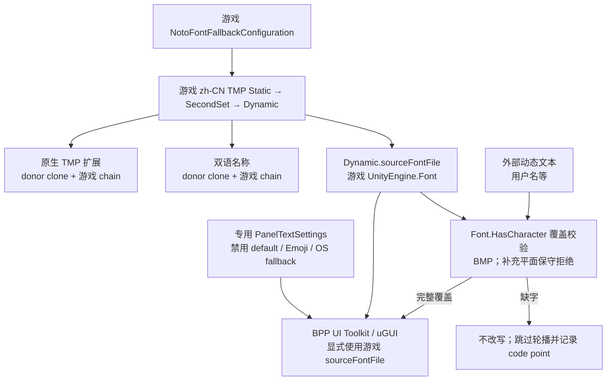

# RFC：移除 BPP 自定义 UI 字体，统一使用游戏字体

- 状态：实现中；自动化验证通过，实机矩阵待人工补充
- 日期：2026-07-13
- 跟踪 issue：[cauyxy/bazaarplusplus-mod#73](https://github.com/cauyxy/bazaarplusplus-mod/issues/73)
- 关联变更：[PR #69](https://github.com/cauyxy/bazaarplusplus-mod/pull/69)
- 实施前门槛：独立 red-team review → 修订 RFC → 用户确认（已完成）

## 1. 决策摘要

本 RFC 建议：

1. 删除 BPP 内嵌的 LXGW WenKai、所有 Unity `LegacyRuntime.ttf` / OS 字体路径、运行时自建 TMP 字体和 `Appearance.UiFont` 设置项。
2. 游戏原生 TMP 表面保留 donor primary font 与材质；当 BPP 在非中文游戏 locale 主动输出 CJK 时，只给 donor clone 挂载游戏 `zh-CN` Static → SecondSet → Dynamic fallback 链，不替换成 BPP 字体。
3. BPP 自建 UI Toolkit / uGUI 表面（包括 Combat Status Bar 与 Voice Subtitles 中文行）默认使用游戏 Noto Sans Dynamic 资产所引用的 `UnityEngine.Font`；Collection Panel 顶层标题和 Live Build 终局阵容标题按游戏 screen-title 规则单独使用 Noto Serif。
4. 把 `NativeChineseFontFallback` 的游戏资产加载与 TMP donor fallback 安装能力抽成共享 seam；双语名称与 BPP 原生 tooltip CJK 复用同一条游戏字体链；Main Menu 版本文本保持 ASCII donor。
5. BPP 自建 UI Toolkit panel 使用受控 `PanelTextSettings`，显式清空默认、普通 fallback、Emoji fallback 与 OS fallback，避免缺字时静默切到系统字体。
6. 外部动态文本先按实际游戏 `UnityEngine.Font` 覆盖范围校验。当前赞助名单完整覆盖；未来缺字的名字不改写、不落回 BPP/OS 字体，而是从轮播样本中跳过并记录缺失 code point。
7. 新旧字体路径不并存。迁移完成后只保留游戏字体路径；回滚方式是整体 revert，不是运行时 fallback。

这里“删除自定义 fallback”指删除 BPP 自己维护的 LXGW / `LegacyRuntime.ttf` / `BppTmpFont` 路径，不会拆掉游戏自身的 `Static → SecondSet → Dynamic` Noto 字体链。

## 2. 背景与问题

当前代码同时存在五种字体策略：

| 表面 | 当前策略 | 问题 |
|---|---|---|
| 原生 tooltip 中的 BPP section | clone 原生文本块后，所有 CJK 默认换成 LXGW；部分 section 再通过 `UseUiFont` 选择 BPP TMP 字体 | 破坏 donor 字体/材质；掩盖非中文游戏 locale 下缺少游戏中文链的问题 |
| F8 / Tab / Live Build / 赞助行等 UI Toolkit | 根节点或控件显式指定 `BppUiFont.Default` | 不使用游戏字体；需要维护字体资源、缓存与设置 |
| Combat Status Bar | 自建 uGUI `Text` 使用 Unity built-in `LegacyRuntime.ttf` | 用户可见表面仍不是游戏字体，且原 RFC 完成条件漏检 |
| Voice Subtitles 中文行 | 自建 uGUI `Text` 通过 `CreateDynamicFontFromOSFont` 选择 PingFang / YaHei 等系统字体 | 直接违反“不使用 OS 字体”目标 |
| 双语名称 | clone 原生 TMP 字体并挂载游戏 `zh-CN` fallback 资产 | 符合目标：资产来自游戏，且只处理主动跨 locale 文本 |

当前自定义字体根位于 `Infrastructure/Fonts`：

- `BppUiFont` 在内嵌 LXGW 与 Unity `LegacyRuntime.ttf` 之间选择，并把 LXGW 解压到 BepInEx cache（`src/BazaarPlusPlus/Infrastructure/Fonts/BppUiFont.cs:13-110`）。
- `BppTmpFont` 再从上述 `UnityEngine.Font` 创建 2048×2048、multi-atlas 的 BPP TMP 资产，并替换原生 TMP label 的字体和材质（`src/BazaarPlusPlus/Infrastructure/Fonts/BppTmpFont.cs:12-169`）。
- `Appearance.UiFont` 和 dock row 暴露 KAI/SANS 选择（`src/BazaarPlusPlus/Core/Config/BppConfig.cs:143-148`；`src/BazaarPlusPlus/Game/Settings/UiFontSettingsDockEntry.cs:7-44`）。
- LXGW 字体与 license 作为程序集资源发布（`src/BazaarPlusPlus/BazaarPlusPlus.csproj:21-29`）。

PR #69 又让事件预览和英雄升级奖励显式设置 `UseUiFont = true`，最终覆盖 clone 的原生字体（`src/BazaarPlusPlus/Patches/Tooltips/EncounterEventTooltipPatch.cs:31-37`；`src/BazaarPlusPlus/Patches/Tooltips/HeroLevelRewardsTooltipPatch.cs:27-32`；`src/BazaarPlusPlus/Patches/Tooltips/BppTooltipSections.cs:65-74`）。这正是 #73 最初希望撤销的行为。

独立 red-team 又发现原范围遗漏了两个用户可见表面：Combat Status Bar 的 `GetUiFont()` 直接读取 `LegacyRuntime.ttf`（`src/BazaarPlusPlus/Game/CombatStatusBar/CombatStatusBar.Canvas.cs:639-650,743-745`）；Voice Subtitles 中文行直接创建 OS 字体（`src/BazaarPlusPlus/Game/VoiceSubtitles/FontDiagnostics.cs:15-98`；`VoiceLineDisplay.cs:444,487-493`）。两者现纳入本 RFC。

#73 后续讨论已明确：完整游戏繁体本地化暂不扩大，本次维持 BPP 现有繁体文案范围，后续再单独评估内容工作（[#73 comment](https://github.com/cauyxy/bazaarplusplus-mod/issues/73#issuecomment-4956633439)）。因此本 RFC 只解决字体资产，不扩展 locale 内容。

## 3. 已核验事实

### 3.1 游戏中文字体链

游戏会按 locale 把有序 fallback 挂到 Noto Sans / Serif primary 上；`zh-CN` 链为：

```text
NotoSans → NotoSansSC-Bold SDF
         → NotoSansSC-Bold-SecondSet SDF
         → NotoSansSC-Bold-Dynamic SDF

NotoSerif → NotoSerifSC-SemiBold SDF
          → NotoSerifSC-SemiBold-SecondSet SDF
          → NotoSerifSC-SemiBold-Dynamic SDF
```

运行时代码从配置加载有序引用并应用到 primary 及同名副本（`decompiled/TheBazaarRuntime/TheBazaar.Localization/NotoFontFallbackRuntime.cs:137-174,219-247`）。当前 BPP 的双语名称适配器也已能从同一配置加载 `zh-CN` Sans / Serif 链（`src/BazaarPlusPlus/GameInterop/Localization/NativeChineseFontFallback.cs:148-205`）。

`俱`（U+4FF1）不需要 BPP 字体。它由游戏 Dynamic 源字体正常生成，实机“商人俱乐部”已确认显示正常。

### 3.2 Dynamic 源字体覆盖

核验基线：Steam build `24001960`，Unity `6000.3.11f1`。

| 范围 | NotoSansSC-Bold | NotoSerifSC-SemiBold |
|---|---:|---:|
| 总 code point | 30,890 | 30,928 |
| ASCII 可打印字符 | 95 / 95 | 95 / 95 |
| Latin-1 Supplement | 96 / 96 | 96 / 96 |
| CJK Unified | 20,976 / 20,992 | 20,992 / 20,992 |
| CJK Extension A | 6,582 / 6,592 | 6,592 / 6,592 |
| Hangul syllables | 0 / 11,172 | 0 / 11,172 |
| 阿拉伯文 / Emoji 主区 | 0 | 0 |

Sans 缺少的 BMP 汉字只在新区段末尾；Serif 对 CJK Unified 与 Extension A 完整覆盖。两者都不覆盖 Extension B 等罕见扩展区，也不构成任意用户名字符集。

### 3.3 当前 `zh-Hant` 固定 UI 语料

审计范围是当前 BPP 会进入台湾中文模式的固定 UI 文案：`LocalizedTextSet`、`FormatSimple`、`ResolveChinese`、`ChineseScriptConverter.Convert` 与 Collection `TierForms`。外部用户名、游戏运行时动态文本和语音目录不计入固定语料；Collection / History / Live Build / Supporters 面板使用的固定符号另行并入字体覆盖检查。

| 语料统计 | 数量 | 占比 |
|---|---:|---:|
| 文案模板 / source form | 276 | 100% |
| 显式提供繁体模板 | 182 | 65.9% |
| 由现有转换器自动转换 | 94 | 34.1% |
| 唯一 Han code point | 346 | — |
| 文案内非 Han、非 ASCII 标点 / 符号 | 14 | — |

14 个标点 / 符号为 `· × — … ≥ 、 。 《 》 （ ） ， ： ？`。再加面板固定符号 `♥`、`✓` 后，本次固定 UI 覆盖集合共有 362 个非 ASCII code point。

| 字体源文件 | Han 覆盖 | 固定 UI 非 ASCII 覆盖 | 缺失 |
|---|---:|---:|---:|
| NotoSansSC-Bold | 346 / 346 | 362 / 362 | 0 |
| NotoSerifSC-SemiBold | 346 / 346 | 362 / 362 | 0 |

两个源字体还都覆盖 95 / 95 个可打印 ASCII 字符。也就是说，在 build `24001960` 下，当前固定 `zh-Hant` UI 文案没有字体缺字。

但 Static + SecondSet 两级只包含上述 346 个 Han code point 中的 201 个；其余 145 个（41.9%）必须由 Dynamic `sourceFontFile` 生成。**“源字体覆盖 100%”不能被实现成“只使用静态 atlas”**：原生 TMP 必须保留游戏完整的 Static → SecondSet → Dynamic 链，UI Toolkit 必须绑定 Dynamic 资产的 `sourceFontFile`。

这里还需要区分字体覆盖与本地化质量：`LocalizedTextSet.Resolve` 会把没有显式繁体模板的文案交给转换器（`src/BazaarPlusPlus.Localization/LocalizedTextSet.cs:58-63`）；当前转换器是逐字映射加 `數據庫 → 資料庫`、`查看 → 檢視` 两项台湾用语替换（`src/BazaarPlusPlus.Localization/ChineseScriptConverter.cs:468-513`）。因此字体字符覆盖率是 100%，但显式繁体文案覆盖率只有 65.9%。后者是现有本地化策略的质量局限，不是本次字体迁移新增的问题，也不作为迁移阻塞项。

code point 全覆盖同样不能证明台湾地区字形风格正确；源字体仍是 Noto SC，这个视觉取舍保留为产品确认项。

### 3.4 当前赞助用户名

当前线上名单有 336 个名字、508 个不同 code point：

- Sans SC：336 / 336 完整覆盖；
- Serif SC：336 / 336 完整覆盖。

因此当前赞助名单可以迁到游戏字体。这个结论不能外推到未来任意用户名。

### 3.5 UI Toolkit 可复用路径

已从安装包静态确认：

- `NotoSansSC-Bold-Dynamic SDF.m_SourceFontFile` 指向包内 `NotoSansSC-Bold` `UnityEngine.Font`；
- `NotoSerifSC-SemiBold-Dynamic SDF.m_SourceFontFile` 指向包内 `NotoSerifSC-SemiBold` `UnityEngine.Font`；
- 两个 Dynamic TMP atlas 均为 1024×1024、padding 8、未启用 multi-atlas；前两级静态 atlas 均为 2048×2048。
- Collections 原生场景的 heading 样本 `Label`（`Ringside\nChampion`）序列化为 `NotoSerif`、`m_fontStyle = 0`、`m_fontColor = #FFD5AC`；Collection Panel 顶层标题和 Live Build 终局阵容标题沿用这组语义，正文和控件仍使用 Sans。

UI Toolkit 的 `FontDefinition.FromSDFFont(...)` 接收 `UnityEngine.TextCore.Text.FontAsset`，不能直接接收 `TMPro.TMP_FontAsset`。可行路径是从游戏 Dynamic `TMP_FontAsset.sourceFontFile` 取得上述 `UnityEngine.Font`，再通过 `unityFont` / `FontDefinition.FromFont(...)` 设置到 BPP UI。该路径不创建 BPP TMP atlas。

但仅设置 `unityFont` 不足以证明“不会使用 OS fallback”。对游戏随附的 Unity `6000.3.11f1` 程序集静态核验发现：`UnityEngine.TextCore.Text.TextSettings.fallbackOSFontAssets` 在首次访问时会枚举 OS 字体，`TextGenerator` 在当前 font/fallback 缺字时会继续查询该列表。因此每个 BPP `PanelSettings` 必须绑定专用 `PanelTextSettings`，并在 panel 初始化前把 default font、普通 fallback、Emoji fallback 与内部 OS fallback 列表全部显式置空；不能依赖 Unity 默认 `PanelTextSettings`。

Phase A 必须在主路径确认 `sourceFontFile.dynamic == true`、能在 UI Toolkit 中动态生成审计出的 Dynamic-only Han 字符，并确认缺字只产生 missing glyph 而不会命中 OS fallback。任一条件失败都停止迁移并回到 RFC，不能进入旧字体删除阶段。

### 3.6 Native TMP CJK 路径的根因补充

`BppTooltipSections` 原本只保留 donor typography；提交 `b3f524b4` 为支持附魔 aggregate type 的 CJK 文案，在共享 `TryShow` 路径无条件加入了 `BppTmpFont.TryApply(...)`。当前实现随后演变为：`UseUiFont` 分支强制使用用户选择的 BPP TMP 字体，默认分支则对任何 CJK 文案强制使用 LXGW（`src/BazaarPlusPlus/Patches/Tooltips/BppTooltipSections.cs:65-74`；`src/BazaarPlusPlus/Infrastructure/Fonts/BppTmpFont.cs:21-47`）。历史和代码中没有证据表明 donor 本身必须被替换；真正需要解决的是 BPP locale 与游戏 locale 不一致时，donor primary 未必已挂载中文链。

游戏 `NotoFontFallbackRuntime` 会把 locale chain 应用到 canonical primary 及同名副本，但只按游戏当前 locale 执行（`decompiled/TheBazaarRuntime/TheBazaar.Localization/NotoFontFallbackRuntime.cs:137-174,219-247`）。因此新路径不能简单删除 `BppTmpFont` 后什么都不做：对 BPP 主动输出的 CJK，应 clone donor primary 并挂载游戏 `zh-CN` fallback，沿用现有双语名称的做法；donor primary、材质、字号和 outline 保持不变。

## 4. 目标与非目标

### 目标

- 所有用户可见 BPP UI 只使用游戏包内字体资产。
- 原生 UI 扩展保留原生字体和材质。
- 删除 BPP 字体资源、字体设置和运行时字体生成逻辑。
- 继续支持 BPP 的 `zh-Hans` / `zh-Hant` 文案字符。
- 对赞助用户名等外部动态文本建立明确的覆盖校验与失败策略。
- 字体资产加载失败可诊断，不静默回退到 LXGW、OS 字体或旧实现。

### 非目标

- 不为游戏制作完整 `zh-TW` locale。
- 不承诺覆盖任意 Unicode 用户名、Emoji 或所有文字系统。
- 不修改游戏的全局 locale 或全局 primary/fallback 链。
- 不把 UI Toolkit 改写成 uGUI/TMP。
- 不在迁移期保留新旧双路径或配置开关。

## 5. 最终结构



### 5.1 游戏字体资产适配器

在 `GameInterop` 增加一个只负责游戏资产访问与生命周期的共享适配器（暂名 `NativeGameFonts`）：

- 只在 `NotoFontFallbackRuntime.HasConfiguration` 为 true 后，从游戏已经初始化的 `_configuration` 读取 `zh-CN` Sans / Serif 有序链；BPP 不抢先加载配置，也不调用游戏 initializer；
- 加载并持有 Addressables handles；
- 从链中选择 `sourceFontFile != null` 的 Dynamic 资产；
- 不得把 Static + SecondSet 当作完整中文覆盖：当前固定 `zh-Hant` Han 字符有 145 / 346 依赖 Dynamic；
- 向 UI Toolkit / `UnityEngine.UI.Text` 调用方暴露只读 `UnityEngine.Font`；
- 向原生 TMP 调用方提供“clone donor primary + 追加游戏 fallback chain”的安装能力，不替换 donor primary/material；
- 覆盖校验按 Unicode code point 枚举：BMP 调用实际渲染 `UnityEngine.Font.HasCharacter(char)`；当前两个 SC 源字体不含补充平面字符，因此 surrogate pair 直接判为 unsupported 并报告完整 code point；
- 禁止调用 `FontEngine.LoadFontFace`：它会切换进程共享的 active face，可能与游戏 Dynamic TMP glyph population 交错；
- 资产与 handles 在首次成功加载后存活整个 plugin session；locale 切换和场景切换不得释放，只有 plugin unload 才统一恢复 donor binding、销毁 clone 并释放自有 handles；
- 不修改游戏全局 locale 或全局字体链。

现有 `NativeChineseFontFallback` 的 loader 与 donor-binding 逻辑迁入该 seam，避免同一组 Addressables 被两套 BPP loader 重复持有。共享 seam 属于 `GameInterop`，具体面板绑定与失败时的产品行为仍留在 `Game/`。

#### 5.1.1 Phase A 实机发现：配置初始化竞态

2026-07-13 的首轮 Debug 主路径 tracer 证明了字体资产本身与两条渲染路径成立，但也发现了原 RFC 没覆盖的启动时序：`VoiceLineDisplay` 在游戏加载到 30% 左右就挂载中文 uGUI label，此时 `NotoFontFallbackRuntime._configuration` 仍为 `null`；游戏稍后才在 `LocalizationService.InitializeAsync` 中调用 `NotoFontFallbackRuntime.InitializeAsync`（`decompiled/TheBazaarRuntime/TheBazaar.Localization/LocalizationService.cs:77`）。首轮日志因此先出现 `configuration_unavailable`，到 Collection panel 打开时才恢复。

首轮 tracer 的通过证据：

- Supporter row：`font=NotoSansSC-Bold; dynamic=True; han=True; unsupported_rejected=True; missing=U+20000; panels_isolated=True`；画面中 `俱` 正常显示，U+20000 只显示 missing glyph。
- `BppTooltipSections`：`donor=NotoSans`，安装后为 donor clone，`material_preserved=True`，`chain_has_han=True`，实际 mesh 的 `俱` 来自 `NotoSansSC-Bold-Dynamic SDF`。

这不否定字体选择与 fallback 方案，但说明 Voice Subtitles 没必要在游戏初始化期间抢先创建 renderer，故 Phase A 仍未完成。经产品取舍，修订方案改为延迟挂载：`VersionLabelScanner` 仍按现有节奏查找原生 version label，但当该 label 自身不覆盖中文时，只有 `NotoFontFallbackRuntime.HasConfiguration` 为 true 才调用 `VoiceLineDisplay.MountFromVersionLabel`。游戏配置未就绪是预期的 bootstrap 状态，不触发字体解析、不记录 `configuration_unavailable`，scanner 继续检查；游戏配置就绪后再创建 split renderer。BPP 不主动加载 `ConfigurationAddress`，不调用或等待游戏 async initializer，也不后退到 OS / Unity built-in 字体。

选择延迟挂载的依据是字幕实际首次显示晚于游戏 LocalizationService 初始化；相比让 BPP 额外持有一份配置 handle，这一方案让配置生命周期继续完全由游戏拥有。若 version label 自带完整中文覆盖，则 combined TMP 路径不依赖这份配置，可以直接挂载。dispatcher 在 renderer 挂载前保留仍在播放的 cue，淘汰已停止的头部 cue；播放状态查询异常的 cue 记录现有、按 reason code 去重的 `playback_tracking.degraded` warning 后按不可追踪处理并淘汰，避免延迟挂载后闪现可能已过期的字幕。队列限制为最新 8 条，既避免初始化窗口永久丢弃首条字幕，也避免字体配置永久失败时无界增长。修复后必须从冷启动重跑 tracer，并证明初始化期间没有 `configuration_unavailable`、配置就绪后 split renderer 成功挂载、第一条实际字幕没有因延迟挂载而丢失。

### 5.2 UI Toolkit fallback 隔离

每个 BPP `PanelSettings` 在挂到 `UIDocument` 前绑定专用 `PanelTextSettings`：

- `defaultFontAsset = null`；
- `fallbackFontAssets` 设为空列表；
- `enableEmojiSupport = false`，Emoji fallback 设为空；
- Unity 内部的 OS fallback 列表显式初始化为空，禁止其 lazy 枚举系统字体；
- root 与需要显式覆盖的内部 text element 只绑定 `NativeGameFonts` 暴露的游戏 `UnityEngine.Font`；
- panel 销毁时同时销毁这份 `PanelTextSettings`，不得共享或修改游戏自己的全局 text settings。

OS fallback 列表没有公共 setter；实现必须把“能够可靠清空并读回为空”作为 adapter readiness 的一部分，可使用 Publicizer 暴露成员或窄范围 reflection。若 Unity 版本变化导致该约束无法验证，panel 本次不创建并记录一次明确错误，不能退回默认 `PanelTextSettings`。

### 5.3 各表面迁移规则

| 表面 | 迁移规则 |
|---|---|
| `BppTooltipSections` | 删除 `UseUiFont` 与所有 `BppTmpFont` 调用；CJK 内容通过共享 seam 给 donor clone 追加游戏 chain，其他内容完全继承 donor |
| 事件预览 / 英雄升级奖励 | 删除 `UseUiFont = true`；保留 donor primary/material，CJK 只追加游戏 chain |
| 附魔预览 / aggregate missing types | 保留共享 section；验证 donor clone 的 Dynamic chain，并按 Noto 指标重新验收 CJK line-height |
| Main Menu 版本 label | formatter 只生成 ASCII；删除 `BppTmpFont.TryApply` 后保留 donor primary/material，不安装不可达的 CJK chain |
| Voice Subtitles | 删除 `ResolveSystemChineseUiFont` 与 OS font candidates；TMP 英文/combined label 保留 donor，uGUI 中文行使用游戏 Sans SC `UnityEngine.Font` |
| Combat Status Bar | 删除 `GetBuiltinResource<Font>("LegacyRuntime.ttf")`；所有 uGUI `Text` 使用同一个游戏 Sans SC `UnityEngine.Font` |
| 双语名称 | 保留 donor clone + 游戏 `zh-CN` fallback 行为并切到共享 loader；按已确认需求把适用类型从 Item / EventEncounter 扩到 Skill / EncounterStep（技能 / 奖励） |
| Collection / History / Live Build 根节点 | 统一绑定游戏 Sans SC `UnityEngine.Font` 与专用 `PanelTextSettings`；Collection 顶层标题和 Live Build 终局阵容标题覆盖为游戏 Serif SC source font、normal style 与原生 heading 色 `#FFD5AC` |
| TextField / Button 内部 text element | 清除分散的 `BppUiFont.Default`，继承根字体；只有 Unity 继承失效的控件保留显式游戏字体绑定 |
| 赞助用户名 | 显示前校验；只处理当前实际显示文本，不预热整个远端名单 |
| Collection source badge (`UnityEngine.UI.Text`) | 使用同一个游戏 `UnityEngine.Font` |

### 5.4 繁体中文策略

游戏没有独立的 `zh-TW` 字体资产。对 build `24001960` 的审计已经确认：NotoSansSC-Bold 与 NotoSerifSC-SemiBold 的源字体都覆盖当前固定 `zh-Hant` UI 集合的 362 / 362 个非 ASCII code point，其中 Han 为 346 / 346；没有字体缺字。但 145 / 346 个 Han 字符不在 Static + SecondSet 中，必须保留 Dynamic / `sourceFontFile` 路径。

采用游戏字体意味着：

- 当前固定文案字符可完整显示；
- 字形采用 Simplified Chinese regional forms，而不是台湾地区字形；
- 本 RFC 不再通过 LXGW 提供另一套视觉风格。

当前 276 个繁体文案模板中，182 个（65.9%）显式提供繁体，94 个（34.1%）沿用现有自动转换器。自动转换的措辞质量是既有本地化局限，不由字体迁移解决，也不阻塞迁移；“全部使用游戏字体”新增且需要确认的产品取舍只有接受 Noto SC 的地区字形风格。

### 5.5 外部动态文本策略

当前赞助名单全部通过。对未来数据：

1. 在准备显示一个轮播候选时，用实际渲染的游戏 `sourceFontFile` 按 Unicode code point 校验完整名字；
2. 完整覆盖才进入可显示样本池；
3. 缺字时保留原始数据，不修改用户名；该名字不进入轮播，日志记录数据来源与缺失 code point；
4. 如果所有候选都被过滤，仍显示通用赞助 CTA，不显示 tofu；
5. 服务端/发布流程的字体覆盖 preflight 作为后续跨仓库工作，本 RFC 不直接修改服务端。

该策略是“只用游戏字体”与“任意外部文本可能超出游戏覆盖”之间的明确边界。

校验不能调用 `TMP_FontAsset.HasCharacters(..., tryAddCharacter: true)`：UI Toolkit 不使用该 TMP atlas，这样做会为了校验向游戏 1024×1024 Dynamic atlas 写字形；也不能调用 `FontEngine.LoadFontFace`，以免切换与 TMP 共享的 active face。校验只使用实际渲染的 `UnityEngine.Font.HasCharacter(char)`；BMP 逐字符检查，surrogate pair 按完整 code point 记录并保守判为 unsupported。用户在搜索框等输入的任意文本不改写；超出游戏字体覆盖时显示 missing glyph，专用 `PanelTextSettings` 保证不会静默切到 OS 字体。

## 6. 删除清单

### 生产代码与资源

- [x] 删除 `Infrastructure/Fonts/BppUiFont.cs`。
- [x] 删除 `Infrastructure/Fonts/BppTmpFont.cs`。
- [x] 删除 `Infrastructure/Fonts/EmbeddedFontFile.cs`。
- [x] 删除 `BppTmpFontPolicy` 的字体职责；CJK 检测迁到无字体资源语义的 `UnicodeFontCoverage`。
- [x] 删除 `Core/Config/BppUiFontKind.cs`。
- [x] 删除 `BppConfig.DefaultUiFontKind`、`UiFontKindConfig`、`IBppConfig.UiFontKindConfig` 和 `Appearance.UiFont` bind。
- [x] 删除 `Game/Settings/UiFontSettingsDockEntry.cs` 及注册。
- [x] 删除 `BppSettingsDockOrder.UiFont` 并连续重排后续 order。
- [x] 删除 `Plugin` 中 `BppUiFont.Install/Reset`。
- [x] 删除 `Resources/Fonts/LXGWWenKai-Regular.ttf`、license、README。
- [x] 删除 csproj 中两个字体 `EmbeddedResource`。
- [x] 删除只服务旧字体加载的 `settings.ui_font.loaded/degraded` 字段、枚举和 storm test；新增共享 `plugin.native_game_fonts.*` readiness / 缺字事件。
- [x] 删除 Voice Subtitles 的 OS font candidate 列表、`ResolveSystemChineseUiFont`、对应 creation failure reason/event；保留 donor/TMP diagnostics。
- [x] 删除 Combat Status Bar 的 built-in font cache；`GetUiFont()` 现在只返回已解析的游戏字体并 fail closed。
- [x] 确认删除的 font-specific settings reason code 没有 surviving non-font consumer。

### 调用点

- [x] 清理 Collection Panel 的 root、filter、TextField、Button 旧字体赋值并迁移到 panel 游戏字体。
- [x] 清理 History Panel 的 root、style helper、表格/输入框旧字体赋值并迁移到 panel 游戏字体。
- [x] 清理 Live Build Panel 的 root、foreground root、label/button 旧字体赋值并迁移到 panel 游戏字体。
- [x] 清理 `BPPSupporterAttributionRow` 的旧字体赋值与 warm 调用。
- [x] 迁移 `CollectionSourceAttributionBadge`。
- [x] 清理 `BppTooltipSections`、事件预览、英雄升级奖励、附魔预览、aggregate missing types；CJK 改挂游戏 chain。Main Menu 版本 label 删除旧字体调用并保留 ASCII-only donor。
- [x] 迁移 Combat Status Bar 的全部 uGUI `Text`。
- [x] 迁移 Voice Subtitles 的 uGUI 中文行并删除 OS font 路径。

### 测试与文档

- [x] 删除 `UiFoundation.Tests` 中 `EmbeddedFontFile` 测试及 csproj compile-include。
- [x] 将 CJK 检测测试迁到 `UnicodeFontCoverage`，避免以 embedded font policy 命名。
- [x] 删除 SettingsDock / BppConfig 的 UI Font 测试。
- [x] 反转 Architecture tests：断言没有 BPP 字体资源、配置、`UseUiFont`、BPP runtime font asset、Unity built-in font 和 OS font creation。
- [x] 增加共享游戏字体 adapter 的资产选择、session-lifetime handle、donor clone 清理和 Unicode 校验测试。
- [x] 增加受控 `PanelTextSettings` 结构约束：default / ordinary / Emoji / OS fallback 均为空，无法验证时 fail closed。
- [ ] 固化可重复的 `zh-Hant` 固定语料审计：不得遗漏本地化调用形式，并分别报告显式繁体与自动转换模板。
- [ ] 在有游戏安装包的验证环境中，对实际 Dynamic `sourceFontFile` cmap 运行固定语料与面板符号覆盖 preflight。
- [x] 更新 `docs/ARCHITECTURE.md` 的字体与 settings roster 描述。
- [x] 更新 `docs/drafts/2026-07-13-operational-log-migration-manifest.md` 中已删除字体事件的清单。
- [x] 不直接编辑 `docs/MEMORY.md`；记录为下一次 consolidation 的待清理知识。

## 7. 实施 Todo

### Phase 0：设计门槛

- [x] 使用独立只读 reviewer 审查字体来源、Dynamic、Addressables 生命周期和删除范围。
- [x] 把 Combat Status Bar、Voice Subtitles、UI Toolkit OS fallback、native TMP CJK donor chain、字体指标风险纳入 RFC。
- [x] 用户确认首版修订后的执行清单并要求开始实现。
- [x] 用户确认 5.1.1 的配置初始化竞态修订方案：Voice Subtitles 延迟挂载，BPP 不抢先加载游戏配置。

完成条件：用户确认后才能进入 Phase A；未确认时不改生产代码。

### Phase A：共享游戏字体 seam

- [x] 把 `zh-CN` 字体引用加载从 `NativeChineseFontFallback` 提取为共享 `GameInterop` loader。
- [x] 用纯选择逻辑测试证明只选择 `sourceFontFile != null` 的 Dynamic 资产。
- [x] 断言 Static + SecondSet 不能作为完整链或 source font，任一引用加载失败时 adapter 不接受部分链。
- [x] 实现字体 Addressables handle 持有与去重：首次成功加载后存活整个 plugin session，locale/scene change 不释放，unload 才释放；配置本身继续由游戏持有，BPP 不创建配置 handle。
- [x] 抽出 donor clone + game fallback installer，供双语名称与原生 tooltip 共用；unload 恢复 binding 并销毁 clone。
- [x] 实现 `Font.HasCharacter` 覆盖校验：BMP 精确检查，surrogate pair 按完整 code point 保守拒绝；代码不得调用 `FontEngine.LoadFontFace` 或写 TMP atlas。
- [x] 建立专用 `PanelTextSettings` factory，并能验证 default / ordinary / Emoji / OS fallback 全空；失败时 panel fail closed。
- [x] 首轮实际 Supporter row tracer 已证明 Dynamic Han、unsupported missing glyph 与 panel 隔离；临时 probe 已删除。
- [x] 首轮实际 `BppTooltipSections` tracer 已证明 donor material 保持且 `俱` 由 `NotoSansSC-Bold-Dynamic SDF` 渲染；临时 probe 已删除。
- [x] 实现 Voice Subtitles readiness gate：version label 不覆盖中文且游戏配置未就绪时不创建 renderer，由现有 scanner 延迟重试；adapter 将该状态视为 not-ready 而非 degraded。
- [ ] 冷启动复核：已确认启动期无 `configuration_unavailable` 且配置就绪后 split renderer 成功挂载；dispatcher 的真实队列回归测试已覆盖挂载前保留、停止 cue 淘汰、播放状态查询异常时告警并淘汰和 8 条上限，但未在本次会话触发第一条实际字幕，因此端到端“没有丢失首条字幕”仍保留为人工验证项。临时 probe 已删除。

完成条件：上述两个主路径 tracer 和全部 readiness 约束通过；任一失败则停止并修订 RFC，不进入 Phase B 或删除旧字体。

### Phase B：逐表面迁移

- [x] 迁移 Collection / History / Live Build 根与内部控件。
- [x] 迁移 uGUI source badge。
- [x] 迁移 Combat Status Bar 的全部 uGUI `Text`。
- [x] 迁移 Voice Subtitles 中文 uGUI 行并删除 OS font path；英文/combined TMP donor 行为保持。
- [x] 删除原生 tooltip / main-menu label 的 BPP 字体覆盖并保留 donor typography；原生 tooltip 的 CJK 安装游戏 chain，ASCII-only main-menu label 不安装不可达的 chain。
- [ ] 重新验收附魔预览和 aggregate missing types 的 CJK line-height / wrapping。
- [x] 双语名称切到共享 loader，并把适用类型从 Item / EventEncounter 扩到 Skill / EncounterStep（技能 / 奖励）。

完成条件：全仓对 `BppUiFont|BppTmpFont|UseUiFont|GetBuiltinResource<Font>|CreateDynamicFontFromOSFont|new Font\(` 的源码扫描无命中；所有用户可见 BPP 表面只引用游戏字体资产。

### Phase C：删除旧子系统

- [x] 按第 6 节删除资源、配置、dock row、日志与测试。
- [x] 清理设置顺序和旧 cfg 行为：已有 `Appearance.UiFont` 留在用户 cfg 中也只作为未绑定旧键被忽略，不写迁移 fallback。
- [x] 删除旧字体 cache 不作为运行时职责；现有 cache 文件可自然遗留，不再读取。
- [x] 确认删除的 settings/voice font reason code 无 surviving consumer，再更新 logging tests 与 manifest。
- [x] 更新架构文档与 operational log draft。

完成条件：构建产物不含 LXGW 字体/license；运行时不创建 BPP TMP font asset；UI Font 设置消失。

### Phase D：验证与收尾

- [x] 跑格式化，仅保留任务相关 diff。
- [x] 跑受影响单测与 architecture tests。
- [ ] 跑 `./run.sh test`（本回合不执行：该入口会清理游戏/installer xattr，Debug 传递构建还会部署到游戏目录；已改用隔离的受影响测试与 Release 构建）。
- [x] 在隔离 worktree 使用 Release 构建验证；输出重定向到临时 installer 路径，未触碰游戏目录。
- [ ] 通过 Steam 启动游戏，完成第 8 节实机矩阵（不再由 Codex 在本回合执行，留给人工验证）。
- [x] 自审 diff，确认没有旧字体 fallback 或双路径；并修复了部分 Addressables chain 被误接受、panel 首次 not-ready 后不重试的问题。
- [x] 复核 Phase 0 red-team 的九项发现；代码约束已覆盖 1–4、6–8，视觉字重与 tooltip 字体指标保留在实机矩阵。

## 8. 验证矩阵

### 自动化

- [x] `SettingsDockRegistry.Tests`：不存在 UI Font row，后续 order 正确。
- [x] `BppConfigTests`：不再 bind `Appearance.UiFont`；其他配置 round-trip 不变。
- [x] `UiFoundation.Tests`：CJK / Unicode coverage helper 行为通过；旧字体提取测试消失。
- [x] `Architecture.Tests`：无内嵌字体、无 `TMP_FontAsset.CreateFontAsset`、无 `UseUiFont`、无 `BppUiFont` / `BppTmpFont`、无 `GetBuiltinResource<Font>`、无 `CreateDynamicFontFromOSFont`、无文件路径 `new Font(...)`。
- [x] `PanelTextSettings`：实现与结构约束保证 default / ordinary / Emoji / OS fallback 均为空；reflection seam 失效时返回 not-ready 而不是 Unity default；首轮主路径 tracer 已读回隔离状态。
- [x] 游戏字体 adapter：只选 Dynamic `sourceFontFile`；handles 仅在 unload 释放；donor clone binding 在 unload 恢复。
- [x] `zh-Hant` 固定语料审计：覆盖全部 `LocalizedTextSet` / `FormatSimple` / `ResolveChinese` / `Convert` / `TierForms` 来源，无未解析调用形式，并报告显式 / 自动转换数量；可重复审计脚本仍是后续固化项。
- [x] 安装包字体 preflight：build `24001960` 的两个实际 SC `sourceFontFile` 均覆盖固定 `zh-Hant` 与面板符号集合，结果记录于 3.3；可重复 preflight 仍是后续固化项。
- [x] 赞助用户名校验：BMP 覆盖正确；surrogate pair 保守拒绝并报告完整 code point；不调用 `FontEngine` / TMP mutation API。
- [x] `dotnet build ... -c Release` 与本次受影响 tests 通过。

### 实机

- [ ] 英文游戏：F8、Tab、Live Build、赞助行、source badge、Combat Status Bar 正常显示。
- [ ] 简体中文：上述表面正常；`俱` 与静态集外常见汉字可动态显示。
- [ ] BPP `zh-Hant`：固定文案全部可见；测试串至少包含审计出的 145 个 Dynamic-only Han 字符之一，以证明未退化为静态两级；记录 SC regional glyph 取舍的人工验收结果。
- [ ] 英文游戏 + BPP `zh-Hant`：事件预览、英雄升级奖励、附魔预览、aggregate missing types 均由 donor + 游戏 chain 显示；字体、材质、字号、outline 与原生一致。
- [ ] 附魔预览多行 CJK 与 #74 的间距基线一致，没有因 LXGW → Noto 指标变化重新出现过宽/过窄间距。
- [ ] Item、Skill、EncounterStep 奖励和 EventEncounter 的双语名称在英文/中文游戏 locale 下仍能显示另一语言。
- [ ] Voice Subtitles 中文行确认使用游戏 Sans SC source font；英文/combined donor、换行和布局无回归，日志中没有 OS font creation。
- [ ] 当前线上赞助名字抽样正常；构造 Emoji/Hangul 缺字名时不出现 tofu，且日志包含 code point。
- [ ] 搜索框输入 unsupported 字符时只显示 missing glyph；受控 `PanelTextSettings` 的 OS fallback 列表保持为空。
- [ ] 冷启动、切场景、重复开关三个面板、修改游戏 locale/BPP 中文模式后无失效 handle、dangling `unityFont` 或丢字。
- [ ] `BepInEx/LogOutput.log` 无 Addressables/font exception，且加载/缺字事件不形成日志风暴。

## 9. 风险与待确认项

### 必须确认

- [ ] 接受 `zh-Hant` 使用游戏 SC 字体的地区字形，而不是台湾字形。
- [ ] 接受未来超出游戏字体覆盖的赞助名字从轮播中跳过、保留原数据并告警。

### 主要实现风险

1. **加载时序**：BPP 面板可能早于游戏 `NotoFontFallbackRuntime` 配置 ready。方案必须有明确 readiness，不得静默使用 Unity built-in font；资产不可用时面板本次不开启并给出一次可诊断错误。
2. **Addressables 生命周期**：共享 loader 必须持有自己加载的 handle 到 plugin unload；locale/scene change 期间 panel 仍可能持有 `unityFont`，提前释放会留下 dangling asset。
3. **UI Toolkit 隐式 OS fallback**：Unity `TextGenerator` 会查询 lazy OS font list；专用 `PanelTextSettings` 必须把该内部列表初始化为空并 fail closed，不能只清公开 `fallbackFontAssets`。
4. **UI Toolkit 动态能力与继承**：必须实测 `sourceFont.dynamic` 和 Dynamic-only 字符；TextField/Button 内部 text element 可能不完全继承 root font，再决定保留哪些显式绑定。
5. **视觉字重**：可复用的 Sans SC source font 是 `NotoSansSC-Bold`。UI Toolkit 的普通文本会比当前 `LegacyRuntime.ttf` 更重，需要以“匹配游戏中文 UI”为验收基准，而不是恢复旧字重。
6. **外部语料增长**：当前 336 个名字全覆盖不是永久契约；客户端校验和服务端 preflight 不能省略。
7. **Dynamic 路径被误删**：当前固定 `zh-Hant` Han 字符有 145 / 346（41.9%）不在 Static + SecondSet。原生 TMP 必须保留完整 fallback chain；UI Toolkit 必须使用 Dynamic 的 `sourceFontFile`。两者也不共享 TMP atlas，不能用静态 TMP 覆盖结果替代 UI Toolkit 实测。
8. **Native TMP 跨 locale**：英文游戏 locale 下 donor primary 不自动获得 `zh-CN` chain；BPP `zh-Hant` 必须显式给 donor clone 追加游戏 fallback，否则简单删除 `BppTmpFont` 会重新产生 tofu。
9. **Tooltip 字体指标**：附魔预览的 CJK line-height 由 LXGW 时代调过；换成 donor + Noto fallback 后必须重新对照 #74 验收。

## 10. Rollout / rollback

- 一个 PR 完成 seam、迁移和旧实现删除，不发布双路径中间态。
- 不增加实验开关，不保留 `Appearance.UiFont` 兼容读取。
- 如实机验证失败，回滚整个 PR；不在同一版本中恢复 LXGW fallback。

## 11. Definition of Done

- [ ] 第 9 节两个产品取舍已确认。
- [x] 独立 red-team review 已完成，问题已反映到 RFC。
- [x] 用户确认 5.1.1 修订后的实施计划。
- [ ] 第 6、7、8 节 checklist 全部完成并留有真实验证记录。
- [x] 当前固定 `zh-Hant` 与面板符号在两个游戏 SC 源字体中均为 100% code point 覆盖；首轮 tracer 已确认 `俱` 由 Dynamic SDF 渲染。
- [x] 构建产物、源码、配置和 UI 中均不存在 BPP 自定义字体、Unity built-in font 或 OS font path。
- [x] 所有 BPP UI Toolkit panel 使用 fallback 列表全空的专用 `PanelTextSettings`；unsupported 文本不会静默使用 OS 字体。
- [ ] #73 更新最终决策、验证结果和后续跨仓库字体覆盖 preflight。
