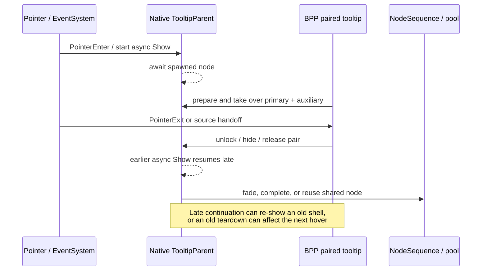

# Equipment Van / Skill Tooltip 闪烁修复尝试复盘

日期：2026-08-08

状态：停止继续修改；所有与 Equipment Van Tooltip 位置、hover 和生命周期相关的实验改动已本地回滚。

结论：问题没有被修好；最终代码差异不包含这些实验实现，分支历史仅保留尝试与明确回滚，便于其他人审阅复盘。

## 1. 问题现象

开启 Combat Impact recap 后，可稳定观察到以下异常之一：

1. 鼠标从空白区域直接移入 Equipment Van：原生卡牌 Tooltip 和 Combat Impact Tooltip 出现后马上消失，随后原生卡牌 Tooltip 再次出现。
2. 鼠标从空白区域移入技能时也出现类似闪烁。
3. 从 Equipment Van 或技能移回空白区域后，两块 Tooltip 偶尔不能正常关闭。

Equipment Van 是最容易复现的对象，但后续技能复现证明，这并不是单一卡牌内容或布局数据的问题，而是原生 Tooltip 与 BPP 配对 Tooltip 共用生命周期时出现的时序问题。

## 2. 预期行为

- 从空白区域移入卡牌或技能时，原生 Tooltip 与 Combat Impact Tooltip 应一次性稳定显示。
- 鼠标仍停留在同一对象上时，不应发生隐藏、重建或重新出现。
- 移回空白区域后，两块 Tooltip 都应可靠关闭。
- 卡牌与技能应使用同一套可验证的关闭语义，不依赖 Equipment Van 特例。

## 3. 已确认的运行时事实

- 每轮测试前都核对了实际部署 DLL 的 SHA256，排除了“测试的仍是旧 DLL”这一可能。
- 运行日志记录过 `pointer_exit` 清理后才到达的 native `show_handoff`，说明原生异步 Show 可以在 BPP 已经结束 hover 后继续完成。
- 日志中的 `dismissed` 只表示 BPP 发出了清理请求，并不能证明原生 Card/Auxiliary 节点已经隐藏或回收到池中。此前把它当成关闭完成证据，是一次错误判断。
- 原生 Card/Auxiliary Tooltip 使用共享、池化的 controller 和 NodeSequence。某次 hover 的延迟 Show、fade-out 或回收动作，可能落到下一次 hover 正在复用的同一个 controller 上。
- Equipment Van 和技能都能复现，说明根因位于 PointerEnter/PointerExit、异步 Show、fade/pool 和配对接管之间，而不是 Equipment Van 自身的文案、卡面或 Combat Impact 数据。

## 4. 关键时序

这条链路同时包含原生异步 continuation、BPP hover 状态和池化节点复用。只修其中一层，容易把“闪一下”变成“关不掉”或“下一张卡不显示”。

## 5. 已尝试方案及结果

### 尝试 A：调整 hover 注册顺序

曾把 Recap hover 注册从 postfix 移到 prefix，假设 BPP gate 安装过晚，原生 Tooltip 已经先渲染一帧。

结果：游戏内仍能复现，因此撤回。该方向没有解释退出后 native Show 才完成的日志证据。

### 尝试 B：在原生 Auxiliary teardown 期间持续隐藏外框

本地提交 `85a03d2b`（`fix(combat-insights): conceal native tooltip teardown`）尝试在释放配对内容后继续保持 `auxParent` gate 关闭，直到确认下一次原生 Show 接管 controller，避免原生 tween 把空 Auxiliary 外框重新抬起。

结果：架构测试、功能测试和构建均通过，但游戏内 Equipment Van 仍闪烁。该提交作为失败尝试保留在分支历史中，后续回滚提交完整撤销其代码差异。

### 尝试 C：PointerExit 延迟与 raycast watcher

尝试给 PointerExit 增加一帧或短时间 grace，并通过 EventSystem raycast 判断鼠标是否仍在原 owner、BPP Tooltip 或空白区域，以过滤 Tooltip 自己制造的 synthetic exit。

结果：出现“移回空白后 Tooltip 不关闭”的回归。主要问题包括：

- `RaycastAll` 的首个结果可能是透明 overlay，不等同于语义上的 hover owner。
- 把 Tooltip 子树视为 hover 区域，会让配对 Tooltip 自己永久续命。
- 同一 owner 的重复 Show/OnMouseOver 信号可能取消唯一的退出 watcher。
- 手工 raycast 不能恢复 EventSystem 自己的 pointerEnter 状态。

该方向已全部回滚。

### 尝试 D：拦截 late native Show，并做 scoped concealment/completion

根据日志中的“dismiss 之后才 show_handoff”，尝试记录已退出的 source/anchor，对迟到的 Card/Auxiliary Show 进行隐藏，并在精确 controller + data model + spawned node 完成后清理。

结果：能覆盖一部分 late-show，但共享 singleton 和池化节点带来新的竞态：

- 无条件全局 Hide 可能误杀期间已经到来的新 Tooltip。
- 直接 `NodeSequence.Completed()` 会绕过 TooltipParent cache 清理，或被下一次 fade-in 中断。
- 可逆 gate 若与普通 paired session 共用，会在普通 Hide 时过早恢复，旧 Tooltip 再次露出。
- controller 已被置空但 data model 仍 active 的窗口，会让下一次 outer Show 在进入低层拦截前直接丢失。

为了覆盖这些交错，方案逐步发展为 generation、tombstone、exact-node completion 和 deferred replay，复杂度已经明显超过当前证据能支持的范围。全部实验改动已回滚。

### 尝试 E：保留 native primary 的 source handoff，并等待可用 slot

尝试区分“从 A 移到 B”和“真正移回空白”：A→B 不立即销毁 native primary，让 B 复用；真实退出才 Hide。同时等待原生 card data model 的旧 fade/pool 完成后再发下一次 Show，并补充 Recap 卡牌 rotation 恢复。

结果：源码契约测试通过，独立审查也没有再找到明显的静态 P0/P1，但最终游戏内仍能复现 Equipment Van 闪烁。说明这些测试只证明实现满足设计约束，没有证明设计命中了真实根因。该轮改动未提交、未推送，现已全部回滚。

## 6. 为什么多轮尝试仍失败

1. **成功判据不完整。** 早期以 `dismissed` 日志和源码架构测试作为主要依据，没有同时验证 native controller、Canvas、NodeSequence 和 paired content 在后续帧的真实可见状态。
2. **测试层级不够。** 156 个 Architecture 测试和 241 个 PostCombatImpact 测试可以防止结构回归，但不能模拟 Unity EventSystem、async void continuation、DOTween 和池化节点跨帧复用。
3. **根因假设变化过快。** 先后把问题归因于创建顺序、Auxiliary gate、PointerExit、late Show、fade/pool handoff；每次局部证据成立，但没有一条端到端证据证明它就是最终造成屏幕闪烁的那次事件。
4. **修复范围失控。** 为保护共享 controller，方案逐步引入 watcher、generation、tombstone、completion 和 replay。每增加一层，都会产生新的关闭、handoff 或复用交错，风险高于当前收益。

## 7. 回滚状态

所有与 Equipment Van Tooltip 位置、hover、PointerExit、late Show 和 paired tooltip teardown 相关的改动，均已恢复到 `origin/master` 的实现。

当前保留的只有两个与本问题无关的改动：

- Combat Impact 触发来源计数改为 observed activation batch count。
- Combat Impact 行没有 icon 时左对齐。

回滚后验证：

- Architecture Tests：156/156 通过。
- PostCombatImpact Tests：241/241 通过。
- Debug build：成功，0 warning / 0 error。
- 已替换游戏本地 DLL，SHA256：`85761F829E1BDBD88632D1AF679EA47316E201CB54C5680A02B462C04B430CF1`。

## 8. Git / PR 交付状态

- 分支：`codex/fix-recap-equipment-van-tooltip-flash`
- 失败尝试提交：`85a03d2b`。
- 后续回滚提交撤销 `85a03d2b` 的全部 Tooltip 实现变化。
- 最终分支相对 `origin/master` 不包含 Equipment Van/Skill Tooltip 生命周期修改。
- 分支同时保留了两个已验证、与本问题无关的 Combat Impact 修正：触发批次数量与无 icon 左对齐。
- 本报告随分支发布，用于说明为什么不应把 `85a03d2b` 当成可合并修复。

## 9. 如果后续由其他人继续排查

建议不要继续叠加生命周期补丁，先建立一次端到端、逐帧可证明的复现记录：

1. 只从 `origin/master` 开始，不带本报告中的实验代码。
2. 对一次 hover 分配 correlation id，逐帧记录 PointerEnter/Exit、source id、原生 Card/Aux controller identity、NodeSequence identity/active/completed、Canvas alpha/active、BPP presentation revision。
3. 把“清理请求发出”和“两个原生节点确认不可见”拆成两个独立事件。
4. 同时录制画面与日志，用帧号关联第一次消失和第二次出现，先确定到底是哪一个原生节点重新可见。
5. 只实现能解释该帧证据的最小修复；不要先引入通用 watcher 或 deferred replay。

建议验收序列：

- 空白 → Equipment Van，重复至少 20 次，无一次隐藏后重现。
- 空白 → 技能，重复至少 20 次，无一次隐藏后重现。
- Equipment Van → 空白、技能 → 空白，两块 Tooltip 每次都关闭。
- Equipment Van ↔ 其他卡牌快速切换，原生 Tooltip 不丢失、不闪烁。
- 验收必须以游戏内画面为准，日志和架构测试只作为辅助证据。
