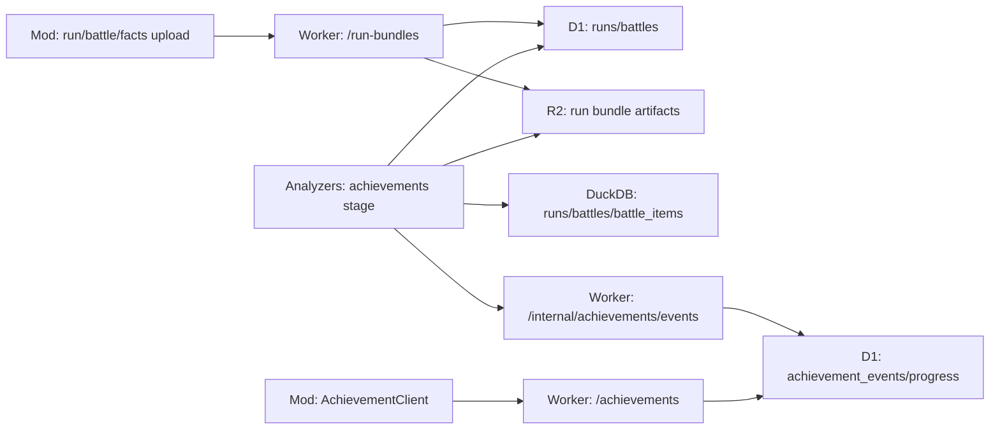

# 成就系统一期与服务端方案

Status: revised 2026-06-11 after multi-agent red-team review（14 条发现：1 blocker / 7 major / 6 minor，全部经对抗复核确认并已应用；本地 UI 一期细化为 `docs/plans/achievement-ui-local-mvp.md` 的 4-PR 计划）
Scope: CollectionPanel 新增“成就”栏、BPP 自建成就卡片、服务端成就状态、analyzers 成就解析与内部写回

## 代码事实

- 游戏内身份入口已经存在：`BppClientCacheBridge.TryGetProfileAccountId()` 从 profile 的 `AccountId` 成员读取账号，并返回字符串，见 `src/BazaarPlusPlus/GameInterop/BppClientCacheBridge.cs:26`。
- run bundle 上传已经以账号为边界：上传服务先解析账号，账号为空时直接跳过待上传 runs，见 `src/BazaarPlusPlus/Game/RunLogging/Upload/RunBundleUploadService.cs:31` 和 `src/BazaarPlusPlus/Game/RunLogging/Upload/RunBundleUploadService.cs:58`。
- 当前上传 payload 的 metadata 已经包含 `player_account_id`、run projection 和 battle projections，见 `src/BazaarPlusPlus.ModApi/Models/RunBundleUploadRequest.cs:7`。
- run bundle artifact 已经包含每场战斗的 manifest、participants、snapshots 和 replay payload，见 `src/BazaarPlusPlus.ModApi/Models/RunBundleUploadRequest.cs:154`。
- 战斗卡牌快照包含 `template_id`、类型、尺寸、tier、enchant、tags、attributes，见 `src/BazaarPlusPlus.ModApi/Models/RunBundleUploadRequest.cs:288`（`CardSetItemArtifact`）和 `src/BazaarPlusPlus/Game/PvpBattles/PvpBattleCardSnapshot.cs:7`。
- replay payload 保留 spawn/combat/despawn 原始消息字节，见 `src/BazaarPlusPlus.ModApi/Models/RunBundleUploadRequest.cs:324`。
- mod 本地 run log 有通用 `run_events` 表，但当前 run bundle artifact 构建只放入 battles，没有把 `run_events` 一起上传，见 `src/BazaarPlusPlus.Storage/RunLog/RunLogSchema.cs:87` 和 `src/BazaarPlusPlus/Game/RunLogging/Upload/RunBundleUploadStore.cs:190`。
- server 当前 `runs` 表存 R2 object key、账号、run 终局数据，`battles` 表存投影，不存 replay bytes，见 `../bazaarplusplus-server/migrations/0001_v4_initial.sql:7` 和 `../bazaarplusplus-server/migrations/0001_v4_initial.sql:36`。
- server run-bundle endpoint 当前无 token auth，但要求 metadata `player_account_id`，见 `../bazaarplusplus-server/docs/api-reference.md:28`。
- server 把 artifact bytes 写入 R2，并把 D1 投影批量写入 `runs`/`battles`/`seen_player_accounts`：投影语句构建于 `../bazaarplusplus-server/src/features/runBundles/upload.ts:423-493`，R2 put 与 D1 batch 提交在 `putThenProject`，见 `../bazaarplusplus-server/src/features/runBundles/upload.ts:497-521`。
- server 现有内部接口鉴权模式是 Bearer token，当前只用于 BazaarDB pull endpoints，见 `../bazaarplusplus-server/src/http/auth.ts:16` 和 `../bazaarplusplus-server/src/features/bazaardb/peek.ts:75`。
- `bazaarplusplus-analyzers` 已经定位为“同步 V4 D1 `runs`、解码 R2 run bundles、把 facts 写进本地 DuckDB”，见 `../bazaarplusplus-analyzers/README.md:3`。
- analyzers 已经有 D1 client、R2 client、bundle 队列 drain 和 run-bundle codec：D1 query 在 `../bazaarplusplus-analyzers/src/bpp/clients.py:62`，R2 `get_bytes` 在 `../bazaarplusplus-analyzers/src/bpp/clients.py:126`，bundle worker 在 `../bazaarplusplus-analyzers/src/bpp/stages/bundles/worker.py:33`，artifact decoder 在 `../bazaarplusplus-analyzers/src/bpp/codec.py:140`。
- analyzers 当前 bundle worker 用 `include_replay=False` 解码 artifact，见 `../bazaarplusplus-analyzers/src/bpp/stages/bundles/worker.py:77`。战斗事件类成就需要在成就 pipeline 中 replay-aware 解码，不能直接复用现有 publish 投影。
- analyzers 本地 DuckDB 已经有 `runs`、`battles`、`battle_items` fact tables，见 `../bazaarplusplus-analyzers/src/bpp/migrations/0001_init.sql:64`、`../bazaarplusplus-analyzers/src/bpp/migrations/0001_init.sql:97` 和 `../bazaarplusplus-analyzers/src/bpp/migrations/0001_init.sql:139`。

mod UI 渲染链事实（2026-06-11 review 补充，决定一期形态）：

- CollectionPanel 顶部 tab 模型是游戏枚举 `ECardType ActiveType` + `PackagesOnly` 布尔，没有可扩展的 mod 自有“来源枚举”，见 `src/BazaarPlusPlus/Game/CollectionPanel/Data/CollectionFilterState.cs:24` 和 `:36`；`CollectionSourceKind`（Merchant/Trainer）是右侧来源 chip 概念，与 tab 无关，见 `src/BazaarPlusPlus/Game/CollectionPanel/Sources/CollectionSourceEnums.cs:5`。
- 网格渲染硬依赖游戏静态模板：`CollectionCardFactory.TryBind` 先查 `BppStaticDataAccess.GetCardTemplate(staticData, vm.Id)`，未知 GUID 返回 null、不产生卡面，见 `src/BazaarPlusPlus/Game/CollectionPanel/Grid/CollectionCardFactory.cs:45`；失败 bind 不被记录，virtualizer 每帧重试，见 `src/BazaarPlusPlus/Game/CollectionPanel/Grid/CollectionGridVirtualizer.cs:341`；游戏 `JsonGameDataManager.GetCardById` 对未知 GUID 无负缓存、每次都开 SQLite 查询，见 `decompiled/TheBazaarRuntime/TheBazaar.DataManagement.Json/JsonGameDataManager.cs:73`。
- 面板没有卡牌点击选中、没有左侧预览面板；唯一卡面交互是 hover tooltip，见 `src/BazaarPlusPlus/Game/CollectionPanel/Grid/CollectionCardHoverRelay.cs:16`。现有预览最小输入模型是 `NativeCardPreviewSpec`（无 Size、无 Source，DisplaySpan 由 Size 推导），见 `src/BazaarPlusPlus/GameInterop/CardPreview/NativeCardPreviewSpec.cs:9`。
- 美术链从模板 `ArtKey` 走 Addressables，见 `src/BazaarPlusPlus/Game/CollectionPanel/Grid/CollectionCardArtCache.cs:54`；mod 自有美术缝是 `<templateGuid>.jpg` 材质替换，且当前只对 package 模板生效，见 `src/BazaarPlusPlus/Patches/CardArtReplacement/CardPreviewItemArtReplacePatch.cs:38`。
- 打开面板必种一个英雄（默认 Vanessa），Heroes 为空的 VM 过不了 `AnyHeroMatch`，见 `src/BazaarPlusPlus/Game/CollectionPanel/Data/CollectionFilterState.cs:84` 和 `src/BazaarPlusPlus/Game/CollectionPanel/Data/CollectionFilterEngine.cs:52`；run 内 day 闸按天数隐藏高展示 tier，见 `src/BazaarPlusPlus/Game/CollectionPanel/Data/DayTierSchedule.cs:16-33`。
- 可行的伪造卡渲染缝：`CollectionCardVm` 是纯 POCO，可从纯数据构造，见 `src/BazaarPlusPlus/Game/CollectionPanel/Data/CollectionCardVm.cs:28`；`TCardItem` 是 public sealed record，`CardPreviewBase.SetUp` 接受外部传入模板、容忍空 Tiers，见 `decompiled/BazaarGameShared/BazaarGameShared.Domain.Cards.Item/TCardItem.cs:13` 和 `decompiled/TheBazaarRuntime/TheBazaar.UI/CardPreviewBase.cs:64`；tooltip 标题回退内联 `TLocalizableText.Text`，见 `decompiled/TheBazaarRuntime/TheBazaar.Tooltips/CardTooltipData.cs:139-141` 和 `decompiled/TheBazaarRuntime/TheBazaar.Tooltips/TooltipExtensions.cs:33-44`。
- 本仓库用户可见文案走 `LocalizedTextSet`（en + zh-Hans + zh-TW/zh-HK 四槽位，其他语言回退英文），见 `src/BazaarPlusPlus/Game/CollectionPanel/Text/CollectionPanelText.cs:13` 和 `src/BazaarPlusPlus.Localization/LocalizedTextSet.cs:11-26`；现有卡牌标题来自游戏自身的本地化数据（`src/BazaarPlusPlus/Game/CollectionPanel/Data/CollectionLocalizationResolver.cs:14`），成就文案将是第一批没有游戏端回退的 mod 自有卡牌文案。

## 目标形态

用户在 CollectionPanel 顶部看到第四个来源栏：“物品 / 包裹 / 技能 / 成就”。点“成就”后，右侧筛选只显示 BPP 自建成就卡片。卡片不是游戏原生静态卡牌，而是我们生成的成就 catalog：每个成就有稳定 `achievementId`、GUID 格式 `templateId`、名称、描述、占位图、分类、进度目标和展示 tier。

一期没有“选中 → 左侧预览”交互：CollectionPanel 当前没有卡牌点击选中，也没有预览面板，唯一交互是 hover tooltip（见“代码事实”）。成就卡直接在网格中渲染：`CollectionCardFactory` 为成就 VM 走专用分支，构造合成内存 `TCardItem`（不查游戏静态卡牌表）后照常走现有 pool + `SetUp` 链。一期不把成就写入游戏静态卡牌表（包括不向 `JsonGameDataManager` 的运行时卡牌 map 注入合成模板——那会经 `BppStaticDataAccess.LoadCardMap` 泄漏进物品/技能栏），也不向 run/battle 数据注入伪造卡牌实例；预览用合成实例（`bpp-collection-{n}`）本来就是现有网格的工作方式。点击选中与详情面板留到后续版本。

服务端负责按 `player_account_id` 返回成就状态。mod 不直接判定最终解锁结果，只负责上传 run/battle/facts、读取状态、缓存状态并展示。成就解析直接放进 `bazaarplusplus-analyzers`，作为现有 pull/drain/fact pipeline 的一个子 pipeline，从 run bundle artifact 和新增 facts 中计算成就，然后只通过 server 内部写接口写入成就表。

## 一期交付

1. **占位成就卡片**
   - 新增 `src/BazaarPlusPlus/Data/AchievementCards/achievement-cards.json`，并在 `BazaarPlusPlus.csproj` 中显式嵌入。
   - `achievementId` 用稳定 slug，例如 `cosmic_ray`；`templateId` 必须是 GUID/UUID 字符串，例如 `11111111-1111-4111-8111-111111111111`。
   - 禁止把 `bpp-achievement-cosmic-ray` 这类 slug 写进 `templateId`。自定义美术管线和原生 `TCardBase.Id` 都以 GUID 为类型边界；但 GUID 格式只是必要条件——未知 GUID 在现有链路上仍渲染不出，可渲染性由下文第 3 点的合成模板分支提供。
   - 字段：`schemaVersion`、`cards[].achievementId`、`cards[].templateId`、`cards[].internalName`、`cards[].title`、`cards[].description`、`cards[].category`、`cards[].ruleKind`、`cards[].ruleParams`、`cards[].target`、`cards[].displayTier`、`cards[].displaySize`、`cards[].sortKey`、`cards[].hiddenUntilUnlocked`。
   - `title` / `description` 是多语对象（`en` / `zhHans` / `zhHant`），遵循仓库 `LocalizedTextSet` 约定（`LocalizedTextSet` 实际分 zh-TW/zh-HK 两个槽位，schema 的 `zhHant` 是有意合并、TW/HK 填同一值；其他语言回退英文）；单语中文字段不可接受，因为成就文案没有游戏端本地化回退。
   - `ruleParams` 承载参数化规则的稳定 id（如 `run_perfect_win_by_hero` 的 hero id、`fact_defeat_specific_enemy` 的 encounter id）；C 层验真完成前允许为符号占位值，但字段必须从 schema v1 就存在，避免破坏性 schemaVersion 升级。
   - 不设 `placeholderArtKey`（该字段在现有美术链路上没有落点）：占位图按约定为 `<templateId>.jpg`，走现有 GUID-jpg 自有美术管线；`CardPreviewItemArtReplacePatch` 的 package 闸需拓宽为“package 或 BPP 成就 GUID 注册表”，不要给合成模板打 `EHiddenTag.Package`（会污染 IsPackage 分类与包裹栏）。
   - UI 一期全部可见，状态可以是 `locked / unlocked / unknown`。server 不可用时一律 `unknown`，不阻塞 CollectionPanel；本地 MVP 阶段无 server，不渲染状态徽章（状态缝见开发顺序第 1 步）。

2. **CollectionPanel 第四栏**
   - 现有 tab 不是可扩展的枚举（游戏 `ECardType` + `PackagesOnly` 布尔，见“代码事实”）。先做一次行为不变的重构：引入 mod 自有 `CollectionTabKind { Items, Packages, Skills }` 收敛这对二元状态，仅在 grid/pool/layout 需要处映射回 `ECardType`，然后再加 `Achievements` 值。
   - “成就”栏只走 BPP catalog，不走游戏 `CardTemplate` 全量筛选，也不走 offer-pool / 来源 rail。
   - 品质/尺寸筛选对成就卡仍然可用（吃 `displayTier` / `displaySize`），但成就分支必须 `ApplyHeroFilter=false`（先例：`CollectionPanel.cs:811-813` 的 PackagesOnly 分支）并在 Apply 调用点设 `SuppressDayGate=true`。注意 PackagesOnly **不是** day 闸抑制先例：`CollectionPanel.cs:816-819` 在 PackagesOnly 下反而把 `SuppressDayGate` 置 false，包裹是靠引擎早退分支（`CollectionFilterEngine.cs:42-47`，在 `:56` 的 day 检查之前 continue）逃过 day 闸的；`SuppressDayGate=true` 的现有先例是固定 tier 来源池，缝在 `CollectionFilterContext`。不抑制则默认种入的英雄筛选与 run 内 day-tier 上限会把成就栏清空。hero/day/tag/keyword 筛选行在成就栏隐藏——`CollectionTabProfile` 的 `ShowHeroFilter` / `ShowDayFilter` 需从硬编码 true 变为 per-tab 标志。

3. **成就卡渲染路径**（替代早先版本虚构的“选中后的最小 DTO / 左侧预览”——`CollectionSelectedCardDto` 在代码中没有对应物，真实预览输入模型是 `NativeCardPreviewSpec`，且 DisplaySpan 由 Size 推导、二者不双带）
   - `CollectionCardFactory` 加成就分支：跳过 `BppStaticDataAccess.GetCardTemplate`，直接构造合成 `TCardItem { Id = catalog templateId, Type = Item, Size / StartingTier = catalog 展示字段, Tiers = 空字典, Localization = 按当前语言（经 L）解析的内联标题 }`，照常走 pool Take + `InvokeSetUpSafe`。
   - 硬约束：伪造 GUID 不得到达 `CollectionCardFactory.TryBind` 的模板查询——未知 GUID 会触发每帧 SQLite 查询 + Warn 风暴（见“代码事实”）。无论如何给 virtualizer 加固：失败 bind 按代 memoize，最多一条 Warn。
   - 一期成就格子禁用 hover：`SetUp` 内部 `DTOUtils.CreateCard` 对未知 GUID 会把 `_clientCard.Template` 置 null（`decompiled/TheBazaarRuntime/TheBazaar/DTOUtils.cs:64-71`），tooltip 行为未经验证。
   - 合成模板对 `SetUp` 的容忍目前只在反编译源上验证过；首次真机构建即 spike，失败则渲染段回退为 BPP 自绘 UITK tile（先例：`CollectionPanelView.Filters.cs` 的 sprite-on-UITK chip、`BundledCustomCardArtInstaller` 的内嵌图安装）。

4. **mod 读取服务端状态**（属于开发顺序第 3 步，不在本地 UI MVP 范围内）
   - `ModApiRoutes` 增加 `/achievements` 和 `/achievements/catalog` 路由，当前 route 集中在 `src/BazaarPlusPlus.ModApi/ModApiRoutes.cs:6`。
   - 新增 `AchievementClient.QueryAsync(playerAccountId)`，模式参考 `GhostBattleClient.QueryAgainstMeAsync()` 的 query-string 调用和失败包装，见 `src/BazaarPlusPlus.ModApi/Clients/GhostBattleClient.cs:24`。
   - 打开成就栏时拉取一次；后台每 5-10 分钟刷新一次；失败保留最近缓存。
   - 账号为空时只展示本地 catalog，不请求服务端。

## 服务端职责

server 应继续作为唯一对外 API：

- 公网读接口给 mod 用，参数为 `player_account_id`。是否无 token auth 是产品决策门：只有当“成就是公开资料”被明确接受时，才沿用 ghost battles 的无 token 模式；否则必须先补账号证明、短期 read token 或签名读。
- 内部写接口给解析器用，Bearer token 鉴权。可扩展 `requireBearer()` 支持 `ACHIEVEMENT_WRITE_TOKEN`。
- D1 保存成就 catalog 版本、玩家进度、事件账本、扫描状态。
- R2 仍保存原始 run bundle artifact；server 不需要在上传同步路径里做重解析，避免拖慢 `/run-bundles`。
- 一期禁止 analyzers 直接写远端 D1。所有远端进度写入必须走 `POST /internal/achievements/events`，由 server 统一做鉴权、canonical event key、幂等汇总和审计日志。

推荐 API：

```text
GET  /achievements/catalog
GET  /achievements?player_account_id=<id>
GET  /achievements/changes?player_account_id=<id>&since=<cursor>
POST /internal/achievements/events
POST /internal/achievements/scan-state
```

`GET /achievements` 返回（一期 read response 不含 evidence，与“风险与决策点”一致；evidence 反查是后续版本的扩展字段）：

```json
{
  "catalogVersion": 1,
  "playerAccountId": "player-account-id",
  "serverTimeUtc": "2026-06-10T00:00:00.000Z",
  "items": [
    {
      "achievementId": "cosmic_ray",
      "templateId": "11111111-1111-4111-8111-111111111111",
      "state": "unlocked",
      "progressCurrent": 1,
      "progressTarget": 1,
      "firstUnlockedAtUtc": "2026-06-10T00:00:00.000Z"
    }
  ]
}
```

`POST /internal/achievements/events` 接受解析器批量写入：

```json
{
  "processorId": "achievement-worker-v1",
  "ruleVersion": 1,
  "events": [
    {
      "playerAccountId": "player-account-id",
      "achievementId": "cosmic_ray",
      "sourceType": "battle",
      "sourceRunId": "run-id",
      "sourceBattleId": "battle-id",
      "sourceFactId": "",
      "delta": 1,
      "absoluteValue": 1,
      "unlocked": true,
      "evidence": {
        "damage": 10023
      }
    }
  ]
}
```

`eventId` 不由 analyzers 决定。server 必须按 canonical fields 重新计算：

```text
sha256(playerAccountId|achievementId|sourceType|sourceRunId|sourceBattleId|sourceFactId|ruleVersion)
```

如果客户端以后带 `eventId`，只能用于诊断或校验，不能作为唯一幂等依据。

## D1 表设计

```sql
CREATE TABLE achievement_progress (
  player_account_id       TEXT NOT NULL,
  achievement_id          TEXT NOT NULL,
  state                   TEXT NOT NULL DEFAULT 'locked'
    CHECK (state IN ('locked', 'unlocked')),
  progress_current        INTEGER NOT NULL DEFAULT 0,
  progress_target         INTEGER NOT NULL DEFAULT 1,
  best_value              INTEGER,
  first_unlocked_at_utc   TEXT,
  last_event_at_utc       TEXT NOT NULL,
  source_run_id           TEXT,
  source_battle_id        TEXT,
  evidence_json           TEXT NOT NULL DEFAULT '{}',
  rule_version            INTEGER NOT NULL,
  updated_at_utc          TEXT NOT NULL,
  PRIMARY KEY (player_account_id, achievement_id)
);

CREATE INDEX idx_achievement_progress_player_updated
  ON achievement_progress(player_account_id, updated_at_utc DESC, achievement_id);

CREATE TABLE achievement_events (
  event_id                TEXT PRIMARY KEY,
  canonical_event_key     TEXT NOT NULL UNIQUE,
  player_account_id       TEXT NOT NULL,
  achievement_id          TEXT NOT NULL,
  source_type             TEXT NOT NULL,
  source_run_id           TEXT NOT NULL DEFAULT '',
  source_battle_id        TEXT NOT NULL DEFAULT '',
  source_fact_id          TEXT NOT NULL DEFAULT '',
  rule_version            INTEGER NOT NULL,
  delta                   INTEGER,
  absolute_value          INTEGER,
  unlocked                INTEGER NOT NULL DEFAULT 0 CHECK (unlocked IN (0, 1)),
  evidence_json           TEXT NOT NULL DEFAULT '{}',
  created_at_utc          TEXT NOT NULL
);

CREATE INDEX idx_achievement_events_player_created
  ON achievement_events(player_account_id, created_at_utc DESC, event_id);

CREATE UNIQUE INDEX idx_achievement_events_semantic_key
  ON achievement_events(
    player_account_id,
    achievement_id,
    source_type,
    source_run_id,
    source_battle_id,
    source_fact_id,
    rule_version
  );

CREATE TABLE achievement_scan_state (
  source_run_id           TEXT NOT NULL,
  artifact_hash           TEXT NOT NULL,
  object_key              TEXT NOT NULL,
  rule_version            INTEGER NOT NULL,
  status                  TEXT NOT NULL CHECK (status IN ('done', 'failed')),
  processed_at_utc        TEXT NOT NULL,
  error_code              TEXT,
  error_message           TEXT,
  PRIMARY KEY (source_run_id, artifact_hash, rule_version)
);
```

Catalog 建议先放代码/JSON，不放 D1：mod 和 server 都必须从同一个生成源输出 `achievement-cards.json` 与 server `catalog.ts`。生成测试需要验证 `achievementId`、GUID `templateId`、`catalogVersion` 完全一致。归属：一期（本地 UI）以 mod 仓库手写的 `achievement-cards.json` 为唯一权威源，不存在跨仓一致性义务；生成器与一致性测试在开发顺序第 2-3 步（server 阶段）随 `catalog.ts` 一起落地，生成源放 mod 仓库。等以后需要动态开关或分批灰度时，再加 `achievement_catalog` 表。

## Analyzers 成就子系统

推荐直接放进 `bazaarplusplus-analyzers`，而不是新建 `bazaarplusplus-achievements` 仓库。原因是 analyzers 已经有 D1/R2 访问、run bundle 下载、gzip+MessagePack 解码、DuckDB facts、队列重试、状态输出和 cron 入口。成就解析是同一批数据的另一个投影，不需要另起运维面。

- 输入：D1 `runs` 增量游标、R2 run-bundle artifact、成就 catalog/rule definitions。
- 本地输出：DuckDB `achievement_events_local`、`achievement_progress_local`、`achievement_scan_state`，便于回放和 debug。
- 远端输出：内部 events API 批量写 server `achievement_events`，server 幂等汇总进 `achievement_progress`。
- 游标：按 `runs.updated_at_utc, run_id` keyset 扫描。现有 `runs` 有 `idx_runs_updated_at`，见 `../bazaarplusplus-server/migrations/0001_v4_initial.sql:34`（注意 `:33` 的 `idx_runs_ended_at` 已被迁移 0002 删除，勿引错）。
- 幂等：analyzers 生成 canonical event fields，server 重新计算 `event_id` 并用 semantic unique index 去重；analyzers 不直接决定远端主键。
- 回放：规则升级时 bump `rule_version`，解析器可从头扫；已解锁成就默认保持解锁，只补齐 evidence/progress。
- 入口：一期可以新增 `./bpp achievements` 单独跑，稳定后由 `./bpp pull` 在 bundle drain 后顺手推进。
- 前置验证：战斗事件类规则必须先用真实 R2 artifact fixture 解出 typed combat facts（damage/burn/poison/haste/charge/slow/health）。如果 Python 侧无法稳定解释游戏 MessagePack union，就改为 mod 上传 typed combat facts，而不是在 analyzers 里继续猜 raw bytes。
- 回填覆盖率：每次 backfill 输出 scanned、artifact_missing、artifact_expired、decode_failed、events_written 指标，避免 R2 lifecycle 导致的沉默缺口。
- 代码位置建议：
  - `src/bpp/stages/achievements/catalog.py`：成就定义和 catalog 版本。
  - `src/bpp/stages/achievements/rules.py`：规则函数，只吃 facts，不碰 I/O。
  - `src/bpp/stages/achievements/project.py`：artifact/facts -> achievement events。
  - `src/bpp/stages/achievements/push.py`：把 events 推到 server 内部 API。
  - `src/bpp/cli/achievements.py`：手动 backfill、dry-run、push。

注意：server 侧老文档里写过 analyzers 不消费 D1 `battles`，见 `../bazaarplusplus-server/docs/architecture-decisions.md:65`；这不阻碍成就方案，因为 analyzers 现在实际已经直接解码 R2 run bundles，并在本地生成 `battles`/`battle_items` facts。成就子系统应以 R2 artifact 和 analyzers 本地 facts 为输入，不依赖 server D1 `battles`。

## 数据流



## 成就规则分层

### A. 当前 run bundle 可以优先支持

这些主要依赖 combat replay、battle outcome、卡组/技能快照和 run 终局字段。注意：combat replay 类规则不是默认可用，必须先通过 analyzers replay typed facts spike；如果 spike 失败，这些规则改走 mod 上传的 typed combat facts。

- 宇宙射线、地狱魔神、美杜莎之吻：单次伤害/火/毒阈值。
- 毫发无损、命悬一线、满血/低血获胜：战斗结束生命状态。
- 冻结时间：对手未使用任何物品前结束战斗。
- 生命复苏、空壳、浴火重生、百毒不侵、死里逃生：结算 buff/生命/护盾状态。
- 苦命鸳鸯：平局状态下获胜，需要先确认 game result 对 draw 的表达。
- 无敌破坏王：敌方物品全摧毁。
- 我爱读书、禁书研读者：技能数量与品质。
- 钻石大亨、钢铁风暴、陷阱大师、大收藏家、大魔导师：阵容快照的 tier/type/tags/enchant。
- 和平主义、一发入魂、加特林、百发百中、自动瞄准、投石索：combat damage event 统计。
- 极速狂魔、超载电池、泥沼深渊、无效运转、西西弗斯：haste/charge/slow 事件统计。
- 神仙难救、神圣加护、长生不老、铜墙铁壁、锻体大师、锻体/面板成长类：combat event 累计和首末状态。
- 全角色/单角色完美胜利：如果 run_projection 的 hero/final_wins/final_losses 足够，先支持终局类。（教团之刃、传奇猎手的 ruleKind 是 `fact_` 前缀、依赖特殊 encounter 事实，归 B 层，不在此列。）

### B. 需要新增 mod facts

这些不是纯战斗 replay 能稳定还原，必须由 mod 在主路径采集事件，并随 run bundle schema v6 上传：

- 尊贵顾客：进入商店、商店初始货架、购买/移除后剩余库存。
- 蜥蜴君：是否进入任何商店。
- 节俭大师、资本家：旅程金币消耗/收入流水。
- 老猎人：战利品获取次数。
- 最佳快递员：快递接取/送达事件。
- 这是个陷阱！：查看魔术帽或银河翻译器升级/附魔。
- 失败的（Spider）：使用缓速物品但未触发缓速，需要“使用物品”与“产生 slow”关联。
- 纵火者、教团之刃、停下，伙计！、这是陷阱！（宝箱怪）、传奇猎手：encounter/monster ids 和胜负事实。
- 风暴旅人：沙尘暴 encounter/status 的进入与存活事实。
- 两手空空：毯子完全展开后的阵容状态，需要明确“毯子完全展开”来源。
- 扬帆起航：旗舰配件与 6 重释放，需要物品特定运行事件。

建议新增 artifact 字段：

```csharp
public sealed class RunArtifact
{
    public string RunId { get; set; } = string.Empty;
    public List<RunArtifactBattle> Battles { get; set; } = new();
    public List<AchievementFactArtifact> AchievementFacts { get; set; } = new();
}

public sealed class AchievementFactArtifact
{
    public string FactId { get; set; } = string.Empty;
    public string Kind { get; set; } = string.Empty;
    public string TsUtc { get; set; } = string.Empty;
    public int? Day { get; set; }
    public int? Hour { get; set; }
    public string PayloadJson { get; set; } = "{}";
}
```

本地 facts 可以复用现有 `run_events`，但必须定义 typed 子集合同：

- `kind` 使用 `achievement.` 前缀，例如 `achievement.shop_entered`、`achievement.gold_spent`。
- `FactId = sha256(run_id, seq, kind, canonical_payload_json)`，这样从 `run_events` 带出 artifact 后仍可幂等。
- 每个 `kind` 需要有固定 payload schema 和单测，不允许把任意调试日志塞进 `AchievementFacts`。
- 上传 artifact 必须显式带出 `AchievementFacts`，否则 server/analyzers 读不到。

如果 `run_events` 的通用 payload 变得难以约束，第二步再新增本地 `achievement_facts` 表；不要同时维护两套事实来源。

### C. 需要先做规则验真

这些文案依赖游戏内部定义，不能只按中文直觉实现：

- “完美胜利”：需要定义是 `10/10`、无败、还是游戏内特定 outcome。
- “随机角色获胜”：需要确认随机角色在 run 数据中是否有标记，不能只看 hero。
- “主动物品”“武器”“所有类型词条”“多重触发 10”：需要确认 tags/attributes 或 combat events 的稳定字段名。
- “鸡煲/猪猪/马克/黑妹/卡卡/厨师/海盗”：需要映射到稳定 hero id，不用展示名。
- “魔术帽/银河翻译器/旗舰/辉耀鹦鹉/宝箱怪/教团/图书馆”：需要映射稳定游戏 `template_id` 或 `encounter_id`；BPP 成就自身仍使用 GUID `templateId`。

## Catalog 初稿

| achievementId | 标题 | ruleKind | target |
|---|---|---|---:|
| cosmic_ray | 宇宙射线 | combat_single_damage | 9999 |
| infernal_demon | 地狱魔神 | combat_single_burn | 999 |
| medusa_kiss | 美杜莎之吻 | combat_single_poison | 999 |
| flawless_health | 毫发无损 | battle_win_full_health | 1 |
| last_breath | 命悬一线 | battle_win_hp_percent_below | 1 |
| storm_traveler | 风暴旅人 | fact_survive_sandstorm | 1 |
| vip_customer | 尊贵顾客 | fact_buy_out_shop | 1 |
| frozen_time | 冻结时间 | combat_win_before_enemy_item_use | 1 |
| all_hero_master | 全角色精通大师 | progress_random_hero_wins | 50 |
| pirate_perfect | 大巴扎海盗 | run_perfect_win_by_hero | 1 |
| robot_perfect | 完美机器人 | run_perfect_win_by_hero | 1 |
| pig_wall_street | 华尔街之猪 | run_perfect_win_by_hero | 1 |
| alchemist_steel | 钢之炼金术师 | run_perfect_win_by_hero | 1 |
| bazaar_chef | 巴扎小当家 | run_perfect_win_by_hero | 1 |
| legendary_mechanic | 传奇机械师 | run_perfect_win_by_hero | 1 |
| veteran_hunter | 资深猎人 | run_perfect_win_by_hero | 1 |
| life_revival | 生命复苏 | battle_end_regen_at_least | 999 |
| tragic_lovers | 苦命鸳鸯 | battle_win_on_draw | 1 |
| wreck_it | 无敌破坏王 | combat_destroy_all_enemy_items | 1 |
| book_lover | 我爱读书 | snapshot_skill_count_at_least | 20 |
| diamond_tycoon | 钻石大亨 | snapshot_board_all_tier_at_least | 1 |
| lizard_lord | 蜥蜴君 | fact_no_shop_run_win | 1 |
| steel_storm | 钢铁风暴 | snapshot_all_items_weapon_win | 1 |
| pacifist | 和平主义 | combat_win_without_active_damage | 1 |
| empty_handed | 两手空空 | fact_win_empty_board_after_rug | 1 |
| trap_master | 陷阱大师 | snapshot_no_active_items_win | 1 |
| frugal_master | 节俭大师 | fact_run_spend_gold_at_most | 50 |
| unyielding_traveler | 不屈旅人 | run_win_after_day_at_least | 16 |
| invalid_operation | 无效运转 | combat_charge_count_loss | 100 |
| capitalist | 资本家 | fact_run_earn_gold_at_least | 999 |
| fierce_wind | 凶风（标题待定） | snapshot_item_crit_over | 200 |
| gatling | 加特林 | combat_damage_event_count | 100 |
| sharpshooter | 百发百中 | combat_all_damage_critical | 1 |
| speed_maniac | 极速狂魔 | combat_haste_count | 99 |
| overloaded_battery | 超载电池 | combat_charge_count | 99 |
| mire_abyss | 泥沼深渊 | combat_slow_count | 99 |
| forbidden_reader | 禁书研读者 | run_end_high_tier_skill_count | 6 |
| sloppy_finish | 潦草结束 | run_end_no_high_tier_items_or_skills | 1 |
| empty_shell | 空壳 | battle_end_shield_hp_ratio | 1 |
| old_hunter | 老猎人 | fact_loot_count | 40 |
| best_courier | 最佳快递员 | fact_delivery_success_count | 2 |
| sisyphus | 西西弗斯 | combat_day10_win_no_haste_charge | 1 |
| slingshot | 投石索 | combat_total_damage_enemy_hp_ratio_win | 10 |
| perfect_score_small | 满分（10/10） | run_perfect_ten_small_items | 1 |
| what_profession | 你是什么职业？ | run_ten_win_off_class_board | 1 |
| upgrade_trap_view | 这是个陷阱！ | fact_view_specific_upgrade_or_enchant | 1 |
| ice_fire | 冰火两重天 | combat_freeze_count_without_own_freeze | 50 |
| failed_spider | 失败的（Spider） | fact_use_slow_items_without_slow | 20 |
| cult_blade | 教团之刃 | fact_join_cult_perfect_win | 1 |
| arsonist | 纵火者 | fact_burn_library | 1 |
| stop_buddy | 停下，伙计！ | fact_defeat_specific_enemy | 1 |
| mimic_trap | 这是陷阱！（宝箱怪） | fact_defeat_specific_enemy | 1 |
| collector | 大收藏家 | snapshot_all_type_tags | 1 |
| legendary_hunter | 传奇猎手 | fact_defeat_legendary_monsters_ten_win | 3 |
| archmage | 大魔导师 | snapshot_enchant_kind_count | 5 |
| ghost_combo | 鬼神连击 | combat_item_multicast_at_least | 10 |
| auto_aim | 自动瞄准 | combat_weapon_crit_streak | 10 |
| master_craftsman | 大师工匠 | combat_weapon_stat_ratio_win | 10 |
| one_shot_soul | 一发入魂 | combat_win_single_damage_event | 1 |
| body_forging | 锻体大师 | battle_end_max_health_ratio | 10 |
| immortal | 长生不老 | combat_heal_ratio_initial_max_hp | 10 |
| iron_wall | 铜墙铁壁 | combat_shield_gain_ratio_initial_max_hp | 10 |
| beyond_saving | 神仙难救 | combat_enemy_burn_poison_taken | 1000 |
| reborn_fire | 浴火重生 | battle_win_with_burn_at_least | 1000 |
| poison_immunity | 百毒不侵 | battle_win_with_poison_at_least | 1000 |
| divine_blessing | 神圣加护 | combat_cleanse_burn_poison | 1000 |
| narrow_escape | 死里逃生 | battle_win_hp_below_dot_total | 1 |
| set_sail | 扬帆起航 | fact_flagship_six_release | 1 |
| bazaar_god | 巴扎之神 | meta_unlock_all | 1 |

参数化规则的 `ruleParams`（稳定 id 的映射是 C 层验真工作，验真前用符号占位值）：

- `run_perfect_win_by_hero` 7 行：`{"hero": "<pirate|robot|pig|alchemist|chef|mechanic|hunter>"}`，按行各取一值，验真后替换为稳定 hero id。
- `fact_defeat_specific_enemy`：`stop_buddy = {"encounter": "<停下伙计 encounter id>"}`、`mimic_trap = {"encounter": "<宝箱怪 encounter id>"}`。
- `fact_view_specific_upgrade_or_enchant`：`{"templates": ["<魔术帽 template id>", "<银河翻译器 template id>"]}`。

标题待定项：`fierce_wind`（凶风）的最终文案与规则验真一并归入 C 层。

## 开发顺序

0. **review gate 固化**
   - 统一 catalog 路径为 `src/BazaarPlusPlus/Data/AchievementCards/achievement-cards.json`（内嵌模式照 `Data/CollectionSources/collection-sources.json` 先例）。
   - 固定 `achievementId` 为 slug、`templateId` 为 GUID（生成后冻结）。
   - schema v1 即包含多语 `title`/`description` 与 `ruleParams`；取消 `placeholderArtKey`，占位图为 `<templateId>.jpg`。
   - 决定成就状态是否公开；若不公开，先设计账号证明或 read token。
   - 决定 run-bundle R2 retention 或 typed achievement facts 的长期保留策略。
   - server 远端写入只允许内部 Bearer API，不允许 analyzers 直接写远端 D1。

1. **UI/catalog skeleton（已细化为本地 MVP 的 4-PR 计划，见 `docs/plans/achievement-ui-local-mvp.md`）**
   - PR1 tab-mode 重构（行为不变）→ PR2 内嵌 catalog + 加载器（先 1 张卡）→ PR3 成就栏渲染（合成 `TCardItem` spike，含美术闸拓宽、virtualizer 加固、hover 禁用、hero/day 闸抑制）→ PR4（可选）`IAchievementStateSource` 全-unknown stub + 徽章（按 `CollectionSourceAttributionBadge` 先例）。
   - 不依赖 server，可本地验 UI。无 server 时状态一律 `unknown` 且不渲染徽章；状态缓存落点（`BazaarPlusPlus.Storage` SQLite）在第 3 步接 `AchievementClient` 时一并决定。

2. **server D1 migrations + internal write API**
   - 新增 `achievement_progress`、`achievement_events`、`achievement_scan_state`。
   - 新增 `ACHIEVEMENT_WRITE_TOKEN`、`POST /internal/achievements/events`、canonical event key 校验和汇总逻辑。
   - 加 handler tests 覆盖鉴权、重复 event、rule_version 分片、progress upsert。

3. **server read API + mod 状态读取**
   - 新增 `/achievements/catalog` 和 `/achievements?player_account_id=`。
   - 一期 read response 默认不返回详细 evidence；只返回展示所需的 state/progress/unlockedAt。
   - 新增 ModApi client、路由、错误处理、缓存。
   - CollectionPanel 打开时刷新并合并 catalog。

4. **analyzers 成就 MVP**
   - 先做 replay typed facts spike：用真实 artifact fixture 证明能解出 damage/burn/poison/haste/charge/slow/health。
   - spike 通过后，只实现 A 类里 5-10 个最稳的战斗成就：单次大伤害、满血胜利、低血胜利、20 技能、99 充能等。
   - spike 不通过时，切换到 mod typed combat facts 上传，不继续在 Python raw bytes 上猜结构。
   - 加 `./bpp achievements --from-day ... --dry-run` 和 backfill，从历史 `runs` 扫一次。

5. **schema v6 facts**
   - mod 本地新增 achievement facts 采集。
   - run bundle artifact 增加 `achievement_facts`。
   - server 接受更高 schema，但保持旧 schema 可上传。

6. **完整规则扩展**
   - 为 B/C 类逐个补 stable ids、解析器单测和回放样本。
   - 每个规则要有 evidence_json，方便用户反馈时反查来源 run/battle。

## 风险与决策点

- `player_account_id` 不是认证，只是身份 key。当前 mod-facing API 已经是无 token 模式，成就读接口如果也无 token，知道账号的人理论上可以查询长期成就状态。只有当产品明确把成就页定义为公开资料时才接受；否则先补账号证明、短期 read token 或签名读。无论是否公开，一期 read response 都不返回 raw evidence。另注意引用 ghost battles 作无 token 先例时的精确形态：`GET /ghost-battles` 以 `player_account_id` 为 key，但 `POST /ghost-battles/:battle_id/replay-link` 仅按裸 `battle_id` 发 presigned URL、无账号绑定（`../bazaarplusplus-server/src/features/ghostBattles/replayLink.ts:21`）——成就读接口不要复制后一种形态。
- R2 lifecycle 可能导致历史 artifact 过期。server docs 只要求 run bundle R2 保留至少 5 天以满足 ghost replay，见 `../bazaarplusplus-server/docs/architecture-decisions.md:45`。成就回填如果要扫更久历史，需要在 P0 决定提高 R2 保留期，或在上传/首次解析时同步生成可长期保留的 typed achievement facts。
- `/run-bundles` 对同 run_id 同 hash 重传会直接返回旧 object key，不刷新 D1 投影，见 `../bazaarplusplus-server/docs/api-reference.md:125`（代码：`upload.ts:402-414` 的 `findExistingRun` 提前返回）。成就解析不能依赖重传触发，必须自己 backfill。
- 不建议让 mod 直接上报“已解锁”。mod 可以上报事实，server/processor 判定结果。这样规则可回放、可修复、可防重复。
- 不允许 analyzers 直接写远端 D1 成就表。direct D1 会绕过 server canonical key、鉴权、审计和 progress 汇总；一期统一走内部 writer endpoint。
- “巴扎之神”（`meta_unlock_all`）必须由 server 汇总 `achievement_progress` 判定，不应由解析器从 catalog 静态推断一次性写死。语义固定为：判定集合 = 当前 `catalogVersion` 下全部非 meta 成就（自身及未来 meta 类排除，`hiddenUntilUnlocked` 计入）；已解锁不回锁，catalog 扩容只重算进度展示（`progressTarget` 随集合增长），不撤销已解锁状态。

## 推荐结论

采用“三段式”架构，但第三段直接落在现有 analyzers 仓库里：

1. `bazaarplusplus-mod`：负责展示、占位 catalog、账号读取、run/battle/facts 上传、状态读取缓存。
2. `bazaarplusplus-server`：负责 D1/R2、公开或受保护查询 API、内部写 API、canonical event key、幂等进度汇总。
3. `bazaarplusplus-analyzers`：新增 achievements stage，负责 artifact/facts 解析、规则版本、历史 backfill、写入内部 events。

一期先把 UI、GUID catalog、server 内部写接口和 read API 合同跑通，卡片可以全是占位图和 unknown 状态。第二步先验证 replay typed facts，再让 analyzers 解锁少量高确定性的战斗成就。第三步再补非战斗 facts 和剩余复杂成就。
