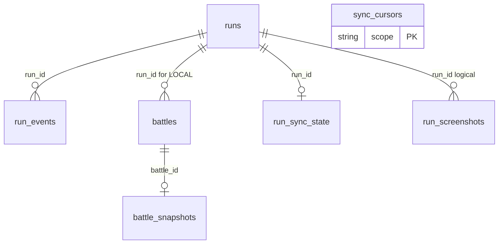

# SQLite And V3 Data Schema Reference

## Scope

This document describes the current storage model used by BazaarPlusPlus after the V3 run-bundle flow and JSON identity cleanup.

It covers:

1. Local client SQLite in `bazaarplusplus.db`
2. V3 server-side D1 projection tables in `ModCFServerV3`

Source of truth:

- `Game/RunLogging/Persistence/Sqlite/RunLogSqliteSchema.cs`
- `Game/RunLogging/Persistence/SqliteRunLogStore.cs`
- `Game/PvpBattles/Persistence/PvpBattleSqliteStore.cs`
- `Game/Screenshots/Persistence/RunScreenshotSqliteStore.cs`
- `Game/HistoryPanel/HistoryPanelRepository.cs`
- `Game/RunLogging/Upload/RunBundleUploadStore.cs`
- `ModCFServerV3/migrations/`
- `ModCFServerV3/src/features/v3/uploadRunBundle.ts`

## Local Client SQLite

- Database file: `<GameRoot>/BazaarPlusPlus/bazaarplusplus.db`
- Local schema version: `11`
- Row schema version: `11`
- Upload payload schema version: `1`
- Runtime pragmas include `foreign_keys = ON`, `user_version = 11`, `busy_timeout = 2000`, and WAL mode.

Current tables:

- `runs`
- `run_events`
- `battles`
- `battle_snapshots`
- `run_screenshots`
- `sync_cursors`
- `run_sync_state`

Older logical names like `run_checkpoints`, `run_status`, `pvp_battles`, `ghost_battles`, and `replay_sync_state` now map onto the tables above. They are not separate tables.



### `runs`

One row per locally observed run. It stores active-run state, checkpoint fields, terminal summary, and upload roots.

Key columns:

- `run_id TEXT PRIMARY KEY`
- `started_at_utc`, `last_seen_at_utc`, `status`, `completed`
- `hero`, `game_mode`, `seed`
- current state fields: `player_rank`, `player_rating`, `day`, `hour`, `max_health`, `prestige`, `level`, `income`, `gold`
- sequencing: `last_seq`
- terminal fields: `ended_at_utc`, `final_day`, `final_hour`, `victories`, `losses`, `final_player_rank`, `final_player_rating`, `final_player_rating_delta`, `reason`

Main write paths:

- `SqliteRunLogStore.CreateRun`
- `SqliteRunLogStore.AppendEvent`
- `SqliteRunLogStore.SaveCheckpoint`
- `SqliteRunLogStore.CompleteRun`
- `SqliteRunLogStore.MarkRunAbandoned`

### `run_events`

Append-only fact stream for a run.

Columns:

- `run_id TEXT NOT NULL`
- `seq INTEGER NOT NULL`
- `ts_utc TEXT NOT NULL`
- `kind TEXT NOT NULL`
- `payload_json TEXT NOT NULL`
- primary key: `(run_id, seq)`

The V3 upload path does not upload `run_events` directly. Upload projection comes from `runs`, `battles`, `battle_snapshots`, and replay payload files.

### `battles`

Unified local projection table for both locally captured PVP battles and remotely synced ghost battles.

Columns:

- identity: `battle_id`, `source`, `run_id`, `local_player_account_id`
- timing: `recorded_at_utc`, `day`, `hour`, `encounter_id`, `combat_kind`
- player side: `player_name`, `player_account_id`, `player_hero`, `player_rank`, `player_rating`, `player_level`
- opponent side: `opponent_name`, `opponent_account_id`, `opponent_hero`, `opponent_rank`, `opponent_rating`, `opponent_level`
- outcome: `result`, `winner_combatant_id`, `loser_combatant_id`
- bundle marker: `is_bundle_final_battle`
- replay state: `replay_available`, `replay_downloaded`, `has_local_payload`, `replay_dirty`, `replay_last_attempt_at_utc`, `replay_last_uploaded_at_utc`, `replay_retry_count`, `replay_last_error`
- sync/lifecycle: `last_synced_at_utc`, `deleted_at_utc`

Constraint:

```sql
CHECK (
    (source = 'LOCAL') OR
    (source = 'GHOST' AND run_id IS NULL)
)
```

Main write paths:

- `PvpBattleSqliteStore.Save`
- `HistoryPanelRepository.UpsertGhostBattles`
- `HistoryPanelRepository.MarkOldUndownloadedGhostBattlesDeleted`
- `HistoryPanelRepository.MarkGhostReplayDownloaded`
- `BattleReplaySyncStateStore.MarkReplayDirty`
- `RunBundleUploadStore.MarkRunUploaded`

### `battle_snapshots`

Stores the JSON card-set snapshots associated with a battle.

Columns:

- `battle_id TEXT PRIMARY KEY`
- `player_hand_json`
- `player_skills_json`
- `opponent_hand_json`
- `opponent_skills_json`

Used by local history preview rendering and run-bundle artifact construction.

### `run_screenshots`

Stores screenshot metadata. Current runtime writes end-of-run auto screenshots.

Columns:

- `screenshot_id TEXT PRIMARY KEY`
- `run_id TEXT NULL`
- `hero_name TEXT NULL`
- `battle_id TEXT NULL`
- `capture_source TEXT NOT NULL`
- `is_primary INTEGER NOT NULL DEFAULT 0`
- `image_relative_path TEXT NOT NULL`
- `captured_at_local TEXT NOT NULL`
- `captured_at_utc TEXT NOT NULL`
- `day INTEGER NULL`
- `player_rank TEXT NULL`
- `player_rating INTEGER NULL`
- `player_position INTEGER NULL`
- `victories_at_capture INTEGER NULL`

### `sync_cursors`

Generic key-value cursor table. Current use is ghost sync checkpoints.

Columns:

- `scope TEXT PRIMARY KEY`
- `cursor_value TEXT NOT NULL`
- `updated_at_utc TEXT NOT NULL`

### `run_sync_state`

Upload queue state for run-bundle uploads.

Columns:

- `run_id TEXT PRIMARY KEY`
- `dirty INTEGER NOT NULL`
- `uploaded_seq INTEGER NULL`
- `uploaded_status TEXT NULL`
- `last_attempt_at_utc TEXT NULL`
- `last_uploaded_at_utc TEXT NULL`
- `retry_count INTEGER NOT NULL DEFAULT 0`
- `last_error TEXT NULL`

### Local Indexes

```sql
CREATE INDEX IF NOT EXISTS idx_run_events_ts_utc
    ON run_events(ts_utc);

CREATE INDEX IF NOT EXISTS idx_runs_status_last_seen
    ON runs(status, last_seen_at_utc DESC);

CREATE INDEX IF NOT EXISTS idx_runs_started_at_utc
    ON runs(started_at_utc DESC);

CREATE INDEX IF NOT EXISTS idx_battles_run_id_recorded
    ON battles(run_id, recorded_at_utc DESC);

CREATE INDEX IF NOT EXISTS idx_battles_source_recorded
    ON battles(source, recorded_at_utc DESC);

CREATE INDEX IF NOT EXISTS idx_battles_local_player_recent
    ON battles(local_player_account_id, recorded_at_utc DESC);

CREATE INDEX IF NOT EXISTS idx_battles_replay_dirty
    ON battles(replay_dirty, replay_last_attempt_at_utc);

CREATE INDEX IF NOT EXISTS idx_run_sync_state_dirty
    ON run_sync_state(dirty, last_attempt_at_utc);

CREATE INDEX IF NOT EXISTS idx_run_screenshots_run_id_captured_at_utc
    ON run_screenshots(run_id, captured_at_utc DESC);

CREATE UNIQUE INDEX IF NOT EXISTS idx_run_screenshots_primary_run
    ON run_screenshots(run_id)
    WHERE is_primary = 1 AND run_id IS NOT NULL;
```

## V3 Upload Payload Model

The V3 upload request has three layers:

- `artifact_bytes`: gzip-compressed MessagePack blob, content type `application/x-bpp-runbundle+msgpack+gzip`
- `run_projection`: queryable run summary
- `battle_projections`: queryable battle metadata

`artifact_bytes` stores the raw replay payloads and card-set snapshots inside R2. SQL stores only metadata and query projections.
The server treats the last `battle_projection` in an accepted bundle as the bundle-final battle and writes `is_bundle_final_battle = 1` if that battle is projected into SQL.

## V3 Server D1 Schema

Current effective tables after all migrations:

- `users`
- `tokens`
- `run_bundles`
- `runs`
- `battles`
- `replay_tokens`

The original `installations`, `installation_sessions`, and `installation_observations` tables are dropped by `0002_auth_simplification.sql`. Some projection tables still retain an `installation_id` column for transition compatibility; current upload code writes the legacy value `legacy`.

### `users`

Player account table.

Columns:

- `player_account_id TEXT PRIMARY KEY`
- `player_username TEXT NOT NULL UNIQUE`
- `password_hash TEXT NOT NULL`
- optional stream fields: `stream_platform`, `stream_channel_id`, `stream_url`
- timestamps: `created_at_utc`, `updated_at_utc`, `last_login_at_utc`

### `tokens`

Bearer token table added by `0002_auth_simplification.sql`.

```sql
CREATE TABLE tokens (
  token              TEXT    PRIMARY KEY,
  player_account_id  TEXT    NOT NULL REFERENCES users(player_account_id),
  issued_at_utc      TEXT    NOT NULL,
  revoked_at_utc     TEXT    NULL,
  last_used_at_utc   TEXT    NULL
);

CREATE INDEX tokens_by_user ON tokens(player_account_id, revoked_at_utc);
```

### `run_bundles`

Metadata for uploaded artifact blobs.

Key columns:

- `bundle_id TEXT PRIMARY KEY`
- `installation_id TEXT NOT NULL`
- `player_account_id TEXT NOT NULL`
- `run_id TEXT NOT NULL`
- `payload_hash TEXT NOT NULL`
- `schema_version INTEGER NOT NULL`
- `object_key TEXT NOT NULL`
- `codec TEXT NOT NULL`
- `size_bytes INTEGER NOT NULL`
- `submitted_at_utc TEXT NOT NULL`
- `created_at_utc TEXT NOT NULL`

Current upload behavior:

- `bundle_id` is deterministically the `run_id`
- `installation_id` is written as `legacy`
- object key shape is `run-bundles/<player>/<run>/<hash>.mpack.gz`

### `runs` Server Projection

Queryable summary for uploaded runs.

Key columns:

- `run_id TEXT PRIMARY KEY`
- `installation_id TEXT NOT NULL`
- `player_account_id TEXT NOT NULL`
- `bundle_id TEXT NOT NULL`
- `status TEXT NOT NULL`
- hero/rating fields: `hero_id`, `hero_name`, `player_rank`, `player_rating`, `player_position`
- timing/final fields: `started_at_utc`, `ended_at_utc`, `final_day`, `final_wins`, `final_losses`, `final_player_rank`, `final_player_rating`, `final_player_position`
- `updated_at_utc TEXT NOT NULL`

### `battles` Server Projection

Queryable battle projection used by `GET /ghost-battles`.

Key columns:

- `battle_id TEXT PRIMARY KEY`
- `run_id TEXT NOT NULL`
- `installation_id TEXT NOT NULL`
- `player_account_id TEXT NOT NULL`
- `bundle_id TEXT NOT NULL`
- `recorded_at_utc TEXT NOT NULL`
- `day INTEGER NULL`
- uploader side: `player_name`, `player_account_id_in_payload`, `player_hero`, `player_rank`, `player_rating`, `player_level`
- opponent side: `opponent_name`, `opponent_account_id`, `opponent_hero`, `opponent_rank`, `opponent_rating`, `opponent_level`
- `result TEXT NULL`
- `is_bundle_final_battle INTEGER NOT NULL DEFAULT 0`
- `replay_available INTEGER NOT NULL`
- `updated_at_utc TEXT NOT NULL`

`player_account_id` is row ownership, while `player_account_id_in_payload` is the account id carried inside the uploaded battle projection.

### `replay_tokens`

Short-lived replay download links.

Columns:

- `token TEXT PRIMARY KEY`
- `battle_id TEXT NOT NULL`
- `requested_by_player_account_id TEXT NOT NULL`
- `expires_at_utc TEXT NOT NULL`
- `created_at_utc TEXT NOT NULL`
- `used_at_utc TEXT NULL`
- `revoked_at_utc TEXT NULL`

### Server Indexes

```sql
CREATE INDEX tokens_by_user
  ON tokens(player_account_id, revoked_at_utc);

CREATE INDEX IF NOT EXISTS idx_battles_opponent_recorded_covering
  ON battles(
    opponent_account_id,
    recorded_at_utc DESC,
    battle_id DESC,
    day,
    player_name,
    player_account_id_in_payload,
    player_hero,
    player_rank,
    player_rating,
    player_level,
    opponent_name,
    opponent_hero,
    opponent_rank,
    opponent_rating,
    opponent_level,
    result,
    replay_available,
    is_bundle_final_battle
  );

CREATE INDEX IF NOT EXISTS idx_run_bundles_submitted_at
  ON run_bundles (submitted_at_utc, bundle_id);

CREATE INDEX IF NOT EXISTS idx_runs_ended_at
  ON runs (ended_at_utc, run_id);

CREATE INDEX IF NOT EXISTS idx_run_bundles_created_at
  ON run_bundles (created_at_utc, bundle_id);

CREATE INDEX IF NOT EXISTS idx_runs_updated_at
  ON runs (updated_at_utc, run_id);
```

## Practical Summary

- Local SQLite is the client-side capture and projection cache.
- Local replay payload files are the heavy binary source for replay.
- V3 upload packages local run and battle state into one artifact plus lightweight SQL projections.
- Server SQL is for lookup and authorization. The uploaded artifact body lives in R2.
- Current auth is bearer-token based through `tokens`, not installation-signature based.
- `is_bundle_final_battle` is a server-computed projection flag carried through ghost sync so `HistoryPanel` can explain final-battle elimination outcomes without reading sibling battles or R2 artifacts.
