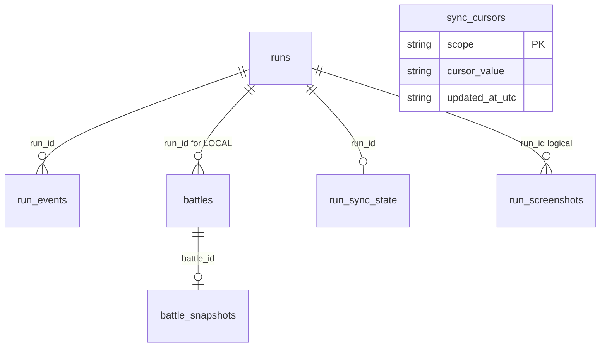

# SQLite Schema Reference

## Scope

This document describes the storage model used by BazaarPlusPlus after the V4 run-bundle flow.

It covers:

1. Local client SQLite in `bazaarplusplus.db`
2. V4 server-side D1 projection tables (in the separate `bazaarplusplus-server` repo)

Source of truth:

- `Storage/RunLog/RunLogSchema.cs`
- `Storage/RunLog/RunLogStore.cs`
- `Game/PvpBattles/Persistence/PvpBattleSqliteStore.cs`
- `Storage/RunScreenshot/RunScreenshotSqliteStore.cs`
- `Game/CombatReplay/Video/CombatReplayVideoMetadataStore.cs`
- `Game/Screenshots/Upload/BazaarDbSnapshotUploadStore.cs`
- `Game/HistoryPanel/Storage/HistoryPanelRepository.cs`
- `Game/RunLogging/Upload/RunBundleUploadStore.cs`
- `bazaarplusplus-server/migrations/0001_v4_initial.sql`
- `bazaarplusplus-server/src/features/runBundles/upload.ts`

## Local Client SQLite

- Database file: `<GameRoot>/BazaarPlusPlusV4/bazaarplusplus.db`
- Local schema version: `15` (`RunLogSchema.LocalDatabaseSchemaVersion`)
- Row schema version: `11`
- Upload payload schema version: `1`
- Runtime pragmas include `foreign_keys = ON`, `user_version = 15`, `busy_timeout = 2000`, and WAL mode.

> Version history: `v11→v12` added the `combat_replay_videos` table; `v13` added the BazaarDB upload sidecar; `v14` added battle-time player/opponent prestige and victories to `battles`; `v15` renamed the sidecar to `bazaardb_snapshot_uploads` with `snapshot_id`. The bootstrap is a single `CREATE TABLE IF NOT EXISTS` pass (`RunLogSchema.BootstrapSql`), so a fresh database is created directly at the current version rather than migrated step by step.

Current tables:

- `runs`
- `run_events`
- `battles`
- `battle_snapshots`
- `run_screenshots`
- `combat_replay_videos`
- `sync_cursors`
- `run_sync_state`
- `bazaardb_snapshot_uploads`

Older logical names like `run_checkpoints`, `run_status`, `pvp_battles`, `ghost_battles`, and `replay_sync_state` now map onto the tables above. They are not separate tables.



### `runs`

One row per locally observed run. It stores active-run state, checkpoint fields, terminal summary, and upload roots.

Key columns:

- `run_id TEXT PRIMARY KEY`
- `started_at_utc`, `last_seen_at_utc`, `status`, `completed`
- `hero`, `game_mode`, `seed`
- current state fields: `player_rank`, `player_rating`, `day`, `hour`, `max_health`, `prestige`, `level`, `income`, `gold`
- sequencing: `last_seq`
- terminal fields: `ended_at_utc`, `final_day`, `final_hour`, `victories`, `losses`, `final_player_rank`, `final_player_rating`, `final_player_rating_delta`, `reason`

Main write paths:

- `SqliteRunLogStore.CreateRun`
- `SqliteRunLogStore.AppendEvent`
- `SqliteRunLogStore.SaveCheckpoint`
- `SqliteRunLogStore.CompleteRun`
- `SqliteRunLogStore.MarkRunAbandoned`

### `run_events`

Append-only fact stream for a run.

Columns:

- `run_id TEXT NOT NULL`
- `seq INTEGER NOT NULL`
- `ts_utc TEXT NOT NULL`
- `kind TEXT NOT NULL`
- `payload_json TEXT NOT NULL`
- primary key: `(run_id, seq)`

The upload path does not upload `run_events` directly. Upload projection comes from `runs`, `battles`, `battle_snapshots`, and replay payload files.

### `battles`

Unified local projection table for both locally captured PVP battles and remotely synced ghost battles.

Columns:

- identity: `battle_id`, `source`, `run_id`, `local_player_account_id`
- timing: `recorded_at_utc`, `day`, `hour`, `encounter_id`, `combat_kind`
- player side: `player_name`, `player_account_id`, `player_hero`, `player_rank`, `player_rating`, `player_level`, `player_prestige`, `player_victories`
- opponent side: `opponent_name`, `opponent_account_id`, `opponent_hero`, `opponent_rank`, `opponent_rating`, `opponent_level`, `opponent_prestige`, `opponent_victories`
- outcome: `result`, `winner_combatant_id`, `loser_combatant_id`
- bundle marker: `is_bundle_final_battle` — this is a **local column**. Current V4 API does not upload or return a final-battle wire field.
- replay state: `replay_available`, `replay_downloaded`, `has_local_payload`, `replay_dirty`, `replay_last_attempt_at_utc`, `replay_last_uploaded_at_utc`, `replay_retry_count`, `replay_last_error`
- sync/lifecycle: `last_synced_at_utc`, `deleted_at_utc`

Constraint:

```sql
CHECK (
    (source = 'LOCAL') OR
    (source = 'GHOST' AND run_id IS NULL)
)
```

Main write paths:

- `PvpBattleSqliteStore.Save`
- `HistoryPanelRepository.UpsertGhostBattles`
- `HistoryPanelRepository.MarkOldUndownloadedGhostBattlesDeleted`
- `HistoryPanelRepository.MarkGhostReplayDownloaded`
- `BattleReplaySyncStateStore.MarkReplayDirty`
- `RunBundleUploadStore.MarkRunUploaded`

### `battle_snapshots`

Stores the JSON card-set snapshots associated with a battle.

Columns:

- `battle_id TEXT PRIMARY KEY`
- `player_hand_json`
- `player_skills_json`
- `opponent_hand_json`
- `opponent_skills_json`

Used by local history preview rendering and run-bundle artifact construction.

### `run_screenshots`

Stores screenshot metadata. Current runtime writes end-of-run auto screenshots.

Columns:

- `screenshot_id TEXT PRIMARY KEY`
- `run_id TEXT NULL`
- `hero_name TEXT NULL`
- `battle_id TEXT NULL`
- `capture_source TEXT NOT NULL`
- `is_primary INTEGER NOT NULL DEFAULT 0`
- `image_relative_path TEXT NOT NULL`
- `captured_at_local TEXT NOT NULL`
- `captured_at_utc TEXT NOT NULL`
- `day INTEGER NULL`
- `player_rank TEXT NULL`
- `player_rating INTEGER NULL`
- `player_position INTEGER NULL`
- `victories_at_capture INTEGER NULL`

### `combat_replay_videos`

Stores metadata for MP4 video recordings of saved combat replay playback. The MP4 files themselves live under `<GameRoot>/BazaarPlusPlusV4/CombatReplayVideos/<yyyy-MM-dd>/`; this table indexes them. Only present once at least one combat replay has been recorded via the HistoryPanel "Record and Replay" button.

Columns:

- `video_id TEXT PRIMARY KEY`
- `battle_id TEXT NOT NULL` — implicit reference to `battles.battle_id` (no FK to keep ghost replays insertable when the battle row hasn't been persisted)
- `source TEXT NOT NULL` — `LocalSaved` or `ImportedGhost`
- `video_relative_path TEXT NOT NULL` — relative to `<GameRoot>/BazaarPlusPlusV4/CombatReplayVideos/`
- `width INTEGER NOT NULL`
- `height INTEGER NOT NULL`
- `fps INTEGER NOT NULL`
- `codec TEXT NOT NULL` — currently always `libx264`
- `crf INTEGER NULL`
- `preset TEXT NULL`
- `started_at_utc TEXT NOT NULL`
- `ended_at_utc TEXT NULL`
- `duration_ms INTEGER NULL`
- `captured_frames INTEGER NOT NULL DEFAULT 0`
- `dropped_frames INTEGER NOT NULL DEFAULT 0`
- `file_size_bytes INTEGER NULL`
- `status TEXT NOT NULL` — `RECORDING`, `COMPLETED`, or `FAILED`
- `error TEXT NULL`

Write paths:

- `CombatReplayVideoMetadataStore.SaveStart` — inserts a `RECORDING` row when playback begins.
- `CombatReplayVideoMetadataStore.SaveFinish` — updates the row to `COMPLETED` or `FAILED` when playback ends.

### `sync_cursors`

Generic key-value cursor table. Current use is ghost sync checkpoints.

Columns:

- `scope TEXT PRIMARY KEY`
- `cursor_value TEXT NOT NULL`
- `updated_at_utc TEXT NOT NULL`

### `run_sync_state`

Upload queue state for run-bundle uploads.

Columns:

- `run_id TEXT PRIMARY KEY`
- `dirty INTEGER NOT NULL`
- `uploaded_seq INTEGER NULL`
- `uploaded_status TEXT NULL`
- `last_attempt_at_utc TEXT NULL`
- `last_uploaded_at_utc TEXT NULL`
- `retry_count INTEGER NOT NULL DEFAULT 0`
- `last_error TEXT NULL`

### `bazaardb_snapshot_uploads`

Sidecar upload-queue table for the optional BazaarDB snapshot upload feature (`BazaarDB / UploadScreenshots`). One row per `run_screenshots` row that has been (or is being) pushed to `bazaarplusplus-server` as a Snapshot DTO. Only present once the feature has been enabled at least once; rows are backfilled for every existing `capture_source = 'end_of_run_auto'` screenshot via `INSERT OR IGNORE`, so flipping the switch on uploads historical screenshots too.

Columns:

- `snapshot_id TEXT PRIMARY KEY` — references `run_screenshots.screenshot_id` (`ON DELETE CASCADE`)
- `status TEXT NOT NULL` — `pending`, `uploaded`, or `permanent_failure`
- `attempts INTEGER NOT NULL DEFAULT 0`
- `last_attempted_at_utc TEXT NULL`
- `last_error TEXT NULL`
- `uploaded_at_utc TEXT NULL`

Write path: `Game/Screenshots/Upload/BazaarDbSnapshotUploadStore.cs` (`MarkUploaded` → `uploaded`; 4xx except 408/429 → `permanent_failure`; 5xx / network errors stay `pending` for retry).

### Local Indexes

```sql
CREATE INDEX IF NOT EXISTS idx_run_events_ts_utc
    ON run_events(ts_utc);

CREATE INDEX IF NOT EXISTS idx_runs_status_last_seen
    ON runs(status, last_seen_at_utc DESC);

CREATE INDEX IF NOT EXISTS idx_runs_started_at_utc
    ON runs(started_at_utc DESC);

CREATE INDEX IF NOT EXISTS idx_battles_run_id_recorded
    ON battles(run_id, recorded_at_utc DESC);

CREATE INDEX IF NOT EXISTS idx_battles_source_recorded
    ON battles(source, recorded_at_utc DESC);

CREATE INDEX IF NOT EXISTS idx_battles_local_player_recent
    ON battles(local_player_account_id, recorded_at_utc DESC);

CREATE INDEX IF NOT EXISTS idx_battles_replay_dirty
    ON battles(replay_dirty, replay_last_attempt_at_utc);

CREATE INDEX IF NOT EXISTS idx_run_sync_state_dirty
    ON run_sync_state(dirty, last_attempt_at_utc);

CREATE INDEX IF NOT EXISTS idx_run_sync_state_dirty_retry
    ON run_sync_state(dirty, retry_count, last_attempt_at_utc, run_id);

CREATE INDEX IF NOT EXISTS idx_battles_source_run_recorded
    ON battles(source, run_id, recorded_at_utc ASC, battle_id ASC);

CREATE INDEX IF NOT EXISTS idx_run_screenshots_run_id_captured_at_utc
    ON run_screenshots(run_id, captured_at_utc DESC);

CREATE INDEX IF NOT EXISTS idx_run_screenshots_source_captured
    ON run_screenshots(capture_source, captured_at_utc ASC, screenshot_id ASC);

CREATE UNIQUE INDEX IF NOT EXISTS idx_run_screenshots_primary_run
    ON run_screenshots(run_id)
    WHERE is_primary = 1 AND run_id IS NOT NULL;

CREATE INDEX IF NOT EXISTS idx_combat_replay_videos_battle
    ON combat_replay_videos(battle_id, started_at_utc DESC);

CREATE INDEX IF NOT EXISTS idx_bazaardb_snapshot_uploads_status
    ON bazaardb_snapshot_uploads(status);
```

## V5 Run Bundle Upload Payload Model

The V5 run-bundle upload is multipart and has three logical layers:

- `metadata` part: JSON with `schema_version = 5`, `player_account_id`, `submitted_at_utc`, `artifact_codec`, `run_projection`, and `battle_projections[]`
- `artifact` part: raw gzip-compressed MessagePack blob, content type `application/x-bpp-runbundle+msgpack+gzip`
- local upload queues: `run_sync_state` and `bazaardb_snapshot_uploads` drive background retries

R2 stores the raw artifact bytes. D1 stores only metadata and query projections. Current V5 run-bundle uploads use top-level `battle_projections[]` for battle metadata and do not carry a final-battle marker; the old JSON `artifact_bytes` field is no longer emitted by the mod.

## V4 Server D1 Schema

The V4 server schema lives in a separate repo (`bazaarplusplus-server`) and is the single source of truth — do **not** duplicate the column lists here, they drift. Effective tables:

- `runs` — collapsed `run_bundles + runs` (V3 had two; V4 has one)
- `battles` — projection for `GET /ghost-battles`
- `bazaardb_delivery` — BazaarDB Snapshot DTO delivery queue

V4 explicitly removed (vs V3): `run_bundles` table, `replay_tokens` table, all `installation_id` columns, `battles.player_account_id_in_payload`, `battles.replay_available`, and the former `seen_player_accounts` opponent filter. The current wire contract also omits the battle bundle-final flag; any retained D1 column is schema residue, not API contract.

Authoritative references:

- DDL: [`bazaarplusplus-server/migrations/0001_v4_initial.sql`](../../../bazaarplusplus-server/migrations/0001_v4_initial.sql)
- Wire contract: [`bazaarplusplus-server/docs/api-reference.md`](../../../bazaarplusplus-server/docs/api-reference.md)
- Upload write path: [`bazaarplusplus-server/src/features/runBundles/upload.ts`](../../../bazaarplusplus-server/src/features/runBundles/upload.ts)
- Ghost query: [`bazaarplusplus-server/src/features/ghostBattles/query.ts`](../../../bazaarplusplus-server/src/features/ghostBattles/query.ts)

## Practical Summary

- Local SQLite is the client-side capture and projection cache.
- Local replay payload files are the heavy binary source for replay.
- Run-bundle upload packages local run + battle state into one MessagePack artifact (to R2) plus lightweight SQL projections written via `db.batch()` (`runs` insert + per-battle ON CONFLICT upsert).
- Server SQL is for lookup; the uploaded artifact body lives in R2 and is served via short-lived presigned URLs from `POST /ghost-battles/:battle_id/replay-link`.
- The server is fully unauthenticated for mod-side endpoints; identity comes from `player_account_id` in `POST /run-bundles` bodies and `GET /ghost-battles` query strings. The server fully ingests valid battle projections, and ghost sync filters by `opponent_account_id`.
- Current V4 ghost sync does not carry a final-battle marker, so remote imports leave the local `is_bundle_final_battle` marker false.
- BazaarDB pull endpoints (`POST /bazaardb/peek` and `POST /bazaardb/confirm`) require a Bearer token (`BAZAARDB_PULL_TOKEN`). Snapshot DTOs live in private R2 and are exposed to BazaarDB only through short-lived presigned URLs returned by `peek`; `confirm` marks delivered rows done and deletes the corresponding R2 object best-effort.
