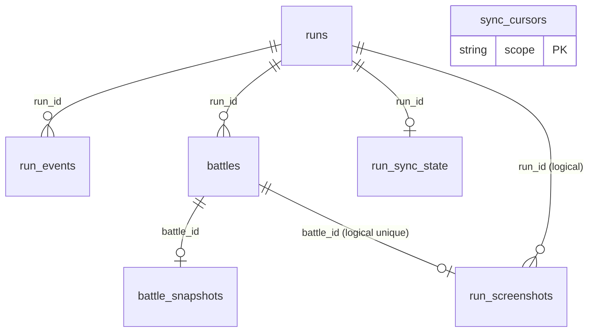

# SQLite And V3 Data Schema Reference

## Scope

This document describes the current data model used by BazaarPlusPlus as of the V3 run-bundle flow.

It covers two separate storage layers:

1. Local client storage in `bazaarplusplus.db`
2. V3 server-side projection tables in `ModCFServerV3`

These two layers have different responsibilities:

- The local SQLite database is the source of truth for in-game capture, local history UI, screenshot metadata, ghost sync state, and upload staging.
- The V3 service stores uploaded run-bundle artifacts in object storage and keeps query-friendly projection tables in SQL.

## Source Of Truth

Current facts in this document come from:

- `Game/RunLogging/Persistence/Sqlite/RunLogSqliteSchema.cs`
- `Game/RunLogging/Persistence/SqliteRunLogStore.cs`
- `Game/PvpBattles/Persistence/PvpBattleSqliteStore.cs`
- `Game/Screenshots/Persistence/RunScreenshotSqliteStore.cs`
- `Game/HistoryPanel/HistoryPanelRepository.cs`
- `Game/RunLogging/Upload/RunBundleUploadStore.cs`
- `Game/Online/Models/RunBundleUploadRequestV3.cs`
- `Game/Online/V3RunBundleArtifactCodec.cs`
- `ModCFServerV3/migrations/0001_initial_schema.sql`
- `ModCFServerV3/src/features/v3/uploadRunBundle.ts`

## Part 1: Local Client SQLite

### Overview

- Database file: `bazaarplusplus.db`
- Default path: `<GameRoot>/BazaarPlusPlus/bazaarplusplus.db`
- Local schema version: `9`
- Row schema version: `9`
- Upload payload schema version: `1`
- Runtime pragmas:
  - `PRAGMA foreign_keys = ON`
  - `PRAGMA user_version = 9`
  - `PRAGMA busy_timeout = 2000`
  - `PRAGMA journal_mode = WAL`

### Current Local Tables

- `runs`
- `run_events`
- `battles`
- `battle_snapshots`
- `run_screenshots`
- `sync_cursors`
- `run_sync_state`

### Important Model Notes

- Older docs and older code paths referred to logical names like `run_checkpoints`, `run_status`, `pvp_battles`, `ghost_battles`, and `replay_sync_state`.
- In the current implementation, those are no longer separate tables.
- Their data is now folded into `runs`, `battles`, or `sync_cursors`.

### Relationship Summary



### Table: `runs`

Role:

- One row per locally observed run
- Stores active-run state, final run summary, and fields previously split across checkpoint/status tables
- Acts as the root row for run uploads and history UI

DDL:

```sql
CREATE TABLE IF NOT EXISTS runs (
    run_id TEXT PRIMARY KEY,
    started_at_utc TEXT NOT NULL,
    last_seen_at_utc TEXT NOT NULL,
    status TEXT NOT NULL,
    completed INTEGER NOT NULL DEFAULT 0,
    hero TEXT NOT NULL,
    game_mode TEXT NOT NULL,
    seed INTEGER NULL,
    player_rank TEXT NULL,
    player_rating INTEGER NULL,
    day INTEGER NULL,
    hour INTEGER NULL,
    max_health INTEGER NULL,
    prestige INTEGER NULL,
    level INTEGER NULL,
    income INTEGER NULL,
    gold INTEGER NULL,
    last_seq INTEGER NOT NULL DEFAULT 0,
    ended_at_utc TEXT NULL,
    final_day INTEGER NULL,
    final_hour INTEGER NULL,
    victories INTEGER NULL,
    losses INTEGER NULL,
    final_player_rank TEXT NULL,
    final_player_rating INTEGER NULL,
    final_player_rating_delta INTEGER NULL,
    reason TEXT NULL
);
```

Fields:

| Column | Type | Null | Meaning |
| --- | --- | --- | --- |
| `run_id` | `TEXT` | No | Stable run identifier. Primary key. |
| `started_at_utc` | `TEXT` | No | Run start timestamp in ISO-8601 UTC string form. |
| `last_seen_at_utc` | `TEXT` | No | Latest time the local client observed this run state. |
| `status` | `TEXT` | No | Current or terminal run status. Typical values are `active`, `completed`, `abandoned`. |
| `completed` | `INTEGER` | No | Boolean flag stored as `0/1`. `1` means the run has terminal state. |
| `hero` | `TEXT` | No | Hero name captured for the run. |
| `game_mode` | `TEXT` | No | Game mode for the run. |
| `seed` | `INTEGER` | Yes | Run seed when available. |
| `player_rank` | `TEXT` | Yes | Player rank observed near run start. |
| `player_rating` | `INTEGER` | Yes | Player rating observed near run start. |
| `day` | `INTEGER` | Yes | Latest known run day while active, or final day when completed. |
| `hour` | `INTEGER` | Yes | Latest known run hour while active, or final hour when completed. |
| `max_health` | `INTEGER` | Yes | Latest or final max health captured from player stats. |
| `prestige` | `INTEGER` | Yes | Latest or final prestige value. |
| `level` | `INTEGER` | Yes | Latest or final player level. |
| `income` | `INTEGER` | Yes | Latest or final income value. |
| `gold` | `INTEGER` | Yes | Latest or final gold value. |
| `last_seq` | `INTEGER` | No | Highest `run_events.seq` persisted for this run. |
| `ended_at_utc` | `TEXT` | Yes | Terminal timestamp for completed or abandoned runs. |
| `final_day` | `INTEGER` | Yes | Final day at run exit. |
| `final_hour` | `INTEGER` | Yes | Final hour at run exit. |
| `victories` | `INTEGER` | Yes | Final win count. |
| `losses` | `INTEGER` | Yes | Final loss count. |
| `final_player_rank` | `TEXT` | Yes | Player rank at run end. |
| `final_player_rating` | `INTEGER` | Yes | Player rating at run end. |
| `final_player_rating_delta` | `INTEGER` | Yes | Final rating minus initial rating when resolvable. |
| `reason` | `TEXT` | Yes | Terminal reason such as `run_state_exit`, `run_interrupted`, or another completion/abandonment reason. |

Write paths:

- `SqliteRunLogStore.CreateRun`
- `SqliteRunLogStore.AppendEvent`
- `SqliteRunLogStore.SaveCheckpoint`
- `SqliteRunLogStore.CompleteRun`
- `SqliteRunLogStore.MarkRunAbandoned`

Read paths:

- active run restore
- history panel run list
- run bundle upload staging

### Table: `run_events`

Role:

- Append-only event log for each run
- Keeps the fact stream used for debugging, export, and future derivations
- Not uploaded directly in the V3 bundle request
- Currently acts as a lightweight timeline, not as the primary source for history UI or V3 server projections

DDL:

```sql
CREATE TABLE IF NOT EXISTS run_events (
    run_id TEXT NOT NULL,
    seq INTEGER NOT NULL,
    ts_utc TEXT NOT NULL,
    kind TEXT NOT NULL,
    payload_json TEXT NOT NULL,
    PRIMARY KEY (run_id, seq),
    FOREIGN KEY (run_id) REFERENCES runs(run_id) ON DELETE CASCADE
);
```

Fields:

| Column | Type | Null | Meaning |
| --- | --- | --- | --- |
| `run_id` | `TEXT` | No | Parent run id. Foreign key to `runs.run_id`. |
| `seq` | `INTEGER` | No | Monotonic per-run event sequence number. |
| `ts_utc` | `TEXT` | No | Event timestamp in ISO-8601 UTC string form. |
| `kind` | `TEXT` | No | Event type name. |
| `payload_json` | `TEXT` | No | Full serialized event payload in snake_case JSON. |

Write path:

- `SqliteRunLogStore.AppendEvent`

Read paths:

- export/debug flows
- any future replay or analysis logic that wants the raw event stream

Current practical status:

- The current runtime writes only a small subset of event kinds into this table.
- In practice it is mainly used to preserve a local fact trail such as run start, run resume, and local PVP-combat capture markers.
- The history panel does not read from `run_events`.
- The V3 upload path does not upload `run_events` rows directly.
- The authoritative inputs for V3 upload are `runs`, `battles`, `battle_snapshots`, and replay payload files on disk.
- `run_events` should be understood as local diagnostic/timeline data that is useful to keep, but is no longer the core projection table for the modern V3 flow.

### Table: `battles`

Role:

- Unified local projection table for both locally captured battles and remotely synced ghost battles
- Replaces older logical tables such as `pvp_battles`, `ghost_battles`, and replay sync state
- Stores upload state for local battle replay payloads

DDL:

```sql
CREATE TABLE IF NOT EXISTS battles (
    battle_id TEXT PRIMARY KEY,
    source TEXT NOT NULL,
    run_id TEXT NULL,
    local_player_account_id TEXT NULL,
    recorded_at_utc TEXT NOT NULL,
    day INTEGER NULL,
    hour INTEGER NULL,
    encounter_id TEXT NULL,
    combat_kind TEXT NOT NULL,
    player_name TEXT NULL,
    player_account_id TEXT NULL,
    player_hero TEXT NULL,
    player_rank TEXT NULL,
    player_rating INTEGER NULL,
    player_level INTEGER NULL,
    opponent_name TEXT NULL,
    opponent_account_id TEXT NULL,
    opponent_hero TEXT NULL,
    opponent_rank TEXT NULL,
    opponent_rating INTEGER NULL,
    opponent_level INTEGER NULL,
    result TEXT NULL,
    winner_combatant_id TEXT NULL,
    loser_combatant_id TEXT NULL,
    replay_available INTEGER NOT NULL DEFAULT 0,
    replay_downloaded INTEGER NOT NULL DEFAULT 0,
    has_local_payload INTEGER NOT NULL DEFAULT 0,
    replay_dirty INTEGER NOT NULL DEFAULT 0,
    replay_last_attempt_at_utc TEXT NULL,
    replay_last_uploaded_at_utc TEXT NULL,
    replay_retry_count INTEGER NOT NULL DEFAULT 0,
    replay_last_error TEXT NULL,
    last_synced_at_utc TEXT NULL,
    deleted_at_utc TEXT NULL,
    FOREIGN KEY (run_id) REFERENCES runs(run_id) ON DELETE CASCADE,
    CHECK (
        (source = 'LOCAL') OR
        (source = 'GHOST' AND run_id IS NULL)
    )
);
```

Fields:

| Column | Type | Null | Meaning |
| --- | --- | --- | --- |
| `battle_id` | `TEXT` | No | Stable battle identifier. Primary key. |
| `source` | `TEXT` | No | Battle source. Current values are `LOCAL` and `GHOST`. |
| `run_id` | `TEXT` | Yes | Parent run id for local battles. Must be `NULL` for ghost rows. |
| `local_player_account_id` | `TEXT` | Yes | Local player account id used for ghost sync scoping. |
| `recorded_at_utc` | `TEXT` | No | Battle timestamp in ISO-8601 UTC string form. |
| `day` | `INTEGER` | Yes | Day at which the battle occurred. |
| `hour` | `INTEGER` | Yes | Hour at which the battle occurred. |
| `encounter_id` | `TEXT` | Yes | Encounter id if available. |
| `combat_kind` | `TEXT` | No | Combat type such as `PVPCombat`. |
| `player_name` | `TEXT` | Yes | Player display name from the manifest. |
| `player_account_id` | `TEXT` | Yes | Player account id from the manifest payload. |
| `player_hero` | `TEXT` | Yes | Player hero name. |
| `player_rank` | `TEXT` | Yes | Player rank at battle time. |
| `player_rating` | `INTEGER` | Yes | Player rating at battle time. |
| `player_level` | `INTEGER` | Yes | Player level at battle time. |
| `opponent_name` | `TEXT` | Yes | Opponent display name. |
| `opponent_account_id` | `TEXT` | Yes | Opponent account id. |
| `opponent_hero` | `TEXT` | Yes | Opponent hero name. |
| `opponent_rank` | `TEXT` | Yes | Opponent rank. |
| `opponent_rating` | `INTEGER` | Yes | Opponent rating. |
| `opponent_level` | `INTEGER` | Yes | Opponent level. |
| `result` | `TEXT` | Yes | Battle result such as `win` or `loss`. |
| `winner_combatant_id` | `TEXT` | Yes | Winner combatant id from the manifest. |
| `loser_combatant_id` | `TEXT` | Yes | Loser combatant id from the manifest. |
| `replay_available` | `INTEGER` | No | Boolean `0/1`. For ghost rows this means server replay availability. |
| `replay_downloaded` | `INTEGER` | No | Boolean `0/1`. Tracks whether a ghost replay payload has been downloaded locally. |
| `has_local_payload` | `INTEGER` | No | Boolean `0/1`. Set for local rows that have a corresponding replay payload file on disk. |
| `replay_dirty` | `INTEGER` | No | Boolean `0/1`. Marks local battle payloads that still need upload-state reconciliation. |
| `replay_last_attempt_at_utc` | `TEXT` | Yes | Last replay upload attempt time for local battles. |
| `replay_last_uploaded_at_utc` | `TEXT` | Yes | Last successful replay-related upload time for local battles. |
| `replay_retry_count` | `INTEGER` | No | Number of replay upload retries. |
| `replay_last_error` | `TEXT` | Yes | Last replay upload error string. |
| `last_synced_at_utc` | `TEXT` | Yes | Last ghost manifest sync timestamp. |
| `deleted_at_utc` | `TEXT` | Yes | Soft-delete timestamp used for expiring stale undownloaded ghost rows. |

Write paths:

- `PvpBattleSqliteStore.Save` for local battle manifests
- `HistoryPanelRepository.UpsertGhostBattles` for ghost manifests
- `HistoryPanelRepository.MarkOldUndownloadedGhostBattlesDeleted`
- `HistoryPanelRepository.MarkGhostReplayDownloaded`
- `BattleReplaySyncStateStore.MarkReplayDirty`
- `RunBundleUploadStore.MarkRunUploaded` for replay sync fields

Read paths:

- history panel local battle list
- history panel ghost battle list
- run bundle upload staging

### Table: `battle_snapshots`

Role:

- Stores the JSON card-set snapshots associated with a battle row
- Used both for local history preview rendering and for artifact construction

DDL:

```sql
CREATE TABLE IF NOT EXISTS battle_snapshots (
    battle_id TEXT PRIMARY KEY,
    player_hand_json TEXT NOT NULL,
    player_skills_json TEXT NOT NULL,
    opponent_hand_json TEXT NOT NULL,
    opponent_skills_json TEXT NOT NULL,
    FOREIGN KEY (battle_id) REFERENCES battles(battle_id) ON DELETE CASCADE
);
```

Fields:

| Column | Type | Null | Meaning |
| --- | --- | --- | --- |
| `battle_id` | `TEXT` | No | Parent battle id. Primary key and foreign key to `battles.battle_id`. |
| `player_hand_json` | `TEXT` | No | Serialized player item-hand card-set capture. |
| `player_skills_json` | `TEXT` | No | Serialized player skill card-set capture. |
| `opponent_hand_json` | `TEXT` | No | Serialized opponent item-hand card-set capture. |
| `opponent_skills_json` | `TEXT` | No | Serialized opponent skill card-set capture. |

Write path:

- `PvpBattleSqliteStore.Save`

Read paths:

- `PvpBattleSqliteStore.TryLoad`
- `PvpBattleSqliteStore.ListRecentBattles`
- `PvpBattleSqliteStore.ListByRunId`
- `HistoryPanelRepository`
- `RunBundleUploadStore`

### Table: `run_screenshots`

Role:

- Stores metadata for screenshots captured by the mod
- Separate from battle replay payloads and separate from V3 upload state

DDL:

```sql
CREATE TABLE IF NOT EXISTS run_screenshots (
    screenshot_id TEXT PRIMARY KEY,
    run_id TEXT NULL,
    battle_id TEXT NULL,
    capture_source TEXT NOT NULL,
    is_primary INTEGER NOT NULL DEFAULT 0,
    image_relative_path TEXT NOT NULL,
    captured_at_local TEXT NOT NULL,
    captured_at_utc TEXT NOT NULL,
    day INTEGER NULL,
    player_rank TEXT NULL,
    player_rating INTEGER NULL,
    player_position INTEGER NULL,
    victories_at_capture INTEGER NULL
);
```

Fields:

| Column | Type | Null | Meaning |
| --- | --- | --- | --- |
| `screenshot_id` | `TEXT` | No | Screenshot identifier. Primary key. |
| `run_id` | `TEXT` | Yes | Associated run id when known. |
| `battle_id` | `TEXT` | Yes | Associated battle id when the screenshot is battle-scoped. |
| `capture_source` | `TEXT` | No | Source such as `manual_f9`, `settings_dock_camera_button`, `pvp_battle_start`, `end_of_run_auto`. |
| `is_primary` | `INTEGER` | No | Boolean `0/1`. Marks the primary screenshot for a run. |
| `image_relative_path` | `TEXT` | No | Relative path under the screenshot root. |
| `captured_at_local` | `TEXT` | No | Local timestamp string. |
| `captured_at_utc` | `TEXT` | No | UTC timestamp string. |
| `day` | `INTEGER` | Yes | Day at capture time. |
| `player_rank` | `TEXT` | Yes | Player rank at capture time. |
| `player_rating` | `INTEGER` | Yes | Player rating at capture time. |
| `player_position` | `INTEGER` | Yes | Player leaderboard position at capture time when the client cache can resolve it. |
| `victories_at_capture` | `INTEGER` | Yes | Victory count at capture time. |

Write path:

- `RunScreenshotSqliteStore.Save`

Read paths:

- screenshot consumers and external tooling

### Table: `sync_cursors`

Role:

- Generic key-value cursor table
- Currently used for ghost sync checkpoints

DDL:

```sql
CREATE TABLE IF NOT EXISTS sync_cursors (
    scope TEXT PRIMARY KEY,
    cursor_value TEXT NOT NULL,
    updated_at_utc TEXT NOT NULL
);
```

Fields:

| Column | Type | Null | Meaning |
| --- | --- | --- | --- |
| `scope` | `TEXT` | No | Cursor namespace key. For ghost sync the format is `recent_against_me::<player_account_id>`. |
| `cursor_value` | `TEXT` | No | Cursor payload. Currently stores an ISO-8601 UTC timestamp. |
| `updated_at_utc` | `TEXT` | No | Last update timestamp for the cursor row. |

Write paths:

- `HistoryPanelRepository.SaveGhostSyncCheckpointUtc`

Read paths:

- `HistoryPanelRepository.TryGetGhostSyncCheckpointUtc`

### Table: `run_sync_state`

Role:

- Upload queue state for run-bundle uploads
- Tracks whether a completed run still needs to be uploaded to V3

DDL:

```sql
CREATE TABLE IF NOT EXISTS run_sync_state (
    run_id TEXT PRIMARY KEY,
    dirty INTEGER NOT NULL,
    uploaded_seq INTEGER NULL,
    uploaded_status TEXT NULL,
    last_attempt_at_utc TEXT NULL,
    last_uploaded_at_utc TEXT NULL,
    retry_count INTEGER NOT NULL DEFAULT 0,
    last_error TEXT NULL,
    FOREIGN KEY (run_id) REFERENCES runs(run_id) ON DELETE CASCADE
);
```

Fields:

| Column | Type | Null | Meaning |
| --- | --- | --- | --- |
| `run_id` | `TEXT` | No | Parent run id. Primary key and foreign key to `runs.run_id`. |
| `dirty` | `INTEGER` | No | Boolean `0/1`. `1` means the run still has upload work pending. |
| `uploaded_seq` | `INTEGER` | Yes | Highest run event sequence known to have been included in the latest successful upload. |
| `uploaded_status` | `TEXT` | Yes | Run status associated with the latest successful upload. |
| `last_attempt_at_utc` | `TEXT` | Yes | Last upload attempt timestamp. |
| `last_uploaded_at_utc` | `TEXT` | Yes | Last successful upload timestamp. |
| `retry_count` | `INTEGER` | No | Retry counter for run uploads. |
| `last_error` | `TEXT` | Yes | Last upload failure reason. |

Write paths:

- `RunSyncStateSqliteStore.MarkRunDirty`
- `RunBundleUploadStore.MarkRunUploadFailed`
- `RunBundleUploadStore.MarkRunUploaded`
- `ReplicatedRunLogStore` marks runs dirty after every logical run write

Read paths:

- `RunBundleUploadStore.GetPendingCompletedRunIds`
- `RunBundleUploadStore.HasMorePendingCompletedRuns`

### Local Indexes

```sql
CREATE INDEX IF NOT EXISTS idx_run_events_ts_utc
    ON run_events(ts_utc);

CREATE INDEX IF NOT EXISTS idx_runs_status_last_seen
    ON runs(status, last_seen_at_utc DESC);

CREATE INDEX IF NOT EXISTS idx_runs_started_at_utc
    ON runs(started_at_utc DESC);

CREATE INDEX IF NOT EXISTS idx_battles_run_id_recorded
    ON battles(run_id, recorded_at_utc DESC);

CREATE INDEX IF NOT EXISTS idx_battles_source_recorded
    ON battles(source, recorded_at_utc DESC);

CREATE INDEX IF NOT EXISTS idx_battles_local_player_recent
    ON battles(local_player_account_id, recorded_at_utc DESC);

CREATE INDEX IF NOT EXISTS idx_battles_replay_dirty
    ON battles(replay_dirty, replay_last_attempt_at_utc);

CREATE INDEX IF NOT EXISTS idx_run_sync_state_dirty
    ON run_sync_state(dirty, last_attempt_at_utc);

CREATE INDEX IF NOT EXISTS idx_run_screenshots_run_id_captured_at_utc
    ON run_screenshots(run_id, captured_at_utc DESC);

CREATE UNIQUE INDEX IF NOT EXISTS idx_run_screenshots_battle_id
    ON run_screenshots(battle_id)
    WHERE battle_id IS NOT NULL;

CREATE UNIQUE INDEX IF NOT EXISTS idx_run_screenshots_primary_run
    ON run_screenshots(run_id)
    WHERE is_primary = 1 AND run_id IS NOT NULL;
```

### Local Storage Responsibilities By Feature

| Feature | Uses |
| --- | --- |
| Run logging | `runs`, `run_events`, `run_sync_state` |
| Combat replay manifest projection | `battles`, `battle_snapshots` |
| Ghost battle sync | `battles`, `sync_cursors` |
| Screenshot metadata | `run_screenshots` |
| History panel | `runs`, `battles`, `battle_snapshots`, `sync_cursors` |
| Run-bundle upload staging | `runs`, `battles`, `battle_snapshots`, `run_sync_state` plus replay payload files on disk |

## Part 2: V3 Upload Payload Model

The V3 upload request is not just table rows. It has three layers:

1. `artifact_bytes`
2. `run_projection`
3. `battle_projections`

### `artifact_bytes`

- Type: gzip-compressed MessagePack blob
- Content type: `application/x-bpp-runbundle+msgpack+gzip`
- Encodes `RunArtifactV3`
- Stored in object storage, not in SQL

Artifact shape:

- `run_id`
- `battles[]`

Each artifact battle contains:

- manifest fields
- participant fields
- card-set snapshots
- raw replay payload bytes

### `run_projection`

Used by the service for queryable run metadata.

Fields:

- `run_id`
- `status`
- `hero_id`
- `hero_name`
- `player_rank`
- `player_rating`
- `player_position`
- `started_at_utc`
- `ended_at_utc`
- `final_day`
- `final_wins`
- `final_losses`
- `final_player_rank`
- `final_player_rating`
- `final_player_position`

### `battle_projections`

Used by the service for queryable battle metadata.

Fields:

- `battle_id`
- `run_id`
- `recorded_at_utc`
- `day`
- `player_name`
- `player_account_id`
- `player_hero`
- `player_rank`
- `player_rating`
- `player_level`
- `opponent_name`
- `opponent_account_id`
- `opponent_hero`
- `opponent_rank`
- `opponent_rating`
- `opponent_level`
- `result`
- `replay_available`

## Part 3: V3 Server SQL Schema

### Overview

The V3 server stores:

- identity and installation state
- run-bundle metadata
- query-friendly run projections
- query-friendly battle projections
- replay download tokens

The uploaded artifact itself is stored in object storage, not inside SQL rows.

### Current V3 SQL Tables

- `users`
- `installations`
- `installation_sessions`
- `installation_observations`
- `run_bundles`
- `runs`
- `battles`
- `replay_tokens`

### Table: `users`

Role:

- Auth/account table for players using the V3 service

DDL:

```sql
CREATE TABLE IF NOT EXISTS users (
  player_account_id TEXT PRIMARY KEY,
  player_username TEXT NOT NULL UNIQUE,
  password_hash TEXT NOT NULL,
  stream_platform TEXT NULL,
  stream_channel_id TEXT NULL,
  stream_url TEXT NULL,
  created_at_utc TEXT NOT NULL,
  updated_at_utc TEXT NOT NULL,
  last_login_at_utc TEXT NULL
);
```

Fields:

| Column | Type | Null | Meaning |
| --- | --- | --- | --- |
| `player_account_id` | `TEXT` | No | Stable player account id. Primary key. |
| `player_username` | `TEXT` | No | Unique login/display username. |
| `password_hash` | `TEXT` | No | Stored password hash. |
| `stream_platform` | `TEXT` | Yes | Optional linked stream platform. |
| `stream_channel_id` | `TEXT` | Yes | Optional linked channel id. |
| `stream_url` | `TEXT` | Yes | Optional stream URL. |
| `created_at_utc` | `TEXT` | No | Row creation timestamp. |
| `updated_at_utc` | `TEXT` | No | Last profile update timestamp. |
| `last_login_at_utc` | `TEXT` | Yes | Last successful login timestamp. |

### Table: `installations`

Role:

- Tracks mod installations bound to a player account

DDL:

```sql
CREATE TABLE IF NOT EXISTS installations (
  installation_id TEXT PRIMARY KEY,
  player_account_id TEXT NOT NULL,
  public_key TEXT NOT NULL,
  status TEXT NOT NULL,
  created_at_utc TEXT NOT NULL,
  last_seen_at_utc TEXT NULL,
  revoked_at_utc TEXT NULL
);
```

Fields:

| Column | Type | Null | Meaning |
| --- | --- | --- | --- |
| `installation_id` | `TEXT` | No | Stable installation id. Primary key. |
| `player_account_id` | `TEXT` | No | Owning player account id. |
| `public_key` | `TEXT` | No | Installation public key used for request signing/auth. |
| `status` | `TEXT` | No | Installation status. |
| `created_at_utc` | `TEXT` | No | Installation creation time. |
| `last_seen_at_utc` | `TEXT` | Yes | Last authenticated contact time. |
| `revoked_at_utc` | `TEXT` | Yes | Revocation time if disabled. |

### Table: `installation_sessions`

Role:

- Short-lived login/session rows for installation bootstrap/auth

DDL:

```sql
CREATE TABLE IF NOT EXISTS installation_sessions (
  session_id TEXT PRIMARY KEY,
  player_account_id TEXT NOT NULL,
  created_at_utc TEXT NOT NULL,
  expires_at_utc TEXT NOT NULL,
  revoked_at_utc TEXT NULL
);
```

Fields:

| Column | Type | Null | Meaning |
| --- | --- | --- | --- |
| `session_id` | `TEXT` | No | Session id. Primary key. |
| `player_account_id` | `TEXT` | No | Player account that owns the session. |
| `created_at_utc` | `TEXT` | No | Session creation time. |
| `expires_at_utc` | `TEXT` | No | Session expiry time. |
| `revoked_at_utc` | `TEXT` | Yes | Revocation time if invalidated early. |

### Table: `installation_observations`

Role:

- Records signed installation-side player identity observations

DDL:

```sql
CREATE TABLE IF NOT EXISTS installation_observations (
  installation_id TEXT NOT NULL,
  observed_player_account_id TEXT NOT NULL,
  observed_player_username TEXT NOT NULL,
  observed_at_utc TEXT NOT NULL,
  signature TEXT NOT NULL,
  status TEXT NOT NULL
);
```

Fields:

| Column | Type | Null | Meaning |
| --- | --- | --- | --- |
| `installation_id` | `TEXT` | No | Installation that reported the observation. |
| `observed_player_account_id` | `TEXT` | No | Observed account id. |
| `observed_player_username` | `TEXT` | No | Observed username. |
| `observed_at_utc` | `TEXT` | No | Observation timestamp. |
| `signature` | `TEXT` | No | Signature over the observation payload. |
| `status` | `TEXT` | No | Validation or lifecycle status for the observation. |

### Table: `run_bundles`

Role:

- Metadata table for uploaded run-bundle artifacts
- Points to the object-storage key where the compressed artifact was written

DDL:

```sql
CREATE TABLE IF NOT EXISTS run_bundles (
  bundle_id TEXT PRIMARY KEY,
  installation_id TEXT NOT NULL,
  player_account_id TEXT NOT NULL,
  run_id TEXT NOT NULL,
  payload_hash TEXT NOT NULL,
  schema_version INTEGER NOT NULL,
  object_key TEXT NOT NULL,
  codec TEXT NOT NULL,
  size_bytes INTEGER NOT NULL,
  submitted_at_utc TEXT NOT NULL,
  created_at_utc TEXT NOT NULL,
  UNIQUE (installation_id, run_id, payload_hash)
);
```

Fields:

| Column | Type | Null | Meaning |
| --- | --- | --- | --- |
| `bundle_id` | `TEXT` | No | Run bundle id. Primary key. |
| `installation_id` | `TEXT` | No | Uploading installation id. |
| `player_account_id` | `TEXT` | No | Uploading player account id. |
| `run_id` | `TEXT` | No | Run represented by the artifact. |
| `payload_hash` | `TEXT` | No | Content hash of `artifact_bytes`. Used for dedupe. |
| `schema_version` | `INTEGER` | No | Upload payload schema version. |
| `object_key` | `TEXT` | No | R2/object-storage key for the artifact blob. |
| `codec` | `TEXT` | No | Artifact content type, currently the run-bundle codec. |
| `size_bytes` | `INTEGER` | No | Artifact size in bytes. |
| `submitted_at_utc` | `TEXT` | No | Client-reported submission time. |
| `created_at_utc` | `TEXT` | No | Server insert time. |

### Table: `runs` (server-side)

Role:

- Queryable projection of uploaded run summaries
- Rebuilt or replaced from each uploaded run-bundle request

DDL:

```sql
CREATE TABLE IF NOT EXISTS runs (
  run_id TEXT PRIMARY KEY,
  installation_id TEXT NOT NULL,
  player_account_id TEXT NOT NULL,
  bundle_id TEXT NOT NULL,
  status TEXT NOT NULL,
  hero_id TEXT NULL,
  hero_name TEXT NULL,
  player_rank TEXT NULL,
  player_rating INTEGER NULL,
  player_position INTEGER NULL,
  started_at_utc TEXT NULL,
  ended_at_utc TEXT NOT NULL,
  final_day INTEGER NULL,
  final_wins INTEGER NULL,
  final_losses INTEGER NULL,
  final_player_rank TEXT NULL,
  final_player_rating INTEGER NULL,
  final_player_position INTEGER NULL,
  updated_at_utc TEXT NOT NULL
);
```

Fields:

| Column | Type | Null | Meaning |
| --- | --- | --- | --- |
| `run_id` | `TEXT` | No | Run id. Primary key. |
| `installation_id` | `TEXT` | No | Installation that uploaded the current projection. |
| `player_account_id` | `TEXT` | No | Player account id that owns the run. |
| `bundle_id` | `TEXT` | No | Most recent bundle backing this projection row. |
| `status` | `TEXT` | No | Uploaded terminal run status. |
| `hero_id` | `TEXT` | Yes | Optional hero id. |
| `hero_name` | `TEXT` | Yes | Hero name. |
| `player_rank` | `TEXT` | Yes | Player rank near run start. |
| `player_rating` | `INTEGER` | Yes | Player rating near run start. |
| `player_position` | `INTEGER` | Yes | Optional player ladder position. |
| `started_at_utc` | `TEXT` | Yes | Run start time if available. |
| `ended_at_utc` | `TEXT` | No | Run end time. |
| `final_day` | `INTEGER` | Yes | Final run day. |
| `final_wins` | `INTEGER` | Yes | Final wins. |
| `final_losses` | `INTEGER` | Yes | Final losses. |
| `final_player_rank` | `TEXT` | Yes | Final rank. |
| `final_player_rating` | `INTEGER` | Yes | Final rating. |
| `final_player_position` | `INTEGER` | Yes | Final ladder position. |
| `updated_at_utc` | `TEXT` | No | Projection update time on the server. |

### Table: `battles` (server-side)

Role:

- Queryable projection of selected battle metadata from uploaded run bundles
- Built from `battle_projections`

DDL:

```sql
CREATE TABLE IF NOT EXISTS battles (
  battle_id TEXT PRIMARY KEY,
  run_id TEXT NOT NULL,
  installation_id TEXT NOT NULL,
  player_account_id TEXT NOT NULL,
  bundle_id TEXT NOT NULL,
  recorded_at_utc TEXT NOT NULL,
  day INTEGER NULL,
  player_name TEXT NULL,
  player_account_id_in_payload TEXT NULL,
  player_hero TEXT NULL,
  player_rank TEXT NULL,
  player_rating INTEGER NULL,
  player_level INTEGER NULL,
  opponent_name TEXT NULL,
  opponent_account_id TEXT NULL,
  opponent_hero TEXT NULL,
  opponent_rank TEXT NULL,
  opponent_rating INTEGER NULL,
  opponent_level INTEGER NULL,
  result TEXT NULL,
  replay_available INTEGER NOT NULL,
  updated_at_utc TEXT NOT NULL
);
```

Fields:

| Column | Type | Null | Meaning |
| --- | --- | --- | --- |
| `battle_id` | `TEXT` | No | Battle id. Primary key. |
| `run_id` | `TEXT` | No | Parent run id. |
| `installation_id` | `TEXT` | No | Installation that uploaded the projection. |
| `player_account_id` | `TEXT` | No | Owner player account id for the bundle. |
| `bundle_id` | `TEXT` | No | Bundle backing this projection row. |
| `recorded_at_utc` | `TEXT` | No | Battle timestamp. |
| `day` | `INTEGER` | Yes | Day at battle time. |
| `player_name` | `TEXT` | Yes | Player display name. |
| `player_account_id_in_payload` | `TEXT` | Yes | Player account id as carried inside the uploaded battle projection payload. |
| `player_hero` | `TEXT` | Yes | Player hero. |
| `player_rank` | `TEXT` | Yes | Player rank. |
| `player_rating` | `INTEGER` | Yes | Player rating. |
| `player_level` | `INTEGER` | Yes | Player level. |
| `opponent_name` | `TEXT` | Yes | Opponent display name. |
| `opponent_account_id` | `TEXT` | Yes | Opponent account id. |
| `opponent_hero` | `TEXT` | Yes | Opponent hero. |
| `opponent_rank` | `TEXT` | Yes | Opponent rank. |
| `opponent_rating` | `INTEGER` | Yes | Opponent rating. |
| `opponent_level` | `INTEGER` | Yes | Opponent level. |
| `result` | `TEXT` | Yes | Battle result. |
| `replay_available` | `INTEGER` | No | Boolean `0/1` showing whether replay artifact data exists for this battle. |
| `updated_at_utc` | `TEXT` | No | Projection update time. |

### Table: `replay_tokens`

Role:

- Access-control table for replay download links

DDL:

```sql
CREATE TABLE IF NOT EXISTS replay_tokens (
  token TEXT PRIMARY KEY,
  battle_id TEXT NOT NULL,
  requested_by_player_account_id TEXT NOT NULL,
  expires_at_utc TEXT NOT NULL,
  created_at_utc TEXT NOT NULL,
  used_at_utc TEXT NULL,
  revoked_at_utc TEXT NULL
);
```

Fields:

| Column | Type | Null | Meaning |
| --- | --- | --- | --- |
| `token` | `TEXT` | No | Replay download token. Primary key. |
| `battle_id` | `TEXT` | No | Battle whose replay is being requested. |
| `requested_by_player_account_id` | `TEXT` | No | Player account that requested the replay download. |
| `expires_at_utc` | `TEXT` | No | Token expiration timestamp. |
| `created_at_utc` | `TEXT` | No | Token creation time. |
| `used_at_utc` | `TEXT` | Yes | Time the token was consumed. |
| `revoked_at_utc` | `TEXT` | Yes | Time the token was revoked. |

### Server Indexes

```sql
CREATE INDEX IF NOT EXISTS idx_installations_player
  ON installations(player_account_id);

CREATE INDEX IF NOT EXISTS idx_installation_sessions_player
  ON installation_sessions(player_account_id, expires_at_utc DESC);

CREATE INDEX IF NOT EXISTS idx_installation_observations_installation
  ON installation_observations(installation_id, observed_at_utc DESC);

CREATE INDEX IF NOT EXISTS idx_run_bundles_player_run
  ON run_bundles(player_account_id, run_id);

CREATE INDEX IF NOT EXISTS idx_battles_opponent_recorded
  ON battles(opponent_account_id, recorded_at_utc DESC);

CREATE INDEX IF NOT EXISTS idx_battles_run_recorded
  ON battles(run_id, recorded_at_utc DESC);

CREATE INDEX IF NOT EXISTS idx_replay_tokens_expires
  ON replay_tokens(expires_at_utc);
```

## Part 4: Recommended Mental Model

Use this model when reasoning about the current V3 system:

- Local SQLite is the client-side event/projection cache.
- Local replay payload files are the heavy binary payload source.
- V3 upload packages local run and battle state into one run artifact plus lightweight projections.
- The server stores the artifact blob separately from SQL.
- Server SQL tables are query projections, not the authoritative raw artifact body.

## Part 5: Practical Summary

If you only need the high-level answer:

- The current local client schema is built around `runs`, `run_events`, `battles`, `battle_snapshots`, `run_screenshots`, `sync_cursors`, and `run_sync_state`.
- The current V3 service schema is built around `users`, `installations`, `installation_sessions`, `installation_observations`, `run_bundles`, `runs`, `battles`, and `replay_tokens`.
- V3 run artifacts are not stored in SQL tables. They are compressed blobs written to object storage, with SQL only storing metadata and query projections.
