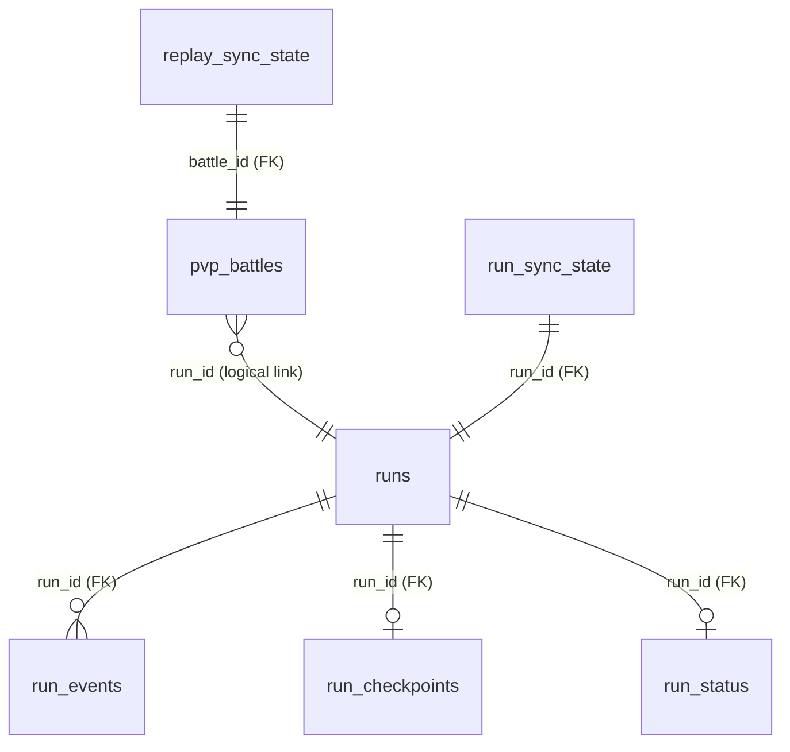

# SQLite Schema Reference

## Scope

这份文档只给出当前 schema 的紧凑摘要。完整事实来源是：

- `Game/RunLogging/Persistence/Sqlite/RunLogSqliteSchema.cs`
- `Game/RunLogging/Persistence/SqliteRunLogStore.cs`
- `Game/PvpBattles/Persistence/PvpBattleSqliteStore.cs`
- `Game/HistoryPanel/HistoryPanelRepository.cs`

## Current Version

- database file: `bazaarplusplus.db`
- default path: `<GameRoot>/BazaarPlusPlus/bazaarplusplus.db`
- local schema version: `4`
- row schema version: `4`
- upload payload schema version: `1`
- uses `PRAGMA user_version`

## Current Tables

- `runs`
- `run_events`
- `run_checkpoints`
- `run_status`
- `pvp_battles`
- `ghost_battles`
- `run_sync_state`
- `replay_sync_state`

## Runtime SQLite Setup

- `PRAGMA foreign_keys = ON`
- `PRAGMA user_version = 4`
- `PRAGMA busy_timeout = 2000`
- `PRAGMA journal_mode = WAL`
- command timeout is kept short

## Relationships



## Table Roles

- `runs`: run 级主表
- `run_events`: append-only 事件流
- `run_checkpoints`: 最近可恢复 checkpoint
- `run_status`: run 终态摘要
- `pvp_battles`: 本地 battle manifest 与快照
- `ghost_battles`: 从服务端同步的 ghost battle 摘要
- `run_sync_state`: run 上传状态
- `replay_sync_state`: replay 上传状态

## Read / Write Owners

- run write path: `Game/RunLogging/Persistence/SqliteRunLogStore.cs`
- battle write path: `Game/PvpBattles/Persistence/PvpBattleSqliteStore.cs`
- history read path: `Game/HistoryPanel/HistoryPanelRepository.cs`
- export path: `scripts/export_run_log.py`
- `run_checkpoints` 是“最近一次可恢复状态”
- `run_status` 是终态快照
- `pvp_battles` 是 PVP battle 的 manifest 投影，不是 replay payload 本体

### 4.2 DDL 摘要

下面这段是“当前有效 schema”的摘要版，表达的是新库初始化后、再叠加运行时补列/迁移后的最终形状。

```sql
CREATE TABLE runs (
    run_id TEXT PRIMARY KEY,
    schema_version INTEGER NOT NULL,
    started_at_utc TEXT NOT NULL,
    hero TEXT NOT NULL,
    game_mode TEXT NOT NULL,
    day INTEGER NULL,
    hour INTEGER NULL,
    seed INTEGER NULL,
    status TEXT NOT NULL
);

CREATE TABLE run_events (
    run_id TEXT NOT NULL,
    seq INTEGER NOT NULL,
    ts_utc TEXT NOT NULL,
    kind TEXT NOT NULL,
    payload_json TEXT NOT NULL,
    PRIMARY KEY (run_id, seq),
    FOREIGN KEY (run_id) REFERENCES runs(run_id) ON DELETE CASCADE
);

CREATE TABLE run_checkpoints (
    run_id TEXT PRIMARY KEY,
    schema_version INTEGER NOT NULL,
    last_seq INTEGER NOT NULL,
    last_seen_at_utc TEXT NOT NULL,
    day INTEGER NULL,
    hour INTEGER NULL,
    max_health INTEGER NULL,
    prestige INTEGER NULL,
    level INTEGER NULL,
    income INTEGER NULL,
    gold INTEGER NULL,
    state TEXT NULL,
    current_encounter_id TEXT NULL,
    last_state_fingerprint TEXT NULL,
    last_selection_fingerprint TEXT NULL,
    pending_selection_seq INTEGER NULL,
    pending_selection_json TEXT NULL,
    completed INTEGER NOT NULL,
    FOREIGN KEY (run_id) REFERENCES runs(run_id) ON DELETE CASCADE
);

CREATE TABLE run_status (
    run_id TEXT PRIMARY KEY,
    schema_version INTEGER NOT NULL,
    status TEXT NOT NULL,
    ended_at_utc TEXT NOT NULL,
    final_day INTEGER NULL,
    final_hour INTEGER NULL,
    max_health INTEGER NULL,
    prestige INTEGER NULL,
    level INTEGER NULL,
    income INTEGER NULL,
    gold INTEGER NULL,
    victories INTEGER NULL,
    losses INTEGER NULL,
    reason TEXT NULL,
    FOREIGN KEY (run_id) REFERENCES runs(run_id) ON DELETE CASCADE
);

CREATE TABLE pvp_battles (
    battle_id TEXT PRIMARY KEY,
    run_id TEXT NULL,
    recorded_at_utc TEXT NOT NULL,
    day INTEGER NULL,
    hour INTEGER NULL,
    encounter_id TEXT NULL,
    player_name TEXT NULL,
    player_account_id TEXT NULL,
    opponent_name TEXT NULL,
    opponent_hero TEXT NULL,
    opponent_rank TEXT NULL,
    opponent_rating INTEGER NULL,
    opponent_level INTEGER NULL,
    opponent_account_id TEXT NULL,
    combat_kind TEXT NOT NULL,
    result TEXT NULL,
    winner_combatant_id TEXT NULL,
    loser_combatant_id TEXT NULL,
    player_hand_json TEXT NOT NULL,
    player_skills_json TEXT NOT NULL,
    opponent_hand_json TEXT NOT NULL,
    opponent_skills_json TEXT NOT NULL
);

CREATE INDEX idx_run_events_ts_utc
    ON run_events(ts_utc);

CREATE INDEX idx_run_checkpoints_last_seen_at_utc
    ON run_checkpoints(last_seen_at_utc);

CREATE INDEX idx_pvp_battles_run_id
    ON pvp_battles(run_id);

CREATE INDEX idx_pvp_battles_recorded_at_utc
    ON pvp_battles(recorded_at_utc);
```

## 5. 表级总览

| 表名 | 主键 | 作用 | 写入方式 |
| --- | --- | --- | --- |
| `runs` | `run_id` | 每局 run 的基础元数据 | `CreateRun` 插入，checkpoint/completion 会回写部分字段 |
| `run_events` | `(run_id, seq)` | append-only 事件流 | `AppendEvent` 只插入，不更新 |
| `run_checkpoints` | `run_id` | 每局 run 最新恢复点 | `SaveCheckpoint` upsert |
| `run_status` | `run_id` | 每局 run 的终态快照 | `CompleteRun` / `MarkRunAbandoned` upsert |
| `pvp_battles` | `battle_id` | PVP 战斗 manifest 与卡组快照 | `Save` 按 `battle_id` upsert |

## 6. 详细表结构

### 6.1 `runs`

每个 run 一行，是其他 run 相关表的根表。

| 列名 | 类型 | Null | 键/约束 | 含义 |
| --- | --- | --- | --- | --- |
| `run_id` | `TEXT` | 否 | `PRIMARY KEY` | run 唯一标识 |
| `schema_version` | `INTEGER` | 否 |  | 行级 schema version，当前写入值为 `1` |
| `started_at_utc` | `TEXT` | 否 |  | run 开始时间，ISO-8601 字符串 |
| `hero` | `TEXT` | 否 |  | 英雄名 |
| `game_mode` | `TEXT` | 否 |  | 模式，如 Ranked / Unranked |
| `day` | `INTEGER` | 是 |  | 当前或最终 day，会被 checkpoint / completion 回写 |
| `hour` | `INTEGER` | 是 |  | 当前或最终 hour，会被 checkpoint / completion 回写 |
| `seed` | `INTEGER` | 是 |  | 种子 |
| `status` | `TEXT` | 否 |  | run 当前状态，创建时默认 `active`，结束时会变成 `completed` 或 `abandoned` |

分析要点：

- `runs` 并不是纯只写表，`day`、`hour`、`status` 会被后续流程更新
- 当前 UI 查询 run 列表时，会优先结合 `run_status` / `run_checkpoints` 的信息来展示最终状态

### 6.2 `run_events`

记录 run 过程中采集到的事件流，是最接近“事实日志”的表。

| 列名 | 类型 | Null | 键/约束 | 含义 |
| --- | --- | --- | --- | --- |
| `run_id` | `TEXT` | 否 | `PRIMARY KEY (run_id, seq)` 的一部分；`FOREIGN KEY -> runs(run_id) ON DELETE CASCADE` | 所属 run |
| `seq` | `INTEGER` | 否 | `PRIMARY KEY (run_id, seq)` 的一部分 | 事件序号，单 run 内递增 |
| `ts_utc` | `TEXT` | 否 |  | 事件时间，ISO-8601 字符串 |
| `kind` | `TEXT` | 否 |  | 事件类型 |
| `payload_json` | `TEXT` | 否 |  | `RunLogEvent` 的完整 snake_case JSON |

索引：

- `idx_run_events_ts_utc` on `run_events(ts_utc)`

分析要点：

- 主访问路径是 `WHERE run_id = ? ORDER BY seq`
- 虽然表里拆出了 `ts_utc` 和 `kind`，但完整事件内容仍然保存在 `payload_json`
- `payload_json` 对应 `RunLogEvent`，包含 `victories`、`losses`、`state`、`encounter_id`、`options`、`selection_*` 等大量上下文字段
- 删除 `runs` 行时，`run_events` 会跟着 cascade 删除

### 6.3 `run_checkpoints`

每个 run 最多一行，是“恢复当前活跃 run”所需的最新状态快照。

| 列名 | 类型 | Null | 键/约束 | 含义 |
| --- | --- | --- | --- | --- |
| `run_id` | `TEXT` | 否 | `PRIMARY KEY`；`FOREIGN KEY -> runs(run_id) ON DELETE CASCADE` | 所属 run |
| `schema_version` | `INTEGER` | 否 |  | 行级 schema version |
| `last_seq` | `INTEGER` | 否 |  | 已落盘的最后事件序号 |
| `last_seen_at_utc` | `TEXT` | 否 |  | 最近一次观测到 run 状态的时间 |
| `day` | `INTEGER` | 是 |  | checkpoint 时的 day |
| `hour` | `INTEGER` | 是 |  | checkpoint 时的 hour |
| `max_health` | `INTEGER` | 是 |  | 玩家最大生命 |
| `prestige` | `INTEGER` | 是 |  | Prestige |
| `level` | `INTEGER` | 是 |  | 玩家等级 |
| `income` | `INTEGER` | 是 |  | 收益 |
| `gold` | `INTEGER` | 是 |  | 金币 |
| `state` | `TEXT` | 是 |  | 当前 state 名 |
| `current_encounter_id` | `TEXT` | 是 |  | 当前 encounter |
| `last_state_fingerprint` | `TEXT` | 是 |  | 最近状态指纹 |
| `last_selection_fingerprint` | `TEXT` | 是 |  | 最近选择指纹 |
| `pending_selection_seq` | `INTEGER` | 是 |  | 尚未闭合选择链的起始事件序号 |
| `pending_selection_json` | `TEXT` | 是 |  | `RunLogPendingSelectionState` 的 snake_case JSON |
| `completed` | `INTEGER` | 否 |  | 布尔位，`0/1` |

索引：

- `idx_run_checkpoints_last_seen_at_utc` on `run_checkpoints(last_seen_at_utc)`

分析要点：

- `SaveCheckpoint` 对这张表使用 `INSERT ... ON CONFLICT(run_id) DO UPDATE`
- 每次保存 checkpoint 后，还会把 `runs.day` / `runs.hour` 同步更新
- `pending_selection_json` 用于把“已看到 options，但尚未产生最终选择结果”的状态存下来
- `completed` 在 SQLite 里是 `INTEGER`，代码里按布尔值使用
- 结束 run 时，`run_status` 落盘之后会把这里的 `completed` 强制改为 `1`

`pending_selection_json` 的对象形状来自 `RunLogPendingSelectionState`，核心字段包括：

- `day`
- `hour`
- `state`
- `encounter_id`
- `parent_encounter_id`
- `selection_seq`
- `options`

### 6.4 `run_status`

每个 run 最多一行，是终态信息表。

| 列名 | 类型 | Null | 键/约束 | 含义 |
| --- | --- | --- | --- | --- |
| `run_id` | `TEXT` | 否 | `PRIMARY KEY`；`FOREIGN KEY -> runs(run_id) ON DELETE CASCADE` | 所属 run |
| `schema_version` | `INTEGER` | 否 |  | 行级 schema version |
| `status` | `TEXT` | 否 |  | 终态状态，当前代码会写 `completed` 或 `abandoned` |
| `ended_at_utc` | `TEXT` | 否 |  | 结束时间 |
| `final_day` | `INTEGER` | 是 |  | 终局 day |
| `final_hour` | `INTEGER` | 是 |  | 终局 hour |
| `max_health` | `INTEGER` | 是 |  | 终局最大生命 |
| `prestige` | `INTEGER` | 是 |  | 终局 Prestige |
| `level` | `INTEGER` | 是 |  | 终局等级 |
| `income` | `INTEGER` | 是 |  | 终局收益 |
| `gold` | `INTEGER` | 是 |  | 终局金币 |
| `victories` | `INTEGER` | 是 |  | 胜场 |
| `losses` | `INTEGER` | 是 |  | 负场 |
| `reason` | `TEXT` | 是 |  | 终态原因，如 `run_end_event`、`interrupted` |

分析要点：

- `CompleteRun` 和 `MarkRunAbandoned` 最终都会走 `WriteTerminalStatus`
- 对这张表也是 upsert，不是 append-only
- 写入终态后，还会同步回写 `runs.status`，并尽量把 `runs.day` / `runs.hour` 提升到最终值
- 活跃 run 可以没有 `run_status` 行

### 6.5 `pvp_battles`

这张表保存的是 battle manifest 和双方卡组快照，不保存 replay payload 本体。

| 列名 | 类型 | Null | 键/约束 | 含义 |
| --- | --- | --- | --- | --- |
| `battle_id` | `TEXT` | 否 | `PRIMARY KEY` | battle 唯一标识 |
| `run_id` | `TEXT` | 是 |  | 逻辑关联到 run；当前没有 FK |
| `recorded_at_utc` | `TEXT` | 否 |  | battle 记录时间 |
| `day` | `INTEGER` | 是 |  | battle 所在 day |
| `hour` | `INTEGER` | 是 |  | battle 所在 hour |
| `encounter_id` | `TEXT` | 是 |  | 遭遇 id |
| `player_name` | `TEXT` | 是 |  | 玩家名 |
| `player_account_id` | `TEXT` | 是 |  | 玩家 account id |
| `opponent_name` | `TEXT` | 是 |  | 对手名 |
| `opponent_hero` | `TEXT` | 是 |  | 对手英雄 |
| `opponent_rank` | `TEXT` | 是 |  | 对手段位 |
| `opponent_rating` | `INTEGER` | 是 |  | 对手 rating |
| `opponent_level` | `INTEGER` | 是 |  | 对手等级 |
| `opponent_account_id` | `TEXT` | 是 |  | 对手 account id |
| `combat_kind` | `TEXT` | 否 |  | 战斗类型；当前只有 `PVPCombat` 才会写入 |
| `result` | `TEXT` | 是 |  | 结果，如 `win` / `loss` |
| `winner_combatant_id` | `TEXT` | 是 |  | 胜者 combatant id |
| `loser_combatant_id` | `TEXT` | 是 |  | 败者 combatant id |
| `player_hand_json` | `TEXT` | 否 |  | 玩家手牌快照 JSON |
| `player_skills_json` | `TEXT` | 否 |  | 玩家技能快照 JSON |
| `opponent_hand_json` | `TEXT` | 否 |  | 对手手牌快照 JSON |
| `opponent_skills_json` | `TEXT` | 否 |  | 对手技能快照 JSON |

索引：

- `idx_pvp_battles_run_id` on `pvp_battles(run_id)`
- `idx_pvp_battles_recorded_at_utc` on `pvp_battles(recorded_at_utc)`

分析要点：

- `Save(PvpBattleManifest manifest)` 使用 `INSERT ... ON CONFLICT(battle_id) DO UPDATE`
- 只有 `combat_kind == "PVPCombat"` 时才会真正写表
- `run_id` 只是逻辑关联，没有外键，所以手工删 `runs` 不会自动删 battle 行
- `*_json` 四列对应 `PvpBattleCardSetCapture`，对象至少有：
  - `items`
  - `status`
  - `source`
- 这张表保存的是历史展示与导出所需的 manifest 投影
- replay 原始 payload 单独存到 `CombatReplays/<battle_id>.payload.mpack.gz`，不在 SQLite 里

## 7. 当前索引清单

当前代码显式创建的索引只有 4 个：

| 索引名 | 表 | 列 |
| --- | --- | --- |
| `idx_run_events_ts_utc` | `run_events` | `ts_utc` |
| `idx_run_checkpoints_last_seen_at_utc` | `run_checkpoints` | `last_seen_at_utc` |
| `idx_pvp_battles_run_id` | `pvp_battles` | `run_id` |
| `idx_pvp_battles_recorded_at_utc` | `pvp_battles` | `recorded_at_utc` |

隐式索引：

- `runs(run_id)` 主键
- `run_events(run_id, seq)` 主键
- `run_checkpoints(run_id)` 主键
- `run_status(run_id)` 主键
- `pvp_battles(battle_id)` 主键

## 8. 写入生命周期

### 8.1 run 相关

1. `CreateRun`
   - 插入 `runs`
   - 初始 `status = active`

2. `AppendEvent`
   - 只插入 `run_events`

3. `SaveCheckpoint`
   - upsert `run_checkpoints`
   - 同步更新 `runs.day` / `runs.hour`

4. `CompleteRun` / `MarkRunAbandoned`
   - upsert `run_status`
   - 更新 `runs.status`
   - 用终局 day/hour 回写 `runs`
   - 将 `run_checkpoints.completed` 置为 `1`

### 8.2 PVP battle 相关

1. `Save(PvpBattleManifest)`
   - upsert `pvp_battles`
   - 只处理 `PVPCombat`

2. replay payload
   - 不进 SQLite
   - 落到 `CombatReplays/<battle_id>.payload.mpack.gz`

## 9. 读路径与字段依赖

### 9.1 历史面板

`HistoryPanelRepository` 的 run 列表读取逻辑：

- 从 `runs` 读基础信息
- `LEFT JOIN run_status` 取终态
- `LEFT JOIN run_checkpoints` 取未结束 run 的最新状态
- `LEFT JOIN pvp_battles` 并按 `COUNT(pb.battle_id)` 统计 battle 数

这说明：

- `runs` 不是独立就能支撑 UI 的
- `run_status` 与 `run_checkpoints` 共同构成 run 的最终展示态
- `pvp_battles` 已经是面向查询的 projection，而不是只为导出存在

### 9.2 导出脚本

`scripts/export_run_log.py` 会导出：

- `runs -> meta.json`
- `run_events -> events.ndjson`
- `run_events -> decision_chain.ndjson`（派生读模型，不是直接原样 dump）
- `run_checkpoints -> checkpoint.json`
- `run_status -> status.json`
- `pvp_battles -> pvp_battles.ndjson`

说明当前 schema 已经不仅是“游戏内缓存”，也承担调试导出格式的上游职责。

## 10. 兼容与迁移

当前项目没有独立 migration framework，兼容是靠 store 构造函数里的代码驱动迁移完成的。

### 10.1 `SqliteRunLogStore` 的补列逻辑

启动时会确保以下列存在：

`run_checkpoints`

- `pending_selection_json`
- `max_health`
- `prestige`
- `level`
- `income`
- `gold`

`run_status`

- `max_health`
- `prestige`
- `level`
- `income`
- `gold`

如果缺失，就执行 `ALTER TABLE ... ADD COLUMN ...`。

### 10.2 `PvpBattleSqliteStore` 的兼容逻辑

启动时会确保以下列存在：

- `opponent_hero`
- `opponent_rank`
- `opponent_rating`
- `opponent_level`

同时还会处理 legacy 表：

- 如果 `pvp_battles` 仍然有旧列 `replay_id`
- 就把旧表 rename 为 `_legacy`
- 重新建当前表结构
- 将旧数据拷贝到新表
- 新增列以 `NULL` 补齐
- 最后删除旧表并重建索引

所以，真正的“当前 schema”应理解为：

- 新库：直接执行当前 `BootstrapSql`
- 老库：先执行 `BootstrapSql`，再运行构造函数里的补列与迁移

## 11. 设计观察

### 11.1 这是事件流 + 投影的混合模型

当前 schema 不是传统强范式业务库，而是：

- `run_events` 保存事实流
- `run_checkpoints` 保存恢复点
- `run_status` 保存终态投影
- `pvp_battles` 保存 battle 查询投影

这对本地插件场景是合理的，因为读性能和恢复能力比强一致范式更重要。

### 11.2 `schema_version` 是行级标记，不是数据库 migration 版本

虽然多张表都有 `schema_version`，但当前代码：

- 没有按它做分支 migration
- 没有 schema history table
- 没有 `PRAGMA user_version`

因此它更像“应用层生成版本标记”，不是完整 DB migration 机制。

### 11.3 `pvp_battles.run_id` 没有外键

这意味着：

- run 与 battle 的关系是弱约束
- battle 可以独立存在
- 手工清理 `runs` 不会自动清理 `pvp_battles`

这和当前“battle manifest + replay payload 分离保存”的设计是一致的，但要意识到它不是严格 referential integrity。

### 11.4 时间与 JSON 都按文本存储

当前实现里：

- 时间统一以 `DateTimeOffset.ToString("o")` 落成 `TEXT`
- 结构化对象通过 Newtonsoft JSON 落成 `TEXT`
- JSON 命名策略使用 `snake_case`

这让调试和导出非常方便，但也意味着：

- DB 约束主要依赖应用层，而不是列级强类型
- JSON 内容的演进更多依赖兼容读取，而不是 DDL 约束

## 12. 一页版结论

如果只保留一句话：

> 当前 SQLite schema 是一套围绕 run logging 和 PVP 历史构建的本地事件库：`runs` 管 run 基础信息，`run_events` 管事实流，`run_checkpoints` 管恢复点，`run_status` 管终态，`pvp_battles` 管 PVP manifest；实际 schema 还包含启动时的代码驱动补列和 legacy 表迁移。
