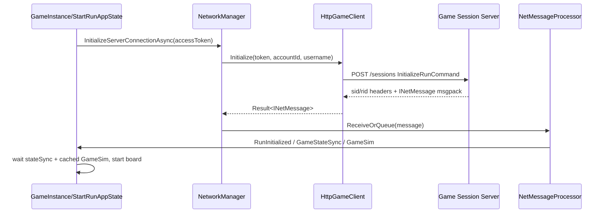

# Run Session / MessagePack 协议

## 协议定位

进入 run 后，客户端不再用普通 REST 操作玩法。`NetworkManager` 创建 `HttpGameClient(Config.SocketURL)`，并通过两个 HTTP 端点交换 MessagePack：

- `POST /sessions`：创建或恢复 run session。
- `POST /commands`：发送 run 内玩家命令。
- `DELETE /sessions`：退出时清理 session。

客户端收到的所有 gameplay 结果都是 `INetMessage`：状态快照、游戏模拟事件、战斗模拟事件、初始化消息或错误消息。

## 初始化流程

`StartRunAppState.InitializeRun` 的关键业务：

1. `Data.ResetRunData()`。
2. 如果未恢复 active run 且 loadout randomize 开启，调用 REST `EquipLoadout`。
3. `Data.EnsureGetStatic()`，最多等 40s，超时使用已有缓存。
4. `NetworkManager.InitializeServerConnectionAsync()` 创建 `/sessions`。
5. 等待 `_stateSyncReceived && _cachedGameSim != null`，最多 40s。
6. `RunManager.StartRun()` 初始化 board。
7. 处理 cached `GameSim`，刷新 active run，触发 `Events.RunStarted`。

## HTTP header 和超时

`HttpGameClient.Initialize` 设置默认 header：

| Header | 值 |
|---|---|
| `aid` | account GUID 去掉 `-` |
| `uid` | username |
| `Authorization` | `Bearer <accessToken>` |

`/commands` 请求额外加：

| Header | 值 |
|---|---|
| `sid` | `/sessions` 响应 header 捕获的 session id |
| `rid` | 上次响应 header 捕获的 request id，初始 0 |

响应：

- `/sessions` 成功必须带 `sid`，否则客户端认为初始化失败。
- 响应可带 `rid`，客户端更新本地 `_requestId`。
- body 必须能用 `MessagePackSerializer.Deserialize<INetMessage>(..., MessagePackConfig.Options)` 解析。

超时来自 `maintenance.json.httpGameClientTimeouts`：

- `defaultRequestSeconds`
- `inRunCommandSeconds`
- `deleteSessionSeconds`

缺省均为 60 秒。

## 命令 union

`INetCommand` union key：

| Key | 类型 | 字段 |
|---:|---|---|
| 1 | `SelectItemCommand` | `0 InstanceId: InstanceId`, `1 TargetSockets: List<EContainerSocketId>`, `2 Section: EInventorySection?` |
| 2 | `MoveItemCommand` | `0 InstanceId`, `1 TargetSockets`, `2 Section: EInventorySection` |
| 3 | `SelectSkillCommand` | `0 InstanceId` |
| 4 | `SelectEncounterCommand` | `0 InstanceId` |
| 5 | `RerollCommand` | empty |
| 6 | `ExitCurrentStateCommand` | empty |
| 7 | `SellCardCommand` | `0 InstanceId` |
| 8 | `CommitToPedestalCommand` | `0 InstanceId` |
| 9 | `InitializeRunCommand` | `0 GameModeId: Guid?`, `1 PlayMode: EPlayMode`, `2 SelectedHero: EHero = Pygmalien` |
| 10 | `CheatCommand` | `0 Args: List<string>` |
| 11 | `AbandonRunCommand` | empty |

`InstanceId` 是 `MessagePackObject` record struct，key 0 为 `string Value`。

## 消息 union

`INetMessage` union key：

| Key | 类型 | 字段 | 业务 |
|---:|---|---|---|
| 1 | `NetMessageError` | `0 MessageId`, `1 ErrorType`, `2 Message?` | 服务端拒绝或错误。 |
| 2 | `NetMessageCombatSim` | `0 CombatSim Data`, `1 MessageId` | 战斗帧和结果。 |
| 3 | `NetMessageGameSim` | `0 GameSim Data`, `1 MessageId` | 非战斗 run 事件和状态变化。 |
| 4 | `NetMessageGameStateSync` | `0 GameStateSnapshotDTO Data`, `1 MessageId` | 全量 run 快照同步。 |
| 5 | `NetMessageRunInitialized` | `0 RunId`, `1 BuildId`, `2 Environment`, `3 PlayMode`, `4 MessageId` | run/session 初始化完成。 |
| 6 | `NetMessageAggregate` | `0 List<INetMessage> Messages`, `1 MessageId` | 聚合消息，客户端递归处理。 |

## 全量状态快照

`GameStateSnapshotDTO`：

| Key | 字段 | 类型 |
|---:|---|---|
| 0 | `Run` | `RunSnapshotDTO` |
| 1 | `CurrentState` | `RunStateSnapshotDTO?` |
| 2 | `Player` | `PlayerSnapshotDTO` |
| 3 | `Cards` | `HashSet<CardSnapshotDTO>` |

`RunSnapshotDTO`：

| Key | 字段 | 类型 |
|---:|---|---|
| 0 | `GameModeId` | `Guid` |
| 1 | `Day` | `uint` |
| 2 | `Hour` | `uint` |
| 3 | `Victories` | `uint` |
| 4 | `Defeats` | `uint` |
| 5 | `HasVisitedFates` | `bool` |
| 6 | `DataVersion` | `string` |

`RunStateSnapshotDTO`：

| Key | 字段 | 类型 |
|---:|---|---|
| 0 | `StateName` | `ERunState` |
| 1 | `CurrentEncounterId` | `string?` |
| 2 | `Board` | `string?` |
| 3 | `RerollCost` | `uint?` |
| 4 | `RerollsRemaining` | `uint?` |
| 5 | `SelectionSet` | `List<string>` |
| 6 | `SelectionContextRules` | `TSelectionContextRules?` |

`PlayerSnapshotDTO`：

| Key | 字段 | 类型 |
|---:|---|---|
| 0 | `Hero` | `EHero` |
| 1 | `Attributes` | `Dictionary<EPlayerAttributeType,int>` |
| 2 | `UnlockedSlots` | `ushort` |

`CardSnapshotDTO`：

| Key | 字段 | 类型 |
|---:|---|---|
| 0 | `InstanceId` | `string` |
| 1 | `TemplateId` | `Guid` |
| 2 | `Attributes` | `Dictionary<ECardAttributeType,int>` |
| 3 | `Enchantment` | `EEnchantmentType?` |
| 4 | `Heroes` | `HashSet<EHero>` |
| 5 | `HiddenTags` | `HashSet<EHiddenTag>` |
| 6 | `Tags` | `HashSet<ECardTag>` |
| 7 | `Tier` | `ETier` |
| 8 | `Type` | `ECardType` |
| 9 | `Size` | `ECardSize` |
| 10 | `Owner` | `ECombatantId?` |
| 11 | `Socket` | `EContainerSocketId?` |
| 12 | `Section` | `EInventorySection?` |

## GameSim 结构

`GameSim` 字段：

| Key | 字段 | 类型 |
|---:|---|---|
| 0 | `Events` | `List<IGameSimEvent>` |
| 1 | `Player` | `SimUpdatePlayer` |
| 2 | `Opponent` | `SimUpdatePlayer` |
| 3 | `Cards` | `Dictionary<string, SimUpdateCard>` |
| 4 | `Run` | `SimUpdateRun` |
| 5 | `CurrentState` | `SimUpdateRunState?` |
| 6 | `VfxKeys` | `List<string>` |

`IGameSimEvent` union key：

| Key | 类型 |
|---:|---|
| 1 | `GameSimEventCardDealt` |
| 2 | `GameSimEventCardDisposed` |
| 3 | `GameSimEventCardEnchanted` |
| 4 | `GameSimEventCardFused` |
| 5 | `GameSimEventCardMoved` |
| 6 | `GameSimEventCardPurchased` |
| 7 | `GameSimEventCardSold` |
| 8 | `GameSimEventCardSpawned` |
| 9 | `GameSimEventCardUpgraded` |
| 10 | `GameSimEventEffectExecuted` |
| 11 | `GameSimEventInterruptStateEntered` |
| 12 | `GameSimEventInterruptStateExited` |
| 13 | `GameSimEventPedestalActivated` |
| 14 | `GameSimEventPlayerExperienceGained` |
| 15 | `GameSimEventPlayerIncomeGained` |
| 16 | `GameSimEventPlayerPrestigeChanged` |
| 17 | `GameSimEventRunDayChanged` |
| 18 | `GameSimEventRunHourChanged` |
| 19 | `GameSimEventSocketsUnlocked` |
| 20 | `GameSimEventStateTransitioned` |
| 21 | `GameSimEventPlayerSkillEquipped` |
| 22 | `GameSimEventPlayerInitialized` |
| 23 | `GameSimEventEffectAuraExecuted` |
| 24 | `GameSimEventRunCompleted` |
| 25 | `GameSimEventCardTransformed` |
| 26 | `GameSimEventCardTransformReverted` |
| 27 | `GameSimEventCardQuestCompleted` |
| 28 | `GameSimEventCardQuestUpdated` |
| 29 | `GameSimEventBoardOverridden` |
| 30 | `GameSimEventRunRerollCostChanged` |

`SimUpdateRunState` 比 snapshot 多一个 `PvpOpponent: SimPvpOpponent?`，用于 PVP 对手 UI。`TSelectionContextRules` 包含 `CanSelectMultiple`、`SelectionIsFree`、`CanExit`、`RerollRules`、`WillAutoSellOnExit`、`NextEncounterOnExit`。

## CombatSim 结构

`CombatSim` 字段：

| Key | 字段 | 类型 |
|---:|---|---|
| 0 | `Frames` | `List<CombatSimFrame>` |
| 1 | `Winner` | `ECombatantId` |
| 2 | `Loser` | `ECombatantId` |
| 3 | `OpponentHealthThresholdsForGold` | `List<float>` |
| 4 | `OpponentHealthThresholdsForXp` | `List<float>` |
| 5 | `CardStats` | `Dictionary<string, Dictionary<ECardStats,int>>` |
| 6 | `VfxKeys` | `List<string>` |
| 7 | `PortraitKeys` | `List<string>` |

`CombatSimFrame`：

| Key | 字段 | 类型 |
|---:|---|---|
| 0 | `Events` | `List<ICombatSimEvent>` |
| 1 | `PlayerUpdates` | `CombatSimPlayerUpdate?` |
| 2 | `OpponentUpdates` | `CombatSimPlayerUpdate?` |
| 3 | `CardUpdates` | `Dictionary<InstanceId, CombatSimCardUpdate>` |

`ICombatSimEvent` union key：

| Key | 类型 |
|---:|---|
| 1 | `CombatSimEventCombatantDied` |
| 2 | `CombatSimEventSandstormCountdownStarted` |
| 3 | `CombatSimEventSandstormStarted` |
| 4 | `CombatSimEventMonsterGoldReceived` |
| 5 | `CombatSimEventEffectExecuted` |
| 6 | `CombatSimEventEffectTriggered` |
| 7 | `CombatSimEventEffectAuraExecuted` |
| 8 | `CombatSimEventCardEnchanted` |
| 9 | `CombatSimEventCardTransformed` |
| 10 | `CombatSimEventCardTransformReverted` |
| 11 | `CombatSimEventCardQuestCompleted` |
| 12 | `CombatSimEventCardQuestUpdated` |
| 13 | `CombatSimEventMonsterXpReceived` |

## 客户端命令业务校验

`AppState` 在发命令前做本地业务校验，服务端仍是最终权威：

| 命令 | 本地校验/行为 |
|---|---|
| `SelectEncounter` | 卡存在、交互 filter 允许、可支付；设置 `LeftSocketId = Socket_5` 和 `Data.CurrentEncounterId` 后发送。 |
| `SelectSkill` | filter 允许；非 combat/free 时校验购买能力；找到技能 socket；owner 设为 player；发送。 |
| `SelectItem` | filter、费用、空间；如果是 fuse/upgrade 路径直接发送；否则乐观移动到目标 section/socket，失败时 undo。 |
| `MoveItem` | 乐观移动手牌/仓库/位置，失败时 undo。 |
| `SellCard` | 必须是玩家拥有且不是 `Unsellable`；乐观从 `Data.Entities`/container 移除，失败 undo。 |
| `Reroll` | 需要当前状态允许、剩余 reroll、金币足够。 |
| `ExitCurrentState` | 如果当前是 combat state，优先消费 cached next `GameSim`；否则发送命令。 |
| `CommitToPedestal` | 当前状态允许且目标卡存在。 |
| `AbandonRun` | 当前状态允许，发送后回主菜单/结束 run。 |

`StateOps` 允许矩阵：

| 状态 | 允许操作 |
|---|---|
| Choice | SelectSkill, SelectItem, SelectEncounter, MoveItem, SellItem, LevelUp, Reroll, AbandonRun |
| Encounter | Choice 的操作 + ExitState |
| LevelUp | SelectSkill, SelectItem, SelectEncounter, MoveItem, SellItem, ExitState, LevelUp, AbandonRun |
| Loot | 同 LevelUp |
| Pedestal | SelectSkill, SelectItem, MoveItem, SellItem, ExitState, LevelUp, CommitToPedestal, AbandonRun |
| Replay | SelectSkill, SelectItem, MoveItem, SellItem, ExitState, AbandonRun |

## `NetMessageProcessor` 业务逻辑

- `NetMessageAggregate` 递归处理子消息。
- `NetMessageError`、`GameStateSync`、`GameSim`、`CombatSim`、`RunInitialized` 分发给对应 handler。
- 当前在 `Combat/PVPCombat/EndRun/Replay` 时，会跳过部分 `GameStateSync/GameSim` 的即时处理，避免打断战斗/回放序列。
- 维护最近 3 个消息；当出现 `GameSim(Combat/PVPCombat)` -> `CombatSim` -> `GameSim` 时，生成 `LastCombatSequence` 并触发 `CombatSequenceCreated`。这就是 replay/history 能抓到完整战斗前中后消息的关键。

## 错误和恢复

| 情况 | 客户端行为 |
|---|---|
| `/sessions` HTTP 500 | `SessionCreationException`，StartRun 弹窗允许重试或回主菜单。 |
| `/sessions` 404 | 当前 run 不可恢复，用户消息为“current run could not be recovered”，需要回主菜单。 |
| `/commands` 410 Gone 或 409 Conflict | `SessionReestablishRequiredException`；`Cmd` 会尝试刷新 token 并重新 POST `/sessions`。 |
| 400/412/422 | 用户动作不合法，显示 action failed。 |
| 401/403 | session/token 失效，通常回主菜单。 |
| 429 | 反加速/动作太快提示；客户端执行乐观 undo callback。 |
| 5xx | server trouble，显示失败；部分网络/timeout 作为可恢复连接异常处理。 |
| 本地 connectivity 不可达 | 可恢复异常；`Cmd` 等待网络并弹 connection issue。 |

离线本地 session server 应尽量复用同样状态码语义，这样现有 UI 和恢复逻辑可以继续工作。
