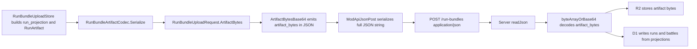
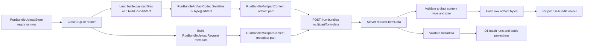
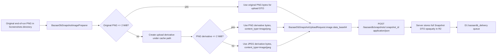

# Upload DTO Performance Implementation Plan

> **For agentic workers:** REQUIRED SUB-SKILL: Use superpowers:subagent-driven-development (recommended) or superpowers:executing-plans to implement this plan task-by-task. Steps use checkbox (`- [ ]`) syntax for tracking.

**Goal:** Reduce upload DTO memory growth, network payload size, and SQLite hot-path overhead across `bazaarplusplus-mod` and `bazaarplusplus-server`, while preserving query projections and keeping local screenshot quality intact.

**Architecture:** Split heavy binary payloads from JSON projections. Run bundles use multipart upload: JSON metadata remains queryable, and the gzip MessagePack artifact is sent as a raw binary part. BazaarDB screenshots keep the existing JSON DTO contract, but the mod generates an upload derivative capped at 2 MiB while leaving the full local PNG screenshot untouched; PNG is preferred, and JPEG is allowed as a fallback because BazaarDB accepts JPEG.

**Tech Stack:** C# netstandard2.1, Unity `Texture2D`, Newtonsoft.Json, MessagePack+gzip, Microsoft.Data.Sqlite, Cloudflare Workers, R2, D1, TypeScript, Vitest.

---

## Evidence Summary

Current mod-side bottlenecks:

- `ModApi/Models/RunBundleUploadRequest.cs` embeds `ArtifactBytes` into JSON through `ArtifactBytesBase64`, which forces base64 expansion and full string allocation.
- `ModApi/Http/ModApiJsonPost.cs` serializes every upload body to a full JSON string, then copies it into UTF-8 bytes before `HttpClient.SendAsync`.
- `Game/RunLogging/Upload/RunBundleUploadStore.cs` builds run bundle payloads while a SQLite reader is still open, loads each replay payload from disk, decompresses it, copies replay message bytes into a new artifact object, then gzip-compresses the whole bundle again.
- `Game/Screenshots/Upload/BazaarDbSnapshotUploadStore.cs` reads the full PNG into memory and base64-encodes it into the snapshot JSON DTO. A local V4 sample screenshot was 7.9 MB on disk; base64 alone would exceed 10 MB.
- `Storage/RunLog/RunLogSchema.cs` has basic upload indexes, but `EXPLAIN QUERY PLAN` shows temp B-tree sorting for pending run and pending screenshot scans.

Current server-side facts:

- `/run-bundles` stores `artifact_bytes` opaquely in R2 and writes D1 rows only from `run_projection` and top-level `battle_projections[]`.
- `/bazaardb/snapshots/:snapshot_id` stores the JSON body opaquely in R2, with only a minimal `snapshot.id` parse to match the path.
- The server caps BazaarDB snapshot JSON body bytes at 4 MiB. The mod-side upload derivative must stay lower; this plan uses a 2 MiB image byte cap so base64+JSON still fits.

## Decisions

1. **Run bundle wire format changes in place.** `POST /run-bundles` becomes multipart-only for the new mod/server pair. Do not keep JSON `artifact_bytes` as a mod-side fallback. This is a breaking wire cleanup and requires a major version bump on the mod assemblies.
2. **Battle projections remain top-level JSON metadata.** The server still does not parse the artifact to populate D1; this preserves the current ghost-battle query model.
3. **BazaarDB screenshot external shape remains JSON with `image.data_base64`.** The upload body gets smaller because the image bytes are smaller, not because the partner-facing DTO changes.
4. **Upload screenshots are capped at 2 MiB.** The local original PNG is preserved. The upload derivative is generated under an upload cache path and referenced only during DTO construction. PNG is attempted first; JPEG fallback is allowed and must set `image.content_type = image/jpeg`.
5. **SQLite schema changes are additive indexes only.** No local migration/backfill is required for this performance pass.

## Protocol DTOs

### Run Bundle Upload: New Wire Contract

`POST /run-bundles` uses one `multipart/form-data` request. The endpoint rejects `application/json` bodies with `415 { "error": "unsupported_content_type" }`.

| Part name | Required | Content-Type | Body |
|---|---:|---|---|
| `metadata` | yes | `application/json` or omitted by platform `FormData` string part | UTF-8 JSON matching `RunBundleUploadRequest` below |
| `artifact` | yes | `application/x-bpp-runbundle+msgpack+gzip` | Raw gzip MessagePack bytes produced by `RunBundleArtifactCodec.Serialize(...)` |

The `artifact` part filename is `run-bundle.mpack.gz`. The server validates the part content type, rejects empty artifacts, and rejects artifacts above `8 * 1024 * 1024` bytes with `413 { "error": "payload_too_large" }`.

### Run Bundle Metadata DTO

This DTO remains in `ModApi/Models/RunBundleUploadRequest.cs`, but it becomes metadata-only. The existing `ArtifactBytes` and `ArtifactBytesBase64` properties are removed from this type.

Run bundle metadata `schema_version` becomes `5` for this breaking wire contract. Update `Storage/RunLog/RunLogSchema.UploadPayloadSchemaVersion` from `1` to `5`. BazaarDB snapshot DTO `schema_version` remains `2`.

```csharp
public sealed class RunBundleUploadRequest
{
    [JsonProperty("schema_version")]
    public int SchemaVersion { get; set; }

    [JsonProperty("player_account_id")]
    public string PlayerAccountId { get; set; } = string.Empty;

    [JsonProperty("submitted_at_utc")]
    public string SubmittedAtUtc { get; set; } = string.Empty;

    [JsonProperty("artifact_codec")]
    public string ArtifactCodec { get; set; } =
        "application/x-bpp-runbundle+msgpack+gzip";

    [JsonProperty("run_projection")]
    public RunProjection RunProjection { get; set; } = new();

    [JsonProperty("battle_projections")]
    public List<BattleProjection> BattleProjections { get; set; } = new();
}
```

The JSON body of the `metadata` part has this shape:

```json
{
  "schema_version": 5,
  "player_account_id": "player-001",
  "submitted_at_utc": "2026-06-04T00:00:00.000Z",
  "artifact_codec": "application/x-bpp-runbundle+msgpack+gzip",
  "run_projection": {
    "run_id": "run-001",
    "status": "completed",
    "hero_id": "hero-a",
    "hero_name": "HeroA",
    "player_rank": "Gold",
    "player_rating": 1234,
    "player_position": 321,
    "started_at_utc": "2026-06-04T00:10:00.000Z",
    "ended_at_utc": "2026-06-04T00:45:00.000Z",
    "final_day": 10,
    "final_wins": 9,
    "final_losses": 3,
    "final_player_rank": "Gold",
    "final_player_rating": 1234,
    "final_player_position": 321
  },
  "battle_projections": [
    {
      "battle_id": "battle-001",
      "run_id": "run-001",
      "recorded_at_utc": "2026-06-04T00:20:00.000Z",
      "day": 3,
      "player_name": "Player",
      "player_account_id": "player-001",
      "player_hero": "HeroA",
      "player_rank": "Gold",
      "player_rating": 1234,
      "player_level": 8,
      "player_prestige": 2,
      "player_victories": 5,
      "opponent_name": "Opponent",
      "opponent_account_id": "opponent-001",
      "opponent_hero": "HeroB",
      "opponent_rank": "Silver",
      "opponent_rating": 1111,
      "opponent_level": 7,
      "opponent_prestige": 1,
      "opponent_victories": 4,
      "result": "win",
      "winner_combatant_id": "player",
      "loser_combatant_id": "opponent"
    }
  ]
}
```

### Run Bundle Artifact DTO

The binary artifact is not JSON. It remains the gzip-compressed MessagePack serialization of `RunArtifact`.

```csharp
public sealed class RunArtifact
{
    [JsonProperty("run_id")]
    public string RunId { get; set; } = string.Empty;

    [JsonProperty("battles")]
    public List<RunArtifactBattle> Battles { get; set; } = new();
}
```

`RunArtifact` and nested artifact DTOs stay public because they are serialized under the Unity/Mono runtime. The server stores these bytes opaquely in R2 and does not parse them for D1 projections.

### Mod-Side Upload Envelope

`Game/RunLogging/Upload/RunBundleUploadPayload.cs` should be changed from a single `Payload` object that owns bytes to an explicit metadata-plus-artifact envelope:

```csharp
internal sealed class RunBundleUploadSnapshot
{
    public RunBundleUploadRequest Metadata { get; set; } = new();

    public byte[] ArtifactBytes { get; set; } = Array.Empty<byte>();

    public string RunId { get; set; } = string.Empty;

    public long LastSeq { get; set; }

    public string? UploadedStatus { get; set; }

    public IReadOnlyList<string> BattleIds { get; set; } = new List<string>();
}
```

`RunBundleUploadService` calls `RunBundleClient.UploadRunBundleAsync(snapshot.Metadata, snapshot.ArtifactBytes, cancellationToken)`.

### BazaarDB Snapshot DTO

The BazaarDB DTO remains JSON and remains partner-facing. The only DTO-level behavior change is that `image.content_type` can now be either `image/png` or `image/jpeg`, and `image.data_base64` is built from the upload derivative bytes instead of always using the original screenshot file bytes.

```json
{
  "schema_version": 2,
  "snapshot": {
    "id": "snapshot-001",
    "source": "end_of_run_auto",
    "captured_at_utc": "2026-06-04T00:45:00.000Z"
  },
  "player": {
    "account_id": "player-001",
    "display_name": "Player",
    "rank": "Gold",
    "rating": 1234,
    "leaderboard_position": 321
  },
  "run": {
    "id": "run-001",
    "day": 10,
    "wins": 9,
    "losses": null,
    "hero": {
      "id": null,
      "name": "HeroA"
    }
  },
  "image": {
    "content_type": "image/jpeg",
    "encoding": "base64",
    "data_base64": "<base64 upload derivative, image bytes <= 2097152>"
  },
  "client": {
    "submitted_at_utc": "2026-06-04T00:46:00.000Z"
  }
}
```

The original local PNG screenshot remains unchanged on disk. Only the upload derivative is capped to `2 * 1024 * 1024` bytes.

## Data Flow

### Current Run Bundle Flow to Remove



This flow is removed because it creates the base64 expansion, large JSON string allocation, JSON UTF-8 copy, and server-side base64 decode.

### New Run Bundle Flow



### BazaarDB Screenshot Flow



The server-side BazaarDB upload route does not change for this pass.

## Removal Plan

### Remove Run Bundle JSON Artifact Path from Mod

1. Delete `ArtifactBytes` and `ArtifactBytesBase64` from `ModApi/Models/RunBundleUploadRequest.cs`.
2. Rename `RunBundleUploadSnapshot.Payload` to `Metadata` and add `ArtifactBytes` to `RunBundleUploadSnapshot`.
3. Change `RunBundleUploadStore.TryBuildRunBundleSnapshot(...)` so `RunBundleArtifactCodec.Serialize(...)` result is assigned to `RunBundleUploadSnapshot.ArtifactBytes`, not to `RunBundleUploadRequest.ArtifactBytes`.
4. Remove `artifactBytes.ToArray()` at the metadata construction site when the serializer already returns a byte array or owned buffer.
5. Change `RunBundleUploadService` to call `RunBundleClient.UploadRunBundleAsync(metadata, artifactBytes, cancellationToken)`.
6. Change `RunBundleClient` so run-bundle upload no longer calls `ModApiJsonPost.PostJsonAsync`.
7. Add `ModApi/Http/RunBundleMultipartContent.cs` as the only run-bundle request body builder.
8. Delete or rewrite tests that assert `artifact_bytes` JSON serialization.

### Remove Run Bundle JSON Artifact Path from Server

1. Remove `readJson` import and usage from `src/features/runBundles/upload.ts`.
2. Remove `artifact_bytes` from `RawRunBundleRequest`.
3. Remove the `artifact_bytes` field from the top-level `parseBody(...)` schema.
4. Replace every `outer.artifact_bytes.bytes` use with the raw `artifactBytes` returned by `readMultipartRunBundle(...)`.
5. Keep `artifact_codec` in metadata and require it to equal the multipart artifact content type.
6. Remove `byteArrayOrBase64` from `src/http/validation.ts` after confirming no other route uses it.
7. Update tests so valid uploads are multipart and legacy JSON is explicitly rejected with 415.
8. Update `docs/api-reference.md` so `POST /run-bundles` documents multipart parts instead of a JSON body.

### Remove Oversized BazaarDB Snapshot Upload Behavior

1. Stop reading the original screenshot bytes directly inside `BazaarDbSnapshotUploadStore.TryBuildSnapshot(...)` for DTO construction.
2. Add `BazaarDbSnapshotImagePreparer` and make the store depend on it.
3. Keep the original `image_relative_path` and original PNG file untouched.
4. Build `BazaarDbSnapshotImage` from the prepared upload bytes and prepared content type.
5. Add tests that prove an oversized original PNG does not produce an upload image above `2 * 1024 * 1024` bytes.
6. Do not change `/bazaardb/snapshots/:snapshot_id` server parsing or storage in this pass.

### Remove Query Hot-Path Waste

1. Add covering upload-order indexes for pending run bundle scans and pending BazaarDB screenshot scans.
2. Keep the existing tables and status columns.
3. Update SQLite schema reference docs.
4. Verify query plans no longer require a temp B-tree for the pending upload scans.

## File Structure

### Mod repo: `/Users/yxinyu/codes/bpp/bazaarplusplus-mod`

- Modify `ModApi/Models/RunBundleUploadRequest.cs`: remove JSON artifact byte property from the request model and keep metadata fields only.
- Keep run-bundle metadata in `ModApi/Models/RunBundleUploadRequest.cs`; do not create a second metadata type in this pass.
- Create `ModApi/Http/RunBundleMultipartContent.cs`: build multipart content with a `metadata` JSON part and an `artifact` binary part.
- Modify `ModApi/Clients/RunBundleClient.cs`: post multipart content for run bundles.
- Modify `Game/RunLogging/Upload/RunBundleUploadPayload.cs`: carry metadata and artifact bytes separately.
- Modify `Game/RunLogging/Upload/RunBundleUploadStore.cs`: close the run row reader before payload file IO; remove `artifactBytes.ToArray()`.
- Modify `Storage/RunLog/RunLogSchema.cs`: bump `UploadPayloadSchemaVersion` to `5` and add upload query indexes.
- Create `Game/Screenshots/Upload/BazaarDbSnapshotUploadImage.cs`: small value object for upload image bytes/content type.
- Create `Game/Screenshots/Upload/BazaarDbSnapshotImagePreparer.cs`: returns original PNG bytes when `<= 2 MiB`; otherwise creates or reuses a PNG or JPEG upload derivative capped at 2 MiB.
- Create `Game/Screenshots/Upload/BazaarDbSnapshotUploadLimits.cs`: constants for `MaxUploadImageBytes = 2 * 1024 * 1024` and server body budget.
- Modify `Game/Screenshots/Upload/BazaarDbSnapshotUploadStore.cs`: call the image preparer before base64 encoding.
- Modify `tests/ModApi.Tests/BazaarDbSnapshotClientTests.cs`: move run-bundle serialization assertions out or update them.
- Create `tests/ModApi.Tests/RunBundleClientTests.cs`: assert multipart content shape.
- Modify `tests/BazaarDbScreenshotUploadStore.Tests/Program.cs`: cover 2 MiB guard and cache-path behavior using a fake image preparer when needed.
- Modify `tests/RunLoggingSqliteSchema.Tests/Program.cs`: assert new index DDL.
- Modify `docs/features/run-logging-and-upload.md`, `docs/features/screenshots.md`, `docs/reference/sqlite-schema-reference.md`, and `docs/reverse-engineering/network-interface-inventory.md`.
- Modify `BazaarPlusPlus.csproj`, `BazaarPlusPlus.ModApi.csproj`, `BazaarPlusPlus.Storage.csproj`, and `BazaarPlusPlus.Localization.csproj`: bump major version consistently.

### Server repo: `/Users/yxinyu/codes/bpp/bazaarplusplus-server`

- Modify `src/features/runBundles/upload.ts`: parse multipart `metadata` + `artifact`, validate metadata, hash/store artifact bytes, and keep existing D1 projection writes.
- Keep multipart parsing helpers inside `src/features/runBundles/upload.ts` in this pass; do not create a second parser file.
- Modify `src/http/validation.ts`: remove `byteArrayOrBase64` if no longer used.
- Modify `test/runBundles.parse.test.ts`: convert valid payloads to multipart and add JSON rejection.
- Modify `test/runBundles.battles.test.ts` and `test/ghostBattles.query.test.ts`: use a multipart test helper.
- Modify `test/helpers/runBundleUpload.ts`: shared helper for multipart upload requests.
- Modify `docs/api-reference.md` in the server repo.

## Task 1: Server Run Bundle Multipart Parser

**Files:**
- Modify: `/Users/yxinyu/codes/bpp/bazaarplusplus-server/src/features/runBundles/upload.ts`
- Create: `/Users/yxinyu/codes/bpp/bazaarplusplus-server/test/helpers/runBundleUpload.ts`
- Modify: `/Users/yxinyu/codes/bpp/bazaarplusplus-server/test/runBundles.parse.test.ts`

- [ ] **Step 1: Add a multipart test helper**

Create `test/helpers/runBundleUpload.ts` with this shape:

```ts
export function buildRunBundleMultipartUpload(opts: {
  metadata: Record<string, unknown>;
  artifactBytes?: Uint8Array;
}): Request {
  const form = new FormData();
  form.set("metadata", JSON.stringify(opts.metadata));
  form.set(
    "artifact",
    new File(
      [opts.artifactBytes ?? new Uint8Array([1, 2, 3, 4])],
      "run-bundle.mpack.gz",
      { type: "application/x-bpp-runbundle+msgpack+gzip" },
    ),
  );
  return new Request("https://example.com/run-bundles", {
    method: "POST",
    body: form,
  });
}

export function runBundleMetadata(opts?: {
  runId?: string;
  uploader?: string;
  battles?: Array<Record<string, unknown>>;
}): Record<string, unknown> {
  const runId = opts?.runId ?? "run-001";
  const uploader = opts?.uploader ?? "player-001";
  return {
    schema_version: 5,
    player_account_id: uploader,
    submitted_at_utc: "2026-05-26T00:00:00.000Z",
    artifact_codec: "application/x-bpp-runbundle+msgpack+gzip",
    run_projection: {
      run_id: runId,
      status: "completed",
      hero_id: "hero-a",
      hero_name: "HeroA",
      started_at_utc: "2026-05-26T08:30:00.000+08:00",
      ended_at_utc: "2026-05-26T09:00:00.000+08:00",
      final_day: 10,
      final_wins: 9,
      final_losses: 3,
    },
    battle_projections: opts?.battles ?? [],
  };
}
```

- [ ] **Step 2: Write server tests for multipart success and JSON rejection**

In `test/runBundles.parse.test.ts`, replace minimal-valid JSON tests with multipart requests from the helper. Add this explicit rejection test:

```ts
test("POST /run-bundles rejects legacy JSON artifact bodies", async () => {
  const response = await worker.fetch(
    new Request("https://example.com/run-bundles", {
      method: "POST",
      headers: { "content-type": "application/json" },
      body: JSON.stringify({
        schema_version: 4,
        player_account_id: "player-001",
        submitted_at_utc: "2026-05-26T00:00:00.000Z",
        artifact_codec: "application/x-bpp-runbundle+msgpack+gzip",
        artifact_bytes: [1, 2, 3, 4],
        run_projection: {
          run_id: "run-json",
          status: "completed",
          ended_at_utc: "2026-05-26T01:00:00.000Z",
        },
        battle_projections: [],
      }),
    }),
    env,
  );

  expect(response.status).toBe(415);
  expect(await response.json()).toEqual({ error: "unsupported_content_type" });
});
```

Run:

```bash
cd /Users/yxinyu/codes/bpp/bazaarplusplus-server
npm run test -- test/runBundles.parse.test.ts
```

Expected: new/modified tests fail until `upload.ts` parses multipart.

- [ ] **Step 3: Implement multipart parsing**

In `src/features/runBundles/upload.ts`, add helpers near the top:

```ts
const RunBundleArtifactContentType = "application/x-bpp-runbundle+msgpack+gzip";
const MaxRunBundleArtifactBytes = 8 * 1024 * 1024;

function isMultipart(request: Request): boolean {
  return (request.headers.get("content-type") ?? "")
    .toLowerCase()
    .startsWith("multipart/form-data");
}

async function readMultipartRunBundle(request: Request): Promise<{
  rawBody: RawRunBundleRequest;
  artifactBytes: Uint8Array;
}> {
  if (!isMultipart(request)) {
    throw jsonError("unsupported_content_type", 415);
  }

  const form = await request.formData();
  const metadataPart = form.get("metadata");
  const artifactPart = form.get("artifact");
  if (typeof metadataPart !== "string" || !(artifactPart instanceof File)) {
    throw jsonError("invalid_run_bundle_request");
  }

  let rawBody: RawRunBundleRequest;
  try {
    rawBody = JSON.parse(metadataPart) as RawRunBundleRequest;
  } catch {
    throw jsonError("invalid_run_bundle_request");
  }

  if (artifactPart.type !== RunBundleArtifactContentType) {
    throw jsonError("invalid_run_bundle_request");
  }

  const artifactBytes = new Uint8Array(await artifactPart.arrayBuffer());
  if (artifactBytes.byteLength === 0 || artifactBytes.byteLength > MaxRunBundleArtifactBytes) {
    throw jsonError("payload_too_large", 413);
  }

  return { rawBody, artifactBytes };
}
```

Then change the start of `handleUploadRunBundle` from `const rawBody = (await readJson(request))` to:

```ts
const { rawBody, artifactBytes } = await readMultipartRunBundle(request);
```

Remove `artifact_bytes` from the `parseBody` schema and replace uses of `outer.artifact_bytes.bytes` with `artifactBytes`.

- [ ] **Step 4: Re-run focused server tests**

Run:

```bash
cd /Users/yxinyu/codes/bpp/bazaarplusplus-server
npm run test -- test/runBundles.parse.test.ts
```

Expected: PASS.

- [ ] **Step 5: Commit server parser changes**

```bash
cd /Users/yxinyu/codes/bpp/bazaarplusplus-server
git add src/features/runBundles/upload.ts test/helpers/runBundleUpload.ts test/runBundles.parse.test.ts
git commit -m "feat: accept multipart run bundle uploads"
```

## Task 2: Server Battle Tests and Validation Cleanup

**Files:**
- Modify: `/Users/yxinyu/codes/bpp/bazaarplusplus-server/test/runBundles.battles.test.ts`
- Modify: `/Users/yxinyu/codes/bpp/bazaarplusplus-server/test/ghostBattles.query.test.ts`
- Modify: `/Users/yxinyu/codes/bpp/bazaarplusplus-server/src/http/validation.ts`

- [ ] **Step 1: Convert battle tests to the multipart helper**

Replace local `buildUpload`/`payload` helpers in `test/runBundles.battles.test.ts` with `buildRunBundleMultipartUpload` and `runBundleMetadata`. Keep the exact assertions around prestige/victories/winner/loser fields.

- [ ] **Step 2: Convert ghost query setup uploads**

In `test/ghostBattles.query.test.ts`, replace JSON run-bundle setup with `buildRunBundleMultipartUpload({ metadata: runBundleMetadata(...) })`.

- [ ] **Step 3: Remove unused byte-array JSON validation**

In `src/http/validation.ts`, delete:

- `byteArrayOrBase64` from `FieldType`
- the `FieldValue` branch for `byteArrayOrBase64`
- `decodeByteArray`
- the `case "byteArrayOrBase64"` switch block

Keep `base64` if BazaarDB or other routes still need it.

- [ ] **Step 4: Run server checks**

```bash
cd /Users/yxinyu/codes/bpp/bazaarplusplus-server
npm run check
npm run test
```

Expected: both commands pass.

- [ ] **Step 5: Commit server test cleanup**

```bash
cd /Users/yxinyu/codes/bpp/bazaarplusplus-server
git add src/http/validation.ts test/runBundles.battles.test.ts test/ghostBattles.query.test.ts
git commit -m "test: use multipart run bundle fixtures"
```

## Task 3: Mod Run Bundle Multipart Client

**Files:**
- Modify: `/Users/yxinyu/codes/bpp/bazaarplusplus-mod/ModApi/Models/RunBundleUploadRequest.cs`
- Create: `/Users/yxinyu/codes/bpp/bazaarplusplus-mod/ModApi/Http/RunBundleMultipartContent.cs`
- Modify: `/Users/yxinyu/codes/bpp/bazaarplusplus-mod/ModApi/Clients/RunBundleClient.cs`
- Create: `/Users/yxinyu/codes/bpp/bazaarplusplus-mod/tests/ModApi.Tests/RunBundleClientTests.cs`
- Modify: `/Users/yxinyu/codes/bpp/bazaarplusplus-mod/tests/ModApi.Tests/Program.cs`

- [ ] **Step 1: Write failing multipart client tests**

Create `tests/ModApi.Tests/RunBundleClientTests.cs` with assertions:

```csharp
#nullable enable
using System;
using System.Net;
using System.Net.Http;
using System.Threading;
using System.Threading.Tasks;
using BazaarPlusPlus.ModApi;
using BazaarPlusPlus.ModApi.Clients;
using BazaarPlusPlus.ModApi.Models;
using Newtonsoft.Json.Linq;

internal static class RunBundleClientTests
{
    public static void Run()
    {
        UploadsRunBundleAsMultipart().GetAwaiter().GetResult();
        Console.WriteLine("RunBundleClientTests passed.");
    }

    private static async Task UploadsRunBundleAsMultipart()
    {
        var handler = new RecordingHandler();
        using var client = new HttpClient(handler);
        var routes = ModApiRoutes.TryCreate("https://example.invalid")!;
        var uploadClient = new RunBundleClient(client, routes);

        var request = new RunBundleUploadRequest
        {
            SchemaVersion = 5,
            PlayerAccountId = "acct-1",
            SubmittedAtUtc = "2026-06-04T00:00:00.000Z",
            ArtifactCodec = RunBundleArtifactCodec.ContentType,
            RunProjection = new RunProjection
            {
                RunId = "run-1",
                Status = "completed",
                EndedAtUtc = "2026-06-04T00:30:00.000Z",
            },
            BattleProjections =
            [
                new BattleProjection { BattleId = "battle-1", RunId = "run-1" },
            ],
        };

        var result = await uploadClient.UploadRunBundleAsync(
            request,
            new byte[] { 1, 2, 3, 4 },
            CancellationToken.None
        );

        if (!result.Succeeded)
            throw new Exception("Expected multipart run bundle upload to succeed.");
        if (handler.Request == null)
            throw new Exception("Expected one HTTP request.");
        if (handler.Request.Content?.Headers.ContentType?.MediaType != "multipart/form-data")
            throw new Exception("Run bundle upload should use multipart/form-data.");

        var multipart = await handler.Request.Content.ReadAsStringAsync();
        if (!multipart.Contains("\"battle_projections\"", StringComparison.Ordinal))
            throw new Exception("Multipart metadata should include battle_projections.");
        if (multipart.Contains("artifact_bytes", StringComparison.Ordinal))
            throw new Exception("Multipart metadata should not include artifact_bytes.");
    }

    private sealed class RecordingHandler : HttpMessageHandler
    {
        public HttpRequestMessage? Request { get; private set; }

        protected override Task<HttpResponseMessage> SendAsync(
            HttpRequestMessage request,
            CancellationToken cancellationToken
        )
        {
            Request = request;
            return Task.FromResult(new HttpResponseMessage(HttpStatusCode.OK)
            {
                Content = new StringContent("{\"status\":\"accepted\"}"),
            });
        }
    }
}
```

Add `RunBundleClientTests.Run();` to `tests/ModApi.Tests/Program.cs`.

Run:

```bash
cd /Users/yxinyu/codes/bpp/bazaarplusplus-mod
dotnet run --project tests/ModApi.Tests/ModApi.Tests.csproj
```

Expected: FAIL because the client still posts JSON and still expects `ArtifactBytes` on the DTO.

- [ ] **Step 2: Remove artifact bytes from JSON DTO**

In `ModApi/Models/RunBundleUploadRequest.cs`, remove:

- `[JsonIgnore] public byte[] ArtifactBytes`
- `ArtifactBytesBase64`

Keep `ArtifactCodec`, `RunProjection`, and `BattleProjections`.

- [ ] **Step 3: Create multipart content builder**

Create `ModApi/Http/RunBundleMultipartContent.cs`:

```csharp
#nullable enable
using System;
using System.Net.Http;
using System.Text;
using BazaarPlusPlus.ModApi.Models;
using Newtonsoft.Json;

namespace BazaarPlusPlus.ModApi.Http;

public static class RunBundleMultipartContent
{
    public static MultipartFormDataContent Create(
        RunBundleUploadRequest metadata,
        byte[] artifactBytes
    )
    {
        if (metadata == null)
            throw new ArgumentNullException(nameof(metadata));
        if (artifactBytes == null || artifactBytes.Length == 0)
            throw new ArgumentException("Artifact bytes are required.", nameof(artifactBytes));

        var content = new MultipartFormDataContent();
        var metadataJson = JsonConvert.SerializeObject(
            metadata,
            ModApiSerialization.SerializerSettings
        );
        var metadataContent = new StringContent(metadataJson, Encoding.UTF8, "application/json");
        content.Add(metadataContent, "metadata");

        var artifactContent = new ByteArrayContent(artifactBytes);
        artifactContent.Headers.ContentType = new(RunBundleArtifactCodec.ContentType);
        content.Add(artifactContent, "artifact", $"{metadata.RunProjection.RunId}.mpack.gz");
        return content;
    }
}
```

- [ ] **Step 4: Update `RunBundleClient`**

Change `UploadRunBundleAsync` signature to:

```csharp
public async Task<RunBundleUploadResult> UploadRunBundleAsync(
    RunBundleUploadRequest metadata,
    byte[] artifactBytes,
    CancellationToken cancellationToken
)
```

Inside it, use:

```csharp
using var request = new HttpRequestMessage(HttpMethod.Post, _routes.UploadRunBundle)
{
    Content = RunBundleMultipartContent.Create(metadata, artifactBytes),
};
using var response = await _httpClient.SendAsync(request, cancellationToken);
if (response.IsSuccessStatusCode)
    return RunBundleUploadResult.Success();

var responseBody = await response.Content.ReadAsStringAsync();
return RunBundleUploadResult.Failure(
    ModApiErrorFormatter.FormatHttpFailure((int)response.StatusCode, responseBody)
);
```

- [ ] **Step 5: Run focused mod API tests**

```bash
cd /Users/yxinyu/codes/bpp/bazaarplusplus-mod
dotnet run --project tests/ModApi.Tests/ModApi.Tests.csproj
```

Expected: PASS after updating old assertions that checked JSON `artifact_bytes`.

- [ ] **Step 6: Commit mod API multipart changes**

```bash
cd /Users/yxinyu/codes/bpp/bazaarplusplus-mod
git add ModApi/Models/RunBundleUploadRequest.cs ModApi/Http/RunBundleMultipartContent.cs ModApi/Clients/RunBundleClient.cs tests/ModApi.Tests
git commit -m "feat: upload run bundles as multipart"
```

## Task 4: Mod Run Bundle Store Memory and Reader Lifetime

**Files:**
- Modify: `/Users/yxinyu/codes/bpp/bazaarplusplus-mod/Game/RunLogging/Upload/RunBundleUploadPayload.cs`
- Modify: `/Users/yxinyu/codes/bpp/bazaarplusplus-mod/Game/RunLogging/Upload/RunBundleUploadStore.cs`
- Modify: `/Users/yxinyu/codes/bpp/bazaarplusplus-mod/Game/RunLogging/Upload/RunBundleUploadService.cs`
- Modify: `/Users/yxinyu/codes/bpp/bazaarplusplus-mod/tests/CombatReplayRecording.Tests/Program.cs`

- [ ] **Step 1: Add snapshot artifact field**

Change `RunBundleUploadSnapshot` to:

```csharp
internal sealed class RunBundleUploadSnapshot
{
    public RunBundleUploadRequest Metadata { get; set; } = new();
    public byte[] ArtifactBytes { get; set; } = [];
    public string RunId { get; set; } = string.Empty;
    public long LastSeq { get; set; }
    public string? UploadedStatus { get; set; }
    public IReadOnlyList<string> BattleIds { get; set; } = new List<string>();
}
```

- [ ] **Step 2: Extract run row before battle/replay IO**

In `RunBundleUploadStore.TryBuildRunBundleSnapshot`, copy needed columns into a local private type before calling `_battleCatalog.ListByRunId(runId)`:

```csharp
private sealed class RunUploadRow
{
    public string RunId { get; set; } = string.Empty;
    public string? StartedAtUtc { get; set; }
    public string? Status { get; set; }
    public string? Hero { get; set; }
    public string? PlayerRank { get; set; }
    public int? PlayerRating { get; set; }
    public string? EndedAtUtc { get; set; }
    public int? FinalDay { get; set; }
    public int? Victories { get; set; }
    public int? Losses { get; set; }
    public string? FinalPlayerRank { get; set; }
    public int? FinalPlayerRating { get; set; }
    public long LastSeq { get; set; }
}
```

Close the `SqliteDataReader` and connection before replay payload file reads. Build `RunProjection` from `RunUploadRow`, not from an open reader.

- [ ] **Step 3: Keep artifact bytes separate**

Replace:

```csharp
ArtifactBytes = artifactBytes.ToArray(),
```

with:

```csharp
ArtifactBytes = artifactBytes,
```

on `RunBundleUploadSnapshot`, not inside the JSON metadata DTO.

- [ ] **Step 4: Update upload service call**

In `RunBundleUploadService`, change:

```csharp
var result = await client.UploadRunBundleAsync(snapshot.Payload, cancellationToken);
```

to:

```csharp
var result = await client.UploadRunBundleAsync(
    snapshot.Metadata,
    snapshot.ArtifactBytes,
    cancellationToken
);
```

- [ ] **Step 5: Run focused replay/upload tests**

```bash
cd /Users/yxinyu/codes/bpp/bazaarplusplus-mod
dotnet run --project tests/CombatReplayRecording.Tests/CombatReplayRecording.Tests.csproj
dotnet run --project tests/ModApi.Tests/ModApi.Tests.csproj
```

Expected: PASS.

- [ ] **Step 6: Commit run bundle store cleanup**

```bash
cd /Users/yxinyu/codes/bpp/bazaarplusplus-mod
git add Game/RunLogging/Upload tests/CombatReplayRecording.Tests tests/ModApi.Tests
git commit -m "perf: separate run bundle metadata and artifact bytes"
```

## Task 5: Screenshot Upload 2 MiB Image Derivative

**Files:**
- Create: `/Users/yxinyu/codes/bpp/bazaarplusplus-mod/Game/Screenshots/Upload/BazaarDbSnapshotUploadLimits.cs`
- Create: `/Users/yxinyu/codes/bpp/bazaarplusplus-mod/Game/Screenshots/Upload/BazaarDbSnapshotUploadImage.cs`
- Create: `/Users/yxinyu/codes/bpp/bazaarplusplus-mod/Game/Screenshots/Upload/BazaarDbSnapshotImagePreparer.cs`
- Modify: `/Users/yxinyu/codes/bpp/bazaarplusplus-mod/Game/Screenshots/Upload/BazaarDbSnapshotUploadStore.cs`
- Modify: `/Users/yxinyu/codes/bpp/bazaarplusplus-mod/tests/BazaarDbScreenshotUploadStore.Tests/Program.cs`

- [ ] **Step 1: Add pure upload limits**

Create `BazaarDbSnapshotUploadLimits.cs`:

```csharp
#nullable enable
namespace BazaarPlusPlus.Game.Screenshots.Upload;

internal static class BazaarDbSnapshotUploadLimits
{
    public const int MaxUploadImageBytes = 2 * 1024 * 1024;
    public const int ServerMaxJsonBodyBytes = 4 * 1024 * 1024;

    public static int Base64Length(int byteLength)
    {
        return byteLength <= 0 ? 0 : ((byteLength + 2) / 3) * 4;
    }
}
```

- [ ] **Step 2: Add upload image value object**

Create `BazaarDbSnapshotUploadImage.cs`:

```csharp
#nullable enable
namespace BazaarPlusPlus.Game.Screenshots.Upload;

internal sealed class BazaarDbSnapshotUploadImage
{
    public byte[] Bytes { get; set; } = [];
    public string ContentType { get; set; } = "image/png";
    public string SourcePath { get; set; } = string.Empty;
}
```

- [ ] **Step 3: Add preparer with cache-first behavior**

Create `BazaarDbSnapshotImagePreparer.cs` with this behavior:

- If source file bytes are `<= MaxUploadImageBytes`, return original bytes.
- If `UploadCache/<snapshotId>.png` exists and is `<= MaxUploadImageBytes`, return cached bytes.
- If `UploadCache/<snapshotId>.jpg` exists and is `<= MaxUploadImageBytes`, return cached bytes with `ContentType = "image/jpeg"`.
- Otherwise load source PNG into a Unity `Texture2D`, repeatedly downscale the longest edge using these targets: `1920`, `1600`, `1280`, `1024`, `768`.
- Encode each candidate with `EncodeToPNG()`.
- Write the first PNG candidate `<= MaxUploadImageBytes` atomically to `UploadCache/<snapshotId>.png`.
- If no PNG candidate fits, encode JPEG candidates at quality levels `90`, `82`, `74`, `66`, `58`, `50`, using the already smallest candidate texture first, then lower dimensions if needed.
- Write the first JPEG candidate `<= MaxUploadImageBytes` atomically to `UploadCache/<snapshotId>.jpg`.
- If no PNG or JPEG candidate fits, return `null` so the caller marks a permanent failure with `image_too_large_after_resize`.

- [ ] **Step 4: Add tests using a fake preparer path**

Because Unity texture APIs are not safe to exercise in the non-Unity test process, make `BazaarDbSnapshotUploadStore` accept an internal test constructor with an image-preparer delegate:

```csharp
internal delegate BazaarDbSnapshotUploadImage? PrepareSnapshotImage(
    string snapshotId,
    string absolutePath
);
```

Keep the public constructor unchanged and route it to the production preparer.

In `tests/BazaarDbScreenshotUploadStore.Tests/Program.cs`, add assertions:

- A fake preparer returning exactly `2 * 1024 * 1024` bytes produces a payload with `image.content_type = image/png`.
- A fake preparer returning JPEG bytes produces a payload with `image.content_type = image/jpeg`.
- A fake preparer returning `null` makes `TryBuildSnapshot` return `null`, and the service test marks `permanent_failure`.
- The `data_base64` length equals `BazaarDbSnapshotUploadLimits.Base64Length(bytes.Length)`.

- [ ] **Step 5: Wire preparer into store**

In `BazaarDbSnapshotUploadStore.TryBuildSnapshot`, replace:

```csharp
var bytes = File.ReadAllBytes(absolutePath);
if (bytes.Length == 0)
    return null;
```

with:

```csharp
var uploadImage = _imagePreparer(snapshotId, absolutePath);
if (uploadImage == null || uploadImage.Bytes.Length == 0)
    return null;
```

Then set DTO fields from `uploadImage`:

```csharp
Image = new BazaarDbSnapshotImage
{
    ContentType = uploadImage.ContentType,
    Encoding = "base64",
    DataBase64 = Convert.ToBase64String(uploadImage.Bytes),
},
```

- [ ] **Step 6: Run screenshot upload tests**

```bash
cd /Users/yxinyu/codes/bpp/bazaarplusplus-mod
dotnet run --project tests/BazaarDbScreenshotUploadStore.Tests/BazaarDbScreenshotUploadStore.Tests.csproj
dotnet run --project tests/BazaarDbScreenshotUploadService.Tests/BazaarDbScreenshotUploadService.Tests.csproj
```

Expected: PASS.

- [ ] **Step 7: Commit screenshot derivative changes**

```bash
cd /Users/yxinyu/codes/bpp/bazaarplusplus-mod
git add Game/Screenshots/Upload tests/BazaarDbScreenshotUploadStore.Tests tests/BazaarDbScreenshotUploadService.Tests
git commit -m "perf: cap BazaarDB upload images at 2 MiB"
```

## Task 6: SQLite Upload Indexes

**Files:**
- Modify: `/Users/yxinyu/codes/bpp/bazaarplusplus-mod/Storage/RunLog/RunLogSchema.cs`
- Modify: `/Users/yxinyu/codes/bpp/bazaarplusplus-mod/Game/RunLogging/Upload/RunBundleUploadStore.cs`
- Modify: `/Users/yxinyu/codes/bpp/bazaarplusplus-mod/Game/Screenshots/Upload/BazaarDbSnapshotUploadStore.cs`
- Modify: `/Users/yxinyu/codes/bpp/bazaarplusplus-mod/tests/RunLoggingSqliteSchema.Tests/Program.cs`

- [ ] **Step 1: Add index DDL**

Add these indexes to `RunLogSchema.BootstrapSql`:

```sql
CREATE INDEX IF NOT EXISTS idx_run_sync_state_dirty_retry
    ON run_sync_state(dirty, retry_count, last_attempt_at_utc, run_id);

CREATE INDEX IF NOT EXISTS idx_battles_source_run_recorded
    ON battles(source, run_id, recorded_at_utc ASC, battle_id ASC);

CREATE INDEX IF NOT EXISTS idx_run_screenshots_source_captured
    ON run_screenshots(capture_source, captured_at_utc ASC, screenshot_id ASC);
```

- [ ] **Step 2: Make pending run ordering index-friendly**

In `RunBundleUploadStore.GetPendingCompletedRunIds`, change ordering to:

```sql
ORDER BY s.retry_count ASC,
         s.last_attempt_at_utc ASC,
         s.run_id ASC
```

This keeps retries fair without joining `runs.started_at_utc` into the sort key.

- [ ] **Step 3: Make screenshot pending scan prefer screenshot time order**

In `BazaarDbSnapshotUploadStore.GetPendingSnapshotIds`, use `run_screenshots` as the first table:

```sql
SELECT s.screenshot_id
FROM run_screenshots AS s
INNER JOIN bazaardb_snapshot_uploads AS u
    ON u.snapshot_id = s.screenshot_id
WHERE s.capture_source = $captureSource
  AND u.status = 'pending'
ORDER BY s.captured_at_utc ASC, s.screenshot_id ASC
LIMIT $limit;
```

Pass `$captureSource = RunLogSchema.CaptureSourceEndOfRunAuto`.

- [ ] **Step 4: Add schema assertions**

In `tests/RunLoggingSqliteSchema.Tests/Program.cs`, assert `BootstrapSql` contains:

- `idx_run_sync_state_dirty_retry`
- `idx_battles_source_run_recorded`
- `idx_run_screenshots_source_captured`

- [ ] **Step 5: Run schema and upload tests**

```bash
cd /Users/yxinyu/codes/bpp/bazaarplusplus-mod
dotnet run --project tests/RunLoggingSqliteSchema.Tests/RunLoggingSqliteSchema.Tests.csproj
dotnet run --project tests/BazaarDbScreenshotUploadStore.Tests/BazaarDbScreenshotUploadStore.Tests.csproj
dotnet run --project tests/CombatReplayRecording.Tests/CombatReplayRecording.Tests.csproj
```

Expected: PASS.

- [ ] **Step 6: Commit SQLite index changes**

```bash
cd /Users/yxinyu/codes/bpp/bazaarplusplus-mod
git add Storage/RunLog/RunLogSchema.cs Game/RunLogging/Upload/RunBundleUploadStore.cs Game/Screenshots/Upload/BazaarDbSnapshotUploadStore.cs tests/RunLoggingSqliteSchema.Tests tests/BazaarDbScreenshotUploadStore.Tests tests/CombatReplayRecording.Tests
git commit -m "perf: add upload scan indexes"
```

## Task 7: Version Bump and Documentation

**Files:**
- Modify: `/Users/yxinyu/codes/bpp/bazaarplusplus-mod/BazaarPlusPlus.csproj`
- Modify: `/Users/yxinyu/codes/bpp/bazaarplusplus-mod/BazaarPlusPlus.ModApi.csproj`
- Modify: `/Users/yxinyu/codes/bpp/bazaarplusplus-mod/BazaarPlusPlus.Storage.csproj`
- Modify: `/Users/yxinyu/codes/bpp/bazaarplusplus-mod/BazaarPlusPlus.Localization.csproj`
- Modify: `/Users/yxinyu/codes/bpp/bazaarplusplus-mod/docs/features/run-logging-and-upload.md`
- Modify: `/Users/yxinyu/codes/bpp/bazaarplusplus-mod/docs/features/screenshots.md`
- Modify: `/Users/yxinyu/codes/bpp/bazaarplusplus-mod/docs/reference/sqlite-schema-reference.md`
- Modify: `/Users/yxinyu/codes/bpp/bazaarplusplus-mod/docs/reverse-engineering/network-interface-inventory.md`
- Modify: `/Users/yxinyu/codes/bpp/bazaarplusplus-server/docs/api-reference.md`

- [ ] **Step 1: Bump mod assembly versions**

Set `<Version>5.0.0</Version>` in all mod assemblies that currently expose `4.0.0`.

- [ ] **Step 2: Update run-bundle docs**

Document:

- `POST /run-bundles` now requires `multipart/form-data`.
- `metadata` part is JSON and includes `schema_version`, `player_account_id`, `submitted_at_utc`, `artifact_codec`, `run_projection`, `battle_projections`.
- `artifact` part is raw `application/x-bpp-runbundle+msgpack+gzip`.
- `battle_projections[]` remains the query projection source.

- [ ] **Step 3: Update screenshot docs**

Document:

- Local screenshots remain full PNG files.
- Upload DTO image is a generated PNG-or-JPEG derivative capped at `2 MiB`.
- Server still accepts JSON snapshot DTOs and stores them opaquely after validating `snapshot.id`.
- `image.content_type` is `image/png` for original/derived PNG and `image/jpeg` for JPEG fallback.

- [ ] **Step 4: Run docs-adjacent tests/builds**

```bash
cd /Users/yxinyu/codes/bpp/bazaarplusplus-server
npm run check
npm run test

cd /Users/yxinyu/codes/bpp/bazaarplusplus-mod
./run.sh test
./run.sh build
```

Expected: all commands pass.

- [ ] **Step 5: Commit docs and version bump**

```bash
cd /Users/yxinyu/codes/bpp/bazaarplusplus-mod
git add BazaarPlusPlus.csproj BazaarPlusPlus.ModApi.csproj BazaarPlusPlus.Storage.csproj BazaarPlusPlus.Localization.csproj docs/features docs/reference docs/reverse-engineering
git commit -m "docs: document upload performance contract"
```

```bash
cd /Users/yxinyu/codes/bpp/bazaarplusplus-server
git add docs
git commit -m "docs: document multipart run bundle uploads"
```

## Final Verification

Run:

```bash
cd /Users/yxinyu/codes/bpp/bazaarplusplus-server
npm run check
npm run test

cd /Users/yxinyu/codes/bpp/bazaarplusplus-mod
./run.sh test
./run.sh build
git diff --check
```

Runtime validation:

1. Build Debug mod.
2. Launch The Bazaar through Steam only:

```bash
open "steam://run/1617400"
```

3. Complete or use an existing completed ranked run so a run bundle uploads outside a live run.
4. Enable BazaarDB screenshot upload, then verify logs show upload derivative behavior and no 413:

```bash
tail -n 200 "$HOME/Library/Application Support/Steam/steamapps/common/The Bazaar/BepInEx/LogOutput.log"
```

5. Confirm generated upload-cache PNG/JPEG files are `<= 2097152` bytes.

## Red-Team Review

### Finding 1: Multipart removes base64 but still buffers artifact on both sides.

Severity: Medium.

Evidence: Worker `request.formData()` and `File.arrayBuffer()` still materialize the artifact bytes. Mod still creates a full gzip MessagePack artifact byte array before sending. This plan improves network size and removes JSON/base64 allocations, but it is not true streaming.

Revision: Treat multipart as the first protocol cleanup. Do not claim zero-copy. A later plan can add streaming artifact generation if replay artifacts grow beyond the 8 MiB cap.

### Finding 2: 2 MiB image cap may still fail on unusually dense end-of-run screenshots.

Severity: Medium.

Evidence: Unity `EncodeToPNG` is lossless. Some UI-heavy frames may not fit under 2 MiB even after downscaling to 768 longest edge. BazaarDB has confirmed it accepts JPEG, so lossy fallback is allowed.

Revision: The implementation uses PNG first, then JPEG fallback with explicit `image.content_type = image/jpeg`. It must still return `null` and mark `image_too_large_after_resize` rather than sending an oversized DTO if JPEG cannot fit under 2 MiB.

### Finding 3: Breaking `/run-bundles` may reject old deployed mod builds.

Severity: Medium.

Evidence: Existing route currently accepts JSON `artifact_bytes`. This plan changes the route in place.

Revision: This is a deliberate breaking cleanup under the repo rule for subsystem replacement. The mod version bumps to 5.0.0. Do not leave mod-side fallback logic. If production deployment requires a transition window, make that a separately approved server compatibility task, not part of this plan.

### Finding 4: SQLite index additions do not migrate existing tables beyond indexes.

Severity: Low.

Evidence: `CREATE INDEX IF NOT EXISTS` works on existing databases, but changed query ordering for pending runs no longer uses `runs.started_at_utc`.

Revision: The new ordering is explicit retry fairness: `retry_count`, then `last_attempt_at_utc`, then `run_id`. This is acceptable because upload attempts are background and capped at three per interval.

## Self-Review

- Spec coverage: Covers memory, transport efficiency, serialization cost, deserialization cost, SQLite scan efficiency, server route behavior, mod DTO construction, and runtime validation.
- Placeholder scan: No placeholder tokens or unspecified test commands remain.
- Type consistency: `RunBundleUploadRequest` is metadata-only; artifact bytes travel separately through `RunBundleUploadSnapshot` and `RunBundleClient.UploadRunBundleAsync`.
- User constraint: Screenshot upload derivative is capped at `2 * 1024 * 1024` bytes; JPEG fallback is allowed because BazaarDB accepts JPEG.
