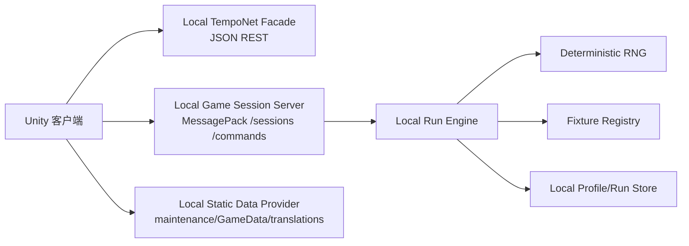

# 本地运行与离线化方案

## 目标

把游戏流程改成可以本地运行、不依赖互联网，同时尽量复用现有客户端 UI、状态机和消息处理链路。目标不是克隆官方后端的账号/支付/排行榜，而是让玩家能稳定开始 run、操作选择、进入战斗、结束 run，并支持预定义对局和确定性随机。

## 推荐方向

推荐实现“本地服务兼容官方协议”：



这样改动面最小：

- `DataProvider` 仍走原来的 JSON REST。
- `HttpGameClient` 仍走 `/sessions` 和 `/commands`。
- `NetMessageProcessor`、`AppState`、`GameSimHandler`、`CombatSimHandler` 不需要重写。
- 本地服务只要发回正确的 `INetMessage`，客户端就能按原流程显示。

## 三种可行方案对比

| 方案 | 做法 | 优点 | 缺点 | 结论 |
|---|---|---|---|---|
| A. 纯客户端短路 | 补丁跳过网络检查、直接注入缓存和假消息 | 最快启动 demo | 容易绕坏状态机；所有 run 命令都要进程内模拟 | 可作为应急，但不推荐做长期玩法系统。 |
| B. 本地 HTTP facade | 把 `Config.*URL` 指向 `127.0.0.1`，本地实现 REST + MessagePack session | 复用最多客户端代码；协议清晰；可独立测试 | 要实现本地服务和 DTO 序列化 | 推荐主路线。 |
| C. 进程内替代 `HttpGameClient` | Harmony/接口替换网络 client，命令直接交给本地引擎 | 无端口/HTTP 依赖；性能好 | 注入点更脆弱；测试隔离差 | 第二阶段可做，用于打包成纯 mod。 |

建议先做 B，再把 B 的引擎核心抽象成可被 C 复用的库。

## 本地化需要替换的启动点

### 1. 网络可达检查

当前 `AppLoader.EnsureInternetAsync` 无网络会阻塞启动。离线模式需要：

- 在离线模式下注册一个 `IConnectivityService` 实现，始终返回 true；或
- patch `EnsureInternetAsync` 在 offline flag 开启时直接完成。

不要只依赖系统网络状态，因为本地 loopback 有服务但无互联网时 `Application.internetReachability` 仍可能判定不可用。

### 2. 维护状态

实现本地 `maintenance.json`：

```json
{
  "systems": {
    "game": { "isAvailable": true },
    "web": { "isAvailable": true },
    "socket": { "isAvailable": true }
  },
  "versions": { "local": "<Application.version>" },
  "maintenance": null,
  "announcement": null,
  "httpGameClientTimeouts": {
    "defaultRequestSeconds": 60,
    "inRunCommandSeconds": 60,
    "deleteSessionSeconds": 10
  },
  "breakingChange": false,
  "locales": []
}
```

`ServersHealthService` 会基于 `breakingChange` 和 `versions` 判断强更；离线固定 `breakingChange=false` 最稳。

### 3. 静态数据

最小方案：使用 bundled `StreamingAssets/GameData.db.zip`。`JsonGameDataManager.GetPath("GameData")` 已支持缓存不存在时从 bundled zip 解压。

完整方案：本地 static server 实现：

- `GET /maintenance.json`
- `GET /GameData.db.zip`
- `GET /translations/{locale}.bytes`

并支持或忽略：

- `x-secret`
- `If-None-Match`
- `Range`
- `ETag`

本地开发可简单返回 200 全量；正式实现建议支持 ETag 和 Range，避免客户端重试逻辑误判。

### 4. Auth 和 server time

最小 REST facade 必须支持：

| 接口 | 本地行为 |
|---|---|
| `GET /api/time` | 返回当前 UTC ISO 时间。 |
| `POST /api/auth/login/silent` | 忽略 Steam ticket，返回本地 `LoginResponse`。 |
| `POST /api/auth/refreshtokens` | 接受任意本地 refresh token，返回新 access/refresh token 和未来过期时间。 |

access token 不需要真实 JWT，客户端只当字符串转发；但过期时间要合理，例如当前 UTC + 24h。也可以返回一个 fake JWT，便于本地 server 解析 account id。

### 5. Bootstrap 和 profile

本地 facade 必须返回完整但简化的 `BootstrapResponse`：

- `profile.playerProfile.AccountId`
- `profile.playerProfile.Username`
- `wallet`
- `playerRank`
- `season.current/all/track/trackProgression`
- `challenges`
- `heroes.owned/listings/purchaseListings`
- `collection.items/loadouts`
- `chests`
- `marketplace.dailySpecials/currencyListings`
- `leaderboard`
- `pendingRewards`
- `runRewardLevels`
- `errors=[]`
- `hasErrors=false`

`GetPlayerProfileCareer` 也必须可用，因为 `GameInstance.FetchData()` 与 bootstrap 并发拉取，并且任一失败都会弹窗重试/退出。

### 6. Game session

本地 `LocalGameSessionServer` 实现：

- `POST /sessions`
- `POST /commands`
- `DELETE /sessions`

必须使用同一套 MessagePack resolver/options。响应 body 必须是 `INetMessage` union，header 必须设置：

- `/sessions`: `sid=<new session id>`，`rid=1`
- `/commands`: `rid=<next request id>`

本地 server 内部维护：

```text
Session {
  sid
  accountId
  username
  requestId
  runId
  fixtureId?
  runState
  rngState
  lastCommandHash
  createdAt
  updatedAt
}
```

## 本地 REST facade 的接口实现方式

### 必须实现的最小接口

| 方法 | 路径 | 本地实现 |
|---|---|---|
| GET | `/api/time` | `DateTimeOffset.UtcNow` 字符串。 |
| POST | `/api/auth/login/silent` | 创建/读取本地账户，返回 fake tokens。 |
| POST | `/api/auth/refreshtokens` | 刷新 fake tokens。 |
| GET | `/api/Bootstrap/app` | 从 `LocalProfileStore` 生成完整 `BootstrapResponse`。 |
| GET | `/api/PlayerProfiles/me/career` | 返回本地 career，初始全 0。 |
| GET | `/api/Loadouts/me` | 返回本地 hero loadouts。 |
| GET | `/api/Loadouts/me/{heroId}` | 返回单英雄 loadout。 |
| POST | `/api/Loadouts/hero/{heroId}/equip-loadout` | 更新本地 loadout 并返回。 |

### 应该实现为 stub 的接口

| 接口族 | 本地行为 |
|---|---|
| seasons/challenges/runRewardLevels | 固定数据或从静态 DB 派生。 |
| wallet/chests/pending rewards | 返回空或固定余额。 |
| heroes/listings/owned | 默认解锁所有可玩英雄，或按 fixture 限制。 |
| collection/duplicate-rates | 返回本地 collection id 列表和固定重复率。 |
| `Bootstrap/post-run` | 从本地 profile/run 结果生成 post-run cache。 |
| `app/runs/complete` | 将 run 结果写入本地 profile，返回 `StateDeltaResponse`。 |

### 应禁用或 fake 的接口

| 接口族 | 推荐 |
|---|---|
| Steam/Stripe purchase | 禁用 UI 或返回“本地模式不可购买”。不要触发真实支付流程。 |
| marketplace | 返回空列表。 |
| leaderboard | 返回 null/空位置。 |
| feedback | 204/EmptyResponse 或写本地 log。 |
| email/account management | 返回 success no-op 或隐藏入口。 |

## 本地 run engine 的职责

`LocalRunEngine` 不是 UI 层。它只接收 `INetCommand`，更新本地 run state，生成 `INetMessage`。

核心接口建议：

```csharp
public interface ILocalRunEngine
{
    INetMessage Initialize(InitializeRunCommand command, LocalRunContext context);
    INetMessage ApplyCommand(INetCommand command, LocalRunContext context);
    GameStateSnapshotDTO BuildSnapshot();
}
```

内部模块：

| 模块 | 职责 |
|---|---|
| `LocalRunState` | day/hour/wins/losses/hero/player attributes/cards/current state/selection set/reroll cost。 |
| `SelectionGenerator` | 生成商店、技能、事件、路线、loot、level up、pedestal 选择。 |
| `CommandValidator` | 服务端权威校验：动作是否在状态允许、卡是否存在、费用/空间/目标是否合法。 |
| `RunReducer` | 应用购买、出售、移动、reroll、退出状态、选择 encounter 等状态变化。 |
| `CombatResolver` | 生成 `CombatSim` 和战斗后的 `GameSim`。 |
| `PvpOpponentProvider` | 从 fixture 或本地 ghost store 选择对手。 |
| `MessageBuilder` | 将 state diff 转为 `GameSim`，将全量状态转为 `GameStateSnapshotDTO`。 |
| `FixtureDriver` | 若有预定义对局，覆盖随机选择和对手。 |

## 服务端命令处理策略

### `/sessions`

1. 解析 `InitializeRunCommand`。
2. 读取本地 profile 和 selected hero/play mode。
3. 如果存在 active run，恢复对应 `LocalRunState`；否则创建新 run。
4. 选择 fixture：命令中的 `GameModeId`、本地配置、或默认 run。
5. 初始化 RNG 和初始选择。
6. 返回 `NetMessageAggregate`，建议包含：
   - `NetMessageRunInitialized`
   - `NetMessageGameStateSync`
   - `NetMessageGameSim`

### `/commands`

1. 校验 `sid` 和 `rid`。
2. 如果 `rid` 重复且命令 hash 一致，可以返回上一次响应，保证客户端重试幂等。
3. 解析 `INetCommand`。
4. 执行状态机：
   - 选择/购买/移动/出售：更新 cards/player attributes/current selection。
   - reroll：消耗金币、更新 reroll cost、生成新 selection。
   - exit：进入下一个 state 或 hour/day。
   - encounter/combat：生成进入战斗 `GameSim`、`CombatSim`、战斗后 `GameSim`。
5. 返回 `NetMessageAggregate` 或单个消息。
6. 持久化 `LocalRunState` 和 RNG counter。

## 本地状态和官方客户端状态的映射

| 本地状态 | 客户端期望 |
|---|---|
| run id | `NetMessageRunInitialized.RunId` 和 history/replay 关联。 |
| day/hour/wins/losses | `RunSnapshotDTO`、`SimUpdateRun`。 |
| selection set | `RunStateSnapshotDTO.SelectionSet` 和 `SimUpdateRunState.SelectionSet`，里面是 card instance id。 |
| cards | `CardSnapshotDTO` 全量 + `GameSim.Cards` diff。 |
| player attributes | `PlayerSnapshotDTO.Attributes` + `SimUpdatePlayer.Attributes`。 |
| current state | `ERunState`，触发客户端 `AppState` 切换。 |
| pvp opponent | `SimUpdateRunState.PvpOpponent`。 |
| combat result | `CombatSim.Winner/Loser` + 后续 `GameSimEventRunHourChanged`/`RunCompleted` 等。 |

## 业务规则实现范围

阶段 1 可以先做“可玩但简化”：

- 从静态 DB 读取卡牌模板，建立 card instance。
- 支持 board/stash 位置、金币、生命、等级、day/hour、wins/losses。
- 支持商店选择、购买、移动、出售、reroll、exit。
- 战斗先用简化 resolver：根据 fixture 或固定公式决定胜负，并生成最小可播放 `CombatSim`。

阶段 2 做“接近官方”：

- 复用/移植 `BazaarBattleService` 的旧 `BazaarCardDealer`、effect、target、seed 逻辑。
- 补齐 encounter、loot、level up、pedestal、PVP ghost。
- `GameSimEvent`/`CombatSimEvent` 更完整，支持 UI 动画和 history。

阶段 3 做“可分享预定义对局”：

- fixture manifest、共享 seed、命令 replay 校验。
- fixture browser 和本地 run selection。
- 导出 run bundle/replay，不上传外网。

## 关闭外部网络的建议

本地模式开关开启时：

- `Config.NetURL = http://127.0.0.1:<restPort>`
- `Config.SocketURL = http://127.0.0.1:<sessionPort>`
- `Config.DataURL = http://127.0.0.1:<staticPort>`
- `Config.MaintenanceDataURL = http://127.0.0.1:<staticPort>`
- `IConnectivityService` 返回 true。
- mod 上传服务不启动，或 `ApiBaseUrl` 留空并禁用上传。
- `AnalyticsManager`/telemetry stub 不挂载或不 flush；若未来有发送逻辑，改写成本地日志。
- sponsor/final builds 使用 cache/embedded fallback，不主动远端刷新。
- 旧 `MainMenuUIDataHandler` 的 sale item 测试下载和 `picsum.photos` 图片路径不应在本地模式触发；如有旧 UI 仍引用，改为本地 JSON/本地图片。
- Addressables 只用本地 catalog；catalog update 失败不阻塞。

## 验证清单

不编译的设计阶段可验证：

- 所有启动必需接口都有本地响应结构。
- `/sessions` 响应包含 `sid` header 和 `RunInitialized + GameStateSync + GameSim`。
- 每个可点击 action 都能映射到一个 `INetCommand`。
- 对同一 fixture 和命令序列，server 生成的消息 hash 相同。
- 无支付、上传、排行榜、公告图片等外网请求在离线模式默认发出。
